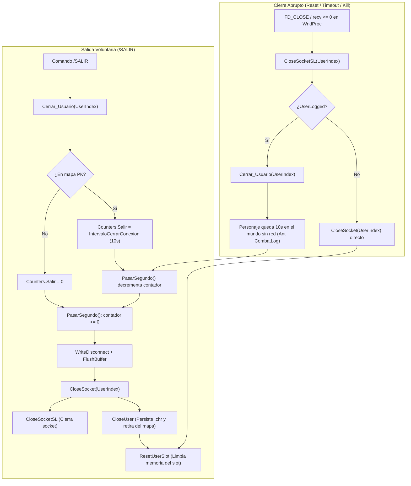

# Auditoría Técnica Anexo: Subsistema de Red Legacy y `TCP.bas` (Adenda a `docs/audit/02-protocolo-de-red.md`)

## 1. Resumen Ejecutivo y Alcance

Este informe documenta la auditoría técnica e investigación exhaustiva del subsistema de red del servidor legacy de Argentum Online v0.13.0, comprendiendo los módulos [`legacy/server/Codigo/TCP.bas`](../../legacy/server/Codigo/TCP.bas), [`legacy/server/Codigo/wskapiAO.bas`](../../legacy/server/Codigo/wskapiAO.bas), [`legacy/server/Codigo/wsksock.bas`](../../legacy/server/Codigo/wsksock.bas), y sus articulaciones directas en [`legacy/server/Codigo/Protocol.bas`](../../legacy/server/Codigo/Protocol.bas), [`legacy/server/Codigo/Declares.bas`](../../legacy/server/Codigo/Declares.bas), [`legacy/server/Codigo/Modulo_UsUaRiOs.bas`](../../legacy/server/Codigo/Modulo_UsUaRiOs.bas) y [`legacy/server/Codigo/General.bas`](../../legacy/server/Codigo/General.bas).

El objetivo de esta investigación es fijar con absoluta precisión el comportamiento, ciclo de vida, flujos de buffers, puntos de contacto con seguridad perimetral y modelo de ejecución de la arquitectura original en Visual Basic 6, sentando las bases empíricas para el futuro desglose por fases (`TCP-breakdown.md`) y la posterior implementación del subsistema de red en C++20 utilizando **standalone Asio**.

---

## 2. Modos de Socket Legacy y Selección en Producción (`UsarQueSocket`)

En el proyecto del servidor VB6 ([`legacy/server/SERVER.VBP#L84`](../../legacy/server/SERVER.VBP#L84)), la directiva de compilación condicional oficial para producción está configurada de la siguiente forma:

```ini
CondComp="UsarQueSocket = 1 : ConUpTime = 1"
```

El código legacy contiene directivas `#If UsarQueSocket` que admiten 4 implementaciones históricas alternativas (relevadas en [`legacy/server/Codigo/General.bas#L459-L488`](../../legacy/server/Codigo/General.bas#L459-L488)):

1. **`UsarQueSocket = 1` (Producción oficial 0.13.0)**: Utiliza llamadas directas a la API WinSock 2 (`ws2_32.dll` / `wsock32.dll`) con notificación asíncrona a nivel de ventana Win32 (`WSAAsyncSelect`) y subclassing (`WndProc`) encapsulados en [`wskapiAO.bas`](../../legacy/server/Codigo/wskapiAO.bas) y [`wsksock.bas`](../../legacy/server/Codigo/wsksock.bas).
2. **`UsarQueSocket = 0` (Legacy obsoleto)**: Empleaba el control ActiveX con ventana `Socket2` (`MSWinsock.Winsock` o SocketWrench).
3. **`UsarQueSocket = 2` (Experimental)**: Control externo tipo servidor `frmMain.Serv`.
4. **`UsarQueSocket = 3` (Experimental DLL)**: Componente externo `frmMain.TCPServ` (`AO-Server-TCP.dll`).

> [!IMPORTANT]
> Toda la auditoría técnica de este documento se enfoca en **`UsarQueSocket = 1`**, ya que constituye el subsistema activo y testeado en los servidores de producción de la versión 0.13.0.

---

## 3. Arquitectura y Ciclo de Vida de Conexión en Legacy

### 3.1. Socket de Escucha (`Listening`) y APIs WinSock

El arranque del socket de escucha ocurre al inicializar el servidor dentro de `Sub Main()` en [`legacy/server/Codigo/General.bas#L459-L463`](../../legacy/server/Codigo/General.bas#L459-L463):

```vb
#If UsarQueSocket = 1 Then
    Call IniciaWsApi(frmMain.hWnd)
    SockListen = ListenForConnect(Puerto, hWndMsg, "")
#End If
```

El flujo exacto de llamadas de API Win32 / WinSock comprende dos fases:

#### A. Creación de Ventana Oculta y Subclassing (`IniciaWsApi`)
En [`legacy/server/Codigo/wskapiAO.bas#L86-L105`](../../legacy/server/Codigo/wskapiAO.bas#L86-L105):
- Crea una ventana estática invisible hija (`WS_CHILD`) para recibir los mensajes de red posteados por el kernel de WinSock:
  ```vb
  hWndMsg = CreateWindowEx(0, "STATIC", "AOMSG", WS_CHILD, 0, 0, 0, 0, hwndParent, 0, App.hInstance, ByVal 0&)
  ```
  *(Línea 93 de `wskapiAO.bas`)*.
- Realiza el subclassing de dicha ventana asignando `WndProc` como procedimiento de ventana:
  ```vb
  OldWProc = SetWindowLong(hWndMsg, GWL_WNDPROC, AddressOf WndProc)
  ```
  *(Línea 98 de `wskapiAO.bas`)*.
- Inicializa la biblioteca WinSock invocando `StartWinsock(desc)` ([`legacy/server/Codigo/wsksock.bas#L934-L951`](../../legacy/server/Codigo/wsksock.bas#L934-L951)), la cual ejecuta `WSAStartup(257, StartupData)`.

#### B. Apertura y Enlace del Socket (`ListenForConnect`)
En [`legacy/server/Codigo/wsksock.bas#L834-L896`](../../legacy/server/Codigo/wsksock.bas#L834-L896):
- Inicializa la estructura `sockin As sockaddr` (`AF_INET`, `htons(Puerto)` y `htonl(INADDR_ANY)` si `Enlazar` es vacía).
- Crea el socket de streaming:
  ```vb
  S = Socket(PF_INET, SOCK_STREAM, 0)
  ```
  *(Línea 855 de `wsksock.bas`)*.
- Asocia el socket al puerto local:
  ```vb
  If bind(S, sockin, sockaddr_size) Then ...
  ```
  *(Línea 870 de `wsksock.bas`)*.
- Registra la notificación asíncrona Win32 mediante `WSAAsyncSelect` para el mensaje `1025` (`WM_USER + 1`):
  ```vb
  SelectOps = FD_READ Or FD_CLOSE Or FD_ACCEPT
  If WSAAsyncSelect(S, HWndToMsg, ByVal 1025, ByVal SelectOps) Then ...
  ```
  *(Líneas 878-879 de `wsksock.bas`)*.
  > [!NOTE]
  > Notá que en la línea 877 `FD_WRITE` se encuentra expresamente comentado: la arquitectura legacy no gestiona reactividad de escritura por eventos de ventana.
- Coloca el socket en modo pasivo de escucha:
  ```vb
  If listen(S, SOMAXCONN) Then ...
  ```
  *(Línea 888 de `wsksock.bas`)*.

#### C. Procesamiento del Evento de Conexión Entrante (`FD_ACCEPT`)
1. WinSock detecta la llegada del handshake TCP SYN-ACK y postea un mensaje Win32 con `msg = 1025` a la cola del hilo principal.
2. `WndProc` recibe el mensaje ([`legacy/server/Codigo/wskapiAO.bas#L215-L225`](../../legacy/server/Codigo/wskapiAO.bas#L215-L225)):
   - `S = wParam` (descriptor del socket que generó el evento).
   - `E = WSAGetSelectEvent(lParam)` (extrae el evento mediante `lParam And &HFFFF&`).
   - Si `E = FD_ACCEPT` y `S = SockListen`, delega en:
     ```vb
     Call EventoSockAccept(S)
     ```
3. `EventoSockAccept` ([`legacy/server/Codigo/wskapiAO.bas#L372-L497`](../../legacy/server/Codigo/wskapiAO.bas#L372-L497)):
   - Acepta la conexión invocando a la API:
     ```vb
     Ret = accept(SockID, sa, Tam)
     ```
     *(Línea 394 de `wskapiAO.bas`)*.
   - Pasa la dirección IP cruda (`sa.sin_addr`) al módulo de seguridad anti-flood:
     ```vb
     If Not SecurityIp.IpSecurityAceptarNuevaConexion(sa.sin_addr) Then
         Call WSApiCloseSocket(NuevoSock)
         Exit Sub
     End If
     ```
     *(Líneas 402-405 de `wskapiAO.bas`)*.
     *(Falla histórica de VB6: `NuevoSock` recién se asigna en la línea 420 `NuevoSock = Ret`, por lo que en caso de rechazo anti-flood inmediato, la variable `NuevoSock` en la línea 403 vale 0).*
   - Configura los buffers de socket del sistema operativo mediante `setsockopt`:
     ```vb
     setsockopt(NuevoSock, SOL_SOCKET, SO_RCVBUFFER, SIZE_RCVBUF, 4)
     setsockopt(NuevoSock, SOL_SOCKET, SO_SNDBUFFER, SIZE_SNDBUF, 4)
     ```
     *(Líneas 423 y 428 de `wskapiAO.bas`)*, con `SIZE_RCVBUF = 8192` y `SIZE_SNDBUF = 8192` (8 KB cada uno).
   - Debido a la especificación de WinSock, el socket aceptado (`NuevoSock`) hereda automáticamente los atributos de `WSAAsyncSelect` del socket de escucha, quedando sus eventos `FD_READ` y `FD_CLOSE` enrutados a `hWndMsg` con el mensaje `1025`.

---

### 3.2. Asignación de `UserIndex` en `UserList`

La búsqueda y asignación del slot de usuario para la nueva conexión se ejecuta inmediatamente después en [`legacy/server/Codigo/wskapiAO.bas#L447-L478`](../../legacy/server/Codigo/wskapiAO.bas#L447-L478):

```vb
NewIndex = NextOpenUser ' Nuevo indice
```

#### Función `NextOpenUser`
Ubicada en [`legacy/server/Codigo/Modulo_UsUaRiOs.bas#L868-L883`](../../legacy/server/Codigo/Modulo_UsUaRiOs.bas#L868-L883):

```vb
Function NextOpenUser() As Integer
    Dim LoopC As Long
    
    For LoopC = 1 To MaxUsers + 1
        If LoopC > MaxUsers Then Exit For
        If (UserList(LoopC).ConnID = -1 And UserList(LoopC).flags.UserLogged = False) Then Exit For
    Next LoopC
    
    NextOpenUser = LoopC
End Function
```

- **Criterio de slot libre**: Que el slot no tenga socket asociado (`ConnID = -1`) y no posea un personaje logueado en juego (`UserLogged = False`).
- **Comportamiento ante servidor lleno**: Si todos los slots de 1 a `MaxUsers` se encuentran ocupados, el bucle finaliza con `LoopC = MaxUsers + 1`, retornando ese valor excedente.

#### Enrutamiento según disponibilidad de slots:
- **Si `NewIndex <= MaxUsers` (Slot disponible)**:
  1. Purga remanentes en las colas:
     ```vb
     Call UserList(NewIndex).incomingData.ReadASCIIStringFixed(UserList(NewIndex).incomingData.length)
     Call UserList(NewIndex).outgoingData.ReadASCIIStringFixed(UserList(NewIndex).outgoingData.length)
     ```
     *(Líneas 452-453 de `wskapiAO.bas`)*.
  2. Convierte y almacena la IP en texto: `UserList(NewIndex).ip = GetAscIP(sa.sin_addr)` (*Línea 459*).
  3. Verifica la lista negra de IPs (`BanIps`): si está baneada, escribe mensaje de error, hace `FlushBuffer(NewIndex)`, cierra con `WSApiCloseSocket(NuevoSock)` y aborta (*Líneas 461-470*).
  4. Actualiza el cursor de usuarios activos:
     ```vb
     If NewIndex > LastUser Then LastUser = NewIndex
     ```
     *(Línea 472 de `wskapiAO.bas`)*.
  5. Enlaza el descriptor del socket con el slot:
     ```vb
     UserList(NewIndex).ConnID = NuevoSock
     UserList(NewIndex).ConnIDValida = True
     Call AgregaSlotSock(NuevoSock, NewIndex)
     ```
     *(Líneas 474-477 de `wskapiAO.bas`)*.
     `AgregaSlotSock` registra el mapeo en una colección asociativa de VB6: `WSAPISock2Usr.Add Slot, CStr(Sock)` ([`wskapiAO.bas#L153`](../../legacy/server/Codigo/wskapiAO.bas#L153)), permitiendo la resolución rápida en tiempo $O(1)$ amortizado al recibir eventos de red en `WndProc`.
- **Si `NewIndex > MaxUsers` (Servidor saturado)**:
  1. Genera el paquete de error preformateado:
     ```vb
     str = Protocol.PrepareMessageErrorMsg("El servidor se encuentra lleno en este momento. Disculpe las molestias ocasionadas.")
     ```
     *(Línea 482 de `wskapiAO.bas`)*.
  2. Envía el mensaje directamente por el socket antes de enrolarlo:
     ```vb
     Call send(ByVal NuevoSock, data(0), ByVal UBound(data()) + 1, ByVal 0)
     ```
     *(Línea 492 de `wskapiAO.bas`)*.
  3. Desconecta y cierra el descriptor:
     ```vb
     Call WSApiCloseSocket(NuevoSock)
     ```
     *(Línea 493 de `wskapiAO.bas`)*.

---

### 3.3. Desconexión Ordenada vs. Cierre Abrupto

El servidor legacy distingue taxativamente entre la salida voluntaria de un usuario y el corte imprevisto de la capa física/red.



#### A. Desconexión Ordenada (`/SALIR`)
1. El cliente envía el paquete `ClientPacketID.Quit` (`/SALIR`), despachado en [`legacy/server/Codigo/Protocol.bas#L5175`](../../legacy/server/Codigo/Protocol.bas#L5175):
   ```vb
   Call Cerrar_Usuario(UserIndex)
   ```
2. `Cerrar_Usuario(UserIndex)` ([`legacy/server/Codigo/Modulo_UsUaRiOs.bas#L1850-L1897`](../../legacy/server/Codigo/Modulo_UsUaRiOs.bas#L1850-L1897)):
   - Si el usuario está logueado y no estaba ya saliendo (`.flags.UserLogged And Not .Counters.Saliendo`):
     - Marca `.Counters.Saliendo = True`.
     - Si es un usuario común en mapa PK, impone la espera de combate:
       ```vb
       .Counters.Salir = IIf((.flags.Privilegios And PlayerType.User) And MapInfo(.Pos.map).Pk, IntervaloCerrarConexion, 0)
       ```
       *(Línea 1862 de `Modulo_UsUaRiOs.bas`)*.
     - Si estaba oculto o invisible, lo hace visible de inmediato para evitar abusos tácticos al salir (*Líneas 1864-1888*).
3. `PasarSegundo` ([`legacy/server/Codigo/General.bas#L1555-L1569`](../../legacy/server/Codigo/General.bas#L1555-L1569)):
   - Cada 1 segundo, el timer del servidor itera los usuarios saliendo y decrementa `.Counters.Salir`.
   - Cuando `.Counters.Salir <= 0`:
     ```vb
     Call WriteConsoleMsg(i, "Gracias por jugar Argentum Online", FontTypeNames.FONTTYPE_INFO)
     Call WriteDisconnect(i)
     Call FlushBuffer(i)
     Call CloseSocket(i)
     ```
     *(Líneas 1561-1565 de `General.bas`)*.
4. `CloseSocket(UserIndex)` ([`legacy/server/Codigo/TCP.bas#L610-L664`](../../legacy/server/Codigo/TCP.bas#L610-L664)):
   - Ajusta el puntero `LastUser` si el usuario que desconecta estaba en el extremo superior de la lista (*Líneas 619-624*).
   - Si el socket está abierto, invoca `CloseSocketSL(UserIndex)` (*Línea 630*).
   - Cancela cualquier comercio seguro activo (`ComUsu`) y notifica al centinela si estaba bajo revisión (*Líneas 635-647*).
   - Vacía los buffers de entrada de la cola `clsByteQueue` (*Línea 650*).
   - Si `.flags.UserLogged = True`: decrementa `NumUsers`, llama a `CloseUser(UserIndex)` (*Línea 654*), y actualiza estadísticas web.
   - Si no estaba logueado: llama directamente a `ResetUserSlot(UserIndex)` (*Línea 658*).
   - Blanquea los identificadores de socket del slot:
     ```vb
     UserList(UserIndex).ConnID = -1
     UserList(UserIndex).ConnIDValida = False
     ```
5. `CloseUser(UserIndex)` ([`legacy/server/Codigo/TCP.bas#L1758-L1865`](../../legacy/server/Codigo/TCP.bas#L1758-L1865)):
   - Resetea estados de agresión con NPCs (`AtacadoPorNpc`, `NPCAtacado`).
   - Remueve efectos gráficos FX de la pantalla de usuarios cercanos.
   - Desvincula del grupo/party (`mdParty.SalirDeParty`).
   - Persiste el archivo del personaje en disco:
     ```vb
     Call SaveUser(UserIndex, CharPath & name & ".chr")
     Call WriteVar(CharPath & UserList(UserIndex).name & ".chr", "INIT", "Logged", "0")
     ```
     *(Líneas 1811 y 1814 de `TCP.bas`)*.
   - Remueve el diálogo y el personaje del mapa para los demás clientes (`PrepareMessageRemoveCharDialog` y `EraseUserChar`).
   - Despacha o elimina las mascotas activas invocando `QuitarNPC`.
   - Decrementa el contador de usuarios en el mapa: `MapInfo(Map).NumUsers = MapInfo(Map).NumUsers - 1`.
   - Remueve al usuario de la cola de ayuda de GMs (`Ayuda.Quitar`).
   - Llama a `ResetUserSlot(UserIndex)` (*Línea 1851*).
   - Registra la desconexión en `logs/Connect.log`.
6. `ResetUserSlot(UserIndex)` ([`legacy/server/Codigo/TCP.bas#L1719-L1756`](../../legacy/server/Codigo/TCP.bas#L1719-L1756)):
   - Invalida socket: `ConnIDValida = False`, `ConnID = -1`.
   - Blanquea la totalidad del estado del personaje llamando a los módulos específicos: `LimpiarComercioSeguro`, `ResetFacciones`, `ResetContadores`, `ResetGuildInfo`, `ResetCharInfo`, `ResetBasicUserInfo`, `ResetReputacion`, `ResetUserFlags`, `LimpiarInventario`, `ResetUserSpells`, `ResetUserPets`, `ResetUserBanco` y limpia el struct `ComUsu`.

#### B. Cierre Abrupto (Socket Reset / Timeout / Client Kill)
Se detecta en el procedimiento de ventana `WndProc` ([`legacy/server/Codigo/wskapiAO.bas#L203-L310`](../../legacy/server/Codigo/wskapiAO.bas#L203-L310)) ante 3 posibles eventos del sistema operativo:

1. **`recv < 0` (Error de socket en lectura)**:
   - Si `UltError <> WSAEMSGSIZE` (por ejemplo, `WSAECONNRESET`, `WSAECONNABORTED`, `WSAETIMEDOUT`):
     ```vb
     'no hay q llamar a CloseSocket() directamente,
     'ya q pueden abusar de algun error para
     'desconectarse sin los 10segs. CREEME.
     Call CloseSocketSL(N)
     Call Cerrar_Usuario(N)
     Exit Function
     ```
     *(Líneas 278-284 de `wskapiAO.bas`)*.
2. **`recv == 0` (Cierre graceful iniciado por el cliente sin comando `/SALIR`)**:
   ```vb
   ElseIf Ret = 0 Then
       Call CloseSocketSL(N)
       Call Cerrar_Usuario(N)
   End If
   ```
   *(Líneas 285-288 de `wskapiAO.bas`)*.
3. **`FD_CLOSE` (Notificación WinSock de cierre de conexión)**:
   - Cierra el descriptor en WinSock si no era el de escucha: `apiclosesocket(S)` (*Línea 296*).
   - Remueve el socket del índice: `BorraSlotSock(S)` (*Línea 299*).
   - Marca `ConnID = -1` y `ConnIDValida = False` (*Líneas 300-301*).
   - Dispara `EventoSockClose(N)` ([`legacy/server/Codigo/wskapiAO.bas#L520-L538`](../../legacy/server/Codigo/wskapiAO.bas#L520-L538)):
     ```vb
     If UserList(Slot).flags.UserLogged Then
         Call CloseSocketSL(Slot)
         Call Cerrar_Usuario(Slot)
     Else
         Call CloseSocket(Slot)
     End If
     ```

#### C. Mecánica Anti-CombatLog / Disconnect Exploit
El diseño legacy previene explícitamente que un jugador desconecte su cable de red o fuerce el cierre del proceso para escapar de un combate inminente en zona insegura:
- `CloseSocketSL(Slot)` desconecta y destruye inmediatamente el socket TCP a nivel sistema operativo, liberando recursos de red y evitando que el cliente envíe paquetes adicionales.
- Sin embargo, **el personaje no se destruye del mundo**. Se invoca `Cerrar_Usuario(Slot)`.
- Si el personaje estaba en un mapa PK, permanece inmóvil en el mapa como "fantasma conectado" vulnerable al ataque de otros jugadores o monstruos durante los 10 segundos de `IntervaloCerrarConexion`.
- Recién al agotar ese lapso en `PasarSegundo`, se ejecuta `CloseSocket` -> `CloseUser`, persistiendo el personaje en disco (con la muerte y caída de inventario si fue ejecutado en el interín).

---

## 4. Puntos de Contacto con `SecurityIp`

La auditoría exhaustiva de llamadas a `SecurityIp` dentro de los módulos de red revela el siguiente inventario textual:

### 4.1. Relevamiento Completo de Llamadas

| Archivo | Línea | Código Literal VB6 | Estado | Observación |
| :--- | :-: | :--- | :-: | :--- |
| `legacy/server/Codigo/wsksock.bas` | — | *(Ninguna llamada)* | N/A | `wsksock.bas` es una capa pura de wrappers WinSock; no interactúa con `SecurityIp`. |
| `legacy/server/Codigo/wskapiAO.bas` | 402 | `If Not SecurityIp.IpSecurityAceptarNuevaConexion(sa.sin_addr) Then` | **ACTIVA** | Control anti-flood de intervalos (1.000 ms) en `EventoSockAccept`. |
| `legacy/server/Codigo/wskapiAO.bas` | 433 | `'If SecurityIp.IPSecuritySuperaLimiteConexiones(sa.sin_addr) Then` | **COMENTADA** | Control de conexiones simultáneas por IP deshabilitado. |
| `legacy/server/Codigo/wskapiAO.bas` | 466 | `'Call SecurityIp.IpRestarConexion(sa.sin_addr)` | **COMENTADA** | Decremento de conexión deshabilitado en rechazo por ban de IP. |
| `legacy/server/Codigo/wskapiAO.bas` | 607 | `If Not SecurityIp.IpSecurityAceptarNuevaConexion(sa.sin_addr) Then` | **MUERTA** | Callback `CondicionSocket` no utilizado en producción (`WSAAccept` comentado). |
| `legacy/server/Codigo/TCP.bas` | 626 | `'Call SecurityIp.IpRestarConexion(GetLongIp(UserList(UserIndex).ip))` | **COMENTADA** | Decremento de conexión deshabilitado en `CloseSocket`. |

### 4.2. Invocación Activa de `IpSecurityAceptarNuevaConexion`
Se invoca exclusivamente en [`legacy/server/Codigo/wskapiAO.bas#L402`](../../legacy/server/Codigo/wskapiAO.bas#L402).
- **Parámetro**: `sa.sin_addr` (`Long` de 32 bits con signo en VB6, correspondiente al entero binario IPv4 de 4 bytes en *network byte order*).
- **Semántica**: Consulta y actualiza la tabla plana binaria `IpTables` en [`SecurityIp.bas`](../../legacy/server/Codigo/SecurityIp.bas) para verificar si la dirección IP intentó conectar hace menos de 1.000 ms. Si retorna `False`, rechaza y corta la conexión de inmediato.

### 4.3. Estado de `IPSecuritySuperaLimiteConexiones` e `IpRestarConexion`
Ambas funciones se encuentran **100% comentadas con apóstrofe en todos y cada uno de los puntos de llamada del servidor**:
- En [`wskapiAO.bas#L433`](../../legacy/server/Codigo/wskapiAO.bas#L433): `'If SecurityIp.IPSecuritySuperaLimiteConexiones(sa.sin_addr) Then`
- En [`wskapiAO.bas#L466`](../../legacy/server/Codigo/wskapiAO.bas#L466): `'Call SecurityIp.IpRestarConexion(sa.sin_addr)`
- En [`TCP.bas#L626`](../../legacy/server/Codigo/TCP.bas#L626): `'Call SecurityIp.IpRestarConexion(GetLongIp(UserList(UserIndex).ip))`

**Conclusión definitiva**: En Argentum Online 0.13.0 de producción, el control de concurrencia máxima por IP (`MaxConTables`) estaba **totalmente inactivo**. El subsistema de red solo imponía el límite anti-flood de frecuencia de conexiones entrantes.

### 4.4. Extracción y Representación de la IP del Cliente
1. Al invocar `accept(SockID, sa, Tam)` en [`wskapiAO.bas#L394`](../../legacy/server/Codigo/wskapiAO.bas#L394), WinSock completa la estructura `sa As sockaddr`:
   ```vb
   Public Type sockaddr
       sin_family As Integer
       sin_port As Integer
       sin_addr As Long
       sin_zero As String * 8
   End Type
   ```
   *(Definida en [`legacy/server/Codigo/wsksock.bas#L72-L77`](../../legacy/server/Codigo/wsksock.bas#L72-L77))*.
2. El campo `sa.sin_addr` retiene la dirección IPv4 binaria de 32 bits.
3. La conversión a cadena de texto punteada (*dotted-decimal*, ej. `"192.168.1.50"`) se ejecuta en [`wskapiAO.bas#L459`](../../legacy/server/Codigo/wskapiAO.bas#L459):
   ```vb
   UserList(NewIndex).ip = GetAscIP(sa.sin_addr)
   ```
4. `GetAscIP(ByVal inn As Long)` en [`legacy/server/Codigo/wsksock.bas#L527-L545`](../../legacy/server/Codigo/wsksock.bas#L527-L545):
   - Invoca a la API de WinSock `inet_ntoa(inn)`, la cual devuelve un puntero C a un búfer estático interno del hilo.
   - Lee el largo de la cadena con `lstrlen(lpStr)`.
   - Copia los bytes hacia una cadena BSTR de VB mediante `MemCopy ByVal retString, ByVal lpStr, nStr`.
   - Si la API falla (`lpStr = 0`), retorna `"255.255.255.255"`.

---

## 5. Mecanismo de Búferes y Manejo de `NotEnoughSpaceException`

### 5.1. Flujo de Datos Salientes (`outgoingData` y `FlushBuffer`)
1. Cada usuario activo posee una cola FIFO de salida de bytes en memoria: `UserList(UserIndex).outgoingData As clsByteQueue` ([`legacy/server/Codigo/Declares.bas#L1256`](../../legacy/server/Codigo/Declares.bas#L1256)).
2. Cuando el servidor necesita enviar un mensaje, los métodos de serialización en [`Protocol.bas`](../../legacy/server/Codigo/Protocol.bas) (`WriteChat`, `WriteUpdateUserStats`, `WriteBlockPosition`, etc.) escriben los opcodes y datos binarios en la cola mediante `.WriteByte`, `.WriteInteger`, `.WriteASCIIStringFixed`, etc.
3. La emisión efectiva hacia el socket TCP no es inmediata por cada campo, sino diferida: se despacha invocando a `FlushBuffer(UserIndex)` ([`legacy/server/Codigo/Protocol.bas#L17233-L17249`](../../legacy/server/Codigo/Protocol.bas#L17233-L17249)):
   ```vb
   Public Sub FlushBuffer(ByVal UserIndex As Integer)
       Dim sndData As String
       With UserList(UserIndex).outgoingData
           If .length = 0 Then Exit Sub
           sndData = .ReadASCIIStringFixed(.length)
           Call EnviarDatosASlot(UserIndex, sndData)
       End With
   End Sub
   ```
4. `EnviarDatosASlot` ([`legacy/server/Codigo/TCP.bas#L822-L843`](../../legacy/server/Codigo/TCP.bas#L822-L843)) delega en `WsApiEnviar(UserIndex, sndData)` ([`legacy/server/Codigo/wskapiAO.bas#L314-L352`](../../legacy/server/Codigo/wskapiAO.bas#L314-L352)).
5. `WsApiEnviar` convierte la cadena a bytes ANSI (`StrConv(str, vbFromUnicode)`) y llama síncronamente a `send(ByVal UserList(Slot).ConnID, data(0), ByVal UBound(data()) + 1, ByVal 0)`.

### 5.2. Capacidad de Búfer y Excepción `NOT_ENOUGH_SPACE`
En [`legacy/server/Codigo/clsByteQueue.cls`](../../legacy/server/Codigo/clsByteQueue.cls):
- La capacidad del búfer interno de cada cola está prefijada por la constante:
  ```vb
  Private Const DATA_BUFFER As Long = 10240
  ```
  *(Línea 69 de `clsByteQueue.cls`)*, es decir, **10.240 bytes (10 KB)**.
- Cuando una rutina intenta escribir y los datos exceden la capacidad restante, `clsByteQueue` levanta un error COM estándar:
  ```vb
  Private Const NOT_ENOUGH_SPACE As Long = vbObjectError + 10
  
  If queueCapacity - queueLength - dataLength < 0 Then
      Call Err.raise(NOT_ENOUGH_SPACE)
      Exit Function
  End If
  ```
  *(Líneas 62 y 196-199 de `clsByteQueue.cls`)*.

### 5.3. El Patrón Legacy `On Error GoTo Errhandler` + `Resume`
En el servidor legacy, este desbordamiento no se consideraba un error fatal, sino un mecanismo intencional de control de flujo (*backpressure* rudimentario).

En **101 procedimientos serializadores** de [`legacy/server/Codigo/Protocol.bas`](../../legacy/server/Codigo/Protocol.bas) (por ejemplo, en `WriteMultiMessage`, líneas 804-863), se implementa exactamente el siguiente patrón:

```vb
Public Sub WriteMultiMessage(...)
On Error GoTo Errhandler
    With UserList(UserIndex).outgoingData
        ' [Escritura de bytes...]
    End With
Exit Sub

Errhandler:
    If Err.Number = UserList(UserIndex).outgoingData.NotEnoughSpaceErrCode Then
        Call FlushBuffer(UserIndex)
        Resume
    End If
End Sub
```

#### Dinámica de ejecución:
1. Si al serializar un paquete los 10 KB de `outgoingData` se llenan, salta a `Errhandler:`.
2. El handler comprueba que sea `NotEnoughSpaceErrCode` y llama a `FlushBuffer(UserIndex)`.
3. `FlushBuffer` toma todos los bytes encolados hasta ese momento y los transmite por socket TCP mediante `send()`, dejando `queueLength = 0`.
4. La instrucción `Resume` de Visual Basic 6 vuelve a ejecutar **exactamente la misma instrucción de escritura que había fallado**, la cual ahora se ejecuta con éxito porque el búfer cuenta nuevamente con 10 KB libres.

### 5.4. Umbrales de Socket OS y la Trampa de Bloqueo `WSAEWOULDBLOCK`
- **Tamaño de buffers TCP a nivel OS**:
  - `SO_RCVBUFFER` = 8.192 bytes (8 KB) ([`wskapiAO.bas#L423`](../../legacy/server/Codigo/wskapiAO.bas#L423)).
  - `SO_SNDBUFFER` = 8.192 bytes (8 KB) ([`wskapiAO.bas#L428`](../../legacy/server/Codigo/wskapiAO.bas#L428)).
- **Comportamiento ante bloqueo en `WsApiEnviar`** ([`legacy/server/Codigo/wskapiAO.bas#L332-L343`](../../legacy/server/Codigo/wskapiAO.bas#L332-L343)):
  Si el búfer de socket del kernel de Windows se satura (por ejemplo, un cliente con lag severo o congestión de ventana TCP), la llamada a `send()` no bloquea el hilo sino que falla inmediatamente retornando el error de WinSock `WSAEWOULDBLOCK` (10035):
  ```vb
  If Ret < 0 Then
      Ret = Err.LastDllError
      If Ret = WSAEWOULDBLOCK Then
          ' WSAEWOULDBLOCK, put the data again in the outgoingData Buffer
          Call UserList(Slot).outgoingData.WriteASCIIStringFixed(str)
      End If
  End If
  ```
  *(Líneas 334-342 de `wskapiAO.bas`)*.

> [!WARNING]
> **Vulnerabilidad de Bloqueo Crítico (Busy-Wait Hang) en Legacy**:
> Si se combinan las condiciones de:
> 1. `outgoingData` lleno (10 KB) disparando `NOT_ENOUGH_SPACE`.
> 2. `FlushBuffer` intentando drenar los 10 KB con `send()`.
> 3. `send()` fallando con `WSAEWOULDBLOCK` porque el kernel TCP está saturado.
> 
> `WsApiEnviar` reinyecta íntegramente los 10 KB de datos de vuelta en `outgoingData`. Al retornar el control a `Protocol.bas`, se ejecuta la instrucción `Resume`. La misma línea vuelve a intentar escribir sobre un búfer que sigue saturado (10 KB), arrojando `NOT_ENOUGH_SPACE` nuevamente, reentrando en `FlushBuffer`, rebotando en `WSAEWOULDBLOCK` y ejecutando `Resume` en un **bucle infinito ocupado (busy loop) en el hilo principal**, congelando el servidor hasta que el cliente drene su ventana o se produzca un stack overflow/timeout.

### 5.5. Inexistencia de Notificación `FD_WRITE`
En [`legacy/server/Codigo/wskapiAO.bas#L226-L254`](../../legacy/server/Codigo/wskapiAO.bas#L226-L254), el bloque de código para responder a eventos `FD_WRITE` (cuando el socket vuelve a tener espacio libre para enviar) se encuentra **completamente comentado**:

```vb
'    Case FD_WRITE
'        N = BuscaSlotSock(s)
'        If N < 0 And s <> SockListen Then
'            Call WSApiCloseSocket(s)
'            Exit Function
'        End If
'
'        Call IntentarEnviarDatosEncolados(N)
...
```

Asimismo, en [`legacy/server/Codigo/wsksock.bas#L878`](../../legacy/server/Codigo/wsksock.bas#L878), la máscara de eventos solicitada a WinSock es únicamente `SelectOps = FD_READ Or FD_CLOSE Or FD_ACCEPT`.

El servidor legacy **no poseía un mecanismo reactivo para reanudar envíos bloqueados**: si `WSAEWOULDBLOCK` ocurría fuera de la trampa infinita, los datos quedaban en `outgoingData` esperando que algún evento futuro del juego llamara a `FlushBuffer` nuevamente.

---

## 6. Modelo de Concurrencia Legacy vs. Standalone Asio

### 6.1. Event Loop Monohilo de VB6
Visual Basic 6 opera estrictamente bajo el modelo **Single-Threaded Apartment (STA)**. No existe multitarea real ni hilos secundarios de trabajo en el servidor legacy:
- El hilo principal ejecuta el *message pump* estándar de Windows (`GetMessage` / `DispatchMessage`).
- Los eventos de red son despachados como mensajes de ventana (`msg = 1025`) por WinSock hacia `WndProc`.
- Los timers periódicos del juego (`VB.Timer` en `frmMain`: `tGameLoop`, `tNPCAI`, etc.) se despachan como mensajes `WM_TIMER` en la misma cola.
- **Todo corre secuencialmente en el mismo y único hilo de ejecución**:
  1. Llega paquete por `FD_READ`.
  2. `WndProc` lee los bytes con `recv()` de forma síncrona.
  3. Deserializa en `HandleIncomingData`.
  4. Ejecuta la lógica del juego (mueve personaje, combate, castea hechizos).
  5. Serializa respuestas en `outgoingData`.
  6. Envía con `send()` síncrono.
  7. Retorna el control a la cola de mensajes de Windows.
- **Ventaja en legacy**: Al no existir concurrencia, el código VB6 carece absolutamente de mutexes, cerraduras (*locks*), secciones críticas o sincronización; el estado global (`UserList`, mapas, inventarios) es accedido libremente sin riesgos de *race conditions*.
- **Desventaja en legacy**: Cualquier demora (como un I/O de disco en `SaveUser`, una trampa de `WSAEWOULDBLOCK` o un cálculo pesado de pathfinding en `tNPCAI`) congela y degrada la latencia de todo el servidor y de todos los clientes conectados.

### 6.2. Comparativa Arquitectónica: VB6 WinSock vs. C++20 Standalone Asio

| Dimensión | Legacy VB6 (`wskapiAO.bas` / `wsksock.bas`) | C++20 Standalone Asio |
| :--- | :--- | :--- |
| **Mecanismo de I/O** | `WSAAsyncSelect` (cola de mensajes Win32, limitado a Windows). | Reactor/Proactor multiplataforma (`io_context` con IOCP en Windows, `epoll` en Linux, `kqueue` en macOS). |
| **Hilos de Ejecución** | Monohilo estricto (STA). I/O de red y Game Loop comparten el hilo. | Multihilo desacoplado: hilo(s) de I/O Asio + hilo de Game Loop (simulación de mundo a 25/40 Hz). |
| **Operación de Lectura** | Síncrona dentro de `FD_READ` (`recv` directo al recibir mensaje 1025). | Totalmente asíncrona (`asio::async_read_some` o `asio::async_read`). |
| **Operación de Escritura** | Síncrona en `send()` con re-encolado ante `WSAEWOULDBLOCK`. | Asíncrona (`asio::async_write`) con cola de buffers salientes gestionada por un `strand`. |
| **Seguridad de Concurrencia** | No requerida (ausencia de hilos paralelos). | Crítica: sincronización entre hilos de red y estado del mundo (Command Queue / Actor model / Strands). |
| **Umbral de Búfer** | Capacidad fija de 10 KB (`clsByteQueue`) con manejo por excepciones y `Resume`. | Búfer dinámico segmentado (`std::vector<uint8_t>` o anillo) sin excepciones de control de flujo. |

### 6.3. Directrices de Diseño para el Porting a C++20 (Asio)

A partir de los hallazgos de esta auditoría, el diseño del módulo C++ (#14) debe estructurarse conforme a los siguientes lineamientos:

1. **Desacoplamiento Red / Lógica de Juego (Queue-based Bridge)**:
   - Los callbacks de Asio (`async_read`) no deben modificar directamente el estado de los personajes ni los mapas.
   - La red debe deserializar tramas binarias completas y depositarlas en una cola concurrente segura de paquetes entrantes (*Incoming Packet Queue*).
   - El Game Loop principal, al inicio de cada tick (25 Hz / 40 ms), drena dicha cola y procesa las acciones dentro del contexto de simulación del mundo, garantizando la misma predictibilidad secuencial de VB6 sin requerir locks en toda la base de código del juego.
2. **Eliminación del Patrón `NOT_ENOUGH_SPACE` + `Resume`**:
   - En C++, no debe utilizarse control de flujo mediante excepciones para vaciar búferes.
   - Las colas de salida de cada sesión de red deben almacenar buffers que se transmitan asíncronamente mediante una cadena de `async_write` encadenada a través de un `asio::strand`.
3. **Manejo Seguro de Backpressure (Saturación de Cliente)**:
   - En lugar del bucle infinito de `WSAEWOULDBLOCK`, si una sesión acumula un volumen saliente superior a un límite de seguridad configurable (por ejemplo, 64 KB o 128 KB), debe catalogarse como cliente desincronizado/saturado y programar su desconexión ordenada evitando el envenenamiento del servidor.
4. **Preservación del Mecanismo Anti-CombatLog**:
   - Al detectar cierre abrupto de socket (`eof` o `connection_reset` en Asio), el subsistema de red debe marcar la desconexión física de la sesión, pero el ciclo de vida del personaje en el juego debe invocar el equivalente a `Cerrar_Usuario`, respetando los 10 segundos en zona PK antes de retirarlo de la simulación.
5. **Integración con `SecurityIp`**:
   - El listener TCP (`acceptor`) debe consultar de forma sincrónica a `SecurityIp::AceptarNuevaConexion(client_ip)` antes de instanciar o registrar la nueva sesión.

---

## 7. Trazabilidad de Procedimientos y Funciones Clave

A modo de inventario para la fase de diseño técnico e implementación, la siguiente tabla mapea todos los procedimientos del subsistema de red legacy y su destino en la arquitectura C++:

| Procedimiento Legacy | Módulo Fuente | Líneas VB6 | Propósito y Comportamiento | Destino en C++ / Asio |
| :--- | :--- | :-: | :--- | :--- |
| `IniciaWsApi` | `wskapiAO.bas` | 86-105 | Crea ventana oculta `AOMSG`, aplica `SetWindowLong` e inicia WinSock. | Reemplazado por inicialización de `asio::io_context`. |
| `LimpiaWsApi` | `wskapiAO.bas` | 107-128 | Destruye ventana oculta y llama a `WSACleanup`. | Reemplazado por `io_context::stop()`. |
| `BuscaSlotSock` | `wskapiAO.bas` | 130-142 | Resuelve `Slot` a partir de `Sock` buscando en colección `WSAPISock2Usr`. | Búsqueda en contenedor asociativo `std::unordered_map` o ID en sesión de red. |
| `AgregaSlotSock` | `wskapiAO.bas` | 144-186 | Registra el par `(Sock, Slot)` en la colección. | Registro de la sesión activa en el gestor de conexiones. |
| `BorraSlotSock` | `wskapiAO.bas` | 188-199 | Elimina el socket de la colección asociativa. | Desregistro de la sesión en el gestor de conexiones. |
| `WndProc` | `wskapiAO.bas` | 203-310 | Manejador de eventos Win32 (`1025`) para `FD_ACCEPT`, `FD_READ`, `FD_CLOSE`. | Reemplazado por callbacks asíncronos nativos de Asio. |
| `WsApiEnviar` | `wskapiAO.bas` | 314-352 | Realiza `send()` síncrono y reencola ante `WSAEWOULDBLOCK`. | Reemplazado por `asio::async_write` con cola de salida por sesión. |
| `EventoSockAccept` | `wskapiAO.bas` | 372-497 | Ejecuta `accept()`, chequea `SecurityIp`, obtiene slot con `NextOpenUser`. | Callback de `asio::ip::tcp::acceptor::async_accept`. |
| `EventoSockRead` | `wskapiAO.bas` | 499-518 | Escribe bytes leídos en `incomingData` y llama a `HandleIncomingData`. | Callback de `async_read_some` que despacha tramas a la cola de entrada. |
| `EventoSockClose` | `wskapiAO.bas` | 520-539 | Notifica centinela y ejecuta `CloseSocketSL` + `Cerrar_Usuario`. | Manejador de desconexión en la sesión de red. |
| `WSApiCloseSocket` | `wskapiAO.bas` | 584-589 | Aplica `ShutDown(SD_BOTH)` y filtra eventos en el socket. | `asio::ip::tcp::socket::shutdown()` y `close()`. |
| `ListenForConnect` | `wsksock.bas` | 834-896 | Ejecuta `socket()`, `bind()`, `WSAAsyncSelect()` y `listen()`. | Configuración e inicio de `asio::ip::tcp::acceptor::listen()`. |
| `GetAscIP` | `wsksock.bas` | 527-545 | Convierte `sin_addr` a string mediante `inet_ntoa`. | `endpoint.address().to_string()` en Asio. |
| `NextOpenUser` | `Modulo_UsUaRiOs.bas` | 868-883 | Búsqueda lineal de slot libre en `UserList`. | Gestor de slots / IDs de jugadores activos. |
| `Cerrar_Usuario` | `Modulo_UsUaRiOs.bas` | 1850-1897 | Inicia temporizador de salida (`Counters.Salir`) de 10s en zona PK. | Lógica de logout / temporizador de persistencia de personaje. |
| `CloseSocket` | `TCP.bas` | 610-672 | Cierra socket de red, cancela comercios, llama a `CloseUser` o `ResetUserSlot`. | Desconexión global de usuario y liberación de sesión. |
| `CloseSocketSL` | `TCP.bas` | 782-795 | Cierra el descriptor del socket sin resetear datos del usuario. | Desconexión de socket preservando la entidad lógica en el mundo. |
| `EnviarDatosASlot` | `TCP.bas` | 822-843 | Envía una cadena de texto a través del socket asociado al slot. | Encolado de buffers salientes en la sesión de Asio. |
| `CloseUser` | `TCP.bas` | 1758-1865 | Persiste `.chr` a disco, remueve del mapa, limpia NPCs/party y resetea slot. | Persistencia de personaje y desvinculación del mundo de juego. |
| `ResetUserSlot` | `TCP.bas` | 1719-1756 | Blanquea la totalidad de los datos en memoria de `UserList(UserIndex)`. | Limpieza/reciclado de estructura de usuario en memoria. |
| `FlushBuffer` | `Protocol.bas` | 17233-17249 | Vuelca los bytes de `outgoingData` hacia la red mediante `EnviarDatosASlot`. | Vaciado de cola de salida hacia la operación asíncrona de escritura. |

---

## 8. Referencias y Documentación Relacionada

- [Normas Generales del Proyecto — `docs/CONVENTIONS.md`](../CONVENTIONS.md)
- [Plan Maestro de Porting C++ — `docs/implementation/00-port-plan.md`](../implementation/00-port-plan.md)
- [Auditoría del Protocolo de Red — `docs/audit/02-protocolo-de-red.md`](02-protocolo-de-red.md)
- [Auditoría de `SecurityIp.bas` — `docs/audit/02a-securityip-detalle.md`](02a-securityip-detalle.md)
- [Auditoría del Loop del Juego — `docs/audit/05-loop-del-juego.md`](05-loop-del-juego.md)
