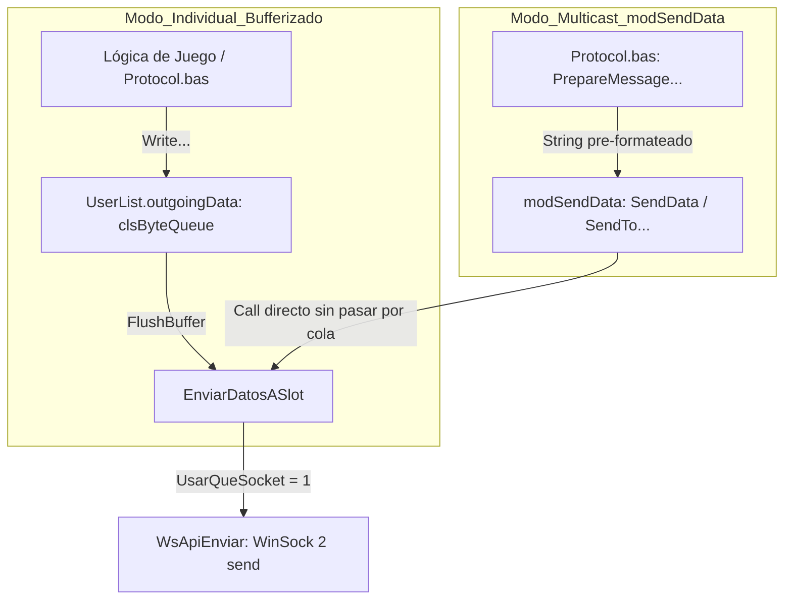
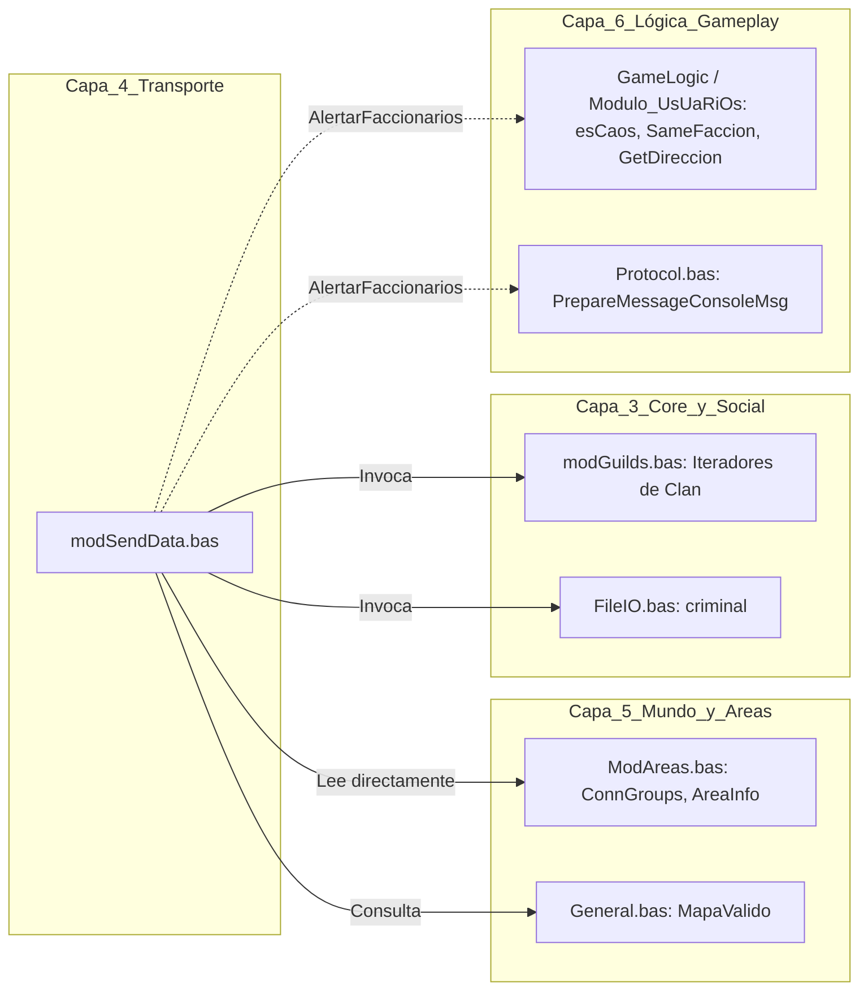

---
area: protocolo-de-red
status: audit
source_files:
  - legacy/server/Codigo/modSendData.bas
  - legacy/server/Codigo/ModAreas.bas
  - legacy/server/Codigo/TCP.bas
  - legacy/server/Codigo/Protocol.bas
  - legacy/server/Codigo/Declares.bas
  - legacy/server/Codigo/modGuilds.bas
  - legacy/server/Codigo/FileIO.bas
  - legacy/server/Codigo/Modulo_UsUaRiOs.bas
tags: [auditoria, modsenddata, senddata, broadcast, areas, modareas, tcp, sockets, vb6, cpp]
last_updated: 2026-09-12
---

# Auditoría Técnica: Módulo de Despacho de Red `modSendData.bas` (Capa 4, Módulo #15)

## 1. Resumen Ejecutivo y Alcance

Este informe documenta la auditoría técnica minuciosa del módulo [`legacy/server/Codigo/modSendData.bas`](../../legacy/server/Codigo/modSendData.bas) (734 líneas en el servidor original de Visual Basic 6 de Argentum Online v0.13.0).

El módulo `modSendData` oficia de subsistema central de enrutamiento y difusión (*broadcasting* y *multicasting*) de mensajes y paquetes salientes de red hacia los clientes conectados. Su rol primordial es evitar la duplicación innecesaria de serializaciones en memoria mediante la emisión de paquetes pre-formateados (cadenas devueltas por rutinas `PrepareMessage...` de [`Protocol.bas`](../../legacy/server/Codigo/Protocol.bas)) hacia múltiples destinatarios filtrados por criterios geográficos (mapas, áreas de visión de 9x9 tiles), administrativos (roles de Game Master, Consejeros), sociales (miembros de clan, miembros de party) y de facción (Armada Real, Fuerzas del Caos, ciudadanos o criminales).

### Objetivos de la Auditoría
1. Relevar el catálogo exhaustivo de rutinas, parámetros, visibilidad y propósitos en el código original.
2. Determinar con exactitud el mecanismo físico de despacho de bytes (colas salientes `outgoingData` vs. invocaciones a `EnviarDatosASlot` y ausencia de `FlushBuffer`).
3. Analizar la frontera de acoplamiento e interacción con el subsistema de áreas ([`ModAreas.bas`](../../legacy/server/Codigo/ModAreas.bas), Capa 5) y módulos satélite (clanes, facciones, visibilidad).
4. Mapear la matriz de condiciones que determinan si un usuario recibe o no un paquete, junto con el tratamiento de casos de borde y desconexiones.
5. Identificar quirks históricos, bugs latentes, símbolos huérfanos y código anómalo en la lógica legacy.
6. Establecer los lineamientos arquitectónicos para la futura migración a C++20 desacoplada e idiomática.

---

## 2. Catálogo Exhaustivo de Procedimientos y Enumeraciones

### 2.1. Enumeración de Ruteo: `SendTarget`

En [`legacy/server/Codigo/modSendData.bas#L34-L64`](../../legacy/server/Codigo/modSendData.bas#L34-L64), se define la enumeración pública `SendTarget` con 30 constantes:

```vb
Public Enum SendTarget
    ToAll = 1
    toMap
    ToPCArea
    ToAllButIndex
    ToMapButIndex
    ToGM
    ToNPCArea
    ToGuildMembers
    ToAdmins
    ToPCAreaButIndex
    ToAdminsAreaButConsejeros
    ToDiosesYclan
    ToConsejo
    ToClanArea
    ToConsejoCaos
    ToRolesMasters
    ToDeadArea
    ToCiudadanos
    ToCriminales
    ToPartyArea
    ToReal
    ToCaos
    ToCiudadanosYRMs
    ToCriminalesYRMs
    ToRealYRMs
    ToCaosYRMs
    ToHigherAdmins
    ToGMsAreaButRmsOrCounselors
    ToUsersAreaButGMs
    ToUsersAndRmsAndCounselorsAreaButGMs
End Enum
```

> [!WARNING]
> **Quirk / Bug Histórico Detectado (`ToGM`)**:
> La constante `ToGM = 6` está presente en la definición de la enumeración `SendTarget`, pero **no existe ninguna rama `Case SendTarget.ToGM` en el `Select Case` de `SendData`** ([`modSendData.bas#L70-L302`](../../legacy/server/Codigo/modSendData.bas#L70-L302)). Si algún emisor invoca `SendData(SendTarget.ToGM, ...)`, la llamada cae en el vacío y no envía ningún dato. En su lugar, el servidor implementó luego `ToGMsAreaButRmsOrCounselors` y `ToAdmins` para los mensajes administrativos.

---

### 2.2. Tabla Exhaustiva de Procedimientos en `modSendData.bas`

El módulo contiene exactamente 15 procedimientos (5 `Public Sub` y 10 `Private Sub`). No contiene ninguna `Function`.

| # | Procedimiento / Firma Exacta | Visibilidad | Líneas VB6 | Propósito y Comportamiento Resumido |
| :-: | :--- | :---: | :---: | :--- |
| 1 | `Public Sub SendData(ByVal sndRoute As SendTarget, ByVal sndIndex As Integer, ByVal sndData As String)` | `Public` | [L66-L303](../../legacy/server/Codigo/modSendData.bas#L66-L303) | Despachador maestro polimórfico. Evalúa `sndRoute` y redirige `sndData` a bucles globales (`1 To LastUser`), iteradores de clanes, o delega en rutinas de mapa/área usando `sndIndex` como referencia de usuario, mapa o clan. |
| 2 | `Private Sub SendToUserArea(ByVal UserIndex As Integer, ByVal sdData As String)` | `Private` | [L305-L335](../../legacy/server/Codigo/modSendData.bas#L305-L335) | Envía `sdData` a todos los usuarios con conexión válida cuya área de recepción de 3x3 intersecta el área de pertenencia de `UserIndex` en su mapa actual. |
| 3 | `Private Sub SendToUserAreaButindex(ByVal UserIndex As Integer, ByVal sdData As String)` | `Private` | [L337-L372](../../legacy/server/Codigo/modSendData.bas#L337-L372) | Difunde `sdData` al área de visión de `UserIndex`, excluyendo explícitamente a dicho `UserIndex`. |
| 4 | `Private Sub SendToDeadUserArea(ByVal UserIndex As Integer, ByVal sdData As String)` | `Private` | [L374-L405](../../legacy/server/Codigo/modSendData.bas#L374-L405) | Difunde `sdData` en el área de `UserIndex` filtrando únicamente a receptores que estén muertos (`flags.Muerto = 1`) o que pertenezcan al staff (`Admin`, `Dios`, `SemiDios`, `Consejero`). |
| 5 | `Private Sub SendToUserGuildArea(ByVal UserIndex As Integer, ByVal sdData As String)` | `Private` | [L407-L439](../../legacy/server/Codigo/modSendData.bas#L407-L439) | Envía `sdData` en el área de `UserIndex` a sus compañeros de clan (`GuildIndex`) o a GMs con rango Dios que no sean RoleMasters. Si `UserIndex` no tiene clan (`GuildIndex = 0`), cancela de inmediato. |
| 6 | `Private Sub SendToUserPartyArea(ByVal UserIndex As Integer, ByVal sdData As String)` | `Private` | [L441-L473](../../legacy/server/Codigo/modSendData.bas#L441-L473) | Envía `sdData` en el área de `UserIndex` exclusivamente a integrantes de su misma party (`PartyIndex`). Si `PartyIndex = 0`, cancela de inmediato. |
| 7 | `Private Sub SendToAdminsButConsejerosArea(ByVal UserIndex As Integer, ByVal sdData As String)` | `Private` | [L475-L506](../../legacy/server/Codigo/modSendData.bas#L475-L506) | Difunde `sdData` en el área de `UserIndex` sólo a miembros de la administración con privilegios `SemiDios`, `Dios` o `Admin` (excluye Consejeros y RoleMasters). |
| 8 | `Private Sub SendToNpcArea(ByVal NpcIndex As Long, ByVal sdData As String)` | `Private` | [L508-L541](../../legacy/server/Codigo/modSendData.bas#L508-L541) | Envía `sdData` a todos los usuarios válidos cuya área de recepción cubra la posición espacial actual del NPC `NpcIndex`. |
| 9 | `Public Sub SendToAreaByPos(ByVal Map As Integer, ByVal AreaX As Integer, ByVal AreaY As Integer, ByVal sdData As String)` | `Public` | [L543-L571](../../legacy/server/Codigo/modSendData.bas#L543-L571) | Difunde `sdData` a los usuarios en `Map` cuya área cubra una coordenada arbitraria de grilla `(AreaX, AreaY)`, calculando dinámicamente las máscaras con `2 ^ (Pos \ 9)`. |
| 10 | `Public Sub SendToMap(ByVal Map As Integer, ByVal sdData As String)` | `Public` | [L573-L591](../../legacy/server/Codigo/modSendData.bas#L573-L591) | Difunde `sdData` a todos los usuarios con conexión válida registrados en el mapa `Map` iterando sobre la colección `ConnGroups(Map)`. |
| 11 | `Public Sub SendToMapButIndex(ByVal UserIndex As Integer, ByVal sdData As String)` | `Public` | [L593-L614](../../legacy/server/Codigo/modSendData.bas#L593-L614) | Difunde `sdData` a todos los usuarios del mapa de `UserIndex`, excepto al propio `UserIndex`. |
| 12 | `Private Sub SendToGMsAreaButRmsOrCounselors(ByVal UserIndex As Integer, ByVal sdData As String)` | `Private` | [L616-L653](../../legacy/server/Codigo/modSendData.bas#L616-L653) | Difunde en el área de `UserIndex` a usuarios con privilegios de staff puro (no usuarios normales, ni consejeros, ni rolemasters). |
| 13 | `Private Sub SendToUsersAreaButGMs(ByVal UserIndex As Integer, ByVal sdData As String)` | `Private` | [L655-L687](../../legacy/server/Codigo/modSendData.bas#L655-L687) | Difunde en el área de `UserIndex` exclusivamente a jugadores mortales estándar (`Privilegios And PlayerType.User`). |
| 14 | `Private Sub SendToUsersAndRmsAndCounselorsAreaButGMs(ByVal UserIndex As Integer, ByVal sdData As String)` | `Private` | [L689-L721](../../legacy/server/Codigo/modSendData.bas#L689-L721) | Difunde en el área de `UserIndex` a mortales, consejeros o rolemasters, excluyendo a la cúpula de administración/dioses. |
| 15 | `Public Sub AlertarFaccionarios(ByVal UserIndex As Integer)` | `Public` | [L723-L762](../../legacy/server/Codigo/modSendData.bas#L723-L762) | Rutina especializada de gameplay que notifica a todos los miembros de la misma facción en el mapa la dirección relativa cardinal de donde proviene el auxilio. |

> [!NOTE]
> **Sobre la existencia de rutinas como `SendToAll` o `SendToArea`**:
> En el código fuente legacy **no existen procedimientos individuales llamados `Sub SendToAll` ni `Sub SendToArea`**.
> - La funcionalidad "SendToAll" se ejecuta de manera *in-place* dentro del `Select Case` de `SendData` bajo `Case SendTarget.ToAll` ([`modSendData.bas#L83-L91`](../../legacy/server/Codigo/modSendData.bas#L83-L91)).
> - La funcionalidad "SendToArea" de un usuario se ejecuta delegando en `SendToUserArea` bajo `Case SendTarget.ToPCArea` ([`modSendData.bas#L72-L74`](../../legacy/server/Codigo/modSendData.bas#L72-L74)).

---

## 3. Mecanismo de Despacho de Bytes a la Red

### 3.1. Flujo Directo vía `EnviarDatosASlot` vs. Colas Salientes `outgoingData`

Uno de los aspectos más importantes del servidor original es la dualidad en el despacho de datos salientes:



1. **Mensajes dirigidos a un único usuario**:
   - Se construyen mediante procedimientos `Write...` de [`legacy/server/Codigo/Protocol.bas`](../../legacy/server/Codigo/Protocol.bas).
   - Estos métodos serializan datos directamente en la cola circular del usuario: `UserList(UserIndex).outgoingData` (instancia de `clsByteQueue`).
   - Posteriormente, cuando la lógica del ciclo de juego decide transmitir los paquetes acumulados en el frame o tick, se invoca `FlushBuffer(UserIndex)`.
   - `FlushBuffer` ([`Protocol.bas#L17233-L17248`](../../legacy/server/Codigo/Protocol.bas#L17233-L17248)) extrae el contenido consolidado (`.ReadASCIIStringFixed(.length)`) y llama a `EnviarDatosASlot(UserIndex, sndData)`.

2. **Mensajes broadcast y multicast (`modSendData.bas`)**:
   - **`modSendData.bas` NUNCA escribe en `UserList(i).outgoingData`**.
   - **`modSendData.bas` NUNCA invoca a métodos de `clsByteQueue`**.
   - **`modSendData.bas` NUNCA invoca a `FlushBuffer`** (la palabra `FlushBuffer` no aparece en ninguna línea del módulo).
   - En su lugar, el mensaje completo ya viene empaquetado en una cadena de bytes (`sndData` o `sdData`) producida por las funciones `PrepareMessage...` de `Protocol.bas` (por ejemplo: `PrepareMessageChatOverHead(...)`, `PrepareMessageBlockPosition(...)`, `PrepareMessageCreateFX(...)`).
   - Cada una de las 15 rutinas de `modSendData.bas` invoca **directamente** a:
     ```vb
     Call EnviarDatosASlot(targetIndex, sdData)
     ```
   - Esto evita el costo computacional de copiar el mismo mensaje a decenas o cientos de colas `outgoingData` individuales, despachándolo inmediatamente a la pila TCP del sistema operativo mediante `WsApiEnviar` ([`legacy/server/Codigo/TCP.bas#L830`](../../legacy/server/Codigo/TCP.bas#L830) y [`legacy/server/Codigo/wskapiAO.bas#L340`](../../legacy/server/Codigo/wskapiAO.bas#L340)).

---

## 4. Interacción con el Sistema de Áreas y Frontera de Dependencias

### 4.1. Análisis Detallado de `SendToUserArea` y `SendToAreaByPos`

Las rutinas de área en `modSendData.bas` no realizan escaneos cuadráticos de coordenadas $(x, y)$ ni calculan distancias euclidianas en cada envío. El servidor de Argentum Online utiliza una grilla de áreas discretas ideada originalmente por Maraxus e implementada por DuNga en [`legacy/server/Codigo/ModAreas.bas`](../../legacy/server/Codigo/ModAreas.bas).

#### Grilla y Representación Matemática en Bitmasks
- El mapa clásico de Argentum Online tiene $100 \times 100$ tiles.
- Se divide en una grilla de $12 \times 12$ áreas de $9 \times 9$ tiles (índices enteros de $0$ a $11$, calculados mediante la división entera `X \ 9` e `Y \ 9`).
- Cada entidad posee una estructura `AreaInfo` ([`ModAreas.bas#L34-L44`](../../legacy/server/Codigo/ModAreas.bas#L34-L44) y [`Declares.bas#L742`](../../legacy/server/Codigo/Declares.bas#L742)):
  - **`AreaPerteneceX` / `AreaPerteneceY`**: Máscara de un solo bit encendido que indica la celda en la que se encuentra la entidad:
    $$\text{AreaPertenece} = 2^{(\text{Coord} \setminus 9)} = 1 \ll (\text{Coord} / 9)$$
  - **`AreaReciveX` / `AreaReciveY`**: Máscara de hasta 3 bits encendidos que cubre su propia celda y las celdas contiguas inmediata anterior y posterior:
    $$\text{AreaRecive}(c) = (2^c) \mid (2^{c-1}) \mid (2^{c+1})$$
    lo que conforma un cono de audición/visión de $3 \times 3$ áreas (es decir, $27 \times 27$ tiles en total alrededor del jugador).

#### Bucle de Despacho en `SendToUserArea` ([`modSendData.bas#L305-L335`](../../legacy/server/Codigo/modSendData.bas#L305-L335))
```vb
    Map = UserList(UserIndex).Pos.Map
    AreaX = UserList(UserIndex).AreasInfo.AreaPerteneceX
    AreaY = UserList(UserIndex).AreasInfo.AreaPerteneceY
    
    If Not MapaValido(Map) Then Exit Sub
    
    For LoopC = 1 To ConnGroups(Map).CountEntrys
        tempIndex = ConnGroups(Map).UserEntrys(LoopC)
        
        If UserList(tempIndex).AreasInfo.AreaReciveX And AreaX Then  'Esta en el area?
            If UserList(tempIndex).AreasInfo.AreaReciveY And AreaY Then
                If UserList(tempIndex).ConnIDValida Then
                    Call EnviarDatosASlot(tempIndex, sdData)
                End If
            End If
        End If
    Next LoopC
```

#### Enrutamiento por Coordenada Arbitraria: `SendToAreaByPos` ([`modSendData.bas#L543-L571`](../../legacy/server/Codigo/modSendData.bas#L543-L571))
A diferencia de `SendToUserArea`, que lee las máscaras precalculadas de la entidad emisora, `SendToAreaByPos` recibe coordenadas de tile arbitrarias `(AreaX, AreaY)` y calcula la máscara al vuelo:
```vb
    AreaX = 2 ^ (AreaX \ 9)
    AreaY = 2 ^ (AreaY \ 9)
```
Luego itera idénticamente sobre `ConnGroups(Map)` aplicando la misma operación bitwise `And`.

---

### 4.2. Frontera de Dependencias y Acoplamiento Inter-Capa

`modSendData.bas` está catalogado en la **Capa 4** (Protocolo y Enrutamiento de Red), pero presenta dependencias cruzadas directas con estructuras y módulos de capas posteriores:



1. **Dependencia Fuerte con `ModAreas.bas` (Capa 5)**:
   - `modSendData.bas` **NO calcula el conjunto de las 9 áreas desde cero**; lee directamente los arreglos globales `ConnGroups(Map).UserEntrys` y los campos de `UserList(i).AreasInfo`.
   - `ConnGroups(Map)` es una lista compacta de los usuarios presentes en dicho mapa, gestionada exclusivamente por `ModAreas.bas` (`AgregarUser`, `QuitarUser`, `CambioDeArea`).
2. **Dependencia con Módulos de Clanes (`modGuilds.bas`, Capa 3)**:
   - Casos `ToGuildMembers` y `ToDiosesYclan`:
     ```vb
     LoopC = modGuilds.m_Iterador_ProximoUserIndex(sndIndex)
     While LoopC > 0
         If (UserList(LoopC).ConnID <> -1) Then Call EnviarDatosASlot(LoopC, sndData)
         LoopC = modGuilds.m_Iterador_ProximoUserIndex(sndIndex)
     Wend
     ```
   - Requiere la existencia de un `GuildManager` que permita iterar sobre los miembros conectados de un clan y sobre los Game Masters (`Iterador_ProximoGM`).
3. **Dependencia con `criminal()` ([`FileIO.bas#L1958`](../../legacy/server/Codigo/FileIO.bas#L1958))**:
   - Utilizado en `ToCiudadanos`, `ToCriminales`, `ToCiudadanosYRMs`, `ToCriminalesYRMs`.
4. **Anomalía de Capa en `AlertarFaccionarios`**:
   - Invoca a `esCaos(UserIndex)` ([`GameLogic.bas#L51`](../../legacy/server/Codigo/GameLogic.bas#L51)), `SameFaccion(...)` ([`Modulo_UsUaRiOs.bas#L2210`](../../legacy/server/Codigo/Modulo_UsUaRiOs.bas#L2210)), `GetDireccion(...)` ([`Modulo_UsUaRiOs.bas#L2178`](../../legacy/server/Codigo/Modulo_UsUaRiOs.bas#L2178)) y `PrepareMessageConsoleMsg(...)` ([`Protocol.bas#L17328`](../../legacy/server/Codigo/Protocol.bas#L17328)).
   - Es el único procedimiento con lógica de alto nivel acoplada en un módulo de transporte.

---

## 5. Filtros de Destinatarios y Casos de Borde

### 5.1. Matriz Exhaustiva de Condiciones de Recepción

| Ruta / Rutina | Población Iterada | Condición de Conectividad | Filtros de Gameplay y Privilegios |
| :--- | :--- | :--- | :--- |
| `ToAll` | `1 To LastUser` | `ConnID <> -1` | `flags.UserLogged = 1` |
| `ToAllButIndex` | `1 To LastUser` | `ConnID <> -1` | `flags.UserLogged = 1` y `LoopC <> sndIndex` |
| `ToAdmins` | `1 To LastUser` | `ConnID <> -1` | `flags.Privilegios And (Admin Or Dios Or SemiDios Or Consejero)` (¡No chequea `UserLogged`!) |
| `ToHigherAdmins` | `1 To LastUser` | `ConnID <> -1` | `flags.Privilegios And (Admin Or Dios)` (¡No chequea `UserLogged`!) |
| `ToConsejo` | `1 To LastUser` | `ConnID <> -1` | `flags.Privilegios And PlayerType.RoyalCouncil` |
| `ToConsejoCaos` | `1 To LastUser` | `ConnID <> -1` | `flags.Privilegios And PlayerType.ChaosCouncil` |
| `ToRolesMasters` | `1 To LastUser` | `ConnID <> -1` | `flags.Privilegios And PlayerType.RoleMaster` |
| `ToCiudadanos` | `1 To LastUser` | `ConnID <> -1` | `Not criminal(LoopC)` |
| `ToCriminales` | `1 To LastUser` | `ConnID <> -1` | `criminal(LoopC)` |
| `ToReal` | `1 To LastUser` | `ConnID <> -1` | `Faccion.ArmadaReal = 1` |
| `ToCaos` | `1 To LastUser` | `ConnID <> -1` | `Faccion.FuerzasCaos = 1` |
| `ToCiudadanosYRMs` | `1 To LastUser` | `ConnID <> -1` | `Not criminal(LoopC) Or (Privilegios And RoleMaster) <> 0` |
| `ToCriminalesYRMs` | `1 To LastUser` | `ConnID <> -1` | `criminal(LoopC) Or (Privilegios And RoleMaster) <> 0` |
| `ToRealYRMs` | `1 To LastUser` | `ConnID <> -1` | `Faccion.ArmadaReal = 1 Or (Privilegios And RoleMaster) <> 0` |
| `ToCaosYRMs` | `1 To LastUser` | `ConnID <> -1` | `Faccion.FuerzasCaos = 1 Or (Privilegios And RoleMaster) <> 0` |
| `ToGuildMembers` | Iterador de clan | `ConnID <> -1` | Pertenece al `GuildIndex` indicado |
| `ToDiosesYclan` | Iteradores clan + GM | `ConnID <> -1` | Miembros del clan o GMs con privilegio `Dios` |
| `SendToMap` | `ConnGroups(Map)` | `ConnIDValida = True` | Todos en el mapa |
| `SendToMapButIndex` | `ConnGroups(Map)` | `ConnIDValida = True` | Todos en el mapa excepto `UserIndex` |
| `SendToUserArea` | `ConnGroups(Map)` | `ConnIDValida = True` | Intersección de máscaras `AreaRecive` y `AreaPertenece` |
| `SendToUserAreaButindex`| `ConnGroups(Map)` | `ConnIDValida = True` | Intersección de máscaras y `tempIndex <> UserIndex` |
| `SendToDeadUserArea` | `ConnGroups(Map)` | `ConnIDValida = True` | En área y (`flags.Muerto = 1` o miembro del Staff) |
| `SendToUserGuildArea` | `ConnGroups(Map)` | `ConnIDValida = True` | En área y (`GuildIndex` coincidente o `Dios` que no sea `RoleMaster`) |
| `SendToUserPartyArea` | `ConnGroups(Map)` | `ConnIDValida = True` | En área y `PartyIndex` coincidente |
| `SendToAdminsButConsejerosArea` | `ConnGroups(Map)` | `ConnIDValida = True` | En área y `Privilegios And (SemiDios Or Dios Or Admin)` |
| `SendToGMsAreaButRmsOrCounselors` | `ConnGroups(Map)` | `ConnIDValida = True` | En área y Staff exclusivo (sin bits de `User`, `Consejero` ni `RoleMaster`) |
| `SendToUsersAreaButGMs` | `ConnGroups(Map)` | `ConnIDValida = True` | En área y `Privilegios And PlayerType.User` |
| `SendToUsersAndRmsAndCounselorsAreaButGMs` | `ConnGroups(Map)` | `ConnIDValida = True` | En área y `Privilegios And (User Or Consejero Or RoleMaster)` |
| `AlertarFaccionarios` | `ConnGroups(Map)` | `ConnIDValida = True` | Mismo mapa, `tempIndex <> UserIndex` y `SameFaccion(...)` |

---

### 5.2. Casos de Borde y Manejo de Errores

1. **`On Error Resume Next` en `SendData`**:
   La rutina principal [`modSendData.bas#L69`](../../legacy/server/Codigo/modSendData.bas#L69) inicia con `On Error Resume Next`. Esto amortigua silenciosamente cualquier desbordamiento de índice (por ejemplo, pasar un `sndIndex` inválido a rutinas de clan o un mapa inexistente), continuando la ejecución sin abortar el bucle del servidor.
2. **Validación de Mapa Inválido**:
   En todas las rutinas de área y mapa (`SendToUserArea`, `SendToMap`, etc.), la primera línea evalúa:
   ```vb
   If Not MapaValido(Map) Then Exit Sub
   ```
   Si el mapa es $\le 0$ o mayor a `NumMaps`, la función finaliza de inmediato sin tocar `ConnGroups`.
3. **Usuarios sin Clan o Party**:
   - `SendToUserGuildArea`: Si `UserList(UserIndex).GuildIndex = 0 Then Exit Sub`.
   - `SendToUserPartyArea`: Si `UserList(UserIndex).PartyIndex = 0 Then Exit Sub`.
4. **Discrepancia entre `ConnID <> -1` y `ConnIDValida`**:
   - `ConnID <> -1` indica simplemente que el descriptor de socket fue asignado.
   - `ConnIDValida` es un booleano establecido en `True` únicamente tras completar la inicialización del socket WinSock en [`wskapiAO.bas#L475`](../../legacy/server/Codigo/wskapiAO.bas#L475).
   - En las rutinas globales de `SendData` se chequea `ConnID <> -1`, mientras que en las de área/mapa se verifica `ConnIDValida`.

---

## 6. Detección de Quirks, Bugs Históricos y Código Muerto

### 6.1. `SendTarget.ToGM` Huérfano
En [`modSendData.bas#L39`](../../legacy/server/Codigo/modSendData.bas#L39) se define la constante `ToGM`. Sin embargo:
- No existe `Case SendTarget.ToGM` en `SendData`.
- El código original migró a `ToGMsAreaButRmsOrCounselors` (para ámbito local) y `ToAdmins` (para ámbito global).
- La constante quedó como residuo muerto de versiones tempranas de 0.11/0.12.

### 6.2. Ausencia de Verificación `flags.UserLogged` en Broadcasts Globales
En `SendData`:
- `ToAll` y `ToAllButIndex` chequean explícitamente:
  ```vb
  If UserList(LoopC).flags.UserLogged Then Call EnviarDatosASlot(LoopC, sndData)
  ```
- No obstante, los canales de facción (`ToCiudadanos`, `ToCriminales`, `ToReal`, `ToCaos`) y de administración (`ToAdmins`, `ToHigherAdmins`, `ToConsejo`, `ToConsejoCaos`) **NO evalúan `flags.UserLogged`**.
- Si un slot tiene un socket conectado (`ConnID <> -1`) pero se encuentra en la pantalla de selección de personaje o login, y sus estructuras contienen valores residuales de sesión previa, podría llegar a recibir mensajes de chat global o avisos administrativos antes de haber ingresado formalmente al mundo.

### 6.3. Operación de Exponenciación Matemática en Punto Flotante (`^`) en `SendToAreaByPos`
En [`modSendData.bas#L550-L551`](../../legacy/server/Codigo/modSendData.bas#L550-L551):
```vb
AreaX = 2 ^ (AreaX \ 9)
AreaY = 2 ^ (AreaY \ 9)
```
En VB6, el operador `^` fuerza conversiones a `Double` e invoca rutinas aritméticas de punto flotante de la runtime de VB (`__vbaPower`). En C++, esta operación debe ser un simple desplazamiento a nivel de bits sobre enteros:
```cpp
const int area_mask_x = 1 << (pos_x / 9);
const int area_mask_y = 1 << (pos_y / 9);
```

### 6.4. Cotas de Bucle: `LastUser` vs. `ConnGroups(Map).CountEntrys`
- Los bucles globales iteran `For LoopC = 1 To LastUser`. Esta optimización es histórica de AO: `LastUser` mantiene el índice de slot activo más alto, evitando recorrer hasta `MaxUsers` (10.000). Si no hay usuarios conectados, `LastUser` vale 0 y el bucle no ejecuta ninguna iteración.
- Los bucles locales iteran `For LoopC = 1 To ConnGroups(Map).CountEntrys`. Este arreglo dinámico se redimensiona y compacta en `ModAreas.bas`, de modo que no hay iteraciones sobre slots inactivos del mapa.

---

## 7. Lineamientos para la Implementación en C++20

Para preservar la arquitectura limpia y respetar las capas del plan de migración:

1. **Desacoplamiento mediante Inversión de Dependencias**:
   - `modSendData` en C++20 no debe depender de variables globales mutables de `ModAreas`.
   - Puede recibir una interfaz o referencia a un proveedor de contexto espacial (ej. `IAreaViewerProvider` o callbacks que entreguen los `user_index` / `SessionHandle` de un área o mapa).
   - O alternativamente, el despachador de red puede estructurarse como un servicio `Broadcaster` / `MessageDispatcher` inyectable.
2. **Reemplazo de `String` por Vistas de Bytes Inmutables**:
   - En VB6, pasar cadenas de texto `sdData As String` implica constantes copias de `BSTR` y asignaciones de memoria dinámica.
   - En C++20, los métodos de despacho deben recibir `std::span<const uint8_t>` o `std::string_view`, permitiendo enviar el mismo paquete serializado a múltiples sockets sin una sola copia de memoria adicional.
3. **Manejo Seguro de Errores y Tipado Fuerte**:
   - Erradicar el `On Error Resume Next`.
   - Utilizar tipos `enum class SendTarget : uint8_t` con manejo exhaustivo en `switch` (`[[nodiscard]]` o warnings de compilación ante casos faltantes).
   - Reubicar la lógica de `AlertarFaccionarios` en el subsistema de facciones / gameplay, dejando en `modSendData` únicamente primitivas puras de transporte.

---

## 8. Conclusiones

La auditoría de `modSendData.bas` revela que el subsistema de despacho de Argentum Online 0.13.0 está diseñado como un pipeline de entrega directa (*bypass* del buffer de usuario `outgoingData`) optimizado mediante bitmasks enteros sobre una partición de $12 \times 12$ áreas. Su dependencia crítica con `ModAreas.bas` (Capa 5) exige un diseño cuidadoso de desacoplamiento para que el módulo de la Capa 4 pueda ser probado e implementado de forma modular.
