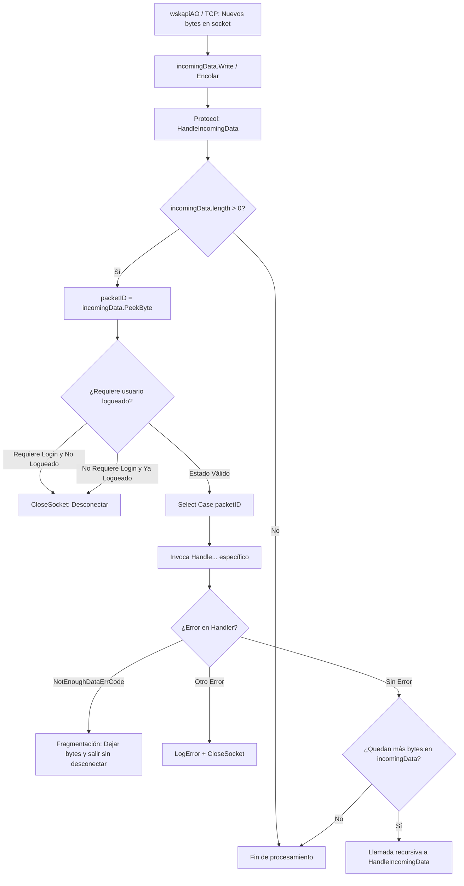
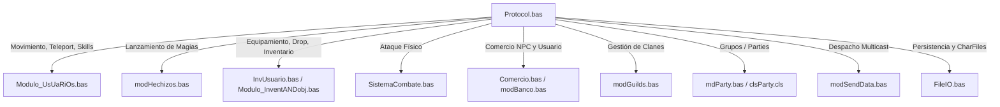

---
area: protocolo-de-red
status: audit
source_files:
  - legacy/server/Codigo/Protocol.bas
  - legacy/server/Codigo/clsByteQueue.cls
  - legacy/server/Codigo/modSendData.bas
  - legacy/server/Codigo/TCP.bas
  - legacy/server/Codigo/Declares.bas
  - legacy/server/Codigo/Modulo_UsUaRiOs.bas
tags: [auditoria, protocol, opcodes, handleincomingdata, write, preparemessage, buffering, fragmentacion, vb6, cpp]
last_updated: 2026-09-12
---

# Auditoría Técnica: Módulo Central de Protocolo `Protocol.bas` (Capa 4, Módulo #16)

## 1. Resumen Ejecutivo y Alcance

Este informe documenta la investigación técnica minuciosa del módulo [`legacy/server/Codigo/Protocol.bas`](../../legacy/server/Codigo/Protocol.bas) del servidor de Argentum Online v0.13.0.

Con un volumen extraordinario de **16.874 líneas de código en Visual Basic 6**, `Protocol.bas` constituye el componente más extenso y con mayor densidad de dependencias de todo el proyecto legacy. Está clasificado como un módulo de **Categoría Crítica 2 (Opcodes)** en [`docs/implementation/00-port-plan.md`](../implementation/00-port-plan.md).

El objetivo de esta auditoría es descomponer sus mecanismos fundamentales:
1. El procesamiento de paquetes entrantes (`HandleIncomingData`) y la gestión de fragmentación de red.
2. La dicotomía entre paquetes de salida individuales (`Write...` sobre `outgoingData`) y colectivos (`PrepareMessage...` para `modSendData`).
3. El patrón histórico de manejo de excepciones y desbordamiento de búfer (`NOT_ENOUGH_SPACE` + `Resume`).
4. El mapeo de dependencias transversales hacia módulos de gameplay (Capas 6 a 10) y la identificación de lógica dura incrustada.

---

## 2. Estructura General y Manejo de Datos Entrantes (`HandleIncomingData`)

### 2.1. Métricas del Módulo
- **Líneas de código totales**: 16.874 líneas.
- **Enumeraciones de Opcodes**:
  - `ClientPacketID` ([L36-L191](../../legacy/server/Codigo/Protocol.bas#L36-L191)): 109 opcodes de cliente (mensajes desde el cliente hacia el servidor).
  - `ServerPacketID` ([L193-L330](../../legacy/server/Codigo/Protocol.bas#L193-L330)): 113 opcodes de servidor (mensajes desde el servidor hacia el cliente).

---

### 2.2. Flujo de `HandleIncomingData` ([L342-L796](../../legacy/server/Codigo/Protocol.bas#L342-L796))

`HandleIncomingData` es el despachador de entrada de mayor nivel del servidor, invocado cada vez que la capa de transporte (`wskapiAO.bas:511` o `TCP.cpp`) deposita bytes en la cola circular del usuario (`UserList(UserIndex).incomingData`).



#### 1. Inspección sin Extracción (`PeekByte`)
En la línea [L349](../../legacy/server/Codigo/Protocol.bas#L349):
```vb
packetID = UserList(UserIndex).incomingData.PeekByte()
```
El identificador del paquete se examina mediante `PeekByte()`, **sin removerlo de la cola circular**. Esto es indispensable para preservar la integridad del paquete si se comprueba que aún no arribaron todos sus bytes.

#### 2. Validación de Estado de Sesión
Entre las líneas [L352-L373](../../legacy/server/Codigo/Protocol.bas#L352-L373):
- Se comprueba si el paquete es de autenticación temprana (`ThrowDices`, `LoginExistingChar`, `LoginNewChar`).
- Si un paquete requiere que el personaje esté dentro del mundo pero `flags.UserLogged = false`, se cierra la conexión de inmediato (`Call CloseSocket(UserIndex)`).
- A la inversa, si un cliente ya autenticado e ingresado al juego intenta enviar un paquete de login, se interpreta como anomalía de protocolo y también se desconecta.
- Ante cualquier paquete válido recibido, se resetea el contador de inactividad (`IdleCount = 0`) y se desactiva la protección inicial de ataque (`flags.NoPuedeSerAtacado = False`).

---

### 2.3. Detección y Aborto de Paquetes Fragmentados

Dado que TCP es un protocolo orientado a flujo de bytes continuo (*byte-stream*) y no a datagramas discretos, un paquete puede llegar fragmentado a través de múltiples lecturas de red.

Cada rutina específica `Handle...` valida la longitud de bytes requerida antes de extraerlos:
Ejemplo en `HandleWalk` ([L1867-L1870](../../legacy/server/Codigo/Protocol.bas#L1867-L1870)):
```vb
If UserList(UserIndex).incomingData.length < 2 Then
    Err.Raise UserList(UserIndex).incomingData.NotEnoughDataErrCode
    Exit Sub
End If
```
O en `HandleAttack` ([L2453-L2456](../../legacy/server/Codigo/Protocol.bas#L2453-L2456)):
```vb
If UserList(UserIndex).incomingData.length < 2 Then
    Err.Raise UserList(UserIndex).incomingData.NotEnoughDataErrCode
    Exit Sub
End If
```

#### Mecanismo de Aborto Silencioso:
1. Al no alcanzar los bytes suficientes, el handler dispara la excepción `NotEnoughDataErrCode` (definida en `clsByteQueue.cls`).
2. La excepción es absorbida por el bloque `On Error Resume Next` de `HandleIncomingData` ([L347](../../legacy/server/Codigo/Protocol.bas#L347)).
3. Al concluir el `Select Case`, `HandleIncomingData` evalúa las líneas [L778-L788](../../legacy/server/Codigo/Protocol.bas#L778-L788):
   ```vb
   If UserList(UserIndex).incomingData.length > 0 And Err.Number = 0 Then
       Err.Clear
       Call HandleIncomingData(UserIndex)
   ElseIf Err.Number <> 0 And Not Err.Number = UserList(UserIndex).incomingData.NotEnoughDataErrCode Then
       Call LogError(...)
       Call CloseSocket(UserIndex)
   End If
   ```
4. **Comportamiento ante Fragmentación**:
   - `Err.Number` es igual a `NotEnoughDataErrCode`.
   - Por ende, **no entra** al reintento recursivo (`Err.Number = 0` es falso).
   - Y **tampoco entra** a la desconexión por error (`Not Err.Number = NotEnoughDataErrCode` es falso).
   - La función finaliza limpiamente sin alterar el contenido de `incomingData`. Cuando la red entregue el siguiente bloque TCP, los bytes acumulados se concatenarán y el paquete se procesará completo.

---

## 3. Dicotomía de Salida: `Write...` vs. `PrepareMessage...`

El subsistema de emisión de paquetes salientes está estrictamente bifurcado en dos arquitecturas complementarias:

| Característica | Procedimientos `Write...` | Funciones `PrepareMessage...` |
| :--- | :--- | :--- |
| **Cantidad de métodos** | 101 procedimientos `Public Sub` ([L14175-L17230](../../legacy/server/Codigo/Protocol.bas#L14175-L17230)) | 36 funciones `Public Function` ([L17255-L17870](../../legacy/server/Codigo/Protocol.bas#L17255-L17870)) |
| **Destino de los Bytes** | `UserList(UserIndex).outgoingData` (cola individual) | Variable modular `auxiliarBuffer` (`clsByteQueue`) |
| **Valor de Retorno** | Ninguno (`Sub`) | Cadena binaria `String` preformateada |
| **Ámbito de Uso** | Mensajes dirigidos a un único cliente (unicast) | Difusiones a múltiples clientes (multicast/broadcast vía `modSendData`) |
| **Vaciado de Buffer** | Diferido; se transmite al invocar `FlushBuffer(UserIndex)` | Inmediato; la cadena devuelta se despacha directo a `EnviarDatosASlot` |

### 3.1. Procedimientos `Write...`
Ejemplo: `WriteUpdateHP` ([L14732-L14749](../../legacy/server/Codigo/Protocol.bas#L14732-L14749)):
```vb
Public Sub WriteUpdateHP(ByVal UserIndex As Integer)
On Error GoTo Errhandler
    With UserList(UserIndex).outgoingData
        Call .WriteByte(ServerPacketID.UpdateHP)
        Call .WriteInteger(UserList(UserIndex).Stats.MinHp)
    End With
Exit Sub

Errhandler:
    If Err.Number = UserList(UserIndex).outgoingData.NotEnoughSpaceErrCode Then
        Call FlushBuffer(UserIndex)
        Resume
    End If
End Sub
```
> [!IMPORTANT]
> Los métodos `Write...` **no envían datos a la red por sí mismos**. Acumulan bytes en `outgoingData`. La transmisión física efectiva ocurre cuando la lógica de juego convoca a `FlushBuffer(UserIndex)` ([L17233-L17248](../../legacy/server/Codigo/Protocol.bas#L17233-L17248)), la cual extrae todo el buffer acumulado y lo despacha con `EnviarDatosASlot`.

### 3.2. Procedimientos `PrepareMessage...`
Ejemplo: `PrepareMessageChatOverHead` ([L17300-L17326](../../legacy/server/Codigo/Protocol.bas#L17300-L17326)):
```vb
Public Function PrepareMessageChatOverHead(ByVal Chat As String, ByVal CharIndex As Integer, ByVal color As Long) As String
    With auxiliarBuffer
        Call .WriteByte(ServerPacketID.ChatOverHead)
        Call .WriteASCIIString(Chat)
        Call .WriteInteger(CharIndex)
        Call .WriteLong(color)
        
        PrepareMessageChatOverHead = .ReadASCIIStringFixed(.length)
    End With
End Function
```
- Se serializa una sola vez en el buffer estático compartido `auxiliarBuffer`.
- Se extrae como cadena y se devuelve.
- Es consumido directamente por `SendData(SendTarget.ToPCArea, ...)` en `modSendData.bas`, despachándolo en bucle a cada socket sin re-serializar ni ocupar espacio en las colas individuales de los usuarios.

---

## 4. Manejo de Errores: Patrón `NOT_ENOUGH_SPACE` y `Resume` (Bug #19)

En las 101 rutinas `Write...` de `Protocol.bas`, se repite de forma idéntica el siguiente bloque de captura de excepciones:

```vb
Errhandler:
    If Err.Number = UserList(UserIndex).outgoingData.NotEnoughSpaceErrCode Then
        Call FlushBuffer(UserIndex)
        Resume
    End If
End Sub
```

### Anatomía del Congelamiento Legacy (Bug #19)
1. La capacidad del buffer `outgoingData` en `clsByteQueue.cls` está limitada por defecto a 10 KB (`DATA_BUFFER = 10240`).
2. Si un usuario experimenta latencia o congestión y se intenta escribir un paquete superando los 10 KB, `clsByteQueue` arroja la excepción `NOT_ENOUGH_SPACE`.
3. El `Errhandler` captura el error, llama a `FlushBuffer(UserIndex)` e intenta forzar la salida de los 10 KB hacia WinSock mediante `send()`.
4. Si el buffer de transmisión del socket del kernel de Windows está lleno, `send()` retorna `-1` con error `WSAEWOULDBLOCK` (10035).
5. En `TCP.bas` / `wskapiAO.bas`, al capturar `WSAEWOULDBLOCK`, **se reinsertan los 10 KB completos de vuelta en `outgoingData`**.
6. La instrucción `Resume` de VB6 ordena reiniciar la ejecución exactamente en la línea que falló (`Call .Write...`).
7. La cola continúa estando 100% llena, relanzando inmediatamente `NOT_ENOUGH_SPACE`, llamando a `FlushBuffer`, rebotando en `WSAEWOULDBLOCK` y ejecutando `Resume` de forma perpetua.
8. Dado el modelo de hilo único (STA) de Visual Basic 6, este bucle consume el 100% de un núcleo de CPU y **congela por completo el servidor entero**.

> [!NOTE]
> Este comportamiento ya fue mitigado en nuestra arquitectura C++ mediante backpressure dinámico en `src/server/TCP.cpp` ([`docs/implementation/KNOWN-LEGACY-BUGS.md`](../implementation/KNOWN-LEGACY-BUGS.md#entrada-19--tcp--wskapiao-congelamiento-del-servidor-por-bucle-infinito-ocupado-ante-wsaewouldblock-y-not_enough_space)), por lo que en el futuro port de `Protocol` las funciones de escritura delegarán en colas de capacidad elástica sin saltos por `Resume`.

---

## 5. Frontera de Dependencias y Acoplamiento con Capas Posteriores

### 5.1. Mapeo de Invocaciones Hacia Otros Módulos

`Protocol.bas` interactúa prácticamente con todo el servidor de juego:



1. **`Modulo_UsUaRiOs.bas` (Capa 6)**:
   - `MoveUserChar(UserIndex, heading)` ([L1931](../../legacy/server/Codigo/Protocol.bas#L1931))
   - `WarpUserChar(...)` ([L7829, L8129, L8184](../../legacy/server/Codigo/Protocol.bas#L7829))
   - `LookatTile(...)` ([L2554, L2917, L3005](../../legacy/server/Codigo/Protocol.bas#L2554))
   - `QuitarUserInvItem(...)` ([L2963](../../legacy/server/Codigo/Protocol.bas#L2963))
   - `SubirSkill(...)`, `CheckUserLevel(...)`, `ActStats(...)`.
2. **`modHechizos.bas` (Capa 6)**:
   - `LanzarHechizo(.flags.Hechizo, UserIndex)` ([L3028](../../legacy/server/Codigo/Protocol.bas#L3028)).
3. **`InvUsuario.bas` / `Modulo_InventANDobj.bas` (Capa 6)**:
   - `DropObj(...)` ([L2478](../../legacy/server/Codigo/Protocol.bas#L2478)), `UseInvItem(...)`, `Desequipar(...)`.
4. **`SistemaCombate.bas` (Capa 7)**:
   - `UsuarioAtacaUsuario(...)`, `UsuarioAtacaNPC(...)`.
5. **`Comercio.bas` / `modBanco.bas` (Capa 8)**:
   - `IniciarComercio(...)`, `IniciarDeposito(...)`, `ComprarObjeto(...)`.
6. **`modGuilds.bas` / `mdParty.bas` (Capa 3 / Capa 8)**:
   - Comandos de clanes y solicitudes de party.
7. **`modSendData.bas` (Capa 4)**:
   - Invocaciones a `SendData(...)` para difusiones globales y de área.

---

### 5.2. Lógica Dura de Juego Incrustada vs. Parser Puro

Un hallazgo crucial de esta auditoría es que **`Protocol.bas` dista mucho de ser un deserializador pasivo o parser puro**:

1. **Control de SpeedHack Embebido**:
   En `HandleWalk` ([L1878-L1915](../../legacy/server/Codigo/Protocol.bas#L1878-L1915)), calcula diferencias de ticks temporales (`TempTick = GetTickCount And &H7FFFFFFF`), evalúa si 30 pasos demoraron menos de 5.800 ms, registra advertencias en `LogHackAttemp` y desconecta al jugador si supera umbrales.
2. **Validación de Intervalos de Ataque y Magia**:
   En `HandleAttack` ([L2460-L2475](../../legacy/server/Codigo/Protocol.bas#L2460-L2475)) y `HandleCastSpell`, realiza verificaciones directas contra `IntervaloGolpe` e `IntervaloMagia` antes de convocar a los subsistemas de combate.
3. **El Monolito de Comandos de Game Master (`HandleGMCommands`)**:
   Entre las líneas **[L880 y L14170](../../legacy/server/Codigo/Protocol.bas#L880-L14170)** (más de **13.000 líneas**, es decir, el 78% del archivo), `HandleGMCommands` implementa directamente en un inmenso `Select Case Command` la lógica completa de:
   - Teletransportación masiva (`/TELEP`, `/SUM`).
   - Sanciones (`/BAN`, `/UNBAN`, `/PENAS`).
   - Creación de ítems (`/CI`, `/ITEM`).
   - Control de NPCs y spawns (`/ACC`, `/INVI`).
   - Auditorías y logs administrativos.

---

## 6. Lineamientos y Estrategia para el Porting a C++20

Dado el volumen colosal de 16.874 líneas y su acoplamiento masivo con capas posteriores:

1. **Desacoplamiento Estricto por Fases**:
   `Protocol` no puede portarse de forma monolítica en un único paso. Se debe dividir en:
   - **Fase A (Core y Parsing)**: `HandleIncomingData` con despacho de opcodes limpios y gestión segura de fragmentación sobre `clsByteQueue`.
   - **Fase B (Serialización Saliente)**: Port de los 36 métodos `PrepareMessage...` (que alimentan a `modSendData`) y los 101 métodos `Write...` (que alimentan a sesiones individuales).
   - **Fase C (Handlers de Jugador Básico)**: Handlers de login, dados, caminata, chat y stats.
   - **Fase D (Extracción de Comandos de GM)**: Aislar las 13.000 líneas de `HandleGMCommands` en un módulo o despachador administrativo separado (`Admin.cpp` / `GMCommands.cpp`) para evitar que el parser de red dependa de toda la lógica de juego.
2. **Eliminación del Patrón `Resume`**:
   Las funciones de escritura saliente en C++ aprovecharán buffers continuos dinámicos o la cola elástica de `TCP`, eliminando excepciones y busy-waits.
3. **Manejo de Errores Tipado**:
   Reemplazar los números de error de VB6 por códigos de retorno tipados `enum class PacketParseResult` (`Complete`, `NeedMoreData`, `Malformed`).

---

## 7. Conclusiones

`Protocol.bas` es el epicentro neurálgico del servidor legacy, vinculando la recepción de bajo nivel con la ejecución de casi todas las mecánicas del juego. Su futura implementación en C++ requerirá un desglose modular meticuloso para aislar la serialización de red de la lógica dura de gameplay que históricamente quedó atrapada en su interior.
