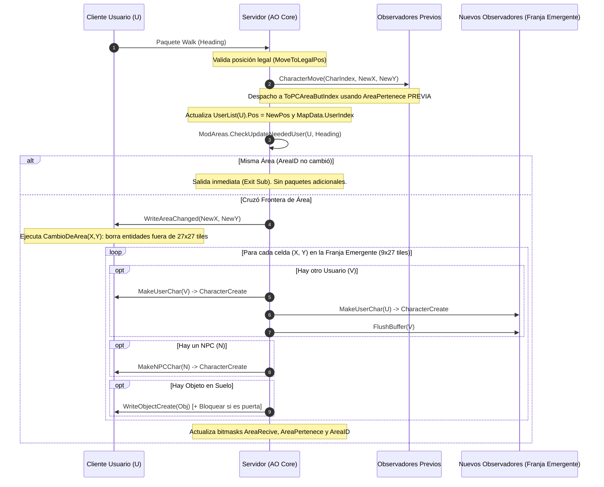

# Auditoría Técnica: Módulo de Gestión Espacial y Áreas `ModAreas.bas` (Capa 5, Módulo #17)

## 1. Resumen Ejecutivo y Alcance

Este documento presenta la auditoría técnica exhaustiva del módulo [`legacy/server/Codigo/ModAreas.bas`](../../legacy/server/Codigo/ModAreas.bas) (459 líneas en el servidor original de Visual Basic 6 de Argentum Online v0.13.0).

El sistema de áreas fue concebido originalmente por Juan Martín Sotuyo Dodero (*Maraxus*) e implementado por Lucio N. Tourrilhes (*DuNga*). Su función medular es el **filtrado de visibilidad espacial y particionamiento del mundo** para evitar el broadcast cuadrático $O(N^2)$ a nivel mapa, reduciendo drásticamente el consumo de ancho de banda y la carga de procesamiento tanto del servidor como del cliente.

### Objetivos de la Auditoría
1. **Relevar el Catálogo Completo**: Registrar todas las firmas, procedimientos, constantes y variables del módulo.
2. **Desglosar la Aritmética Espacial y Máscaras**: Analizar rigurosamente las divisiones enteras, el cómputo de cuadrantes de 9x9 tiles, la adyacencia de Chebyshev 3x3 y las operaciones a nivel de bits.
3. **Mapear el Ciclo de Vida de Visibilidad**: Determinar la secuencia exacta de paquetes emitidos (`AreaChanged`, `CharacterCreate`, `CharacterMove`, etc.) y comprender el mecanismo asimétrico de remoción de entidades.
4. **Analizar Estructuras Globales y de Entidades**: Detallar `AreaInfo`, `ConnGroup`, listas de mapa y referencias cruzadas.
5. **Identificar Quirks, Vulnerabilidades y Código Muerto**: Registrar anomalías de diseño como colisiones en identificadores de área, variables no usadas, índices negativos en bordes del mapa y el subsistema obsoleto de auto-optimización por disco.
6. **Formular Recomendaciones para C++20**: Proponer directrices claras para una reimplementación moderna, determinista, libre de asignaciones en el bucle de juego y testeable unitariamente.

Para consultar las normas de codificación y arquitectura, referirse a [`CONVENTIONS.md`](../CONVENTIONS.md) y al desglose del protocolo en [`docs/implementation/16-protocol-breakdown.md`](../implementation/16-protocol-breakdown.md).

---

## 2. Catálogo Completo de Procedimientos, Constantes y Estructuras

En [`legacy/server/Codigo/ModAreas.bas`](../../legacy/server/Codigo/ModAreas.bas) se definen estructuras de datos para entidades y mapas, una constante de control y 7 subrutinas públicas. No existen funciones que retornen valor (`Function`).

### 2.1. Estructuras Definidas por el Usuario (UDT)

#### `AreaInfo` ([`legacy/server/Codigo/ModAreas.bas#L30-L41`](../../legacy/server/Codigo/ModAreas.bas#L30-L41))
Estructura embebida en cada usuario (`UserList(i).AreasInfo`) y cada criatura (`Npclist(i).AreasInfo`) para almacenar su estado de área y máscaras de bits:

```vb
Public Type AreaInfo
    AreaPerteneceX As Integer ' Bitmask de la franja X actual: 2 ^ (Pos.X \ 9)
    AreaPerteneceY As Integer ' Bitmask de la franja Y actual: 2 ^ (Pos.Y \ 9)
    
    AreaReciveX As Integer    ' Bitmask de 3 bits con las franjas X que puede observar
    AreaReciveY As Integer    ' Bitmask de 3 bits con las franjas Y que puede observar
    
    MinX As Integer           ' Coordenada mínima X del viewport de 27 tiles guardada
    MinY As Integer           ' Coordenada mínima Y del viewport de 27 tiles guardada
    
    AreaID As Long            ' Identificador numérico de la celda de área actual
End Type
```

#### `ConnGroup` ([`legacy/server/Codigo/ModAreas.bas#L43-L47`](../../legacy/server/Codigo/ModAreas.bas#L43-L47))
Estructura por mapa que mantiene el índice de usuarios presentes para evitar recorrer el rango completo `1 To MaxUsers`:

```vb
Public Type ConnGroup
    CountEntrys As Long       ' Cantidad de usuarios actualmente presentes en el mapa
    OptValue As Long          ' Capacidad reservada sugerida según estadísticas históricas
    UserEntrys() As Long      ' Arreglo dinámico de UserIndex (1-based)
End Type
```

### 2.2. Constantes y Variables de Módulo

| Identificador | Alcance | Tipo | Declaración | Propósito |
| :--- | :--- | :--- | :--- | :--- |
| `USER_NUEVO` | `Public Const` | `Byte` | [`ModAreas.bas#L49`](../../legacy/server/Codigo/ModAreas.bas#L49) | Centinela `= 255` utilizado como valor de orientación (`Head`) cuando un usuario/NPC entra al mapa o loguea. |
| `CurDay` | `Private` | `Byte` | [`ModAreas.bas#L53`](../../legacy/server/Codigo/ModAreas.bas#L53) | Índice del tipo de día actual (1 = fin de semana, 2 = día de semana) para auto-optimización. |
| `CurHour` | `Private` | `Byte` | [`ModAreas.bas#L54`](../../legacy/server/Codigo/ModAreas.bas#L54) | Bloque horario de 3 horas (`0..7`) para auto-optimización. |
| `AreasInfo` | `Private` | `Byte(1 To 100, 1 To 100)` | [`ModAreas.bas#L56`](../../legacy/server/Codigo/ModAreas.bas#L56) | Matriz precalculada en `InitAreas` con el `AreaID` de cada celda del mapa. |
| `PosToArea` | `Private` | `Byte(1 To 100)` | [`ModAreas.bas#L57`](../../legacy/server/Codigo/ModAreas.bas#L57) | Arreglo precalculado con `X \ 9`. **Código muerto**, no se lee en ningún lugar. |
| `AreasRecive` | `Private` | `Integer(12)` | [`ModAreas.bas#L59`](../../legacy/server/Codigo/ModAreas.bas#L59) | Tabla de máscaras de adyacencia (índices 0 a 11, índice 12 huérfano). |
| `ConnGroups` | `Public` | `ConnGroup()` | [`ModAreas.bas#L61`](../../legacy/server/Codigo/ModAreas.bas#L61) | Arreglo dinámico dimensionado como `1 To NumMaps`. |

### 2.3. Catálogo de Procedimientos

| Procedimiento | Firma | Ubicación | Propósito |
| :--- | :--- | :--- | :--- |
| `InitAreas` | `Public Sub InitAreas()` | [`ModAreas.bas#L63-L100`](../../legacy/server/Codigo/ModAreas.bas#L63-L100) | Inicializa las tablas `AreasRecive`, `PosToArea`, `AreasInfo` y carga la capacidad inicial de `ConnGroups` desde `AreasStats.dat`. |
| `AreasOptimizacion` | `Public Sub AreasOptimizacion()` | [`ModAreas.bas#L102-L130`](../../legacy/server/Codigo/ModAreas.bas#L102-L130) | Tarea periódica que compara la hora/día actual y persiste promedios móviles de ocupación en `AreasStats.dat`. |
| `CheckUpdateNeededUser` | `Public Sub CheckUpdateNeededUser(ByVal UserIndex As Integer, ByVal Head As Byte, Optional ByVal ButIndex As Boolean = False)` | [`ModAreas.bas#L132-L275`](../../legacy/server/Codigo/ModAreas.bas#L132-L275) | Función central de actualización espacial para usuarios. Detecta cambio de área, envía `AreaChanged`, barre la franja emergente y emite `MakeUserChar`, `MakeNPCChar` y `WriteObjectCreate`. |
| `CheckUpdateNeededNpc` | `Public Sub CheckUpdateNeededNpc(ByVal NpcIndex As Integer, ByVal Head As Byte)` | [`ModAreas.bas#L277-L361`](../../legacy/server/Codigo/ModAreas.bas#L277-L361) | Función de actualización espacial para NPCs. Si cruza frontera, notifica a los clientes presentes en la franja emergente mediante `MakeNPCChar`. |
| `QuitarUser` | `Public Sub QuitarUser(ByVal UserIndex As Integer, ByVal Map As Integer)` | [`ModAreas.bas#L363-L392`](../../legacy/server/Codigo/ModAreas.bas#L363-L392) | Remueve un usuario de la lista compacta `ConnGroups(Map).UserEntrys` mediante búsqueda lineal y corrimiento a la izquierda. |
| `AgregarUser` | `Public Sub AgregarUser(ByVal UserIndex As Integer, ByVal Map As Integer, Optional ByVal ButIndex As Boolean = False)` | [`ModAreas.bas#L394-L441`](../../legacy/server/Codigo/ModAreas.bas#L394-L441) | Añade un usuario a `ConnGroups(Map).UserEntrys` (previniendo duplicados), resetea sus campos `AreasInfo` e invoca `CheckUpdateNeededUser` con `USER_NUEVO`. |
| `AgregarNpc` | `Public Sub AgregarNpc(ByVal NpcIndex As Integer)` | [`ModAreas.bas#L443-L459`](../../legacy/server/Codigo/ModAreas.bas#L443-L459) | Resetea los campos `AreasInfo` del NPC e invoca `CheckUpdateNeededNpc` con `USER_NUEVO`. |

---

## 3. Aritmética de Cuadrículas y Máscaras de Bits

### 3.1. Cómputo de Franjas Espaciales

Un mapa estándar de Argentum Online tiene dimensiones fijas de $100 \times 100$ tiles (coordenadas 1 a 100).
La subdivisión básica de áreas utiliza el operador de división entera de VB6 (`\`):

$$\text{FranjaX} = X \setminus 9, \quad \text{FranjaY} = Y \setminus 9$$

Dado que $X, Y \in [1, 100]$, el rango de resultados enteros va de $0$ a $11$ (12 franjas). La distribución de tiles por franja es asimétrica debido al tamaño del mapa:

| Franja | Coordenadas $X$ o $Y$ | Ancho (Tiles) | Nota |
| :---: | :---: | :---: | :--- |
| **0** | $1 \dots 8$ | **8 tiles** | $1 \setminus 9 = 0 \dots 8 \setminus 9 = 0$. Primer tile múltiplo es 9 ($9 \setminus 9 = 1$). |
| **1** | $9 \dots 17$ | 9 tiles | Franja regular completa. |
| **2** | $18 \dots 26$ | 9 tiles | Franja regular completa. |
| **3** | $27 \dots 35$ | 9 tiles | Franja regular completa. |
| **4** | $36 \dots 44$ | 9 tiles | Franja regular completa. |
| **5** | $45 \dots 53$ | 9 tiles | Franja regular completa. |
| **6** | $54 \dots 62$ | 9 tiles | Franja regular completa. |
| **7** | $63 \dots 71$ | 9 tiles | Franja regular completa. |
| **8** | $72 \dots 80$ | 9 tiles | Franja regular completa. |
| **9** | $81 \dots 89$ | 9 tiles | Franja regular completa. |
| **10** | $90 \dots 98$ | 9 tiles | Franja regular completa. |
| **11** | $99 \dots 100$ | **2 tiles** | Franja residual de borde superior ($100 = 11 \times 9 + 1$). |

### 3.2. Identificador de Área (`AreaID`) y Colisiones Matemáticas

En [`legacy/server/Codigo/ModAreas.bas#L81-L86`](../../legacy/server/Codigo/ModAreas.bas#L81-L86), la matriz `AreasInfo(LoopC, loopX)` se precalcula del siguiente modo:

```vb
For LoopC = 1 To 100
    For loopX = 1 To 100
        'Usamos 121 IDs de area para saber si pasasamos de area "más rápido"
        AreasInfo(LoopC, loopX) = (LoopC \ 9 + 1) * (loopX \ 9 + 1)
    Next loopX
Next LoopC
```

> [!WARNING]
> **Colisión Matemática Histórica en `AreaID` (Preservada)**:
> El comentario original afirma *"Usamos 121 IDs de area..."*, pero la fórmula calcula un producto simple:
> $$\text{AreaID}(X, Y) = \left( \left\lfloor \frac{X}{9} \right\rfloor + 1 \right) \times \left( \left\lfloor \frac{Y}{9} \right\rfloor + 1 \right)$$
> Al ser una multiplicación de dos enteros en el rango $[1, 12]$, **no es inyectiva**. Existen múltiples pares $(\text{FranjaX}, \text{FranjaY})$ que producen exactamente el mismo identificador.
> Por ejemplo, para $\text{AreaID} = 12$:
> - $(\text{FranjaX}=1, \text{FranjaY}=5) \implies 2 \times 6 = 12$
> - $(\text{FranjaX}=2, \text{FranjaY}=3) \implies 3 \times 4 = 12$
> - $(\text{FranjaX}=3, \text{FranjaY}=2) \implies 4 \times 3 = 12$
> - $(\text{FranjaX}=5, \text{FranjaY}=1) \implies 6 \times 2 = 12$
> - $(\text{FranjaX}=0, \text{FranjaY}=11) \implies 1 \times 12 = 12$
> - $(\text{FranjaX}=11, \text{FranjaY}=0) \implies 12 \times 1 = 12$
> 
> En [`ModAreas.bas#L139`](../../legacy/server/Codigo/ModAreas.bas#L139), la primera instrucción de control es:
> ```vb
> If UserList(UserIndex).AreasInfo.AreaID = AreasInfo(UserList(UserIndex).Pos.X, UserList(UserIndex).Pos.Y) Then Exit Sub
> ```
> Si una entidad es teletransportada entre cuadrantes que comparten el mismo producto escalar sin resetear `AreasInfo.AreaID = 0`, el servidor descarta el evento y no actualiza la visibilidad. Siguiendo la política de porting institucional de [`CONVENTIONS.md`](../CONVENTIONS.md), **esta fórmula se replica de forma idéntica (`Replicated`)** en C++20: `(LoopC \ 9 + 1) * (loopX \ 9 + 1)`. Queda terminantemente prohibido sustituirla por un índice plano inyectivo, garantizando la paridad absoluta con el comportamiento histórico de VB6.

### 3.3. Máscaras de Bits y Adyacencia de Chebyshev 3x3

Para evaluar si dos entidades están a distancia de visión sin realizar cálculos de distancia euclidiana, el sistema modela el campo visual como una ventana de **3 franjas de ancho por 3 franjas de alto** (9 cuadrantes en total).

#### 1. Tabla de Recepción `AreasRecive` ([`ModAreas.bas#L73-L75`](../../legacy/server/Codigo/ModAreas.bas#L73-L75))
Para cada franja $i \in [0, 11]$, se encienden 3 bits: el bit actual $i$, el bit anterior $i-1$ (si $i > 0$) y el bit posterior $i+1$ (si $i < 11$):

```vb
For LoopC = 0 To 11
    AreasRecive(LoopC) = (2 ^ LoopC) Or IIf(LoopC <> 0, 2 ^ (LoopC - 1), 0) Or IIf(LoopC <> 11, 2 ^ (LoopC + 1), 0)
Next LoopC
```

Valores resultantes en binario y decimal:
- `LoopC = 0`: $2^0 \mid 2^1 = 1 \mid 2 = 3$ (`000000000011b`)
- `LoopC = 1`: $2^1 \mid 2^0 \mid 2^2 = 2 \mid 1 \mid 4 = 7$ (`000000000111b`)
- `LoopC = k`: $(1 \ll k) \mid (1 \ll (k-1)) \mid (1 \ll (k+1))$
- `LoopC = 11`: $2^{11} \mid 2^{10} = 2048 \mid 1024 = 3072$ (`110000000000b`)

#### 2. Bit de Pertenencia
Cada entidad calcula su máscara atómica de pertenencia:

```vb
AreaPerteneceX = 2 ^ (Pos.X \ 9) ' 1 << FranjaX
AreaPerteneceY = 2 ^ (Pos.Y \ 9) ' 1 << FranjaY
```

#### 3. Test de Visibilidad Rápido en `modSendData.bas`
Para determinar si el observador $O$ ve a la entidad emisora $E$, [`modSendData.bas#L327-L328`](../../legacy/server/Codigo/modSendData.bas#L327-L328) realiza una conjunción a nivel de bits:

```vb
If (UserList(O).AreasInfo.AreaReciveX And E.AreaPerteneceX) <> 0 Then
    If (UserList(O).AreasInfo.AreaReciveY And E.AreaPerteneceY) <> 0 Then
        ' O tiene a E dentro de su cuadrícula visible de 3x3 franjas
    End If
End If
```

Esto equivale formalmente a:
$$|\text{FranjaX}_O - \text{FranjaX}_E| \le 1 \quad \land \quad |\text{FranjaY}_O - \text{FranjaY}_E| \le 1$$

### 3.4. Condiciones de Borde y Aritmética Negativa en Memoria

Cuando un usuario inicia sesión o cambia de mapa (`Head = USER_NUEVO`), [`ModAreas.bas#L180-L187`](../../legacy/server/Codigo/ModAreas.bas#L180-L187) computa el rectángulo envolvente de 27 tiles:

```vb
MinY = ((.Pos.Y \ 9) - 1) * 9
MaxY = MinY + 26

MinX = ((.Pos.X \ 9) - 1) * 9
MaxX = MinX + 26

.AreasInfo.MinX = CInt(MinX)
.AreasInfo.MinY = CInt(MinY)
```

> [!CAUTION]
> **Persistencia de Coordenadas Negativas en `AreasInfo`**:
> Si el usuario está en $X \in [1, 8]$, $\text{FranjaX} = 0$.
> $\text{MinX} = (0 - 1) \times 9 = -9$.
> $\text{MaxX} = -9 + 26 = 17$.
> En la línea 186, se ejecuta: `.AreasInfo.MinX = CInt(-9)`.
> 
> En las líneas 190-193 se aplica el clamp:
> ```vb
> If MinY < 1 Then MinY = 1
> If MinX < 1 Then MinX = 1
> If MaxY > 100 Then MaxY = 100
> If MaxX > 100 Then MaxX = 100
> ```
> El clamp **sólo modifica las variables locales** `MinX` y `MinY` que limitan el bucle de inspección de celdas (`For X = MinX To MaxX`), pero **`.AreasInfo.MinX` conserva el valor `-9` en la estructura del usuario**.
> 
> Cuando este usuario luego se mueve al Este (`Head = eHeading.EAST`), [`ModAreas.bas#L171-L174`](../../legacy/server/Codigo/ModAreas.bas#L171-L174) parte del valor guardado:
> ```vb
> MaxX = MinX + 35       ' -9 + 35 = 26
> MinX = MinX + 27       ' -9 + 27 = 18
> .AreasInfo.MinX = CInt(MinX - 18) ' 18 - 18 = 0
> ```
> La franja a barrer es efectivamente $[18, 26]$ (la nueva franja 2 que entra al rango), pero las coordenadas intermedias guardadas en la estructura operan con un offset virtual relativo desfasado con base cero o negativa. En C++ esto debe tiparse rigurosamente con tipos signados (`int32_t` o `int16_t`) o normalizarse formalmente para evitar comportamiento indefinido por desbordamiento.

---

## 4. Ciclo de Vida de Visibilidad y Paquetes Despachados

### 4.1. Desplazamiento de Usuario y Detección de Cruce de Área

El flujo completo cuando un usuario camina un paso en [`legacy/server/Codigo/Modulo_UsUaRiOs.bas#L717-L815`](../../legacy/server/Codigo/Modulo_UsUaRiOs.bas#L717-L815) (`MoveUserChar`) sigue un orden estricto:



### 4.2. Análisis de Paquetes en Transiciones de Área

#### 1. ¿A qué clientes se les despacha `CharacterCreate`?
- **Al usuario que cruzó la frontera**: Recibe `CharacterCreate` para cada entidad (jugadores y NPCs) situada dentro de la franja rectangular de 9x27 tiles que acaba de entrar en su cono de visión. Además recibe `ObjectCreate` para los ítems del suelo.
- **A los usuarios ubicados en la franja emergente**: Cada jugador presente en esa franja recibe `CharacterCreate` anunciando la aparición del usuario que acaba de entrar en su rango de visión.

#### 2. ¿A qué clientes se les despacha `CharacterRemove`?
> [!IMPORTANT]
> **Mecanismo Asimétrico de Descarte de Entidades**:
> Al cruzar la frontera de un área, **el servidor NO despacha `CharacterRemove` a ningún cliente**.
> - **El cliente que se desplazó**: Recibe el paquete [`AreaChanged`](../../legacy/server/Codigo/Protocol.bas#L15278) conteniendo sus nuevas coordenadas `(X, Y)`. Al procesarlo, el cliente ejecuta localmente [`CambioDeArea(X, Y)`](../../legacy/client/CODIGO/ModAreas.bas#L42-L70), que calcula el nuevo marco de $27 \times 27$ tiles y llama a `EraseChar` sobre todo personaje u objeto que quede fuera de ese rectángulo.
> - **Los observadores que pierden de vista al usuario**: No reciben `CharacterRemove` inmediatamente. Previamente recibieron un [`CharacterMove`](../../legacy/server/Codigo/Modulo_UsUaRiOs.bas#L781) informando que el personaje caminó hacia el límite. Permanecerá en la memoria del cliente hasta que ese observador se mueva y reciba su propio `AreaChanged`, o hasta que ocurra un evento global de reseteo (`EraseUserChar` al desconectarse o morir).

#### 3. ¿A qué clientes se les despacha `CharacterMove`?
En [`Modulo_UsUaRiOs.bas#L780-L781`](../../legacy/server/Codigo/Modulo_UsUaRiOs.bas#L780-L781):
```vb
If Not UserList(UserIndex).flags.AdminInvisible = 1 Then _
    Call SendData(SendTarget.ToPCAreaButIndex, UserIndex, PrepareMessageCharacterMove(UserList(UserIndex).Char.CharIndex, nPos.X, nPos.Y))
```
Este envío ocurre **antes** de que `ModAreas.CheckUpdateNeededUser` actualice las máscaras `AreaPerteneceX/Y` del personaje. Por lo tanto, el paquete llega exactamente a todos los clientes que compartían área con la posición de origen del usuario.

### 4.3. Rutinas Exactas de `modSendData` y `Protocol` Involucradas

| Rutina Invocada | Módulo y Línea | Propósito |
| :--- | :--- | :--- |
| `WriteAreaChanged` | [`Protocol.bas#L15278`](../../legacy/server/Codigo/Protocol.bas#L15278) | Serializa el opcode binario `AreaChanged` con las coordenadas `(X, Y)` hacia el usuario en tránsito. |
| `MakeUserChar` | [`Modulo_UsUaRiOs.bas#L350`](../../legacy/server/Codigo/Modulo_UsUaRiOs.bas#L350) | Invocada con `toMap = False`, prepara y emite `WriteCharacterCreate` con apariencia, nicks y privilegios. |
| `WriteSetInvisible` | [`Protocol.bas#L15065`](../../legacy/server/Codigo/Protocol.bas#L15065) | Notifica el estado invisible/oculto de entidades al entrar en visión recíproca. |
| `FlushBuffer` | [`TCP.bas#L1738`](../../legacy/server/Codigo/TCP.bas#L1738) | Fuerza el vaciado del buffer de socket para clientes que reciben la aparición de otro usuario. |
| `MakeNPCChar` | [`MODULO_NPCs.bas#L605`](../../legacy/server/Codigo/MODULO_NPCs.bas#L605) | Invocada con `toMap = False`, prepara y emite `WriteCharacterCreate` para criaturas y llama a `FlushBuffer`. |
| `WriteObjectCreate` | [`Protocol.bas#L15206`](../../legacy/server/Codigo/Protocol.bas#L15206) | Envía la creación visual de un ítem en el suelo para la franja visible. |
| `Bloquear` | [`TCP.bas#L1873`](../../legacy/server/Codigo/TCP.bas#L1873) / [`Protocol.bas`](../../legacy/server/Codigo/Protocol.bas) | Invoca `WriteBlockPosition` para sincronizar celdas bloqueadas (ej. puertas cerradas). |
| `SendToAreaByPos` | [`modSendData.bas#L543`](../../legacy/server/Codigo/modSendData.bas#L543) | Despacha eventos a observadores de una posición dada calculando $2^{\lfloor X/9 \rfloor}$. |

---

## 5. Estructuras de Datos y Estado Global

### 5.1. Campos de Entidades Involucrados

#### En `UserList(UserIndex)`:
- `Pos As WorldPos`: Posición actual `(Map, X, Y)`.
- `AreasInfo As AreaInfo`: Estado de área, franjas y máscaras.
- `flags.AdminInvisible`: Si es 1, se inhibe el envío de `MakeUserChar` hacia y desde otros clientes regulares ([`ModAreas.bas#L212, L224`](../../legacy/server/Codigo/ModAreas.bas#L212-L224)).
- `flags.invisible` y `flags.Oculto`: Determinan si se despacha `WriteSetInvisible` ([`ModAreas.bas#L216, L227`](../../legacy/server/Codigo/ModAreas.bas#L216-L227)).
- `flags.Privilegios`: Filtra visibilidad de administradores y tags de rol.
- `Char.CharIndex`: Identificador de sprite de personaje sincronizado con el cliente.

#### En `Npclist(NpcIndex)`:
- `Pos As WorldPos`: Posición actual `(Map, X, Y)`.
- `AreasInfo As AreaInfo`: Estado de área del NPC.
- `Char.CharIndex`: Identificador de personaje asignado.

#### En `MapData(Map, X, Y)`:
- `UserIndex As Integer`: Índice del usuario ocupante (0 si vacío).
- `NpcIndex As Integer`: Índice de la criatura ocupante (0 si vacío).
- `ObjInfo.ObjIndex As Integer`: Índice del objeto en el suelo.
- `Blocked As Byte`: Bandera de celda bloqueada.

### 5.2. Estado Global de Conexiones: `ConnGroups`

En lugar de que `modSendData` itere linealmente de 1 a `MaxUsers` (1000+ slots), `ConnGroups(Map)` mantiene una lista contigua compacta de usuarios presentes:

```vb
Public ConnGroups() As ConnGroup
```

- `QuitarUser`: Busca el usuario en `ConnGroups(Map).UserEntrys` con un bucle lineal $O(N)$ y realiza un corrimiento hacia la izquierda para mantener la contigüidad. Si la cantidad cae por debajo de `OptValue`, preserva memoria.
- `AgregarUser`: Verifica duplicados linealmente $O(N)$, incrementa `CountEntrys` y agrega el usuario al final. Luego resetea todas las variables de `AreasInfo` e invoca `CheckUpdateNeededUser(UserIndex, USER_NUEVO)`.

---

## 6. Detección de Quirks, Bugs Históricos y Código Muerto

Durante la inspección línea por línea de `ModAreas.bas` y sus módulos satélite, se identificaron los siguientes problemas:

### 1. Colisión Numérica de `AreaID` (Producto no Inyectivo — Replicado)
- **Ubicación**: [`ModAreas.bas#L84`](../../legacy/server/Codigo/ModAreas.bas#L84).
- **Problema**: `AreasInfo(LoopC, loopX) = (LoopC \ 9 + 1) * (loopX \ 9 + 1)`. Al ser una multiplicación de factores entre 1 y 12, decenas de pares de cuadrantes distintos comparten el mismo `AreaID` (ej. (1,5) y (2,3) ambos dan 12). Un teletransporte interno entre dichas áreas no disparará la actualización si no se pasa por `AgregarUser`.
- **Tratamiento en C++**: Replicado idéntico (`Replicated`) según [`CONVENTIONS.md`](../CONVENTIONS.md). No provoca corrupción de memoria ni Undefined Behavior, por lo que se preserva literalmente para asegurar paridad con el comportamiento histórico.

### 2. Variable Global Huérfana / Código Muerto: `PosToArea`
- **Ubicación**: [`ModAreas.bas#L57, L78`](../../legacy/server/Codigo/ModAreas.bas#L57-L78).
- **Problema**: `Private PosToArea(1 To 100) As Byte` se dimensiona y se inicializa en `InitAreas` con `PosToArea(LoopC) = LoopC \ 9`, pero **nunca más se utiliza en ningún módulo del servidor ni del cliente**. El código recalcula `X \ 9` manualmente en todas las rutinas.

### 3. Asignación de Coordenadas Negativas a `.AreasInfo.MinX` y `MinY`
- **Ubicación**: [`ModAreas.bas#L186-L187, L330-L331`](../../legacy/server/Codigo/ModAreas.bas#L186-L187).
- **Problema**: En `USER_NUEVO`, si $X < 9$, `MinX = -9`. Se asigna directamente a la estructura `.AreasInfo.MinX = CInt(-9)`. El saneamiento posterior (`If MinX < 1 Then MinX = 1`) sólo actúa sobre la variable local, dejando valores negativos persistidos en la estructura de la entidad.

### 4. Asimetría de `FlushBuffer` entre Usuarios y NPCs
- **Ubicación**: [`ModAreas.bas#L234`](../../legacy/server/Codigo/ModAreas.bas#L234) vs [`ModAreas.bas#L344-L346`](../../legacy/server/Codigo/ModAreas.bas#L344-L346).
- **Problema**: Al mover un usuario, `CheckUpdateNeededUser` invoca `Call FlushBuffer(TempInt)` para cada jugador encontrado en la nueva franja. En cambio, en `CheckUpdateNeededNpc`, no se ejecuta `FlushBuffer`; los datos quedan retenidos en el buffer de salida hasta el siguiente tick de red o acción del cliente.

### 5. Asimetría en Chequeo de `NumUsers`
- **Ubicación**: [`ModAreas.bas#L341`](../../legacy/server/Codigo/ModAreas.bas#L341) vs [`ModAreas.bas#L201`](../../legacy/server/Codigo/ModAreas.bas#L201).
- **Problema**: `CheckUpdateNeededNpc` comprueba explícitamente `If MapInfo(.Pos.Map).NumUsers <> 0 Then` antes de iterar la franja visual. `CheckUpdateNeededUser` no realiza ningún chequeo anticipado (aunque se asume que al menos el propio usuario está en el mapa).

### 6. Sub-dimensionamiento Ocioso de `AreasRecive(12)`
- **Ubicación**: [`ModAreas.bas#L59, L73`](../../legacy/server/Codigo/ModAreas.bas#L59-L73).
- **Problema**: `AreasRecive` se declara con tamaño 12 (`Integer(12)`, es decir 13 elementos `0..12`), pero el bucle sólo itera `For LoopC = 0 To 11`. El elemento 12 queda siempre en 0. Dado que $100 \setminus 9 = 11$, el índice 12 nunca es accesible en coordenadas legales.

### 7. Franjas Asimétricas en los Extremos del Mapa
- **Ubicación**: [`ModAreas.bas#L78`](../../legacy/server/Codigo/ModAreas.bas#L78).
- **Problema**: Debido a que el mapa mide 100 tiles y la división es por 9, la Franja 0 tiene sólo 8 tiles ($1..8$) y la Franja 11 tiene únicamente 2 tiles ($99..100$). Las franjas 1 a 10 tienen 9 tiles exactos.

### 8. Subsistema Obsoleto de Auto-optimización (`AreasStats.dat`)
- **Ubicación**: [`ModAreas.bas#L89-L100, L102-L130`](../../legacy/server/Codigo/ModAreas.bas#L89-L130).
- **Problema**: Persiste en disco promedios históricos de usuarios para predecir el tamaño de los arreglos dinámicos en VB6 y evitar `ReDim Preserve`. En un entorno C++ moderno con `std::vector` y reserva previa de capacidad, este subsistema de I/O bloqueante periódica es completamente innecesario y anacrónico.

### 9. Búsqueda y Corrimiento Lineal $O(N)$ en `ConnGroups` (Preservado)
- **Ubicación**: [`ModAreas.bas#L373-L387, L411-L416`](../../legacy/server/Codigo/ModAreas.bas#L373-L387).
- **Problema**: Tanto la remoción como la inserción ejecutan escaneos lineales y corrimientos de memoria manuales.
- **Tratamiento en C++**: Preservado con vector plano contiguo (`std::vector<int16_t>`) y corrimiento lineal conforme a [`CONVENTIONS.md`](../CONVENTIONS.md). Se prohíbe el uso de swap-and-pop o tablas hash para garantizar el mismo orden de iteración de red que en VB6.

### 10. Inconsistencia de Tipos entre Declaración e Implementación
- **Ubicación**: [`ModAreas.bas#L37-L40`](../../legacy/server/Codigo/ModAreas.bas#L37-L40) vs [`ModAreas.bas#L141`](../../legacy/server/Codigo/ModAreas.bas#L141).
- **Problema**: En `AreaInfo`, `MinX` y `MinY` son de tipo `Integer` (16 bits), pero en `CheckUpdateNeededUser` se declaran localmente como `Long` (32 bits) y luego se realiza un cast explícito `CInt(MinX)` para guardarlos.

---

## 7. Lineamientos y Recomendaciones para la Portabilidad a C++20

1. **Preservación Literal de la Fórmula de `AreaID` (`Replicated`)**:
   - Conforme a la política institucional de transliteración y no-optimización de [`CONVENTIONS.md`](../CONVENTIONS.md), **se replica exactamente la fórmula de VB6**:
     ```cpp
     // Replicated: Preserva colisiones históricas de VB6 (LoopC \ 9 + 1) * (loopX \ 9 + 1)
     AreasInfo[x][y] = static_cast<uint8_t>((x / 9 + 1) * (y / 9 + 1));
     ```
   - Queda terminantemente prohibido sustituirla por identificadores inyectivos o planos.
2. **Cómputo Directo de Máscaras sin Potencias de Punto Flotante**:
   - En VB6 se usaba `2 ^ TempInt` (operador potencia que internamente usa punto flotante de doble precisión). En C++20 debe utilizarse desplazamiento de enteros: `1u << temp_int`.
3. **Preservación de Offsets y Tipado Seguro con Signo (`int16_t`)**:
   - Tipar las coordenadas de viewport (`min_x`, `min_y`, `max_x`, `max_y`) y los campos de `AreaInfo` (`MinX`, `MinY`) obligatoriamente como enteros con signo (`int16_t`) para soportar los valores negativos originales (ej. `-9` en `USER_NUEVO`) sin clampleos prematuros ni alteraciones a las fórmulas de desplazamiento relativo de los cuatro puntos cardinales.
4. **Desacoplamiento de Despacho de Red**:
   - Separar el cálculo puramente espacial de la emisión de paquetes hacia los sockets. El módulo de áreas debe exponer un iterador de observadores o destinatarios (`std::span<const uint32_t>`) al que el subsistema de red pueda consultar para realizar el multicasting.
5. **Mantenimiento de Contenedores Contiguos Lineales para `ConnGroups`**:
   - Implementar `ConnGroups` mediante un vector contiguo plano (`std::vector<int16_t>`), manteniendo la búsqueda secuencial y el corrimiento lineal a la izquierda en `QuitarUser`. Queda descartado el uso de *swap-and-pop* o tablas hash para asegurar estricta paridad con el orden de iteración y despacho de VB6.
6. **Eliminación Total de `AreasStats.dat`**:
   - Descartar completamente la lectura y escritura periódica del archivo de estadísticas de auto-optimización (I/O bloqueante obsoleta de redimensionamiento de arrays en VB6, calificada formalmente bajo la Única Excepción de [`CONVENTIONS.md`](../CONVENTIONS.md)).

---

## 8. Conclusión

El módulo `ModAreas.bas` representa una optimización matemática notable para la época de Argentum Online, permitiendo filtrar la visibilidad espacial mediante operaciones de bits extremadamente económicas. Su implementación en VB6 arrastra particularidades históricas: colisiones matemáticas en los identificadores de área (`AreaID`), persistencia de índices negativos en la estructura de entidades y el orden de iteración lineal de conexiones.

Bajo las directivas institucionales de [`CONVENTIONS.md`](../CONVENTIONS.md), todas estas fórmulas y estructuras se replicarán con máxima fidelidad histórica en C++20 (utilizando `int16_t` para preservar los rangos desfasados y vectores planos contiguos), descartando exclusivamente las rutinas bloqueantes obsoletas de I/O en disco (`AreasStats.dat`) y el símbolo huérfano inoperante (`PosToArea`).
