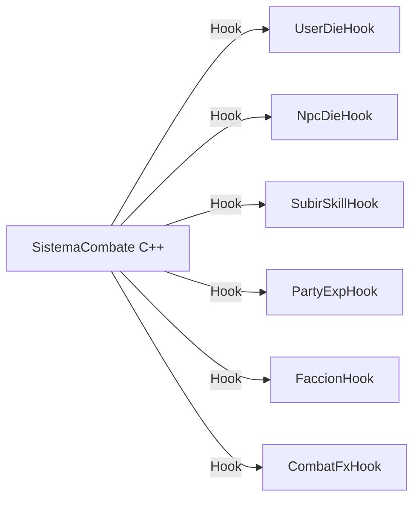

# Auditoría Técnica: Módulo de Combate `SistemaCombate.bas` (Capa 7, Módulo #22)

## 1. Resumen Ejecutivo y Alcance

Este documento presenta la auditoría técnica exhaustiva de `legacy/server/Codigo/SistemaCombate.bas` (1.922 líneas en Visual Basic 6.0), el núcleo matemático y algorítmico responsable de las mecánicas de combate cuerpo a cuerpo y a distancia del servidor de Argentum Online v0.13.0.

El módulo fue diseñado y refinado históricamente por múltiples desarrolladores clave del proyecto:
- **Pablo Ignacio Márquez (Morgolock)**: Arquitectura base original de ORE/AO.
- **Gerardo Saiz**: Diseño y corrección del módulo de combate.
- **Pablo (ToxicWaste)**: Balance de modificadores de clase desde `Balance.dat` (2008), reglas de facciones y desarmes.
- **ZaMa**: Modificaciones de wrestling, apuñalamiento, acuchillamiento, combate entre usuarios, validaciones de munición y estado atacable (2009-2010).
- **Nacho (Integer)**: Reescritura del cálculo de distribución de experiencia proporcional (`CalcularDarExp`, 2006).
- **Juan Martín Sotuyo Dodero (Maraxus)**: Parches anti-crasheo por división por cero en combate con escudos (2006).
- **Lucas Tavolaro Ortiz (Tavo)**: Cancelación de temporizador de salida (`CancelExit`) ante agresión (2008).

### Alcance Arquitectónico en Capa 7
Dentro de la jerarquía de migración, `SistemaCombate.bas` constituye el primer componente de la **Capa 7 (Mecánicas de Juego y Combate)**. Su posición es estratégica:
- **Dependencias hacia Capas Inferiores (Disponibles)**: Se apoya de forma inmediata en tipos globales (`Declares.hpp`), matemáticas y distancias (`Matematicas.hpp`), persistencia y estado criminal (`FileIO.hpp`), despacho de red (`modSendData.hpp`), serialización binaria (`Protocol.hpp`) y manipulación de buffers TCP (`TCP.hpp`).
- **Acoplamiento hacia Capas Superiores (No Migradas)**: Posee un profuso abanico de invocaciones hacia subsistemas que residen en Capas 8 y 9 (`Modulo_UsUaRiOs.bas`, `NPCs.bas`, `Trabajo.bas`, `Intervalos.bas`, `ModoParty.bas`). Para cumplir con la política de transliteración y cierre formal, estas dependencias externas deberán ser aisladas mediante contratos de inyección (`hooks` / `std::function`).

---

## 2. Catálogo Completo de Procedimientos y Constantes

### 2.1. Constantes del Módulo

| Constante | Tipo en VB6 | Valor | Línea VB6 | Propósito |
| :--- | :---: | :---: | :---: | :--- |
| `MAXDISTANCIAARCO` | `Byte` | `18` | L38 | Cota máxima de distancia Manhattan/Chebyshev para efectuar disparos con arcos y proyectiles. |
| `MAXDISTANCIAMAGIA` | `Byte` | `18` | L39 | Cota de distancia para hechizos (declarada por simetría en el módulo). |

### 2.2. Inventario Exhaustivo de los 33 Procedimientos

| # | Procedimiento | Firma Exacta en VB6 | Visibilidad | Líneas VB6 | Propósito Operativo |
| :-: | :--- | :--- | :---: | :---: | :--- |
| 1 | `MinimoInt` | `Function MinimoInt(ByVal a As Integer, ByVal b As Integer) As Integer` | `Public` | L43-L49 | Retorna el menor de dos enteros de 16 bits. |
| 2 | `MaximoInt` | `Function MaximoInt(ByVal a As Integer, ByVal b As Integer) As Integer` | `Public` | L51-L57 | Retorna el mayor de dos enteros de 16 bits. |
| 3 | `PoderEvasionEscudo` | `Function PoderEvasionEscudo(ByVal UserIndex As Integer) As Long` | `Private` | L59-L67 | Computa la evasión aportada por el escudo: `(SkillDefensa * ModClase.Escudo) / 2`. |
| 4 | `PoderEvasion` | `Function PoderEvasion(ByVal UserIndex As Integer) As Long` | `Private` | L69-L82 | Computa el poder base de evasión del personaje según habilidad de Tácticas, Agilidad, modificador de clase y nivel (`ELV`). |
| 5 | `PoderAtaqueArma` | `Function PoderAtaqueArma(ByVal UserIndex As Integer) As Long` | `Private` | L84-L106 | Computa el poder ofensivo cuerpo a cuerpo según tramos de la habilidad Armas, Agilidad, modificador de clase y nivel. |
| 6 | `PoderAtaqueProyectil` | `Function PoderAtaqueProyectil(ByVal UserIndex As Integer) As Long` | `Private` | L108-L130 | Computa el poder ofensivo a distancia según tramos de habilidad Proyectiles, Agilidad, modificador de clase y nivel. |
| 7 | `PoderAtaqueWrestling` | `Function PoderAtaqueWrestling(ByVal UserIndex As Integer) As Long` | `Private` | L132-L154 | Computa el poder ofensivo desarmado (combate cuerpo a cuerpo sin armas) según habilidad de Wrestling y Agilidad. |
| 8 | `UserImpactoNpc` | `Function UserImpactoNpc(ByVal UserIndex As Integer, ByVal NpcIndex As Integer) As Boolean` | `Public` | L156-L193 | Determina probabilísticamente si el ataque del usuario impacta sobre el NPC, e invoca `SubirSkill` según el resultado. |
| 9 | `NpcImpacto` | `Function NpcImpacto(ByVal NpcIndex As Integer, ByVal UserIndex As Integer) As Boolean` | `Public` | L195-L245 | Determina si un NPC impacta a un usuario. Si falla y el usuario usa escudo, evalúa la probabilidad de rechazo con escudo (`BlockedWithShieldUser`). |
| 10 | `CalcularDaño` | `Function CalcularDaño(ByVal UserIndex As Integer, Optional ByVal NpcIndex As Integer = 0) As Long` | `Public` | L247-L355 | Calcula el daño bruto infligido por el usuario (armas, proyectiles, municiones, wrestling, guantes, modificador de fuerza, clase y espada matadracos). |
| 11 | `UserDañoNpc` | `Sub UserDañoNpc(ByVal UserIndex As Integer, ByVal NpcIndex As Integer)` | `Public` | L357-L428 | Aplica el daño físico al NPC, descuenta defensa, notifica al cliente, otorga experiencia, evalúa apuñalamiento, crítico, acuchillamiento y gestiona muerte de NPC. |
| 12 | `NpcDaño` | `Sub NpcDaño(ByVal NpcIndex As Integer, ByVal UserIndex As Integer)` | `Public` | L430-L518 | Aplica el daño del NPC sobre el usuario, determinando aleatoriamente la parte del cuerpo golpeada (cabeza o torso), absorbiendo casco, armadura o barco, y evaluando muerte o ruptura de meditación. |
| 13 | `RestarCriminalidad` | `Sub RestarCriminalidad(ByVal UserIndex As Integer)` | `Public` | L520-L543 | Reduce la reputación de bandido o ladrón al morir a manos de un Guardia Real, actualizando el estado de criminal si corresponde. |
| 14 | `CheckPets` | `Sub CheckPets(ByVal NpcIndex As Integer, ByVal UserIndex As Integer, Optional ByVal CheckElementales As Boolean = True)` | `Public` | L545-L572 | Revisa mascotas agresoras para coordinar objetivos y seguimiento. |
| 15 | `AllFollowAmo` | `Sub AllFollowAmo(ByVal UserIndex As Integer)` | `Public` | L574-L588 | Fuerza a todas las mascotas del usuario a pasar al modo seguimiento (`FollowAmo`). |
| 16 | `NpcAtacaUser` | `Function NpcAtacaUser(ByVal NpcIndex As Integer, ByVal UserIndex As Integer) As Boolean` | `Public` | L590-L650 | Ejecuta el ciclo completo de agresión de un NPC hacia un usuario (sonidos, animación de sangre, veneno y actualización de nivel). |
| 17 | `NpcImpactoNpc` | `Function NpcImpactoNpc(ByVal Atacante As Integer, ByVal Victima As Integer) As Boolean` | `Private` | L652-L669 | Determina el éxito probabilístico de impacto entre dos NPCs confrontados. |
| 18 | `NpcDañoNpc` | `Sub NpcDañoNpc(ByVal Atacante As Integer, ByVal Victima As Integer)` | `Public` | L671-L698 | Aplica daño físico entre NPCs, verifica muerte y reasigna estados de agresión del atacante o su amo. |
| 19 | `NpcAtacaNpc` | `Sub NpcAtacaNpc(ByVal Atacante As Integer, ByVal Victima As Integer, Optional ByVal cambiarMOvimiento As Boolean = True)` | `Public` | L700-L755 | Controla el flujo de ataque entre criaturas (valida pretorianos, emite sonidos y efectúa daño). |
| 20 | `UsuarioAtacaNpc` | `Function UsuarioAtacaNpc(ByVal UserIndex As Integer, ByVal NpcIndex As Integer) As Boolean` | `Public` | L757-L794 | Punto de entrada para el ataque físico de un jugador a un NPC (quita inmunidad de druida y despacha animación). |
| 21 | `UsuarioAtaca` | `Sub UsuarioAtaca(ByVal UserIndex As Integer)` | `Public` | L796-L876 | Despachador principal activado por la acción física de ataque: valida intervalos de golpe/magia/arco, resta stamina, calcula la celda frontal y delega en usuario o NPC. |
| 22 | `UsuarioImpacto` | `Function UsuarioImpacto(ByVal AtacanteIndex As Integer, ByVal VictimaIndex As Integer) As Boolean` | `Public` | L878-L977 | Determina si un usuario acierta su golpe contra otro usuario, considerando evasión con escudo, meditación y posibilidad de bloqueo. |
| 23 | `UsuarioAtacaUsuario` | `Function UsuarioAtacaUsuario(ByVal AtacanteIndex As Integer, ByVal VictimaIndex As Integer) As Boolean` | `Public` | L979-L1039 | Valida distancia de arco, inmunidades de clase (guantes de hurto de bandido, inmovilización de ladrón) y ejecuta el ataque PvP. |
| 24 | `UserDañoUser` | `Sub UserDañoUser(ByVal AtacanteIndex As Integer, ByVal VictimaIndex As Integer)` | `Public` | L1041-L1189 | Resuelve el impacto PvP: calcula daño, aplica veneno, evalúa absorción de casco/armadura/barco, sube skills, intenta apuñalamiento/crítico/acuchillar y gestiona muerte y frags. |
| 25 | `UsuarioAtacadoPorUsuario` | `Sub UsuarioAtacadoPorUsuario(ByVal AttackerIndex As Integer, ByVal VictimIndex As Integer)` | `Sub` | L1191-L1256 | Aplica consecuencias morales de la agresión: convierte en criminal al atacante, actualiza karma/reputación, interrumpe meditación y cancela salida del juego (`CancelExit`). |
| 26 | `AllMascotasAtacanUser` | `Sub AllMascotasAtacanUser(ByVal victim As Integer, ByVal Maestro As Integer)` | `Sub` | L1258-L1274 | Ordena a todas las mascotas del maestro contraatacar a quien lo agredió. |
| 27 | `PuedeAtacar` | `Function PuedeAtacar(ByVal AttackerIndex As Integer, ByVal VictimIndex As Integer) As Boolean` | `Public` | L1276-L1426 | Matriz de guardianes PvP: evalúa muerte, consultas, arenas (trigger 6), facciones (armada/caos), seguro activado, mapas seguros y estado atacable. |
| 28 | `PuedeAtacarNPC` | `Function PuedeAtacarNPC(ByVal AttackerIndex As Integer, ByVal NpcIndex As Integer, Optional ByVal Paraliza As Boolean = False, Optional ByVal IsPet As Boolean = False) As Boolean` | `Public` | L1428-L1796 | Matriz de guardianes PvE: valida rango de arco, consejeros, consultas, criaturas no hostiles, guardias reales/caos, mascotas de otros jugadores y apropiación de NPCs. |
| 29 | `SameClan` | `Function SameClan(ByVal UserIndex As Integer, ByVal OtherUserIndex As Integer) As Boolean` | `Private` | L1798-L1806 | Consulta si dos usuarios pertenecen al mismo clan (`GuildIndex != 0`). |
| 30 | `SameParty` | `Function SameParty(ByVal UserIndex As Integer, ByVal OtherUserIndex As Integer) As Boolean` | `Private` | L1808-L1816 | Consulta si dos usuarios pertenecen a la misma party (`PartyIndex != 0`). |
| 31 | `CalcularDarExp` | `Sub CalcularDarExp(ByVal UserIndex As Integer, ByVal NpcIndex As Integer, ByVal ElDaño As Long)` | `Sub` | L1818-L1859 | Otorga experiencia proporcional al daño infligido al NPC, descontándola del contador `flags.ExpCount` y derivándola a la party o al usuario. |
| 32 | `TriggerZonaPelea` | `Function TriggerZonaPelea(ByVal Origen As Integer, ByVal Destino As Integer) As eTrigger6` | `Public` | L1861-L1891 | Evalúa el trigger 6 (Zona de Pelea / Arena) en las casillas de origen y destino, determinando si el combate está permitido, prohibido o ausente. |
| 33 | `UserEnvenena` | `Sub UserEnvenena(ByVal AtacanteIndex As Integer, ByVal VictimaIndex As Integer)` | `Sub` | L1893-L1922 | Verifica si el arma o munición posee veneno (`Envenena = 1`) y aplica probabilísticamente (60%) el flag `flags.Envenenado = 1`. |

---

## 3. Fórmulas Aritméticas, Modificadores y Redondeos

### 3.1. Evasión y Poder de Ataque

#### 1. Evasión con Escudo (`PoderEvasionEscudo`)
$$\text{PoderEvasionEscudo} = \left\lfloor \frac{\text{SkillDefensa} \times \text{ModClase.Escudo}}{2} \right\rfloor$$
- `UserSkills(eSkill.Defensa)` es un entero de 16 bits.
- `ModClase(clase).Escudo` es un `Single` (coma flotante de precisión simple).
- La división por 2 se realiza en coma flotante y se asigna al retorno `Long` mediante redondeo bancario de VB6.

#### 2. Evasión Corporal Base (`PoderEvasion`)
$$\text{lTemp} = \left(\text{SkillTacticas} + \frac{\text{SkillTacticas}}{33} \times \text{AtributoAgilidad}\right) \times \text{ModClase.Evasion}$$
$$\text{PoderEvasion} = \text{lTemp} + 2.5 \times \max(\text{Nivel} - 12, 0)$$
- **División Flotante**: `SkillTacticas / 33` utiliza el operador `/` (división flotante `Double`), no `\` (división entera).
- Si el personaje tiene nivel $\le 12$, el término de nivel aporta exactamente $0$.

#### 3. Poder de Ataque con Armas (`PoderAtaqueArma`)
El cálculo se segmenta en 4 tramos según la habilidad `eSkill.Armas`:
$$\text{Base} = \begin{cases}
\text{SkillArmas}, & \text{si } \text{Skill} < 31 \\
\text{SkillArmas} + \text{Agilidad}, & \text{si } 31 \le \text{Skill} < 61 \\
\text{SkillArmas} + 2 \times \text{Agilidad}, & \text{si } 61 \le \text{Skill} < 91 \\
\text{SkillArmas} + 3 \times \text{Agilidad}, & \text{si } \text{Skill} \ge 91
\end{cases}$$
$$\text{PoderAtaqueArma} = (\text{Base} \times \text{ModClase.AtaqueArmas}) + 2.5 \times \max(\text{Nivel} - 12, 0)$$
*(La misma estructura modular por tramos se aplica en `PoderAtaqueProyectil` y `PoderAtaqueWrestling`, sustituyendo el skill y el modificador de clase correspondiente).*

### 3.2. Probabilidad de Impacto y Evasión

La tasa de éxito en combate físico se computa mediante:
$$\text{ProbExito} = \text{clamp}\left(10, 90, \left\lfloor 50 + (\text{PoderAtaque} - \text{PoderEvasionTotal}) \times 0.4 \right\rfloor\right)$$
- **Tope Rígido**: La probabilidad está estrictamente acotada entre $10\%$ y $90\%$. Ningún usuario o criatura puede tener $0\%$ ni $100\%$ de probabilidad de acierto.
- **Evasión Total**: Si la víctima tiene un escudo equipado (`EscudoEqpObjIndex > 0`), se añade `PoderEvasionEscudo` a su evasión base.
- **Ruptura de Evasión por Meditación (Quirk L921-925)**:
  Si la víctima está meditando (`flags.Meditando = True`), su chance de evadir se reduce un $25\%$:
  $$\text{ProbEvadir} = (100 - \text{ProbExito}) \times 0.75$$
  $$\text{ProbExito} = \min(90, 100 - \text{ProbEvadir})$$

### 3.3. Bloqueo y Rechazo con Escudo

Si el atacante falla el golpe y la víctima lleva escudo, se calcula la probabilidad de que el fallo haya sido un rechazo activo del escudo:
$$\text{ProbRechazo} = \text{clamp}\left(10, 90, \left\lfloor \frac{100 \times \text{SkillDefensa}}{\text{SkillDefensa} + \text{SkillTacticas}} \right\rfloor\right)$$
- **Guardián Anti-Crasheo (Maraxus, L229)**: Se evalúa obligatoriamente `If SkillDefensa + SkillTacticas > 0 Then` para prevenir división por cero con personajes recién creados en nivel 1 con cero skills.
- Si el rechazo es exitoso, se emite el sonido `SND_ESCUDO` (WAV 37) y el mensaje `BlockedWithShieldUser` / `BlockedWithShieldother`.

### 3.4. Cálculo de Daño Físico Bruto (`CalcularDaño`)

La fórmula canónica de daño de VB6 es:
$$\text{DañoTotal} = \left( 3 \times \text{DañoArma} + \left( \frac{\text{DañoMaxArma}}{5} \times \max(0, \text{Fuerza} - 15) \right) + \text{DañoUsuario} \right) \times \text{ModClase}$$

Donde:
1. $\text{DañoArma} = \text{RandomNumber}(\text{Arma.MinHIT}, \text{Arma.MaxHIT})$.
2. $\text{DañoUsuario} = \text{RandomNumber}(\text{Stats.MinHIT}, \text{Stats.MaxHIT})$.
3. $\text{ModClase}$ es `DañoArmas`, `DañoProyectiles` o `DañoWrestling` según la modalidad.
4. **Wrestling (Desarmado)**:
   - Daño base: $\text{Min} = 4, \text{Max} = 9$.
   - Si porta guantes en el slot de anillo (`Invent.AnilloEqpObjIndex` con `ObjData.Guante = 1`), se añade `ObjData(Guante).MinHIT` y `MaxHIT`.
5. **Combate Naval**: Si el usuario está navegando (`flags.Navegando = 1`), se suma el daño del barco:
   $$\text{Daño} = \text{Daño} + \text{RandomNumber}(\text{Barco.MinHIT}, \text{Barco.MaxHIT})$$

### 3.5. Absorción de Armaduras y Partes del Cuerpo

Al recibir daño de un usuario o NPC, se sortea la zona impactada entre Cabeza y Torso:
- `Lugar = RandomNumber(PartesCuerpo.bCabeza, PartesCuerpo.bTorso)`
- **Cabeza**: Absorbe únicamente el casco (`CascoEqpObjIndex`):
  $$\text{Absorbido} = \text{RandomNumber}(\text{Casco.MinDef}, \text{Casco.MaxDef})$$
- **Torso / Resto**: Absorbe la armadura y el escudo:
  $$\text{Absorbido} = \text{RandomNumber}(\text{Armadura.MinDef} + \text{Escudo.MinDef}, \text{Armadura.MaxDef} + \text{Escudo.MaxDef})$$
- **Refuerzo de Armas**: Si el atacante tiene un arma con propiedad `Refuerzo`, se reduce la absorción de la víctima:
  $$\text{AbsorbidoFinal} = \text{Absorbido} + \text{DefBarco} - \text{Refuerzo}$$
- **Daño Mínimo Garantizado**: Si $\text{Daño} \le \text{AbsorbidoFinal}$, el daño resultante es $1$.

### 3.6. Distribución Proporcional de Experiencia (`CalcularDarExp`)

$$\text{ExpaDar} = \left\lfloor \text{DañoReal} \times \frac{\text{NPC.GiveEXP}}{\text{NPC.MaxHp}} \right\rfloor$$
- **Preservación de Restos (`flags.ExpCount`)**: La experiencia otorgada se descuenta de `Npclist(NpcIndex).flags.ExpCount` (inicializada en `GiveEXP`). Esto garantiza que, debido a redondeos hacia abajo en golpes parciales, el remanente acumulado no se pierda y sea entregado en el golpe de gracia.
- **Clampeo Máximo**: Si el total supera `MAXEXP` ($2.000.000.000$), se clamplea a `MAXEXP`.
- **Derivación a Party**: Si el usuario pertenece a un grupo (`PartyIndex > 0`), se deriva a `mdParty.ObtenerExito`.

---

## 4. Interacciones con el Estado Global y Fronteras de Red

### 4.1. Mutaciones sobre la Entidad `UserList`
- `Stats.MinHp`: Reducido por daño físico directo; si llega a $\le 0$, dispara `UserDie`.
- `Stats.MinSta`: Reducido en `UsuarioAtaca` entre $1$ y $10$ puntos por intento de golpe; si es menor a $10$, cancela el ataque por fatiga.
- `Stats.Exp`: Incrementado en `CalcularDarExp`.
- `flags.Meditando`: Interrumpido ante daño físico recibido o al ejecutar un ataque propio.
- `flags.Envenenado`: Activado con valor `1` si el arma atacante posee la propiedad `Envenena = 1`.
- `flags.Ignorado`: Asignado a `False` en `UsuarioAtacaNpc` (los druidas pierden su camuflaje pacífico ante criaturas al atacar).
- `flags.AtacadoPorNpc` / `flags.AtacadoPorUser`: Registra el índice del agresor.
- `Reputacion`: Modificación de `BandidoRep` y `NobleRep` ante agresiones ilegales en `UsuarioAtacadoPorUsuario`.
- `Counters.Trabajando` / `Counters.Ocultando`: Decrementados al lanzar golpes.

### 4.2. Mutaciones sobre la Entidad `NpcList`
- `Stats.MinHp`: Decrementado ante impactos; si llega a $\le 0$, dispara `MuereNpc`.
- `flags.ExpCount`: Decrementado conforme se cobra experiencia por daño infligido.
- `CanAttack`: Puesto a $0$ tras emitir un ataque.
- `Target` / `TargetNPC`: Actualizado con el índice del adversario atacado.
- `Movement` / `Hostile`: Modificado ante provocación o muerte del contrincante.
- `Owner`: Administrado en `PuedeAtacarNPC` mediante la mecánica de apropiación temporal de criaturas.

### 4.3. Emisión de Paquetes de Red y Protocolo

| Mensaje / Paquete | Canal de Despacho | Líneas VB6 | Disparador |
| :--- | :--- | :---: | :--- |
| `WriteMultiMessage(UserHitNPC)` | Privado al atacante | L370 | Daño exitoso a un NPC. |
| `WriteMultiMessage(NPCHitUser)` | Privado a la víctima | L475 | Impacto de un NPC sobre el jugador. |
| `WriteMultiMessage(NPCKillUser)` | Privado a la víctima | L492 | Muerte del jugador por un NPC. |
| `WriteMultiMessage(NPCSwing)` | Privado al jugador | L645 | Fallo de ataque de un NPC al aire. |
| `WriteMultiMessage(UserSwing)` | Privado al atacante | L788, L1030 | Fallo de ataque propio al aire. |
| `WriteMultiMessage(UserAttackedSwing)`| Privado a la víctima | L1031 | Fallo de otro usuario atacando a la víctima. |
| `WriteMultiMessage(UserHittedUser)` | Privado al atacante | L1109 | Impacto exitoso en combate PvP. |
| `WriteMultiMessage(UserHittedByUser)` | Privado a la víctima | L1110 | Daño recibido en combate PvP. |
| `WriteMultiMessage(BlockedWithShield*)` | Atacante y víctima | L237, L938-L939 | Bloqueo activo con escudo. |
| `WriteUpdateHP` | Privado | L638, L1163 | Actualización de barra de salud tras impacto. |
| `WriteUpdateUserStats` | Privado | L837-L838, L859, L865 | Sincronización de estadísticas de energía y combate. |
| `WriteMeditateToggle` | Privado | L483, L1212 | Interrupción forzada de meditación. |
| `PrepareMessagePlayWave` | `SendToPCArea` / `ToNPCArea` | Varios | Efectos de sonido: `SND_IMPACTO` (10), `SND_IMPACTO2` (11), `SND_SWING` (2), `SND_ESCUDO` (37). |
| `PrepareMessageCreateFX` | `SendToPCArea` | L633, L1004 | Efecto de sangre `FXSANGRE` (14) en la casilla de impacto. |

---

## 5. Acoplamiento con Capas Posteriores y Necesidad de Hooks

Para posibilitar un porting aislado y testeable de `SistemaCombate.bas` en Capa 7 sin requerir la presencia de `Modulo_UsUaRiOs.bas` (Capa 9) ni `NPCs.bas` (Capa 8), se definen los siguientes **puntos de inyección mediante callbacks (`hooks`)**:



### Catálogo de Hooks Requeridos:

1. **`UserDieHook`**:
   - *Firma sugerida*: `std::function<void(int16_t victim_index)>`
   - *Origen*: `Modulo_UsUaRiOs.bas:2202` (`UserDie`). Invocado cuando `Stats.MinHp <= 0`.
2. **`NpcDieHook`**:
   - *Firma sugerida*: `std::function<void(int16_t npc_index, int16_t killer_user_index)>`
   - *Origen*: `NPCs.bas:1248` (`MuereNpc`). Invocado cuando el NPC agota su vida.
3. **`SubirSkillHook`**:
   - *Firma sugerida*: `std::function<void(int16_t user_index, eSkill skill, bool exito)>`
   - *Origen*: `Modulo_UsUaRiOs.bas:1143` (`SubirSkill`). Invocado tras aciertos o fallos en armas, tácticas, proyectiles, defensa o wrestling.
4. **`CheckUserLevelHook`**:
   - *Firma sugerida*: `std::function<void(int16_t user_index)>`
   - *Origen*: `Modulo_UsUaRiOs.bas:885` (`CheckUserLevel`). Evalúa si la experiencia acumulada dispara una subida de nivel.
5. **`PartyExpHook`**:
   - *Firma sugerida*: `std::function<void(int16_t user_index, int32_t exp, int16_t map, int16_t x, int16_t y)>`
   - *Origen*: `ModoParty.bas` (`mdParty.ObtenerExito`). Distribuye experiencia entre integrantes del grupo.
6. **`CombatTriggerHook` (Habilidades Especiales)**:
   - *Funciones*: `DoApuñalar`, `DoGolpeCritico`, `DoAcuchillar`, `DoDesequipar`, `DoHandInmo`, `Desarmar`.
   - *Origen*: `Trabajo.bas`. Permite testear el desencadenamiento de efectos secundarios sin acoplar la lógica de desarmes e inmovilizaciones.
7. **`FaccionHook`**:
   - *Funciones*: `VolverCriminal`, `ExpulsarFaccionCaos`, `ExpulsarFaccionReal`, `RefreshCharStatus`.
   - *Origen*: `Modulo_UsUaRiOs.bas` y `Facciones.bas`. Modifican el alineamiento faccionario del jugador agresor.

---

## 6. Detección de Defectos Técnicos y Quirks Aritméticos

En cumplimiento de la convención de taxonomía ([`docs/CONVENTIONS.md`](../CONVENTIONS.md#7-taxonomía-de-hallazgos-defectos-técnicos-vs-peculiaridades-de-dominio)), se incorpora a [`docs/implementation/KNOWN-LEGACY-BUGS.md`](../implementation/KNOWN-LEGACY-BUGS.md) únicamente el defecto aritmético involuntario detectado:

### 6.1. Descarte del MaxHIT de Munición en Bono por Fuerza (Bug #37)
- **Ubicación**: `SistemaCombate.bas`, líneas 271-274 y 292-295.
- **Código Legacy**:
  ```vb
  If Arma.Municion = 1 Then
      proyectil = ObjData(.Invent.MunicionEqpObjIndex)
      DañoArma = DañoArma + RandomNumber(proyectil.MinHIT, proyectil.MaxHIT)
      ' For some reason this isn't done...
      'DañoMaxArma = DañoMaxArma + proyectil.MaxHIT
  End If
  ```
- **Comportamiento**: En armas de proyectil con munición (arcos con flechas), el daño del proyectil se suma a `DañoArma`, pero el código original omite deliberadamente sumar `proyectil.MaxHIT` a `DañoMaxArma`. Como consecuencia, la bonificación por fuerza `((DañoMaxArma / 5) * (Fuerza - 15))` escala únicamente con el daño máximo del arco e ignora por completo la calidad de la flecha disparada.
- **Acción en C++**: Preservar verbatim este comportamiento histórico (`Replicated (Strict Parity)`).

---

## 7. Peculiaridades de Dominio, Reglas de Balance y Mecánicas Históricas

Conforme a la regla de taxonomía, las siguientes mecánicas intencionales de diseño, balance y administración no constituyen bugs de software ni ingresan al bug ledger, sino que deben preservarse mediante transliteración 1:1 estricta en C++, criterios de aceptación en el desglose modular y pruebas unitarias dedicadas:

### 7.1. Espada Mata Dragones: Letalidad Absoluta y Destrucción de Ítem
- **Ubicación**: `SistemaCombate.bas`, líneas 281-289, 300-304 y 390-399.
- **Justificación Histórica**: Mecánica de evento / quest legendaria de Argentum Online.
- **Comportamiento**:
  - Si el usuario ataca a un NPC de tipo `DRAGON` portando la `EspadaMataDragonesIndex`, el daño calculado es forzado a `Npclist(NpcIndex).Stats.MinHp + Npclist(NpcIndex).Stats.def`, aniquilándolo de un solo golpe sin importar su vida máxima (incluso si supera 100.000 HP).
  - Al asestar el golpe letal al dragón, la espada es removida y destruida del inventario de forma inmediata (`QuitarObjetos`).
  - Si se utiliza contra cualquier otro objetivo (NPCs comunes o usuarios en PvP), el daño base del arma queda truncado en `1` (`DañoArma = 1`, `DañoMaxArma = 1`), volviéndola completamente inútil fuera de su cometido específico.
- **Orden de Transliteración en C++**: Transliteración 1:1 estricta. Deberá cubrirse en doctest con dos escenarios: (1) muerte instantánea y remoción del arma ante NPC tipo dragón, y (2) daño fijado exactamente en 1 ante cualquier otro objetivo.

### 7.2. Asimetría de Daño en Apuñalamiento: PvE vs. PvP (ZaMa 07/04/2010)
- **Ubicación**: `SistemaCombate.bas`, líneas 376 y 1134.
- **Justificación Histórica**: Parche deliberado de balance introducido por el desarrollador ZaMa el 07/04/2010 para balancear la clase Asesino en entrenamiento contra criaturas sin desvirtuar el balance PvP:
  ```vb
  ' (ZaMa 07/04/2010) Los asesinos apuñalan acorde al daño base sin descontar la defensa del npc
  Call DoApuñalar(UserIndex, NpcIndex, 0, DañoBase)
  ```
- **Comportamiento**:
  - En **PvE** (`UserDañoNpc:376`), la rutina `DoApuñalar` recibe como parámetro `DañoBase`, computado **antes** de descontar la defensa del NPC.
  - En **PvP** (`UserDañoUser:1134`), `DoApuñalar` recibe `daño`, es decir, el valor residual **después** de haber absorbido el impacto con casco, armadura y escudo.
- **Orden de Transliteración en C++**: Transliteración 1:1 estricta. Mantener la llamada asimétrica exacta, documentando con comentarios *in-situ* la cita de ZaMa y validando en tests que el valor emitido a `DoApuñalar` difiere entre atacado NPC y atacado User.

### 7.3. Inmunidad de Muerte y Supresión de Penalizaciones en Estado Atacable (`flags.AtacablePor`)
- **Ubicación**: `SistemaCombate.bas`, líneas 1143-1148 y 1200-1210.
- **Justificación Histórica**: Regla de juego esencial de legítima defensa en el sistema de alineamiento y combate de Argentum Online.
- **Comportamiento**: Si un usuario con bandera `flags.AtacablePor == AtacanteIndex` es asesinado por dicho atacante, el servidor omite el registro en estadísticas (`Statistics.StoreFrag`), no incrementa el contador de muertes (`ContarMuerte`), no penaliza el karma (`Stats.Karma`) y no transforma al usuario en criminal (`VolverCriminal`). Esto protege al jugador que se defendió legítimamente de un agresor previo.
- **Orden de Transliteración en C++**: Transliteración 1:1 estricta. Se validará mediante tests unitarios que la muerte con flag `AtacablePor` activo no dispara eventos de criminalidad ni conteo de frags.

### 7.4. Sigilo y Silenciamiento de Swing para Game Masters Invisibles
- **Ubicación**: `SistemaCombate.bas`, líneas 1019-1025.
- **Justificación Histórica**: Mecánica de administración y moderación encubierta.
- **Comportamiento**: Cuando un Game Master invisible (`EsGM(UserIndex)` y `flags.Invisible == 1`) yerra un golpe en combate, el sonido `SND_SWING` no se emite mediante broadcast al área (`ToPCArea`), sino únicamente a su propio socket (`EnviarDatosASlot`), impidiendo que los jugadores cercanos escuchen el efecto y descubran la presencia del administrador.
- **Orden de Transliteración en C++**: Transliteración 1:1 estricta. Preservar la bifurcación de red en `UsuarioAtaca` y verificar en tests que el paquete de audio solo va dirigido al slot del GM.

