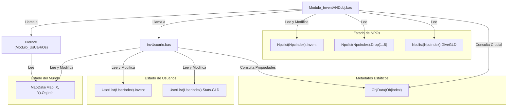
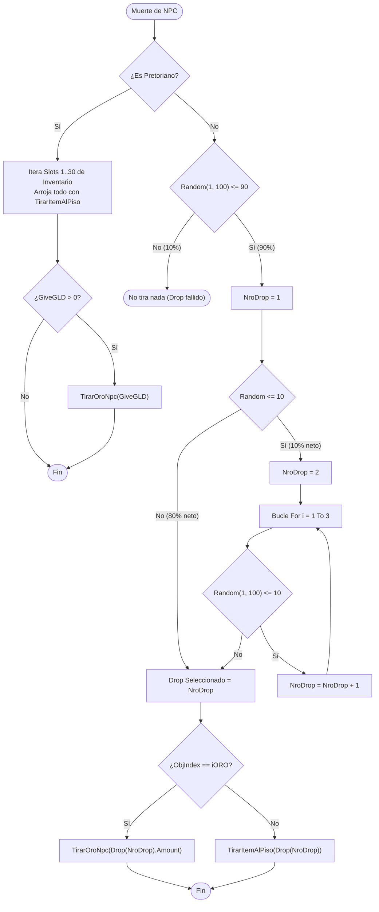

# Auditoría Técnica: Módulo de Inventario y Objetos `Modulo_InventANDobj.bas` (Capa 6, Módulo #18)

## 1. Resumen Ejecutivo y Alcance

Este documento presenta la auditoría técnica exhaustiva del módulo [`legacy/server/Codigo/Modulo_InventANDobj.bas`](../../legacy/server/Codigo/Modulo_InventANDobj.bas) (346 líneas en el servidor original de Visual Basic 6 de Argentum Online v0.13.0) y su intrincado ecosistema de dependencias directas: [`legacy/server/Codigo/InvUsuario.bas`](../../legacy/server/Codigo/InvUsuario.bas), la rutina de búsqueda espacial `Tilelibre` en [`legacy/server/Codigo/Modulo_UsUaRiOs.bas`](../../legacy/server/Codigo/Modulo_UsUaRiOs.bas), el ciclo de vida de criaturas en [`legacy/server/Codigo/MODULO_NPCs.bas`](../../legacy/server/Codigo/MODULO_NPCs.bas) y las estructuras de mapa en [`legacy/server/Codigo/Declares.bas`](../../legacy/server/Codigo/Declares.bas).

El objetivo de este análisis es desentrañar la lógica de manipulación de items tanto en entidades vivas (inventarios de NPCs y usuarios) como en celdas de mapa (`MapData.ObjInfo`), auditar los algoritmos de dispersión espacial de drops, detectar vulnerabilidades históricas de duplicación o desbordamiento entero (`Integer` de 16 bits en VB6) y sentar las bases arquitectónicas para el diseño de la Capa 6 en C++20, garantizando sincronización libre de fugas con el protocolo de red (`modSendData` y `Protocol`).

Para consultar las directrices de arquitectura y nombrado, referite a [`CONVENTIONS.md`](../CONVENTIONS.md) y a la auditoría de visibilidad espacial en [`docs/audit/03a-modareas-detalle.md`](03a-modareas-detalle.md).

---

## 2. Anatomía del Módulo y Segregación Histórica (`InvNpc` vs `InvUsuario`)

En la evolución histórica del código base de Argentum Online ocurrió una divergencia de nombres y responsabilidades que suele inducir a confusión:

1. **`Modulo_InventANDobj.bas`**: Aunque su encabezado de comentarios reza *"Modulo Inv & Obj - Modulo para controlar los objetos y los inventarios"*, internamente declara `Attribute VB_Name = "InvNpc"`. Este módulo quedó especializado casi con exclusividad en la **gestión de inventarios de NPCs** (mercaderes y criaturas), el cálculo de probabilidades de drop complejo, el fraccionamiento de oro al morir criaturas y la función utilitaria global de arrojar objetos al suelo (`TirarItemAlPiso`).
2. **`InvUsuario.bas`**: Módulo complementario (`Attribute VB_Name = "InvUsuario"`, 1247 líneas) que alberga el **inventario del jugador** (equipamiento, uso de items, slots de mochila, validación de clases/razas) y las primitivas canónicas de mutación de entidades en el mapa (`MakeObj`, `EraseObj`, `DropObj`, `GetObj`, `MeterItemEnInventario`).

Dado que `TirarItemAlPiso` (en `Modulo_InventANDobj.bas`) depende funcionalmente de `MakeObj` (en `InvUsuario.bas`) y `Tilelibre` (en `Modulo_UsUaRiOs.bas`), la presente auditoría abarca la interacción integral entre ambos subsistemas.

---

## 3. Catálogo Completo de Procedimientos y Constantes

### 3.1. Constantes de Dominio Asociadas (`Declares.bas`)

`Modulo_InventANDobj.bas` no declara constantes locales en su cabecera; consume las constantes públicas definidas en `Declares.bas`:

| Constante | Tipo | Valor | Ubicación | Descripción |
| :--- | :--- | :--- | :--- | :--- |
| `iORO` | `Byte` | `12` | [`Declares.bas#L389`](../../legacy/server/Codigo/Declares.bas#L389) | `ObjIndex` reservado para las pilas de monedas de oro en el mundo. |
| `MAX_INVENTORY_OBJS` | `Integer` | `10000` | [`Declares.bas#L488`](../../legacy/server/Codigo/Declares.bas#L488) | Límite superior de acumulación por slot o celda de mapa ($10.000$ unidades). |
| `MAX_INVENTORY_SLOTS` | `Byte` | `30` | [`Declares.bas#L492`](../../legacy/server/Codigo/Declares.bas#L492) | Capacidad máxima de slots en inventarios expandidos (con mochila). |
| `MAX_NORMAL_INVENTORY_SLOTS`| `Byte` | `20` | [`Declares.bas#L496`](../../legacy/server/Codigo/Declares.bas#L496) | Capacidad estándar de slots del jugador sin mochila equipada. |
| `MAX_NPC_DROPS` | `Byte` | `5` | [`Declares.bas#L1353`](../../legacy/server/Codigo/Declares.bas#L1353) | Cantidad máxima de etapas configuradas en la tabla de drops de una criatura. |

### 3.2. Procedimientos Declarados en `Modulo_InventANDobj.bas`

| Procedimiento | Firma Exacta | Visibilidad | Líneas VB6 | Propósito Operativo |
| :--- | :--- | :---: | :---: | :--- |
| `TirarItemAlPiso` | `Function TirarItemAlPiso(Pos As WorldPos, Obj As Obj, Optional NotPirata As Boolean = True) As WorldPos` | `Public` | [`L38-L56`](../../legacy/server/Codigo/Modulo_InventANDobj.bas#L38-L56) | Busca un tile legal adyacente desocupado (o combinable) e invoca `MakeObj`. Devuelve la posición resultante o `(0,0)` si falló. |
| `NPC_TIRAR_ITEMS` | `Sub NPC_TIRAR_ITEMS(ByRef npc As npc, ByVal IsPretoriano As Boolean)` | `Public` | [`L58-L136`](../../legacy/server/Codigo/Modulo_InventANDobj.bas#L58-L136) | Evalúa la tabla de drop probabilístico (cascada geométrica) o arroja el inventario íntegro si la criatura es pretoriana. |
| `QuedanItems` | `Function QuedanItems(ByVal NpcIndex As Integer, ByVal ObjIndex As Integer) As Boolean` | Implícita (`Public`) | [`L138-L157`](../../legacy/server/Codigo/Modulo_InventANDobj.bas#L138-L157) | Verifica linealmente si en el inventario del NPC resta algún slot con el `ObjIndex` indicado. |
| `EncontrarCant` | `Function EncontrarCant(ByVal NpcIndex As Integer, ByVal ObjIndex As Integer) As Integer` | Implícita (`Public`) | [`L165-L189`](../../legacy/server/Codigo/Modulo_InventANDobj.bas#L165-L189) | Lee de disco (`NPCs.dat` vía `GetVar`) el stock original de un item para reponer mercaderes de items cruciales. |
| `ResetNpcInv` | `Sub ResetNpcInv(ByVal NpcIndex As Integer)` | Implícita (`Public`) | [`L191-L211`](../../legacy/server/Codigo/Modulo_InventANDobj.bas#L191-L211) | Pone a cero los 30 slots del inventario del NPC y resetea `.Invent.NroItems = 0` e `.InvReSpawn = 0`. |
| `QuitarNpcInvItem` | `Sub QuitarNpcInvItem(ByVal NpcIndex As Integer, ByVal Slot As Byte, ByVal Cantidad As Integer)` | Implícita (`Public`) | [`L218-L270`](../../legacy/server/Codigo/Modulo_InventANDobj.bas#L218-L270) | Descuenta stock al comerciar. Si el item es crucial (`Crucial = 1`), repone stock leyendo de `NPCs.dat`; si se vacía todo, repone inventario completo. |
| `CargarInvent` | `Sub CargarInvent(ByVal NpcIndex As Integer)` | Implícita (`Public`) | [`L272-L297`](../../legacy/server/Codigo/Modulo_InventANDobj.bas#L272-L297) | Lee sincrónicamente desde `NPCs.dat` todos los slots iniciales configurados para el NPC número `.Numero`. |
| `TirarOroNpc` | `Sub TirarOroNpc(ByVal Cantidad As Long, ByRef Pos As WorldPos)` | `Public` | [`L300-L345`](../../legacy/server/Codigo/Modulo_InventANDobj.bas#L300-L345) | Divide una suma arbitraria de oro en fragmentos de hasta `MAX_INVENTORY_OBJS` ($10.000$) y los arroja llamando a `TirarItemAlPiso`. |

### 3.3. Procedimientos Complementarios en `InvUsuario.bas`

Para comprender el flujo completo del ciclo de vida de objetos:

| Procedimiento | Firma | Visibilidad | Líneas VB6 | Función en el Ecosistema |
| :--- | :--- | :---: | :---: | :--- |
| `MakeObj` | `Sub MakeObj(ByRef Obj As Obj, ByVal Map As Integer, ByVal X As Integer, ByVal Y As Integer)` | Implícita (`Public`) | [`L430-L450`](../../legacy/server/Codigo/InvUsuario.bas#L430-L450) | Materializa físicamente el item en `MapData(Map, X, Y).ObjInfo` y despacha el paquete `ObjectCreate` al área. |
| `EraseObj` | `Sub EraseObj(ByVal num As Integer, ByVal Map As Integer, ByVal X As Integer, ByVal Y As Integer)` | Implícita (`Public`) | [`L412-L428`](../../legacy/server/Codigo/InvUsuario.bas#L412-L428) | Reduce o extingue el item de `MapData(Map, X, Y).ObjInfo` y despacha `ObjectDelete` al área. |
| `DropObj` | `Sub DropObj(ByVal UserIndex As Integer, ByVal Slot As Byte, ByVal num As Integer, ByVal Map As Integer, ByVal X As Integer, ByVal Y As Integer)` | Implícita (`Public`) | [`L353-L410`](../../legacy/server/Codigo/InvUsuario.bas#L353-L410) | Extrae items del slot del jugador y los ubica en el mapa. Contiene bug histórico de duplicación. |
| `GetObj` | `Sub GetObj(ByVal UserIndex As Integer)` | Implícita (`Public`) | [`L516-L572`](../../legacy/server/Codigo/InvUsuario.bas#L516-L572) | Recoge el objeto pisado por el usuario. Si es oro (`otGuita`), va directo a `.Stats.GLD`; si es item, invoca `MeterItemEnInventario`. |
| `MeterItemEnInventario` | `Function MeterItemEnInventario(ByVal UserIndex As Integer, ByRef MiObj As Obj) As Boolean` | Implícita (`Public`) | [`L452-L514`](../../legacy/server/Codigo/InvUsuario.bas#L452-L514) | Apila el objeto en un slot existente o halla el primer slot libre, respetando límites de mochila y no-caibles. |
| `QuitarUserInvItem` | `Sub QuitarUserInvItem(ByVal UserIndex As Integer, ByVal Slot As Byte, ByVal Cantidad As Integer)` | Implícita (`Public`) | [`L262-L290`](../../legacy/server/Codigo/InvUsuario.bas#L262-L290) | Resta cantidad del inventario de usuario, desequipando si correspondía y purgando el slot si llega a $\le 0$. |
| `TirarOro` | `Sub TirarOro(ByVal Cantidad As Long, ByVal UserIndex As Integer)` | Implícita (`Public`) | [`L180-L260`](../../legacy/server/Codigo/InvUsuario.bas#L180-L260) | Comando `/TIRARORO`. Fracciona montos, valida clase pirata y deduce de `.Stats.GLD`. |

---

## 4. Mapeo de Estructuras y Estado Global

### 4.1. Definición de Tipos de Datos UDT

En [`Declares.bas`](../../legacy/server/Codigo/Declares.bas) se definen las estructuras que intervienen en el flujo de objetos:

```vb
' Instancia ligera de objeto (usada en celdas de mapa y transferencias)
Public Type Obj
    ObjIndex As Integer   ' Índice del objeto en ObjData (1..UBound(ObjData))
    Amount As Integer     ' Cantidad apilada (1..10000 en VB6 Integer con signo)
End Type

' Elemento de inventario de usuario/NPC
Public Type UserOBJ
    ObjIndex As Integer   ' 0 indica slot desocupado
    Amount As Integer     ' Cantidad apilada
    Equipped As Byte      ' 1 si está actualmente en uso/equipado, 0 caso contrario
End Type

' Inventario completo de 30 slots
Public Type Inventario
    Object(1 To MAX_INVENTORY_SLOTS) As UserOBJ
    WeaponEqpObjIndex As Integer
    WeaponEqpSlot As Byte
    ArmourEqpObjIndex As Integer
    ArmourEqpSlot As Byte
    EscudoEqpObjIndex As Integer
    EscudoEqpSlot As Byte
    CascoEqpObjIndex As Integer
    CascoEqpSlot As Byte
    MunicionEqpObjIndex As Integer
    MunicionEqpSlot As Byte
    AnilloEqpObjIndex As Integer
    AnilloEqpSlot As Byte
    BarcoObjIndex As Integer
    BarcoSlot As Byte
    MochilaEqpObjIndex As Integer
    MochilaEqpSlot As Byte
    NroItems As Integer   ' Conteo de slots activos ocupados
End Type

' Celda unitaria del mapa
Public Type MapBlock
    Blocked As Byte
    Graphic(1 To 4) As Integer
    UserIndex As Integer
    NpcIndex As Integer
    ObjInfo As Obj        ' Contenedor directo del objeto en el suelo (1 solo por celda)
    TileExit As WorldPos
    trigger As eTrigger
End Type
```

### 4.2. Matriz de Acceso al Estado Compartido



- **`MapData(Map, X, Y).ObjInfo`**:
  - En `Tilelibre`: Lee `ObjIndex` y `Amount` para determinar si la celda ya tiene un objeto distinto o si la suma desbordaría `MAX_INVENTORY_OBJS`.
  - En `MakeObj`: Si `ObjIndex == Obj.ObjIndex`, incrementa `.Amount = .Amount + Obj.Amount`. Si estaba vacía, asigna `.ObjInfo = Obj` y emite `PrepareMessageObjectCreate`.
  - En `EraseObj`: Decrementa `.Amount = .Amount - num`. Si `.Amount <= 0`, purga fijando `.ObjIndex = 0` y `.Amount = 0`, emitiendo `PrepareMessageObjectDelete`.
- **`UserList(UserIndex).Invent` y `Stats.GLD`**:
  - `Modulo_InventANDobj.bas` no escribe directamente en `UserList`.
  - Sin embargo, `TirarOro` en `InvUsuario.bas` llama a `TirarItemAlPiso` de `Modulo_InventANDobj.bas`; si la llamada devuelve una posición válida `(X != 0, Y != 0)`, se descuenta el oro del usuario: `.Stats.GLD = .Stats.GLD - MiObj.Amount`.
- **`ObjData` (Cargado en `FileIO.bas`)**:
  - `ObjData` contiene los atributos de cada plantilla de item indexada por `ObjIndex` ($1 \dots \text{UBound}(ObjData)$).
  - En `QuitarNpcInvItem`: Valida `If ObjData(.Invent.Object(Slot).ObjIndex).Crucial = 0 Then ...`. Si `Crucial <> 0`, el NPC mercader está obligado a mantener ese item en venta perpetua.
  - En `MakeObj`: Valida los límites de la matriz global: `If Obj.ObjIndex > 0 And Obj.ObjIndex <= UBound(ObjData) Then`.
  - En `GetObj`: Valida `If ObjData(...).Agarrable <> 1 Then` (nota el quik: `Agarrable <> 1` en lugar de `Agarrable == 1`, permitiendo agarrar items con valor 0 o no inicializados).

---

## 5. Algoritmos Espaciales y Casos de Borde

### 5.1. Algoritmo de Dispersión de Celdas Libres (`Tilelibre`)

Cuando una entidad arroja un objeto mediante `TirarItemAlPiso`, se invoca la subrutina `Tilelibre Pos, NuevaPos, Obj, NotPirata, True` ([`Modulo_UsUaRiOs.bas#L1543-L1588`](../../legacy/server/Codigo/Modulo_UsUaRiOs.bas#L1543-L1588)):

```vb
Sub Tilelibre(ByRef Pos As WorldPos, ByRef nPos As WorldPos, ByRef Obj As Obj, ByRef Agua As Boolean, ByRef Tierra As Boolean)
    Dim LoopC As Integer
    Dim tX As Long
    Dim tY As Long
    Dim hayobj As Boolean
    
    hayobj = False
    nPos.map = Pos.map
    nPos.X = 0
    nPos.Y = 0
    
    Do While Not LegalPos(Pos.map, nPos.X, nPos.Y, Agua, Tierra) Or hayobj
        If LoopC > 15 Then Exit Do
        
        For tY = Pos.Y - LoopC To Pos.Y + LoopC
            For tX = Pos.X - LoopC To Pos.X + LoopC
                If LegalPos(nPos.map, tX, tY, Agua, Tierra) Then
                    hayobj = (MapData(nPos.map, tX, tY).ObjInfo.ObjIndex > 0 And MapData(nPos.map, tX, tY).ObjInfo.ObjIndex <> Obj.ObjIndex)
                    If Not hayobj Then _
                        hayobj = (MapData(nPos.map, tX, tY).ObjInfo.Amount + Obj.Amount > MAX_INVENTORY_OBJS)
                    If Not hayobj And MapData(nPos.map, tX, tY).TileExit.map = 0 Then
                        nPos.X = tX
                        nPos.Y = tY
                        
                        'break both fors
                        tX = Pos.X + LoopC
                        tY = Pos.Y + LoopC
                    End If
                End If
            Next tX
        Next tY
        
        LoopC = LoopC + 1
    Loop
End Sub
```

#### Análisis Geométrico y Orden de Recorrido:
1. **Búsqueda Concéntrica Cuadrada (Distancia Chebyshev)**:
   - `LoopC` arranca en $0$. En la primera iteración solo evalúa la posición original `(Pos.X, Pos.Y)`.
   - Si no califica, `LoopC` se incrementa sucesivamente: $1, 2, \dots, 15$.
   - Para un radio `LoopC`, barre una caja rectangular delimitada por $[X - \text{LoopC}, X + \text{LoopC}] \times [Y - \text{LoopC}, Y + \text{LoopC}]$.
2. **Precedencia Cardinal**:
   - El bucle externo recorre $Y$ de menor a mayor (`Pos.Y - LoopC To Pos.Y + LoopC`), es decir, **desde el Norte hacia el Sur**.
   - El bucle interno recorre $X$ de menor a mayor (`Pos.X - LoopC To Pos.X + LoopC`), es decir, **desde el Oeste hacia el Este**.
   - Por tanto, la búsqueda tiene un **sesgo direccional fijo hacia el Noroeste** (Top-Left priority).
3. **Criterios de Aceptación de Celda**:
   - `LegalPos(...) == True`: Celda transitable y legal para el medio permitido (`Agua`, `Tierra`).
   - `MapData.TileExit.map == 0`: No debe ser una celda con portal/teleport hacia otro mapa.
   - **Compatibilidad de Apilado**:
     - Si la celda está vacía (`ObjIndex == 0`), `hayobj = False`.
     - Si la celda ya tiene items del **mismo tipo** (`ObjIndex == Obj.ObjIndex`), `hayobj = False` siempre y cuando la suma `.Amount + Obj.Amount <= MAX_INVENTORY_OBJS` ($10.000$).
4. **Mecanismo de Ruptura de Bucles (`Break`)**:
   - Para interrumpir ambos bucles anidados en VB6 sin usar `GoTo`, asigna forzosamente los valores máximos a los índices de iteración: `tX = Pos.X + LoopC` y `tY = Pos.Y + LoopC`.
5. **Comportamiento ante Saturación Total (`LoopC > 15`)**:
   - Si ninguna celda dentro del área de $31 \times 31$ tiles cumple las condiciones, el bucle concluye sin asignar coordenadas válidas.
   - `nPos.X` y `nPos.Y` permanecen en $0$.
   - Al regresar a `TirarItemAlPiso`:
     ```vb
     If NuevaPos.X <> 0 And NuevaPos.Y <> 0 Then
         Call MakeObj(Obj, Pos.Map, NuevaPos.X, NuevaPos.Y)
     End If
     TirarItemAlPiso = NuevaPos
     ```
   - **Resultado Crítico**: `MakeObj` **no se ejecuta**. El objeto **se destruye silenciosamente en el limbo** sin emitir error ni notificar al llamador.

### 5.2. El Parámetro `NotPirata`

En la firma de `TirarItemAlPiso`:
```vb
Public Function TirarItemAlPiso(Pos As WorldPos, Obj As Obj, Optional NotPirata As Boolean = True) As WorldPos
    Tilelibre Pos, NuevaPos, Obj, NotPirata, True
```
El cuarto argumento de `Tilelibre` representa el flag `Agua`:
- Para usuarios estándar y NPCs: `NotPirata = True` $\rightarrow$ `Agua = True, Tierra = True`. Los objetos pueden caer libremente tanto en tierra firme como en agua navegable.
- Para el pirata en galera (`BarcoObjIndex = 476` en `InvUsuario.bas#L243`): `NotPirata = False` $\rightarrow$ `Agua = False, Tierra = True`. Se le prohíbe explícitamente arrojar oro al agua para evitar exploits de trasvase de riquezas naval-costero inaccesible a otras clases.

---

## 6. Algoritmo de Drops Probabilísticos de Criaturas (`NPC_TIRAR_ITEMS`)

La rutina `NPC_TIRAR_ITEMS` ([`Modulo_InventANDobj.bas#L58-L136`](../../legacy/server/Codigo/Modulo_InventANDobj.bas#L58-L136)) implementa dos caminos de ejecución radicalmente diferentes:



### Análisis Matemático de Probabilidades

Cada NPC no pretoriano posee un arreglo `Drop(1 To 5) As tDrops`. La selección del índice `NroDrop` sigue una distribución geométrica escalonada:

1. **Probabilidad de Drop Nulo (10%)**:
   - `Random = RandomNumber(1, 100)`. Si `Random > 90`, finaliza sin arrojar nada ($P = 0.10$).
2. **Drop 1 (Base - 80%)**:
   - Ocurre si $11 \le Random \le 90$ ($P = 0.80$). Se selecciona `Drop(1)`.
3. **Drop 2 (Intermedio - 9%)**:
   - Ocurre si $Random \le 10$ ($P = 0.10$), y en la primera iteración del bucle `RandomNumber(1, 100) > 10` ($90\%$ de ese $10\%$).
   - $P(\text{Drop } 2) = 0.10 \times 0.90 = 0.09$ ($9\%$).
4. **Drop 3 (Raro - 0.9%)**:
   - Requiere $Random \le 10$, luego sacar $\le 10$ en el primer paso del bucle y $> 10$ en el segundo.
   - $P(\text{Drop } 3) = 0.10 \times 0.10 \times 0.90 = 0.009$ ($0.9\%$).
5. **Drop 4 (Muy Raro - 0.09%)**:
   - $P(\text{Drop } 4) = 0.10 \times 0.10 \times 0.10 \times 0.90 = 0.0009$ ($0.09\%$).
6. **Drop 5 (Legendario - 0.01%)**:
   - Requiere encadenar 4 tiradas sucesivas de $\le 10\%$.
   - $P(\text{Drop } 5) = 0.10 \times 0.10 \times 0.10 \times 0.10 = 0.0001$ ($1 \text{ en } 10.000$).

### Tratamiento Dual del Oro

- **Entidad `iORO`**: Si el item seleccionado en `Drop(NroDrop).ObjIndex` coincide con `iORO` (`12`), no se arroja como item directo, sino que se delega en `TirarOroNpc(.Drop(NroDrop).Amount, npc.Pos)`.
- **Fraccionamiento en `TirarOroNpc`**: Si la cantidad supera `MAX_INVENTORY_OBJS` ($10.000$), se genera un bucle `While (RemainingGold > 0)` que arroja múltiples pilas de $10.000$ monedas en celdas contiguas hasta agotar el saldo.

---

## 7. Detección de Quirks, Exploits Históricos y Vulnerabilidades

### 7.1. Exploit de Duplicación por Desincronización en `DropObj`

En [`legacy/server/Codigo/InvUsuario.bas#L377-L384`](../../legacy/server/Codigo/InvUsuario.bas#L377-L384):

```vb
'Check objeto en el suelo
If MapData(.Pos.Map, X, Y).ObjInfo.ObjIndex = 0 Or MapData(.Pos.Map, X, Y).ObjInfo.ObjIndex = Obj.ObjIndex Then
    If num + MapData(.Pos.Map, X, Y).ObjInfo.Amount > MAX_INVENTORY_OBJS Then
        num = MAX_INVENTORY_OBJS - MapData(.Pos.Map, X, Y).ObjInfo.Amount
    End If
    
    Call MakeObj(Obj, Map, X, Y)
    Call QuitarUserInvItem(UserIndex, Slot, num)
    Call UpdateUserInv(False, UserIndex, Slot)
```

#### Mecánica de la Vulnerabilidad:
1. Al ingresar a `DropObj`, se inicializa la estructura: `Obj.ObjIndex = ...` y `Obj.Amount = num`.
2. Si la celda destino ya contiene items del mismo tipo y la suma excede $10.000$, la variable local `num` se recorta para llenar la celda exactamente hasta $10.000$.
3. **El fallo**: La propiedad `Obj.Amount` **nunca se actualiza con el nuevo `num` recortado**.
4. Se invoca `MakeObj(Obj, Map, X, Y)` pasando `Obj.Amount` con el valor completo original. En `MakeObj` se realiza:
   `.ObjInfo.Amount = .ObjInfo.Amount + Obj.Amount`
   acumulando en el suelo la cantidad original (violando el tope de $10.000$).
5. Inmediatamente después, se ejecuta `QuitarUserInvItem(UserIndex, Slot, num)` restando únicamente el `num` recortado del inventario del usuario.
6. **Consecuencia**: El jugador retiene en su inventario la diferencia que no cabía en el piso, ¡pero dicha cantidad también fue creada en el suelo! Permite **duplicar items infinitamente** llenando celdas hasta el límite.

### 7.2. Riesgo de Desbordamiento Aritmético de 16 Bits (`Integer Overflow`)

En Visual Basic 6, `Obj.Amount`, `UserOBJ.Amount` y `MapBlock.ObjInfo.Amount` son de tipo `Integer` (enteros con signo de 16 bits, rango $[-32.768, 32.767]$).

- En `MakeObj` ([`InvUsuario.bas#L441`](../../legacy/server/Codigo/InvUsuario.bas#L441)):
  ```vb
  .ObjInfo.Amount = .ObjInfo.Amount + Obj.Amount
  ```
  No existe ninguna cláusula de guarda previa ni truncamiento de desbordamiento. Si por comandos de Game Master (`/CI`), paquetes manipulados o desincronización de scripts se suman dos cantidades cuya adición supere $32.767$ (por ejemplo $20.000 + 20.000 = 40.000$), el servidor lanza inmediatamente un **Run-time error '6': Overflow**, abortando el proceso si la rutina carece de `On Error`.

### 7.3. Asimetría y Desaparición del Oro de NPCs (`GiveGLD`)

Existe una discontinuidad crítica entre la configuración de criaturas y su muerte:
1. En `MODULO_NPCs.bas#L873-L893` existe la subrutina `NPCTirarOro(ByRef MiNPC As npc)`.
2. En `MuereNpc` ([`MODULO_NPCs.bas#L219`](../../legacy/server/Codigo/MODULO_NPCs.bas#L219)), la llamada a `NPCTirarOro` **está comentada**:
   ```vb
   If MiNPC.MaestroUser = 0 Then
       'Tiramos el oro
      ' Call NPCTirarOro(MiNPC)
       'Tiramos el inventario
       Call NPC_TIRAR_ITEMS(MiNPC, IsPretoriano)
       Call ReSpawnNpc(MiNPC)
   End If
   ```
3. En `NPC_TIRAR_ITEMS`, el campo `.GiveGLD` **solo se evalúa si `IsPretoriano = True`** ([`Modulo_InventANDobj.bas#L97-L98`](../../legacy/server/Codigo/Modulo_InventANDobj.bas#L97-L98)).
4. Para todos los demás NPCs regulares del juego, su oro únicamente se arroja si fue colocado en la matriz `Drop(1..5)` con `ObjIndex = 12`.
5. **Consecuencia**: Todo el oro asignado en la propiedad `GiveGLD` de `NPCs.dat` para NPCs comunes es **completamente ignorado y jamás cae al piso**.

### 7.4. Pérdida Silenciosa de Oro en `/TIRARORO` (`InvUsuario.bas#L225-L255`)

En `Sub TirarOro`:
```vb
If Cantidad > 500000 Then
    Extra = Cantidad - 500000
    Cantidad = 500000
End If
' ... bucle tirando lotes de 10k ...
If TeniaOro = .Stats.GLD Then Extra = 0
If Extra > 0 Then
    .Stats.GLD = .Stats.GLD - Extra
End If
```
Si un usuario intenta arrojar más de $500.000$ de oro y al menos una bolsa de $10.000$ pudo depositarse en el suelo (`TeniaOro <> .Stats.GLD`), el remanente `Extra` se deduce inmediatamente de la billetera del usuario (`.Stats.GLD = .Stats.GLD - Extra`) sin que se cree absolutamente nada en el suelo. El oro simplemente se esfuma del mundo.

### 7.5. E/S Sincrónica a Disco en el Bucle de Juego (`GetVar` en `NPCs.dat`)

Las rutinas `EncontrarCant` ([`L177`](../../legacy/server/Codigo/Modulo_InventANDobj.bas#L177)) y `CargarInvent` ([`L283`](../../legacy/server/Codigo/Modulo_InventANDobj.bas#L283)) llaman a `GetVar(npcfile, "NPC" & ..., ...)` abriendo y parseando en disco el archivo INI `NPCs.dat`.
Esto ocurre en el hilo principal del servidor cada vez que un NPC mercader vende un objeto crucial o se queda temporalmente sin stock, violando las advertencias explícitas documentadas en `MODULO_NPCs.bas#L903` (*"¡¡¡¡ NO USAR GetVar PARA LEER LOS NPCS !!!!"*) y causando picos de congelamiento (*lag spikes*) en producción.

---

## 8. Recomendaciones para la Reimplementación en C++20

Al portar `Modulo_InventANDobj.bas` e `InvUsuario.bas` al ecosistema C++20 (`ao::items` / `ao::inventory`):

1. **Unificación y Claridad Arquitectónica**:
   - Crear un componente de inventario unificado `Inventory` desacoplado de si su dueño es un `Player` o un `Npc`.
   - Separar nítidamente las **operaciones de suelo** (`WorldItemService` o `MapItemService` que gestione `MapData.ObjInfo`) de la **lógica de inventario de entidades**.
2. **Tipos Fuertes y Prevención de Desbordamientos**:
   - Reemplazar los `Integer` de 16 bits de VB6 por `std::int32_t` o `std::uint32_t` para identificadores de objeto y cantidades.
   - Enforcear saturación estricta en todas las operaciones aritméticas:
     ```cpp
     constexpr std::uint32_t MAX_INVENTORY_OBJS = 10'000;
     std::uint32_t to_add = std::min(num, MAX_INVENTORY_OBJS - current_amount);
     ```
   - Corregir de raíz el exploit de `DropObj`: asegurar que la cantidad restada del jugador sea exactamente igual a la cantidad depositada en el mapa.
3. **Caché en Memoria de Plantillas de NPCs**:
   - Eliminar por completo las lecturas sincrónicas a disco con `GetVar`.
   - Las cantidades y stocks originales de los NPCs mercaderes deben residir en memoria dentro de las estructuras de configuración cargadas en el arranque por `FileIO`.
4. **Desacoplamiento del Protocolo**:
   - El subsistema de inventario y suelo debe limitarse a modificar el estado y emitir eventos o recibir un `PacketDispatcher` / `AreaNotifier`.
   - Evitar llamadas directas a rutinas de red (`WriteChangeInventorySlot`, `SendToAreaByPos`) embebidas dentro de la lógica pura de negocio.
5. **Algoritmo `Tilelibre` Determinista y Testeable**:
   - Modelar la búsqueda de celdas libres como un algoritmo puro que reciba una vista de mapa (`IMapGrid`) y devuelva un `std::optional<WorldPos>`.
   - Permitir parametrizar la política de descarte o notificación cuando no hay celdas contiguas disponibles en lugar de la destrucción silenciosa de objetos.

---

## 9. Conclusiones y Estado para la Capa 6

`Modulo_InventANDobj.bas` representa el núcleo de la economía y las interacciones físicas de entidades con el mundo de Argentum Online. Su auditoría revela la necesidad urgente de sanear las asimetrías de tipos enteros de VB6, eliminar el I/O a disco durante el juego y corregir el histórico fallo de clonación de objetos en el suelo.

Con este documento queda completada la fase de auditoría e investigación previa requerida para abordar la planificación y posterior implementación de la Capa 6 en C++20.
