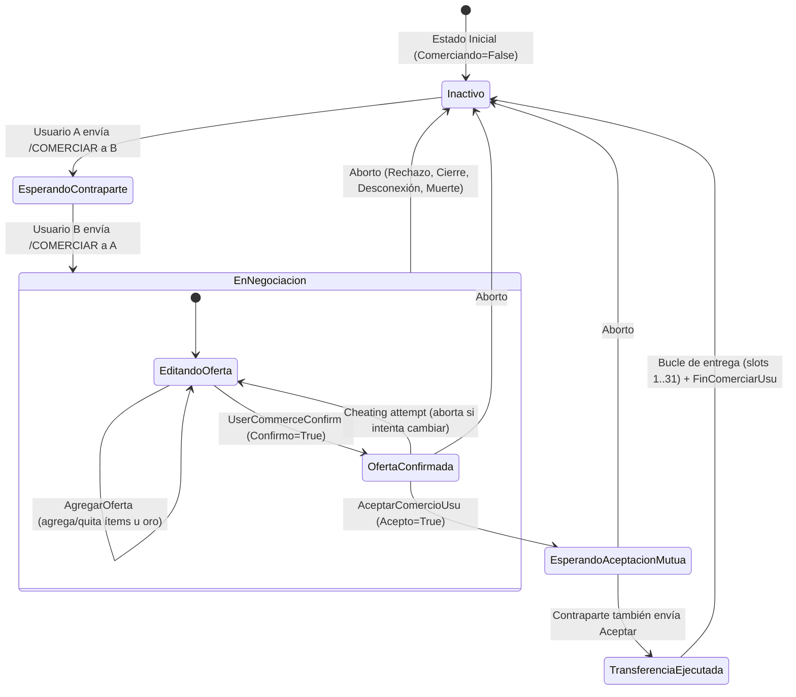

# Auditoría Técnica: Módulos de Comercio `Comercio.bas` y `mdlCOmercioConUsuario.bas` (Capa 6, Módulo #21)

## 1. Resumen Ejecutivo y Alcance

Este documento expone la auditoría técnica exhaustiva de los dos módulos que conforman el subsistema económico de intercambio de bienes en el servidor original de Visual Basic 6.0 de Argentum Online v0.13.0:
1. `legacy/server/Codigo/Comercio.bas` (288 líneas): Responsable del **comercio unidireccional con personajes no jugadores (NPCs)**, abarcando la compra y venta de mercancías, cómputo de tarifas, aplicación de habilidades de regateo y persistencia dinámica de stock.
2. `legacy/server/Codigo/mdlCOmercioConUsuario.bas` (353 líneas): Responsable del **comercio seguro entre usuarios (P2P / C2C)**, implementando una mesa de intercambio bilateral por ofertas con bloqueo de confirmación mutua y transferencia de ítems y oro.

El análisis cubre minuciosamente las interconexiones operativas con los módulos satélites del servidor original:
- `Protocol.bas`: Despacho de opcodes entrantes (`CommerceStart`, `CommerceBuy`, `CommerceSell`, `UserCommerceOffer`, `UserCommerceConfirm`, `UserCommerceOk`, `UserCommerceReject`, `UserCommerceEnd`) y serialización de paquetes salientes de sincronización.
- `InvUsuario.bas` y `Trabajo.bas`: Rutinas de débito/crédito en mochilas (`MeterItemEnInventario`, `QuitarUserInvItem`, `QuitarObjetos`).
- `Modulo_InventANDobj.bas`: Manipulación de inventarios de criaturas (`QuitarNpcInvItem`) y desborde físico al suelo (`TirarItemAlPiso`).
- `TCP.bas` y `GameLogic.bas`: Abortos de emergencia ante desconexión forzada, solapamiento de casillas o cierre de socket.

---

## 2. Catálogo Completo de Procedimientos y Constantes

### 2.1. Inventario Exhaustivo de Procedimientos en `Comercio.bas`

El módulo `Comercio.bas` (`Attribute VB_Name = "modSistemaComercio"`) declara un enumerador, una constante pública y **6 procedimientos**:

| Procedimiento | Firma Exacta en VB6 | Visibilidad | Líneas VB6 | Propósito Operativo |
| :--- | :--- | :---: | :---: | :--- |
| `Comercio` | `Sub Comercio(ByVal Modo As eModoComercio, ByVal UserIndex As Integer, ByVal NpcIndex As Integer, ByVal Slot As Integer, ByVal Cantidad As Integer)` | `Public` | `L41-L191` | Ejecuta la transacción unitaria de compra (`Modo = Compra`) o venta (`Modo = Venta`). Aplica validaciones de cantidad, deduce o acredita oro, altera inventarios de usuario y NPC, emite logs de seguridad y sube la habilidad `eSkill.Comerciar`. |
| `IniciarComercioNPC` | `Sub IniciarComercioNPC(ByVal UserIndex As Integer)` | `Public` | `L193-L201` | Sincroniza el inventario del NPC al cliente mediante `EnviarNpcInv`, activa la bandera `.flags.Comerciando = True` y despacha el paquete `WriteCommerceInit`. |
| `SlotEnNPCInv` | `Function SlotEnNPCInv(ByVal NpcIndex As Integer, ByVal Objeto As Integer, ByVal Cantidad As Integer) As Integer` | `Private` | `L203-L232` | Busca un slot en el inventario del NPC que ya contenga `Objeto` con espacio suficiente (`Amount + Cantidad <= MAX_INVENTORY_OBJS`), o en su defecto el primer slot desocupado (`ObjIndex = 0`), incrementando `NroItems`. |
| `Descuento` | `Function Descuento(ByVal UserIndex As Integer) As Single` | `Private` | `L234-L240` | Computa el divisor de descuento para compras en función de la habilidad de comerciar del usuario: `1 + UserSkills(eSkill.Comerciar) / 100`. |
| `EnviarNpcInv` | `Sub EnviarNpcInv(ByVal UserIndex As Integer, ByVal NpcIndex As Integer)` | `Private` | `L248-L272` | Itera los primeros 20 slots (`MAX_NORMAL_INVENTORY_SLOTS`) del inventario del NPC y emite al cliente paquetes `WriteChangeNPCInventorySlot` con el identificador, cantidad y precio unitario calculado. |
| `SalePrice` | `Function SalePrice(ByVal ObjIndex As Integer) As Single` | `Public` | `L279-L288` | Calcula el valor base de recompra de un ítem por parte del NPC: divide `ObjData(ObjIndex).Valor` por `REDUCTOR_PRECIOVENTA`. Si el ítem es de novato (`ItemNewbie`), retorna 0. |

### 2.2. Inventario Exhaustivo de Procedimientos en `mdlCOmercioConUsuario.bas`

El módulo `mdlCOmercioConUsuario.bas` declara dos constantes privadas de auditoría, dos constantes públicas de slots, la estructura en memoria `tCOmercioUsuario` y **6 procedimientos**:

| Procedimiento | Firma Exacta en VB6 | Visibilidad | Líneas VB6 | Propósito Operativo |
| :--- | :--- | :---: | :---: | :--- |
| `IniciarComercioConUsuario` | `Sub IniciarComercioConUsuario(ByVal Origen As Integer, ByVal Destino As Integer)` | `Public` | `L44-L80` | Verifica si ambos usuarios se han seleccionado mutuamente para comerciar. Si coincide la reciprocidad, actualiza inventarios, marca `.flags.Comerciando = True` y emite `WriteUserCommerceInit` a ambos. De lo contrario, notifica al destinatario por consola invitándolo a escribir `/COMERCIAR`. |
| `EnviarOferta` | `Sub EnviarOferta(ByVal UserIndex As Integer, ByVal OfferSlot As Byte)` | `Public` | `L82-L105` | Despacha al usuario destino (`DestUsu`) la actualización de un slot de oferta específico mediante `WriteChangeUserTradeSlot`. Soporta el slot especial `GOLD_OFFER_SLOT` traduciéndolo a `iORO`. |
| `FinComerciarUsu` | `Sub FinComerciarUsu(ByVal UserIndex As Integer)` | `Public` | `L107-L133` | Restablece a cero el estado del comercio seguro: notifica `WriteUserCommerceEnd`, blanquea `Acepto`, `Confirmo`, `DestUsu`, vacía los arrays de objetos y cantidades ofertadas, resetea `GoldAmount`, limpia `DestNick` y desactiva `.flags.Comerciando = False`. |
| `AceptarComercioUsu` | `Sub AceptarComercioUsu(ByVal UserIndex As Integer)` | `Public` | `L135-L248` | Marca `ComUsu.Acepto = True` en el usuario. Si el otro usuario también aceptó, ejecuta el bucle de transferencia física de oro e ítems entre ambas partes (slots 1 a 31) y finaliza con `FinComerciarUsu` en ambos lados. |
| `AgregarOferta` | `Sub AgregarOferta(ByVal UserIndex As Integer, ByVal OfferSlot As Byte, ByVal ObjIndex As Integer, ByVal Amount As Long, ByVal IsGold As Boolean)` | `Public` | `L250-L284` | Modifica la mesa de oferta propia sumando o restando cantidad de oro o ítems, siempre que la oferta no haya sido previamente confirmada (`Not .Confirmo`). |
| `PuedeSeguirComerciando` | `Function PuedeSeguirComerciando(ByVal UserIndex As Integer) As Boolean` | `Public` | `L286-L352` | Valida si las precondiciones de la sesión siguen vigentes: índices válidos, usuarios conectados, reciprocidad de destinatarios, coincidencia de apodos (`DestNick`) y estado con vida del contraparte. Si falla, aborta inmediatamente con `FinComerciarUsu`. |

### 2.3. Puntos de Contacto Satélites en Otros Módulos

- **`TCP.bas`**:
  - `LimpiarComercioSeguro(ByVal UserIndex As Integer)` (`L1704-L1717`): Aborta sesiones bilaterales invocando `FinComerciarUsu` en el originador y en su contraparte. Invocado durante el reciclado de slots (`ResetUserSlot` `L1731`).
  - Control de Desconexión (`L638-L647`): Al cerrarse la conexión TCP, cancela el comercio seguro y desaloja el búfer del usuario que quedó conectado.
  - Solapamiento de Posición (`L1199-L1212`): Al iniciar sesión un personaje sobre una casilla ocupada que deba desalojarse, cancela el comercio seguro de la entidad desplazada.
- **`Modulo_UsUaRiOs.bas`**:
  - `TotalOfferItems(ByVal ObjIndex As Integer, ByVal UserIndex As Integer) As Long` (`L2318-L2334`): Suma la cantidad total del objeto `ObjIndex` que se encuentra comprometido en todos los slots de oferta de la mesa comercial.
  - `UserDie` (`L1498`): Invoca inmediatamente a `LimpiarComercioSeguro(UserIndex)` si el personaje muere en combate.
- **`Trabajo.bas`**:
  - `QuitarObjetos(ByVal ItemIndex As Integer, ByVal cant As Integer, ByVal UserIndex As Integer)` (`L333-L363`): Remueve `cant` unidades del objeto `ItemIndex` recorriendo la mochila del usuario.
- **`Modulo_InventANDobj.bas`**:
  - `QuitarNpcInvItem(ByVal NpcIndex As Integer, ByVal Slot As Byte, ByVal Cantidad As Integer)` (`L228-L278`): Gestiona el decremento de stock del NPC y la eventual regeneración de ítems cruciales o reaprovisionamiento general.
  - `TirarItemAlPiso(Pos As WorldPos, Obj As Obj, Optional NotPirata As Boolean = True) As WorldPos` (`L43-L65`): Spawnea físicamente un ítem en una coordenada libre adyacente (`TileLibre`).
- **`Protocol.bas`**:
  - Manejadores de entrada: `HandleCommerceStart` (`L5748`), `HandleCommerceEnd` (`L2234`), `HandleCommerceChat` (`L2302`), `HandleCommerceBuy` (`L3594`), `HandleCommerceSell` (`L3691`), `HandleUserCommerceOffer` (`L3990`), `HandleUserCommerceConfirm` (`L2283`), `HandleUserCommerceOk` (`L2381`), `HandleUserCommerceReject` (`L2399`), `HandleUserCommerceEnd` (`L2253`).
  - Escritores de red: `WriteCommerceInit` (`L14362`), `WriteCommerceEnd` (`L14316`), `WriteUserCommerceInit` (`L14409`), `WriteUserCommerceEnd` (`L14433`), `WriteChangeNPCInventorySlot` (`L15902`), `WriteTradeOK` (`L16870`), `WriteChangeUserTradeSlot` (`L16918`), `WriteUserOfferConfirm` (`L14292`), `WriteCancelOfferItem` (`L17838`), `WriteCommerceChat` (`L14837`).

### 2.4. Constantes de Dominio y Parámetros Globales

```vb
' Local en Comercio.bas
Public Const REDUCTOR_PRECIOVENTA As Byte = 3               ' Divisor para el precio de venta al NPC

' Locales en mdlCOmercioConUsuario.bas
Private Const MAX_ORO_LOGUEABLE As Long = 50000            ' Umbral de oro para registrar en LogDesarrollo
Private Const MAX_OBJ_LOGUEABLE As Long = 1000             ' Umbral de unidades para registrar en LogDesarrollo
Public Const MAX_OFFER_SLOTS As Integer = 30               ' Cantidad de slots de ítems en la mesa P2P
Public Const GOLD_OFFER_SLOT As Integer = MAX_OFFER_SLOTS + 1 ' Slot virtual de oro en oferta (31)

' Globales en Declares.bas
Public Const MAX_INVENTORY_SLOTS As Byte = 30              ' Ranuras máximas en inventario del usuario/NPC
Public Const MAX_NORMAL_INVENTORY_SLOTS As Byte = 20       ' Ranuras visibles sincronizadas al cliente para NPCs
Public Const MAX_INVENTORY_OBJS As Integer = 10000         ' Tope máximo apilable por slot individual
Public Const MAXORO As Long = 90000000                     ' Tope de oro del jugador (90 millones)
Public Const FLAGORO As Integer = MAX_INVENTORY_SLOTS + 1  ' Slot virtual de oro en mochila (31)
Public Const iORO As Integer = 12                          ' ObjIndex canónico de la moneda de oro
```

---

## 3. Comercio con NPCs (`Comercio.bas`)

### 3.1. Ciclo de Vida de la Transacción

```mermaid
sequenceDiagram
    autonumber
    actor Player as Jugador (Cliente)
    participant Protocol as Protocol.bas
    participant Commerce as Comercio.bas
    participant NPC as NpcList(NpcIndex)
    participant Inv as InvUsuario / Modulo_InventANDobj

    Player->>Protocol: Paquete CommerceStart (target NPC)
    Protocol->>Protocol: Valida vida, distancia <= 3 y Npc.Comercia = 1
    Protocol->>Commerce: IniciarComercioNPC(UserIndex)
    Commerce->>Player: EnviarNpcInv (slots 1..20) + WriteCommerceInit
    Note over Player,Commerce: Estado: flags.Comerciando = True

    alt Compra (Player compra al NPC)
        Player->>Protocol: Paquete CommerceBuy(Slot, Cantidad)
        Protocol->>Commerce: Comercio(Modo=Compra, Slot, Cantidad)
        Commerce->>Commerce: Valida fondos (Precio <= GLD) y clampa cantidad
        Commerce->>Inv: MeterItemEnInventario(UserIndex, Objeto)
        alt Mochila llena
            Commerce->>Player: EnviarNpcInv + WriteTradeOK (aborta sin cobrar)
        else Mochila con espacio
            Commerce->>Commerce: GLD = GLD - Precio
            Commerce->>Inv: QuitarNpcInvItem(NpcIndex, Slot, Cantidad)
            Commerce->>Player: WriteUpdateUserStats + WriteTradeOK
        end
    else Venta (Player vende al NPC)
        Player->>Protocol: Paquete CommerceSell(Slot, Cantidad)
        Protocol->>Commerce: Comercio(Modo=Venta, Slot, Cantidad)
        Commerce->>Commerce: Valida afinidad de ítem, facción y privilegios
        Commerce->>Inv: QuitarUserInvItem(UserIndex, Slot, Cantidad)
        Commerce->>Commerce: GLD = Min(GLD + Precio, MAXORO)
        Commerce->>Commerce: SlotEnNPCInv (acumula o asigna en NPC)
        Commerce->>Player: UpdateUserInv + WriteUpdateUserStats + WriteTradeOK
    end

    Player->>Protocol: Paquete CommerceEnd
    Protocol->>Player: flags.Comerciando = False + WriteCommerceEnd
```



### 3.2. Fórmulas Matemáticas de Precios y Redondeos

El sistema aplica dos modelos matemáticos asimétricos con reglas de redondeo polarizadas:

#### A. Compra del Jugador (el NPC vende al usuario)
- **Fórmula de Descuento por Habilidad** (`Comercio.bas:239`):
  $$\text{Descuento}(\text{User}) = 1 + \frac{\text{UserSkills}(\text{eSkill.Comerciar})}{100}$$
  - Con `Comerciar = 0`: $\text{Descuento} = 1.0$ (paga el $100\%$ del valor base).
  - Con `Comerciar = 100`: $\text{Descuento} = 2.0$ (paga el $50\%$ del valor base).
  - **Ausencia de Carisma**: El atributo Carisma (`Stats.UserAtributos(eAtributos.Carisma)`) **no interviene** en ninguna parte de la fórmula de AO 0.13.0.
- **Fórmula de Precio Total** (`Comercio.bas:75`):
  $$\text{PrecioCompra} = \text{CLng}\left(\left(\frac{\text{ObjData}(\text{ObjIndex}).\text{Valor}}{\text{Descuento}(\text{User})} \times \text{Cantidad}\right) + 0.5\right)$$
  - **Mecánica de Redondeo**: Sumar $+0.5$ antes del casteo `CLng` fuerza un comportamiento equivalente a la función techo ($\lceil x \rceil$) para valores fraccionarios positivos, evitando el truncamiento bancario de VB6. Siempre favorece al vendedor NPC cobrando la fracción superior de oro.

#### B. Venta del Jugador (el NPC compra al usuario)
- **Valor Unitario de Recompra** (`Comercio.bas:287`):
  $$\text{SalePrice}(\text{ObjIndex}) = \frac{\text{ObjData}(\text{ObjIndex}).\text{Valor}}{\text{REDUCTOR\_PRECIOVENTA}} = \frac{\text{ObjData}(\text{ObjIndex}).\text{Valor}}{3}$$
  - Si `ItemNewbie(ObjIndex) = True`, la función retorna `0`.
- **Fórmula de Precio Total** (`Comercio.bas:154`):
  $$\text{PrecioVenta} = \text{Fix}\left(\text{SalePrice}(\text{ObjIndex}) \times \text{Cantidad}\right)$$
  - **Mecánica de Redondeo**: La función intrínseca `Fix()` trunca la parte decimal descartando fracciones (comportamiento piso $\lfloor x \rfloor$ para números positivos). La habilidad de comercio **no incrementa el valor de venta** en esta versión.

### 3.3. Dinámica del Inventario del NPC: Acumulación y Reposición

1. **Recepción y Acumulación de Objetos Vendidos**:
   - Cuando un jugador vende un ítem, `SlotEnNPCInv` (`L203-L232`) recorre las ranuras del NPC buscando si ya posee dicho `ObjIndex` y su cantidad sumada no supera `MAX_INVENTORY_OBJS` (10.000).
   - Si no existe ranura combinable, asigna la primera ranura vacía (`ObjIndex = 0`) e incrementa `Npclist(NpcIndex).Invent.NroItems`.
   - **Los NPCs conservan los ítems vendidos por jugadores**: Los objetos vendidos pasan a estar a disposición de otros jugadores para ser comprados.
   - Si el inventario del NPC se encuentra colmado en sus 30 slots (`NpcSlot > MAX_INVENTORY_SLOTS`), el ítem **no ingresa al inventario del NPC**, pero el jugador cobra el oro y pierde el ítem igualmente (`L163`).
2. **Reposición de Stock (`QuitarNpcInvItem` en `Modulo_InventANDobj.bas:228-278`)**:
   - **Objetos Cruciales (`Crucial = 1`)**: Si la compra de un jugador agota el stock de un ítem crucial (por ejemplo pociones rojas o leña en suministros esenciales), `QuitarNpcInvItem` consulta el archivo `.dat` del NPC mediante `EncontrarCant`. Si el ítem figura en la configuración base, **se regenera inmediatamente en la misma ranura con el stock original del DAT** (`L266-L268`).
   - **Objetos Comunes (`Crucial = 0`)**: Al agotarse la cantidad, el slot se blanquea (`ObjIndex = 0`). Si el inventario del NPC queda totalmente vacío (`NroItems = 0`) y no tiene respawn individual (`InvReSpawn <> 1`), se invoca `CargarInvent(NpcIndex)` para recargar todas sus mercancías originales desde el archivo de configuración.
   - **Llaves de Casas**: Cuando se compra una llave (`OBJType = otLlaves`), el servidor sobrescribe en caliente el archivo `NPCs.dat` (`Call WriteVar(DatPath & "NPCs.dat", "NPC" & NpcNumero, "obj" & Slot, Objeto.ObjIndex & "-0")`) para anular su venta tras reinicios y registra la operación en `logVentaCasa`.

### 3.4. La Gran Asimetría de Ranuras: `MAX_NORMAL_INVENTORY_SLOTS` vs `MAX_INVENTORY_SLOTS`

Existe una incompatibilidad de diseño en el servidor legacy:
- `MAX_INVENTORY_SLOTS = 30` (`Declares.bas:492`): Capacidad real de memoria del inventario de NPCs.
- `MAX_NORMAL_INVENTORY_SLOTS = 20` (`Declares.bas:496`): Límite fijo de ranuras que la rutina `EnviarNpcInv` (`Comercio.bas:257`) despacha hacia el cliente.

**Consecuencia Operativa**:
Cuando los jugadores venden variedad de ítems a un NPC hasta ocupar los slots 21 a 30, dichos ítems quedan almacenados correctamente en el array de memoria del servidor (`SlotEnNPCInv` llega hasta 30), pero **jamás son informados al cliente** porque `EnviarNpcInv` se detiene en el slot 20. Los objetos en los slots 21 al 30 se convierten en "mercancía fantasma": ocupan capacidad en el NPC pero son invisibles e incomprables mediante la interfaz gráfica estándar.

---

## 4. Comercio Seguro Entre Usuarios (`mdlCOmercioConUsuario.bas`)

### 4.1. Estructura de Memoria de la Oferta

En `Declares.bas:1242`, cada personaje en `UserList` dispone de la estructura `ComUsu As tCOmercioUsuario`, definida en `mdlCOmercioConUsuario.bas:31-40`:

```vb
Public Type tCOmercioUsuario
    DestUsu As Integer                      ' Índice del usuario con quien se negocia
    DestNick As String                      ' Nombre del personaje contraparte (validación de identidad)
    Objeto(1 To MAX_OFFER_SLOTS) As Integer ' ObjIndex ofrecido en cada ranura (1..30)
    GoldAmount As Long                      ' Cantidad de monedas de oro ofrecidas
    cant(1 To MAX_OFFER_SLOTS) As Long      ' Cantidad de unidades ofrecidas por cada ranura (1..30)
    Acepto As Boolean                       ' Flag de pulsación del botón final "Aceptar"
    Confirmo As Boolean                     ' Flag de confirmación/bloqueo de la mesa de ofertas
End Type
```

### 4.2. Máquina de Estados y Protocolo P2P



#### Etapas del Protocolo:
1. **Solicitud de Apertura (`/COMERCIAR`)**:
   - Invocado desde `HandleCommerceStart` (`Protocol.bas:5790`). Requiere que el emisor tenga como objetivo a un usuario (`.flags.TargetUser > 0`).
   - Comprueba: vivo (`.flags.Muerto = 0`), no consejero (`PlayerType.Consejero`), no ser uno mismo, distancia máxima $\le 3$ tiles.
   - Si el destinatario no inició comercio previo, se le envía la invitación por consola. Si el destinatario ya tenía como objetivo al originador, se llama a `IniciarComercioConUsuario(Origen, Destino)` activando la ventana para ambos.
2. **Mesa de Intercambio (`UserCommerceOffer` -> `AgregarOferta`)**:
   - Permite agregar o remover ítems (slots 1 a 30) u oro (`Slot = FLAGORO`).
   - Si `.Confirmo = True`, cualquier intento de alterar la oferta es tratado como trampa y el servidor aborta la sesión de inmediato expulsando a ambos (`Protocol.bas:4019-4029`).
   - Se valida tenencia real mediante `TieneObjetos(ObjIndex, TotalOfferItems + Amount, UserIndex)`.
   - Se despachan notificaciones individuales mediante `EnviarOferta` -> `WriteChangeUserTradeSlot`.
3. **Bloqueo y Confirmación (`UserCommerceConfirm`)**:
   - Cuando un jugador presiona "Confirmar", emite `UserCommerceConfirm` (`Protocol.bas:2283`).
   - Valida `PuedeSeguirComerciando`.
   - Setea `.Confirmo = True` y notifica al socket del otro usuario con `WriteUserOfferConfirm`. A partir de este momento, el usuario no puede agregar ni retirar objetos de su mesa.
4. **Ejecución y Transferencia (`UserCommerceOk` -> `AceptarComercioUsu`)**:
   - Setea `.Acepto = True`.
   - Si `UserList(OtroUserIndex).ComUsu.Acepto = False`, la ejecución se detiene a la espera de la confirmación del otro.
   - Si ambos aceptaron, se ejecuta un bucle directo desde el slot 1 hasta `MAX_OFFER_SLOTS + 1` (31) transfiriendo primero los bienes del usuario 1 al usuario 2, y luego los bienes del usuario 2 al usuario 1.
   - Finaliza invocando `FinComerciarUsu` en ambos jugadores.

### 4.3. Condiciones de Cancelación y Seguridad

- **Cancelación Voluntaria**:
  - `HandleUserCommerceEnd` (`Protocol.bas:2253`) y `HandleUserCommerceReject` (`Protocol.bas:2399`) invocan `FinComerciarUsu` en ambas partes y notifican por consola.
- **Desconexión o Pérdida de Enlace**:
  - `TCP.bas:639` detecta la desconexión del socket y cierra el comercio de la contraparte con `FinComerciarUsu`.
- **Muerte**:
  - En `Modulo_UsUaRiOs.bas:1498`, al morir un personaje se ejecuta `LimpiarComercioSeguro(UserIndex)`.
- **Acciones Restringidas Durante el Comercio**:
  - `HandlePickUp` (`Protocol.bas:2082`): Si `.flags.Comerciando = True`, se aborta el levantamiento de objetos del suelo.
  - `HandleDrop` (`Protocol.bas:2462`): Si `.flags.Comerciando = True`, se prohíbe tirar objetos o tirar oro.
- **Falla en Movimiento Fuera de Rango**:
  - La función `PuedeSeguirComerciando` (`mdlCOmercioConUsuario.bas:286-352`) **no comprueba la distancia física entre los jugadores**.
  - Si un usuario se aleja caminando, es transportado por un hechizo o teleportado por un GM, el comercio seguro sigue activo y la transacción puede completarse a través del mapa.

---

## 5. Auditoría Quirúrgica de Casos de Borde, Desbordamientos y Exploits

### 5.1. Validación de Cantidades Negativas o Nulas

- **Comercio con NPC (`Comercio.bas`)**:
  - `Comercio.bas:50` implementa un guardián estricto: `If Cantidad < 1 Or Slot < 1 Then Exit Sub`.
  - En compras, si `Cantidad > MAX_INVENTORY_OBJS` (10.000), activa el sistema anti-cheat, banea permanentemente al personaje y cierra el socket (`L55-L62`).
- **Comercio Entre Usuarios (`Protocol.bas` y `mdlCOmercioConUsuario.bas`)**:
  - En `HandleUserCommerceOffer` (`Protocol.bas:4039`), se valida `If Amount = 0 Then Exit Sub`.
  - El protocolo **permite cantidades negativas** para restar de la oferta (`Protocol.bas:4038`: `' Can be negative if substracted from the offer`).
  - **Vulnerabilidad de Desbordamiento por Enteros Negativos Extremos**:
    Si un cliente manipulado envía `Amount = -2147483648` (`Long.MinValue`), la validación de tenencia de oro `Amount > .Stats.GLD - .ComUsu.GoldAmount` se evalúa como falsa (dado que un negativo extremo es menor que cualquier saldo). En `AgregarOferta`, la operación `.GoldAmount + Amount` detona un desbordamiento aritmético (`Error 6: Overflow` en VB6). Dado que `HandleUserCommerceOffer` **carece de bloque de captura de errores** (`On Error GoTo`), este paquete provoca la **caída inmediata del proceso del servidor**.

### 5.2. Desbordamiento de Oro (`.Stats.GLD`)

- **Comercio con NPC**:
  - En ventas al NPC (`Comercio.bas:157-158`), el oro acreditado se encuentra protegido mediante clamping explícito:
    ```vb
    UserList(UserIndex).Stats.GLD = UserList(UserIndex).Stats.GLD + Precio
    If UserList(UserIndex).Stats.GLD > MAXORO Then UserList(UserIndex).Stats.GLD = MAXORO
    ```
- **Comercio P2P Entre Usuarios (Falla Crítica)**:
  - En `mdlCOmercioConUsuario.bas:168` y `L210`:
    ```vb
    UserList(OtroUserIndex).Stats.GLD = UserList(OtroUserIndex).Stats.GLD + .ComUsu.GoldAmount
    ```
  - **No existe verificación del tope `MAXORO` (90.000.000)**.
  - Si un usuario con 85M recibe 10M en un intercambio seguro, su saldo pasa a 95M violando la restricción global del juego.
  - Si el saldo resultante excede el rango máximo de un entero de 32 bits con signo (`2.147.483.647`), se produce un `Error 6 (Desbordamiento)` o el saldo muta a un valor negativo catastrófico en binarios sin comprobación de rango, corrompiendo la economía del jugador.

### 5.3. Capacidad de Inventario y Evaporación de Ítems

Uno de los hallazgos más graves de la auditoría reside en la resolución de inventario lleno en `AceptarComercioUsu` (`mdlCOmercioConUsuario.bas:178-182` y `L221-225`):

```vb
' Quita el objeto y se lo da al otro
If Not MeterItemEnInventario(OtroUserIndex, TradingObj) Then
    Call TirarItemAlPiso(UserList(OtroUserIndex).Pos, TradingObj)
End If

Call QuitarObjetos(TradingObj.ObjIndex, TradingObj.Amount, UserIndex)
```

**Consecuencias Operativas**:
1. **Ruptura de la Seguridad Comercial**: Si el receptor no tiene slots disponibles en su mochila, el servidor **no revierte la transacción**. En su lugar, arroja el ítem al suelo debajo de los pies del receptor (`TirarItemAlPiso`). En zonas pobladas o inseguras, cualquier tercero puede recoger el ítem inmediatamente.
2. **Evaporación Definitiva de Bienes**: En `Modulo_InventANDobj.bas:56-59`, la función `TirarItemAlPiso` busca una coordenada adyacente desocupada mediante `TileLibre`. Si todas las baldosas circundantes están bloqueadas por mapa, criaturas u otros objetos, `NuevaPos.X` e `Y` valen 0, y `MakeObj` **no se ejecuta**. Sin embargo, la línea siguiente en `AceptarComercioUsu` ejecuta `QuitarObjetos` sobre el usuario emisor. **El ítem desaparece del mundo sin ser entregado ni colocado en el suelo**.

### 5.4. Orden de Transferencia y Falla de Atomicidad (Riesgo de Duplicación)

1. **Secuencia No Transaccional**:
   - La transferencia se ejecuta secuencialmente ranura por ranura. No existe preparación previa (fase *Prepare*) ni capacidad de reversión (*Rollback*). Si la conexión de red falla durante el slot 5, los slots 1 a 4 quedaron transferidos irreversiblemente y los restantes se anulan.
2. **Acreditación Previa al Débito**:
   - En cada slot, el servidor primero entrega el ítem al receptor (`MeterItemEnInventario`) y **recién después** lo sustrae del emisor (`QuitarObjetos`). Durante ese lapso el ítem existe simultáneamente en dos lugares.
3. **Exploit de Desbordamiento de Tipo en `QuitarObjetos`**:
   - La firma de `QuitarObjetos` en `Trabajo.bas:333` es:
     `Public Sub QuitarObjetos(ByVal ItemIndex As Integer, ByVal cant As Integer, ByVal UserIndex As Integer)`
   - El parámetro `cant` es de tipo `Integer` (16 bits con signo, máximo `32.767`).
   - Sin embargo, en `mdlCOmercioConUsuario.bas`, el array `.ComUsu.cant()` almacena valores de tipo `Long` (32 bits, hasta `2.147.483.647`), y el paquete `UserCommerceOffer` lee un `Long`.
   - **Mecánica de Explotación**: Si dos usuarios intercambian un stack de munición, pociones o leña superior a 32.767 unidades (por ejemplo 40.000 flechas), al ejecutarse la transferencia:
     - `MeterItemEnInventario` acredita exitosamente las 40.000 unidades en el receptor.
     - Al invocar `QuitarObjetos`, el pasaje de argumento `cant = 40000` desborda el tipo `Integer` de VB6 arrojando un error en tiempo de ejecución.
     - Al fallar `QuitarObjetos`, la deducción en el emisor queda trunca mientras que la acreditación en el receptor ya fue efectuada, produciendo una **duplicación neta de ítems apilables**.

### 5.5. Matriz de Restricciones por Tipo de Objeto

| Tipo de Objeto / Condición | Comercio con NPC (`Comercio.bas`) | Comercio Seguro P2P (`mdlCOmercioConUsuario.bas`) | Diagnóstico y Riesgo |
| :--- | :---: | :---: | :--- |
| **Barcos (`otBarcos`)** | Permitido si el NPC acepta el tipo. **No valida si está navegando**. | Bloqueado si `.flags.Navegando = 1` y coincide con `BarcoSlot` (`Protocol.bas:4066`). | **Vulnerabilidad en NPC**: Un jugador navegando puede vender su barco equipado al NPC sastre/mercader y quedar varado a pie en el agua. |
| **Ítems Newbie (`ItemNewbie`)** | Precio de venta forzado a 0 (`SalePrice = 0`). El NPC lo retiene sin pagar oro. | Bloqueado explícitamente (`Protocol.bas:4059` -> `WriteCancelOfferItem`). | Seguro en P2P; trampa de pérdida involuntaria en NPCs. |
| **Llaves de Casas (`otLlaves`)** | Al comprar, persiste a `NPCs.dat` (`L107`) y genera log en `logVentaCasa`. | **Permitido sin restricciones**. | Las llaves de propiedades pueden ser transferidas legítimamente entre jugadores en P2P. |
| **Mochilas Equipadas** | No se valida si está equipada al vender al NPC. | Bloqueado explícitamente si coincide con `MochilaEqpSlot` (`Protocol.bas:4074`). | En NPC puede provocar desfasaje en `.CurrentInventorySlots` si se vende la mochila en uso. |
| **Pertenencias Reales (`Real = 1`)** | Solo vendibles a NPC con nombre `"SR"` (Sastre Real, `L126`). | **Sin restricción**. | Un usuario Real puede traspasar armaduras reales a usuarios criminales o neutros en comercio P2P sin impedimentos de facción. |
| **Pertenencias del Caos (`Caos = 1`)** | Solo vendibles a NPC con nombre `"SC"` (Sastre Caótico, `L133`). | **Sin restricción**. | Ídem caso Real; las armaduras del Caos pueden ser transferidas a cualquier usuario. |
| **Moneda de Oro (`iORO`)** | Bloqueado explícitamente al vender (`L120: Objeto.ObjIndex = iORO`). | Permitido mediante el slot especial `FLAGORO` / `GOLD_OFFER_SLOT`. | Correcto; la venta de oro a NPCs está impedida. |

---

## 6. Recomendaciones Técnicas para la Implementación en C++20

1. **Transacciones Atómicas de Dos Fases (Two-Phase Commit)**:
   - Toda transacción (tanto en NPC como P2P) debe ejecutar primero una fase de validación estricta en memoria (*Prepare*): verificar espacio de inventario disponible para todos los ítems receptores, saldo suficiente de oro, validez de todos los punteros y que el saldo de oro final no sobrepase `MAXORO`.
   - Si la validación es satisfactoria para ambas partes, se aplican las modificaciones de memoria en una única operación indivisible (*Commit*). Bajo ninguna circunstancia deben arrojarse ítems al suelo ni realizar acreditaciones previas al débito.
2. **Tipado Entero Seguro de 32 y 64 bits**:
   - Descartar el uso heterogéneo de enteros de 16 bits (`int16_t`) para cantidades en funciones auxiliares como `QuitarObjetos`. Todas las cantidades de inventario y oro deben manejarse homogéneamente mediante `uint32_t` o `int64_t` para evitar desbordamientos aritméticos.
3. **Validación Espacial Continua y Observadores de Estado**:
   - Incorporar comprobación de distancia Manhattan/Euclidiana ($\le 3$ tiles) y mismo mapa en cada cambio de oferta, confirmación y aceptación de comercio seguro.
   - Si una de las entidades se desplaza, es empujada o teleportada, registrar un listener en el componente de movimiento que cancele automáticamente la sesión.
4. **Protección de Bienes Equipados y Faccionarios**:
   - Impedir la venta a NPCs de barcos y mochilas actualmente en uso (`equipped = true` o `Navegando = true`).
   - Evaluar si las restricciones de equipamiento faccionario (`Real` / `Caos`) deben aplicarse también a la mesa de intercambio P2P para evitar transferencias ilícitas de armaduras a bandos opuestos.
5. **Corrección de la Sincronización de Ranuras en NPCs**:
   - Unificar `MAX_NORMAL_INVENTORY_SLOTS` con `MAX_INVENTORY_SLOTS` para que los ítems vendidos por jugadores en las ranuras 21 a 30 no queden ocultos en el cliente.

---

## 7. Documentos Relacionados

- [Macro-Área 12: Objetos, Inventario y Comercio](12-objetos-inventario-comercio.md)
- [Auditoría de `Modulo_InventANDobj.bas`](12a-modulo-inventandobj-detalle.md)
- [Auditoría de `InvUsuario.bas`](12b-invusuario-detalle.md)
- [Auditoría de `modBanco.bas`](12c-modbanco-detalle.md)
- [Convenciones Generales del Proyecto](../CONVENTIONS.md)
