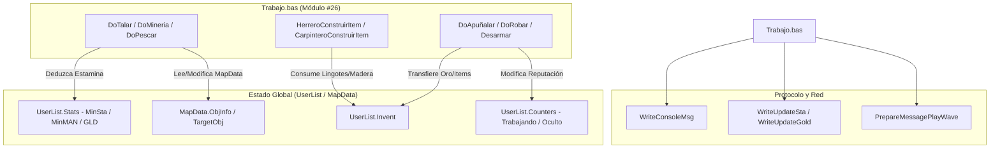

# Auditoría Técnica y Especificación de Paridad: `Trabajo.bas` (Módulo #26)

Este documento presenta la auditoría exhaustiva e investigación técnica del módulo `legacy/server/Codigo/Trabajo.bas` (~2.350 líneas), correspondiente al Módulo #26 del servidor legacy Visual Basic 6 de Argentum Online v0.13.0.

---

## 1. Catálogo Completo de Procedimientos

El módulo `Trabajo.bas` contiene un total de **49 procedimientos** (rutinas `Sub` y `Function`). A continuación se enumeran agrupados según sus áreas temáticas y funcionales, indicando su visibilidad (`Public` / `Private`), firma exacta, tipo de retorno y números de línea de origen.

> [!NOTE]
> En VB6, aquellos procedimientos declarados con `Sub` o `Function` sin especificador explícito de visibilidad adoptan visibilidad `Public` por defecto.

### 1.1. Oficios de Recolección (Tala, Minería y Pesca)
- **`DoTalar`** [`legacy/server/Codigo/Trabajo.bas:1926-1997`](legacy/server/Codigo/Trabajo.bas#L1926-L1997)
  - **Visibilidad**: `Public Sub`
  - **Parámetros**: `(ByVal UserIndex As Integer, Optional ByVal DarMaderaElfica As Boolean = False)`
  - **Propósito**: Procesa la tala de árboles (común y élfica), verifica estamina, calcula azar por skill de Talar, otorga madera e incrementa skill y reputación de plebe.
- **`DoMineria`** [`legacy/server/Codigo/Trabajo.bas:1999-2067`](legacy/server/Codigo/Trabajo.bas#L1999-L2067)
  - **Visibilidad**: `Public Sub`
  - **Parámetros**: `(ByVal UserIndex As Integer)`
  - **Propósito**: Ejecuta la extracción de minerales sobre yacimientos (`TargetObj`), deduce estamina, determina éxito según skill de Minería y entrega minerales.
- **`DoPescar`** [`legacy/server/Codigo/Trabajo.bas:1379-1445`](legacy/server/Codigo/Trabajo.bas#L1379-L1445)
  - **Visibilidad**: `Public Sub`
  - **Parámetros**: `(ByVal UserIndex As Integer)`
  - **Propósito**: Ejecuta la pesca con caña común o caña de pescar en agua, deduce estamina y otorga peces según skill de Pesca.
- **`DoPescarRed`** [`legacy/server/Codigo/Trabajo.bas:1447-1521`](legacy/server/Codigo/Trabajo.bas#L1447-L1521)
  - **Visibilidad**: `Public Sub`
  - **Parámetros**: `(ByVal UserIndex As Integer)`
  - **Propósito**: Ejecuta la pesca masiva con red de pesca, con mayor rendimiento para la clase Trabajador (Pescador).

### 1.2. Oficios de Manufactura y Fundición (Herrería, Carpintería y Minerales)
- **`FundirMineral`** [`legacy/server/Codigo/Trabajo.bas:257-284`](legacy/server/Codigo/Trabajo.bas#L257-L284)
  - **Visibilidad**: `Public Sub`
  - **Parámetros**: `(ByVal UserIndex As Integer)`
  - **Propósito**: Valida el skill de minería/fundición frente al mineral objetivo (`TargetObjInvIndex`) y deriva a `DoLingotes`.
- **`DoLingotes`** [`legacy/server/Codigo/Trabajo.bas:798-847`](legacy/server/Codigo/Trabajo.bas#L798-L847)
  - **Visibilidad**: `Public Sub`
  - **Parámetros**: `(ByVal UserIndex As Integer)`
  - **Propósito**: Transforma 50 unidades de mineral crudo en 1 lingote (Hierro, Plata u Oro).
- **`MineralesParaLingote`** [`legacy/server/Codigo/Trabajo.bas:779-796`](legacy/server/Codigo/Trabajo.bas#L779-L796)
  - **Visibilidad**: `Private Function`
  - **Parámetros**: `(ByVal Lingote As iMinerales) As Integer`
  - **Propósito**: Devuelve el `ItemIndex` de mineral correspondiente según el tipo de lingote (`iMinerales`).
- **`FundirArmas`** [`legacy/server/Codigo/Trabajo.bas:286-309`](legacy/server/Codigo/Trabajo.bas#L286-L309)
  - **Visibilidad**: `Public Sub`
  - **Parámetros**: `(ByVal UserIndex As Integer)`
  - **Propósito**: Valida requerimiento de skill de Herrería sobre un arma objetivo y deriva a `DoFundir`.
- **`DoFundir`** [`legacy/server/Codigo/Trabajo.bas:849-900`](legacy/server/Codigo/Trabajo.bas#L849-L900)
  - **Visibilidad**: `Public Sub`
  - **Parámetros**: `(ByVal UserIndex As Integer)`
  - **Propósito**: Destruye un objeto metálico (arma/armadura/escudo/casco) y recupera entre el 10% y el 25% de los lingotes empleados en su fabricación.
- **`PuedeConstruir`** [`legacy/server/Codigo/Trabajo.bas:528-537`](legacy/server/Codigo/Trabajo.bas#L528-L537)
  - **Visibilidad**: `Public Function`
  - **Parámetros**: `(ByVal UserIndex As Integer, ByVal ItemIndex As Integer, ByVal CantidadItems As Integer) As Boolean`
  - **Propósito**: Valida si el herrero posee materiales y skill requeridos para craftear una cantidad dada de ítems.
- **`PuedeConstruirHerreria`** [`legacy/server/Codigo/Trabajo.bas:539-560`](legacy/server/Codigo/Trabajo.bas#L539-L560)
  - **Visibilidad**: `Public Function`
  - **Parámetros**: `(ByVal ItemIndex As Integer) As Boolean`
  - **Propósito**: Verifica si `ItemIndex` pertenece a los arreglos de recetas de armas o armaduras de herrero.
- **`HerreroConstruirItem`** [`legacy/server/Codigo/Trabajo.bas:562-659`](legacy/server/Codigo/Trabajo.bas#L562-L659)
  - **Visibilidad**: `Public Sub`
  - **Parámetros**: `(ByVal UserIndex As Integer, ByVal ItemIndex As Integer)`
  - **Propósito**: Ejecuta el crafteo en Herrería, consumiendo estamina y lingotes, otorgando skill, reputación y reproduciendo sonido de martillo.
- **`HerreroTieneMateriales`** [`legacy/server/Codigo/Trabajo.bas:420-450`](legacy/server/Codigo/Trabajo.bas#L420-L450)
  - **Visibilidad**: `Public Function` (implícita)
  - **Parámetros**: `(ByVal UserIndex As Integer, ByVal ItemIndex As Integer, ByVal CantidadItems As Integer) As Boolean`
  - **Propósito**: Verifica la presencia de lingotes de Hierro, Plata y Oro necesarios para craftear en herrero.
- **`HerreroQuitarMateriales`** [`legacy/server/Codigo/Trabajo.bas:365-376`](legacy/server/Codigo/Trabajo.bas#L365-L376)
  - **Visibilidad**: `Public Sub` (implícita)
  - **Parámetros**: `(ByVal UserIndex As Integer, ByVal ItemIndex As Integer, ByVal CantidadItems As Integer)`
  - **Propósito**: Descuenta del inventario los lingotes consumidos por Herrería.
- **`PuedeConstruirCarpintero`** [`legacy/server/Codigo/Trabajo.bas:661-677`](legacy/server/Codigo/Trabajo.bas#L661-L677)
  - **Visibilidad**: `Public Function`
  - **Parámetros**: `(ByVal ItemIndex As Integer) As Boolean`
  - **Propósito**: Verifica si `ItemIndex` existe en el arreglo de recetas de carpintería (`ObjCarpintero`).
- **`CarpinteroConstruirItem`** [`legacy/server/Codigo/Trabajo.bas:679-777`](legacy/server/Codigo/Trabajo.bas#L679-L777)
  - **Visibilidad**: `Public Sub`
  - **Parámetros**: `(ByVal UserIndex As Integer, ByVal ItemIndex As Integer)`
  - **Propósito**: Ejecuta el crafteo de Carpintería, consumiendo madera común/élfica y estamina.
- **`CarpinteroTieneMateriales`** [`legacy/server/Codigo/Trabajo.bas:390-418`](legacy/server/Codigo/Trabajo.bas#L390-L418)
  - **Visibilidad**: `Public Function` (implícita)
  - **Parámetros**: `(ByVal UserIndex As Integer, ByVal ItemIndex As Integer, ByVal Cantidad As Integer, Optional ByVal ShowMsg As Boolean = False) As Boolean`
  - **Propósito**: Verifica la presencia de leña común o élfica necesaria para carpintería.
- **`CarpinteroQuitarMateriales`** [`legacy/server/Codigo/Trabajo.bas:378-388`](legacy/server/Codigo/Trabajo.bas#L378-L388)
  - **Visibilidad**: `Public Sub` (implícita)
  - **Parámetros**: `(ByVal UserIndex As Integer, ByVal ItemIndex As Integer, ByVal CantidadItems As Integer)`
  - **Propósito**: Descuenta del inventario la leña consumida en carpintería.
- **`DoUpgrade`** [`legacy/server/Codigo/Trabajo.bas:902-1012`](legacy/server/Codigo/Trabajo.bas#L902-L1012)
  - **Visibilidad**: `Public Sub`
  - **Parámetros**: `(ByVal UserIndex As Integer, ByVal ItemIndex As Integer)`
  - **Propósito**: Sistema de mejora de ítems (armas, cascos, escudos, barcos, flechas) consumiendo el ítem base y materiales extra.
- **`TieneMaterialesUpgrade`** [`legacy/server/Codigo/Trabajo.bas:452-505`](legacy/server/Codigo/Trabajo.bas#L452-L505)
  - **Visibilidad**: `Public Function` (implícita)
  - **Parámetros**: `(ByVal UserIndex As Integer, ByVal ItemIndex As Integer) As Boolean`
  - **Propósito**: Revisa si el jugador posee los materiales para la mejora (`Upgrade`).
- **`QuitarMaterialesUpgrade`** [`legacy/server/Codigo/Trabajo.bas:507-526`](legacy/server/Codigo/Trabajo.bas#L507-L526)
  - **Visibilidad**: `Public Sub` (implícita)
  - **Parámetros**: `(ByVal UserIndex As Integer, ByVal ItemIndex As Integer)`
  - **Propósito**: Descuenta los materiales consumidos por la mejora de un ítem.
- **`MaxItemsConstruibles`** [`legacy/server/Codigo/Trabajo.bas:2343-2350`](legacy/server/Codigo/Trabajo.bas#L2343-L2350)
  - **Visibilidad**: `Public Function`
  - **Parámetros**: `(ByVal UserIndex As Integer) As Integer`
  - **Propósito**: Calcula el tope de ítems construibles por ciclo según el nivel (`ELV`) del jugador.

### 1.3. Habilidades Activas y Combate (Apuñalar, Robar, Domar y Utilidades)
- **`DoApuñalar`** [`legacy/server/Codigo/Trabajo.bas:1793-1846`](legacy/server/Codigo/Trabajo.bas#L1793-L1846)
  - **Visibilidad**: `Public Sub`
  - **Parámetros**: `(ByVal UserIndex As Integer, ByVal VictimNpcIndex As Integer, ByVal VictimUserIndex As Integer, ByVal daño As Integer)`
  - **Propósito**: Aplica daño de apuñalamiento (multiplicador 1.5x con daga en Asesino, 1.4x sin daga o en otras clases) y otorga experiencia/skill.
- **`DoAcuchillar`** [`legacy/server/Codigo/Trabajo.bas:1848-1871`](legacy/server/Codigo/Trabajo.bas#L1848-L1871)
  - **Visibilidad**: `Public Sub`
  - **Parámetros**: `(ByVal UserIndex As Integer, ByVal VictimNpcIndex As Integer, ByVal VictimUserIndex As Integer, ByVal daño As Integer)`
  - **Propósito**: Habilidad especial de acuchillar con probabilidad de incrementar el daño en un 25% (1.25x).
- **`DoGolpeCritico`** [`legacy/server/Codigo/Trabajo.bas:1873-1904`](legacy/server/Codigo/Trabajo.bas#L1873-L1904)
  - **Visibilidad**: `Public Sub`
  - **Parámetros**: `(ByVal UserIndex As Integer, ByVal VictimNpcIndex As Integer, ByVal VictimUserIndex As Integer, ByVal daño As Integer)`
  - **Propósito**: Evalúa golpe crítico (contiene el quirk histórico donde `daño = Int(daño * 0.75)`).
- **`DoRobar`** [`legacy/server/Codigo/Trabajo.bas:1523-1685`](legacy/server/Codigo/Trabajo.bas#L1523-L1685)
  - **Visibilidad**: `Public Sub`
  - **Parámetros**: `(ByVal LadrOnIndex As Integer, ByVal VictimaIndex As Integer)`
  - **Propósito**: Ejecuta la habilidad de Robar oro u objetos a otro usuario, descontando estamina, aplicando estado criminal y reputación de Ladrón.
- **`ObjEsRobable`** [`legacy/server/Codigo/Trabajo.bas:1693-1712`](legacy/server/Codigo/Trabajo.bas#L1693-L1712)
  - **Visibilidad**: `Public Function`
  - **Parámetros**: `(ByVal VictimaIndex As Integer, ByVal Slot As Integer) As Boolean`
  - **Propósito**: Determina si el ítem de un slot es robable (excluye llaves, equipados, barcos e ítems de facción/real/caos).
- **`RobarObjeto`** [`legacy/server/Codigo/Trabajo.bas:1719-1791`](legacy/server/Codigo/Trabajo.bas#L1719-L1791)
  - **Visibilidad**: `Public Sub`
  - **Parámetros**: `(ByVal LadrOnIndex As Integer, ByVal VictimaIndex As Integer)`
  - **Propósito**: Transfiere un objeto robable aleatorio del inventario de la víctima al ladrón.
- **`DoHurtar`** [`legacy/server/Codigo/Trabajo.bas:2260-2286`](legacy/server/Codigo/Trabajo.bas#L2260-L2286)
  - **Visibilidad**: `Public Sub`
  - **Parámetros**: `(ByVal UserIndex As Integer, ByVal VictimaIndex As Integer)`
  - **Propósito**: Habilidad exclusiva de la clase Bandido para hurtar objetos usando `GUANTE_HURTO`.
- **`DoHandInmo`** [`legacy/server/Codigo/Trabajo.bas:2288-2310`](legacy/server/Codigo/Trabajo.bas#L2288-L2310)
  - **Visibilidad**: `Public Sub`
  - **Parámetros**: `(ByVal UserIndex As Integer, ByVal VictimaIndex As Integer)`
  - **Propósito**: Golpe inmovilizador de Ladrón con manos/guantes de hurto (paraliza por `IntervaloParalizado / 2`).
- **`Desarmar`** [`legacy/server/Codigo/Trabajo.bas:2312-2340`](legacy/server/Codigo/Trabajo.bas#L2312-L2340)
  - **Visibilidad**: `Public Sub`
  - **Parámetros**: `(ByVal UserIndex As Integer, ByVal VictimIndex As Integer)`
  - **Propósito**: Desarma al oponente desequipando su arma según habilidad de Wrestling y nivel.
- **`DoDesequipar`** [`legacy/server/Codigo/Trabajo.bas:2155-2258`](legacy/server/Codigo/Trabajo.bas#L2155-L2258)
  - **Visibilidad**: `Public Sub`
  - **Parámetros**: `(ByVal UserIndex As Integer, ByVal VictimIndex As Integer)`
  - **Propósito**: Intenta desequipar secuencialmente escudo, arma o casco del rival durante combate sin armas.
- **`DoDomar`** [`legacy/server/Codigo/Trabajo.bas:1117-1222`](legacy/server/Codigo/Trabajo.bas#L1117-L1222)
  - **Visibilidad**: `Public Sub` (implícita)
  - **Parámetros**: `(ByVal UserIndex As Integer, ByVal NpcIndex As Integer)`
  - **Propósito**: Intenta convertir a una criatura NPC en mascota controlada.
- **`PuedeDomarMascota`** [`legacy/server/Codigo/Trabajo.bas:1224-1242`](legacy/server/Codigo/Trabajo.bas#L1224-L1242)
  - **Visibilidad**: `Private Function`
  - **Parámetros**: `(ByVal UserIndex As Integer, ByVal NpcIndex As Integer) As Boolean`
  - **Propósito**: Valida que el usuario no posea más de 2 mascotas del mismo tipo de NPC.
- **`FreeMascotaIndex`** [`legacy/server/Codigo/Trabajo.bas:1102-1115`](legacy/server/Codigo/Trabajo.bas#L1102-L1115)
  - **Visibilidad**: `Public Function` (implícita)
  - **Parámetros**: `(ByVal UserIndex As Integer) As Integer`
  - **Propósito**: Busca y devuelve un slot libre en el arreglo de mascotas del usuario (`MascotasIndex`).

### 1.4. Rutinas Auxiliares y Gestión de Entorno
- **`DoPermanecerOculto`** [`legacy/server/Codigo/Trabajo.bas:36-88`](legacy/server/Codigo/Trabajo.bas#L36-L88)
  - **Visibilidad**: `Public Sub`
  - **Parámetros**: `(ByVal UserIndex As Integer)`
  - **Propósito**: Decrementa el temporizador de ocultamiento y restaura visibilidad/apariencia normal.
- **`DoOcultarse`** [`legacy/server/Codigo/Trabajo.bas:90-156`](legacy/server/Codigo/Trabajo.bas#L90-L156)
  - **Visibilidad**: `Public Sub`
  - **Parámetros**: `(ByVal UserIndex As Integer)`
  - **Propósito**: Ejecuta la habilidad de ocultarse (invisibilidad por skill), transformando piratas en galeón fantasmal en agua.
- **`DoNavega`** [`legacy/server/Codigo/Trabajo.bas:158-255`](legacy/server/Codigo/Trabajo.bas#L158-L255)
  - **Visibilidad**: `Public Sub`
  - **Parámetros**: `(ByVal UserIndex As Integer, ByRef Barco As ObjData, ByVal Slot As Integer)`
  - **Propósito**: Alterna el estado de navegación (equipar/desequipar barco) y actualiza el sprite visual.
- **`DoAdminInvisible`** [`legacy/server/Codigo/Trabajo.bas:1244-1298`](legacy/server/Codigo/Trabajo.bas#L1244-L1298)
  - **Visibilidad**: `Public Sub` (implícita)
  - **Parámetros**: `(ByVal UserIndex As Integer)`
  - **Propósito**: Alterna la invisibilidad total de Administrador/GM (remueve el personaje de los clientes del área).
- **`TratarDeHacerFogata`** [`legacy/server/Codigo/Trabajo.bas:1300-1377`](legacy/server/Codigo/Trabajo.bas#L1300-L1377)
  - **Visibilidad**: `Public Sub` (implícita)
  - **Parámetros**: `(ByVal Map As Integer, ByVal X As Integer, ByVal Y As Integer, ByVal UserIndex As Integer)`
  - **Propósito**: Transforma 3 o más troncos de leña en el suelo en fogatas apagadas según skill de Supervivencia.
- **`DoMeditar`** [`legacy/server/Codigo/Trabajo.bas:2069-2153`](legacy/server/Codigo/Trabajo.bas#L2069-L2153)
  - **Visibilidad**: `Public Sub`
  - **Parámetros**: `(ByVal UserIndex As Integer)`
  - **Propósito**: Procesa la regeneración progresiva de Maná mediante meditación.
- **`QuitarSta`** [`legacy/server/Codigo/Trabajo.bas:1906-1924`](legacy/server/Codigo/Trabajo.bas#L1906-L1924)
  - **Visibilidad**: `Public Sub`
  - **Parámetros**: `(ByVal UserIndex As Integer, ByVal Cantidad As Integer)`
  - **Propósito**: Decrementa la estamina del usuario respetando el piso en `0` e informando la actualización al cliente.
- **`TieneObjetos`** [`legacy/server/Codigo/Trabajo.bas:311-331`](legacy/server/Codigo/Trabajo.bas#L311-L331)
  - **Visibilidad**: `Public Function` (implícita)
  - **Parámetros**: `(ByVal ItemIndex As Integer, ByVal cant As Integer, ByVal UserIndex As Integer) As Boolean`
  - **Propósito**: Suma la cantidad total de un ítem distribuido entre todos los slots del inventario del jugador.
- **`QuitarObjetos`** [`legacy/server/Codigo/Trabajo.bas:333-363`](legacy/server/Codigo/Trabajo.bas#L333-L363)
  - **Visibilidad**: `Public Sub`
  - **Parámetros**: `(ByVal ItemIndex As Integer, ByVal cant As Integer, ByVal UserIndex As Integer)`
  - **Propósito**: Remueve una cantidad total de un ítem a lo largo del inventario del usuario.
- **`ModNavegacion`** [`legacy/server/Codigo/Trabajo.bas:1014-1035`](legacy/server/Codigo/Trabajo.bas#L1014-L1035)
  - **Visibilidad**: `Public Function` (implícita)
  - **Parámetros**: `(ByVal clase As eClass, ByVal UserIndex As Integer) As Single`
  - **Propósito**: Devuelve el multiplicador de skill necesario para navegar (Pirata: 1.0, Trabajador Pescador 100: 1.71, resto: 2.0).
- **`ModFundicion`** [`legacy/server/Codigo/Trabajo.bas:1037-1051`](legacy/server/Codigo/Trabajo.bas#L1037-L1051)
  - **Visibilidad**: `Public Function` (implícita)
  - **Parámetros**: `(ByVal clase As eClass) As Single`
  - **Propósito**: Devuelve el multiplicador de skill de fundición (Trabajador: 1.0, resto: 3.0).
- **`ModCarpinteria`** [`legacy/server/Codigo/Trabajo.bas:1053-1067`](legacy/server/Codigo/Trabajo.bas#L1053-L1067)
  - **Visibilidad**: `Public Function` (implícita)
  - **Parámetros**: `(ByVal clase As eClass) As Integer`
  - **Propósito**: Devuelve el divisor de skill de carpintería (Trabajador: 1, resto: 3).
- **`ModHerreriA`** [`legacy/server/Codigo/Trabajo.bas:1069-1082`](legacy/server/Codigo/Trabajo.bas#L1069-L1082)
  - **Visibilidad**: `Public Function` (implícita)
  - **Parámetros**: `(ByVal clase As eClass) As Single`
  - **Propósito**: Devuelve el divisor de skill de herrería (Trabajador: 1.0, resto: 3.0).
- **`ModDomar`** [`legacy/server/Codigo/Trabajo.bas:1084-1100`](legacy/server/Codigo/Trabajo.bas#L1084-L1100)
  - **Visibilidad**: `Public Function` (implícita)
  - **Parámetros**: `(ByVal clase As eClass) As Integer`
  - **Propósito**: Devuelve el divisor de skill de domar (Trabajador/Cazador/Druida: 1, resto: 2).

---

## 2. Fórmulas Matemáticas, Probabilidades y Consumo de Recursos

### 2.1. Recolección de Recursos (Tala, Minería y Pesca)
En los tres oficios principales de extracción, el cálculo de azar depende de una fórmula polinómica cuadrática basada en los puntos de skill:

$$\text{Suerte} = \text{Int}\left(-0.00125 \times \text{Skill}^2 - 0.3 \times \text{Skill} + 49\right)$$

- **Evaluación de Éxito**:
  - **Tala (`DoTalar`)**: Se tira `res = RandomNumber(1, Suerte)`. Si `res <= 6`, la extracción es exitosa.
  - **Minería (`DoMineria`)**: Se tira `res = RandomNumber(1, Suerte)`. Si `res <= 5`, la extracción es exitosa.
  - **Pesca (`DoPescar`)**: Se tira `res = RandomNumber(1, Suerte)`. Si `res <= 3` (o ajustado según caña), la pesca es exitosa.

- **Cálculo de Cantidad Recolectada por Ciclo**:
  - **Clases Generales**: 1 unidad por ciclo exitoso.
  - **Clase Trabajador (`eClass.Worker`)**:
    $$\text{CantidadItems} = 1 + \text{MaximoInt}\left(1, \text{CInt}\left(\frac{\text{ELV} - 4}{5}\right)\right)$$
    La cantidad entregada al inventario es `RandomNumber(1, CantidadItems)`.

### 2.2. Habilidades de Combate
- **Apuñalar (`DoApuñalar`)**:
  $$\text{Suerte} = \text{Int}\left(\left(\left(\left(3 \times 10^{-8} \cdot \text{Skill} + 6 \times 10^{-6}\right) \cdot \text{Skill} + 0.000107\right) \cdot \text{Skill} + 0.0893\right) \times 100\right)$$
  Se efectúa `RandomNumber(0, 100) < Suerte`. Si la tirada resulta exitosa:
  - **Asesino con Daga**: $\text{DañoFinal} = \text{Int}(\text{DañoBase} \times 1.5)$
  - **Otras combinaciones**: $\text{DañoFinal} = \text{Int}(\text{DañoBase} \times 1.4)$

- **Desarmar / Desequipar (`Desarmar`, `DoDesequipar`)**:
  $$\text{Probabilidad} = \text{WrestlingSkill} \times 0.2 + \text{ELV} \times 0.66$$
  Tirada exitosa si $\text{RandomNumber}(1, 100) \le \text{Probabilidad}$.

- **Robar (`DoRobar`)**:
  Asigna la variable `Suerte` según tramos discretos de `Skill` (Skill 0-10 $\to$ 35, 11-20 $\to$ 30, ..., 100 $\to$ 5). Éxito si $\text{res} < 3$.
  - **Oro Robado (Ladrón con Guantes)**: $\text{RandomNumber}(\text{ELV} \times 50, \text{ELV} \times 100)$
  - **Oro Robado (Ladrón sin Guantes)**: $\text{RandomNumber}(\text{ELV} \times 25, \text{ELV} \times 50)$

---

## 3. Puntos de Contacto e Interacción con el Estado Global



1. **Mutaciones sobre `UserList`**:
   - `Stats.MinSta`: Reducción mediante `QuitarSta` (`EsfuerzoTalarLeñador = 1`, `General = 3`, etc.).
   - `Invent.Object`: Consumo de lingotes/madera y adición de ítems construidos (`MeterItemEnInventario`).
   - `Reputacion.PlebeRep` / `LadronesRep`: Incremento de reputación proleta o de ladrón (`vlProleta`, `vlLadron`).
2. **Mutaciones sobre `MapData`**:
   - `MapData(Map, X, Y).ObjInfo`: Lectura y descarte de madera al crear fogatas (`TratarDeHacerFogata`).
   - `TirarItemAlPiso`: Caída de materiales al suelo si el inventario se halla colmado.
3. **Red y Protocolo**:
   - Mensajería a consola de cliente (`WriteConsoleMsg`).
   - Sincronización de barras de estado (`WriteUpdateSta`, `WriteUpdateGold`).
   - Emisión de efectos de audio de área (`PrepareMessagePlayWave` con `MARTILLOHERRERO` y `LABUROCARPINTERO`).

---

## 4. Quirks, Asimetrías y Bugs Legacy Relevantes

### 4.1. Quirk Prominente en `DoGolpeCritico`: Reducción de Daño
En `legacy/server/Codigo/Trabajo.bas:1891`, la rutina de golpe crítico contiene una anomalía histórica flagrante:

```vb
If RandomNumber(0, 100) < Suerte Then
    daño = Int(daño * 0.75)
```

En lugar de multiplicar el daño por `1.25` o `1.5`, la rutina reduce el daño infligido al 75% del valor base.

### 4.2. Desbordamientos de Entero (16-bit `Integer` Overflow)
- **`QuitarObjetos` y `TieneObjetos`**: Reciben el parámetro `cant As Integer`. Si se intenta procesar una cantidad de materiales superior a 32.767, provoca desbordamiento aritmético (Error 6 en VB6).
- **`DoFundir`**: En la línea 877, `Lingotes(0) = (ObjData(.flags.TargetObjInvIndex).LingH * num) * 0.01`. La multiplicación intermedia `LingH * num` utiliza enteros de 16 bits. Si `LingH` supera 1.310 (con `num = 25`), la operación intermedia desborda `Integer`.

### 4.3. Quirk de Extracción a Nivel Bajo para Trabajadores
En `DoTalar` y `DoMineria`, la fórmula `1 + MaximoInt(1, CInt((.Stats.ELV - 4) / 5))` genera que un personaje trabajador de Nivel 1 a 3 evalúe `CInt(-0.6) = 0`, resultando en `1 + MaximoInt(1, 0) = 2`. Un trabajador de Nivel 1 extrae entre 1 y 2 recursos por ciclo, duplicando el rendimiento base de cualquier otra clase.

### 4.4. Registro Centralizado en `KNOWN-LEGACY-BUGS.md`
Los bugs identificados se deben registrar en el catálogo central `docs/implementation/KNOWN-LEGACY-BUGS.md` preservando paridad estricta en el port C++:
- **Bug Golpe Crítico**: Reducción al 75% en `DoGolpeCritico`.
- **Bug Overflow Lingotes**: Multiplicación de 16 bits en `DoFundir`.
- **Quirk Extracción Nivel 1**: Redondeo `CInt` de niveles negativos en recolección.

---

## 5. Arquitectura de Desacoplamiento y Callbacks para C++

Para la traslación a C++ (`src/server/Trabajo.hpp` y `src/server/Trabajo.cpp`), las dependencias directas hacia `UserList`, `MapData` y envio de paquetes deberán ser inyectadas mediante lambdas o interfaces de callback:

```cpp
namespace Trabajo {

struct ExtractionContext {
    int userIndex;
    int userLevel;
    bool isWorker;
    int skillPoints;
    std::function<void(int amount)> addItemToInventory;
    std::function<void(int cost)> consumeStamina;
    std::function<void(const std::string& msg)> notifyUser;
};

void doTalar(ExtractionContext& ctx, bool darMaderaElfica);
void doMineria(ExtractionContext& ctx);

} // namespace Trabajo
```

Esta abstracción permite aislar por completo la lógica matemática de los oficios y probarla en forma unitaria sin requerir estado global instanciado.
