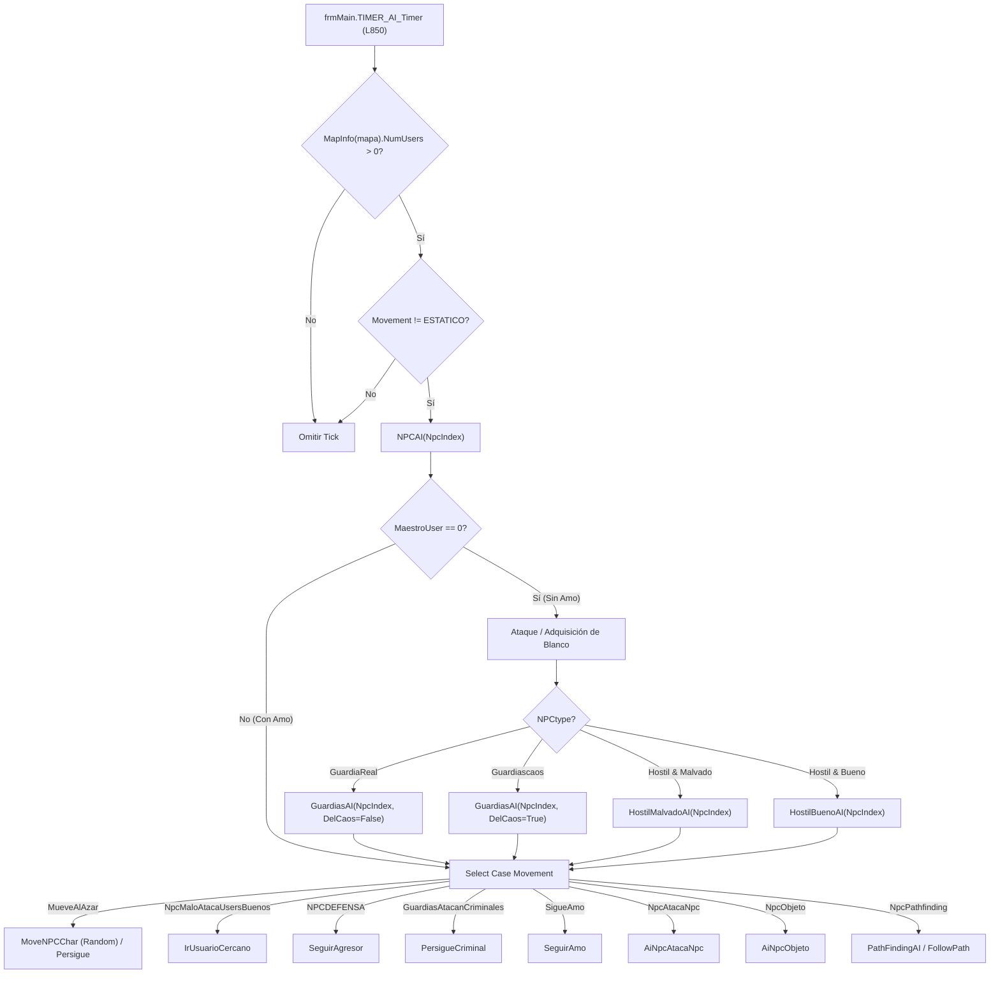

# Auditoría Técnica — Módulo #29: `AI_NPC.bas`

**Macro-Área**: Área 13 — Criaturas e IA  
**Ubicación Legacy**: `legacy/server/Codigo/AI_NPC.bas`  
**Mapeo C++ Futuro**: `src/server/ai/NpcAI.hpp` / `src/server/ai/NpcAI.cpp` (Capa 8)  
**Estado**: Documentado / Investigación Técnica de Desacoplamiento Completa  

---

## 1. Resumen Ejecutivo y Catálogo de Procedimientos

El módulo `AI_NPC.bas` (1.069 líneas de código en VB6) implementa el motor central de toma de decisiones, adquisición de blancos, movimiento táctico, casteo de hechizos, persecución y patrullaje para todas las criaturas y NPCs del juego. 

Es invocado periódicamente desde el loop de servidor (`TIMER_AI_Timer` en `legacy/server/Codigo/frmMain.frm`, L850) únicamente para NPCs activos pertenecientes a mapas donde habita al menos un usuario (`MapInfo(mapa).NumUsers > 0`) y cuyo tipo de movimiento no sea `TipoAI.ESTATICO` (1).

### Enum `TipoAI` (`legacy/server/Codigo/AI_NPC.bas`, L41-57)

| Valor | Constante | Descripción |
| :---: | :--- | :--- |
| `1` | `ESTATICO` | El NPC permanece inmóvil y no ejecuta decisiones periódicas de IA. |
| `2` | `MueveAlAzar` | Movimiento errático aleatorio. En guardias activa persecución de facción opuesta. |
| `3` | `NpcMaloAtacaUsersBuenos` | Hostilidad activa hacia todos los usuarios no criminales ni protegidos. |
| `4` | `NPCDEFENSA` | Comportamiento defensivo (sigue y ataca únicamente al agresor registrado en `AttackedBy`). |
| `5` | `GuardiasAtacanCriminales` | Persecución dedicada de criminales (Guardias Reales). |
| `6` | `NpcObjeto` | IA estática/objeto (ej. estatuas/trampas que lanzan conjuros al azar). |
| `8` | `SigueAmo` | IA de mascotas o criaturas invocadas (sigue al `MaestroUser` si está > 3 tiles). |
| `9` | `NpcAtacaNpc` | IA de combate focalizado entre NPCs (combates de criaturas o invocaciones). |
| `10` | `NpcPathfinding` | Persecución mediante búsqueda de caminos (BFS / Pathfinding). |
| `20-24` | Pretorianos | `SacerdotePretorianoAi`, `GuerreroPretorianoAi`, `MagoPretorianoAi`, `CazadorPretorianoAi`, `ReyPretoriano`. Manejados por `praetorians.bas`. |

### Catálogo Completo de Procedimientos (`AI_NPC.bas`)

| Procedimiento | Visibilidad | Tipo | Líneas VB6 | Firma / Parámetros | Propósito y Comportamiento |
| :--- | :---: | :---: | :---: | :--- | :--- |
| `GuardiasAI` | `Private` | `Sub` | L71-135 | `(NpcIndex As Integer, DelCaos As Boolean)` | Revisa las 4 direcciones adyacentes. Si halla un usuario no protegido, ataca si cumple la condición de facción (criminales para Real, ciudadanos para Caos) o si es su agresor. |
| `HostilMalvadoAI` | `Private` | `Sub` | L137-208 | `(NpcIndex As Integer)` | Escanea las 4 direcciones adyacentes. Ataca a usuarios no protegidos o a criaturas de usuarios. Si posee hechizos, tiene 50% de probabilidad de lanzar spell. |
| `HostilBuenoAI` | `Private` | `Sub` | L210-253 | `(NpcIndex As Integer)` | Escanea las 4 direcciones adyacentes. Ataca únicamente al usuario que figure en `.flags.AttackedBy`. |
| `IrUsuarioCercano` | `Private` | `Sub` | L255-379 | `(NpcIndex As Integer)` | Busca usuarios en la cuadrícula de visión (`8x6`). Prioriza al `Owner` si existe. Si el NPC está inmovilizado, restringe el escaneo a su orientación actual. |
| `SeguirAgresor` | `Private` | `Sub` | L381-498 | `(NpcIndex As Integer)` | Sigue y ataca al agresor guardado en `.flags.AttackedBy`. Incluye regla de mascotas para dueños reales/seguro activado contra ciudadanos. |
| `RestoreOldMovement` | `Private` | `Sub` | L500-508 | `(NpcIndex As Integer)` | Restablece `.Movement` y `.Hostile` a sus valores originales (`OldMovement`/`OldHostil`) si el NPC no tiene amo. |
| `PersigueCiudadano` | `Private` | `Sub` | L510-554 | `(NpcIndex As Integer)` | Recorre usuarios en la zona de visión y avanza hacia ciudadanos no protegidos (usado por Guardias del Caos). |
| `PersigueCriminal` | `Private` | `Sub` | L556-650 | `(NpcIndex As Integer)` | Recorre usuarios en la zona de visión y avanza hacia criminales (usado por Guardias Reales). |
| `SeguirAmo` | `Private` | `Sub` | L652-685 | `(NpcIndex As Integer)` | Si no posee blanco (`Target = 0` y `TargetNPC = 0`), camina hacia `MaestroUser` cuando la distancia es mayor a 3 baldosas. |
| `AiNpcAtacaNpc` | `Private` | `Sub` | L687-789 | `(NpcIndex As Integer)` | Gestiona combate entre NPCs. Soporta interacción especial entre Elemental de Fuego (`93`) y Dragón (`13`). |
| `AiNpcObjeto` | `Public` | `Sub` | L791-834 | `(NpcIndex As Integer)` | IA para objetos/estatuas. Evalúa usuarios en rango y tiene probabilidad (2/3) de lanzar conjuros a blancos válidos. |
| `NPCAI` | Implicit `Public` | `Sub` | L836-941 | `(NpcIndex As Integer)` | **Rutina maestra periódica.** Evalúa adquisición de blanco y despacha el movimiento/acción según `.Movement`. Contiene `ErrorHandler` destructivo. |
| `UserNear` | Implicit `Public` | `Function` | L943-954 | `(NpcIndex As Integer) As Boolean` | Retorna `True` si el usuario objetivo del pathfinding está adyacente (distancia <= 1). |
| `ReCalculatePath` | Implicit `Public` | `Function` | L956-968 | `(NpcIndex As Integer) As Boolean` | Determina si es necesario volver a calcular la ruta BFS para el NPC (`PathLenght == 0` o posición de destino desactualizada). |
| `PathEnd` | Implicit `Public` | `Function` | L970-977 | `(NpcIndex As Integer) As Boolean` | Retorna `True` cuando la posición actual en la ruta coincide con la longitud total (`CurPos == PathLenght`). |
| `FollowPath` | Implicit `Public` | `Function` | L979-1001 | `(NpcIndex As Integer) As Boolean` | Avanza un paso en la grilla siguiendo el arreglo de puntos `PFINFO.Path`. |
| `PathFindingAI` | Implicit `Public` | `Function` | L1003-1042 | `(NpcIndex As Integer) As Boolean` | Busca un usuario en un área de 10x10 baldosas e invoca a `SeekPath` (Módulo #27). Invierte coordenadas X/Y al setear el `Target`. |
| `NpcLanzaUnSpell` | Implicit `Public` | `Sub` | L1044-1057 | `(NpcIndex As Integer, UserIndex As Integer)` | Elige un hechizo al azar de la lista del NPC (`Spells()`) y lo ejecuta sobre el usuario indicado. |
| `NpcLanzaUnSpellSobreNpc` | Implicit `Public` | `Sub` | L1059-1069 | `(NpcIndex As Integer, TargetNPC As Integer)` | Elige un hechizo al azar de la lista del NPC (`Spells()`) y lo ejecuta sobre el NPC objetivo. |

---

## 2. Flujo de Ejecución de `NPCAI` y Ciclo Periódico



---

## 3. Frontera de Desacoplamiento y Mapa de Dependencias

Para mantener la arquitectura por capas desacoplada sin violar la independencia del motor de IA C++, se identifican las siguientes interacciones con módulos de la misma capa o capas inferiores/superiores:

### Módulos Ya Migrados (Capas 1 a 7)

1. **`PathFinding` (Módulo #27)**:
   - Utiliza la estructura `PFINFO` embebida en el NPC.
   - Invoca `SeekPath(NpcIndex)` (`AI_NPC.bas`, L1036) para calcular rutas BFS deterministas en la grilla.
2. **`MODULO_NPCs` (Módulo #28)**:
   - Lectura/Escritura del arreglo `Npclist(NpcIndex)`.
   - Invocaciones directas a `MoveNPCChar`, `ChangeNPCChar`, `QuitarNPC`, `ReSpawnNpc`, `FollowAmo`, `EfectoParalisisNpc`, `MuereNpc`.
3. **`SistemaCombate` (Módulo #22)**:
   - Invocación de ataques cuerpo a cuerpo: `NpcAtacaUser(NpcIndex, UI)` (`AI_NPC.bas`, L96, L195, L239, L433, L476) y `SistemaCombate.NpcAtacaNpc(NpcIndex, NI)` (`AI_NPC.bas`, L189, L725).
4. **`modHechizos` (Módulo #23)**:
   - Lanzamiento de magia: `NpcLanzaSpellSobreUser(NpcIndex, UserIndex, SpellID)` (`AI_NPC.bas`, L1056) y `NpcLanzaSpellSobreNpc(NpcIndex, TargetNPC, SpellID)` (`AI_NPC.bas`, L1068).
5. **`ModAreas` (Módulo #17)**:
   - Optimización de escaneo de usuarios en el mapa mediante `ModAreas.ConnGroups(Map).UserEntrys(i)` y `CountEntrys` (`AI_NPC.bas`, L286, L332, L405, L448, L516, L577, L608, L798).

### Módulos y Capas No Migradas (Dependencias Salientes / Capas 9+)

- **`UserList` (Capa 9 - Entidad Usuario)**: Acceso directo a propiedades de usuarios (`Pos`, `flags.Muerto`, `flags.invisible`, `flags.Oculto`, `flags.AdminPerseguible`, `flags.NoPuedeSerAtacado`, `flags.Ignorado`, `flags.EnConsulta`, `flags.Seguro`, `Faccion.ArmadaReal`).
- **Alineamiento y Estado Criminal**: Invocación a la función global `criminal(UI)`.
- **Intervalos de Combate**: Invocación a `IntervaloPermiteSerAtacado(UI)`.
- **Protocolo y Red (Capa 2)**: Invocación a `WriteConsoleMsg` y `FlushBuffer` para mensajes al amo.
- **Sistema de Logs / Mapas**: Invocación a `LogError`, `RandomNumber`, `FindDirection`, `HeadtoPos`, `InMapBounds`, `Distancia` y acceso a `MapData(Map, X, Y).UserIndex` / `NpcIndex`.

---

## 4. Máquina de Estados, Adquisición de Blancos y Reglas de Criaturas

### 4.1. Reglas de Inmunidad y Selección de Blanco

Antes de que un NPC intente atacar o perseguir a un usuario, valida de forma acumulativa la condición `UserProtected` (`AI_NPC.bas`, L87-88, L148-149, L227-228, L294-295, L340-341, L521-522, L584-585, L615-616, L804):

```vb
UserProtected = Not IntervaloPermiteSerAtacado(UI) And UserList(UI).flags.NoPuedeSerAtacado
UserProtected = UserProtected Or UserList(UI).flags.Ignorado Or UserList(UI).flags.EnConsulta
```

Un usuario es **omitido como blanco** si se cumple cualquiera de las siguientes condiciones:
1. Está muerto (`UserList(UI).flags.Muerto <> 0`).
2. Está invisible u oculto (`flags.invisible <> 0` o `flags.Oculto <> 0`), salvo en escaneos cuerpo a cuerpo adyacentes donde no aplique.
3. No es admisible por administración (`flags.AdminPerseguible == 0`).
4. Posee protección activa de intervalo o flag de consulta/ignorado (`UserProtected == True`).

### 4.2. Comportamiento de Mascotas e Invocaciones (`MaestroUser` / `Owner`)

- **Prioridad de Persecución**: Si un NPC tiene `Owner > 0` y este se encuentra dentro del rango visual (`RANGO_VISION_X` = 8, `RANGO_VISION_Y` = 6) y no está invisible ni en consulta, la IA prioriza avanzar hacia su amo antes que seguir a extraños (`AI_NPC.bas`, L308-327).
- **Control de Furia / Seguro de Mascotas**: En `SeguirAgresor` (`AI_NPC.bas`, L413-421, L456-464), si la mascota pertenece a un usuario no criminal con el seguro activado o perteneciente a la Armada Real, y su agresor registrado (`AttackedBy`) no es criminal:
  - La mascota se niega a atacar al ciudadano.
  - Se envía un mensaje al dueño: *"La mascota no atacará a ciudadanos si eres miembro del ejército real o tienes el seguro activado."*
  - Se limpia la bandera `.flags.AttackedBy = vbNullString` y la mascota vuelve a seguir al amo (`FollowAmo`).

---

## 5. Quirks Históricos, Asimetrías y Posibles Bugs Identificados

### 1. Inversión Histórica de Coordenadas X/Y en Pathfinding (`'ops!`)
En `PathFindingAI` (`AI_NPC.bas`, L1033-1034) y `FollowPath` (`AI_NPC.bas`, L986-987), el código invierte explícitamente las coordenadas $X$ e $Y$:
```vb
' AI_NPC.bas:1033-1034
Npclist(NpcIndex).PFINFO.Target.X = .Pos.Y
Npclist(NpcIndex).PFINFO.Target.Y = .Pos.X 'ops!
```
```vb
' AI_NPC.bas:986-987
tmpPos.X = .PFINFO.Path(.PFINFO.CurPos).Y ' invertí las coordenadas
tmpPos.Y = .PFINFO.Path(.PFINFO.CurPos).X
```
**Causa**: ORE (Online RPG Engine original) manejaba las grillas de mapa en orden inverso $(Y, X)$ respecto al algoritmo BFS implementado en VB6.

### 2. Hardcode de Números de NPC (Identificadores Mágicos)
El módulo contiene constantes numéricas acopladas a números específicos de NPC en archivos `.dat`:
- `ELEMENTALAGUA = 92`: En `SeguirAgresor` (L431, L474), el código tiene la condición `If Npclist(NpcIndex).Numero <> 92 Then Call NpcAtacaUser(NpcIndex, UI)`. El Elemental de Agua no realiza ataque melee directo al seguir agresores.
- `ELEMENTALFUEGO = 93` y `DRAGON = 13`: En `AiNpcAtacaNpc` (L721-726), si un Elemental de Fuego ataca a un Dragón, le spamea conjuros y fuerza `Npclist(NI).CanAttack = 1` en el Dragón para provocar contraataque mágico instantáneo.

### 3. Error de Precedencia y Casting en `UserNear`
En `UserNear` (`AI_NPC.bas`, L950-951):
```vb
UserNear = Not Int(Distance(.Pos.X, .Pos.Y, UserList(.PFINFO.TargetUser).Pos.X, _
            UserList(.PFINFO.TargetUser).Pos.Y)) > 1
```
En VB6, el operador `Not` sobre un entero realiza una operación NOT bit a bit en lugar de una negación lógica booleana, lo que sumado a la precedencia de `>` causa un comportamiento errático cuando la distancia es flotante.

### 4. Recalculo de Trayectoria y Movimiento Aleatorio por Bloqueo (`NoPath`)
Cuando `PathFindingAI` no encuentra una ruta hacia el usuario objetivo (`.PFINFO.NoPath == True`), el NPC ejecuta `MoveNPCChar(NpcIndex, RandomNumber(eHeading.NORTH, eHeading.WEST))` (`AI_NPC.bas`, L923). Si la casilla aleatoria elegida está bloqueada, el NPC permanece estancado recalculando BFS en cada tick del timer.

### 5. `ErrorHandler` Destructivo en `NPCAI`
Si ocurre cualquier excepción no capturada durante el tick de IA (`AI_NPC.bas`, L936-940):
```vb
ErrorHandler:
    Call LogError(...)
    Dim MiNPC As npc
    MiNPC = Npclist(NpcIndex)
    Call QuitarNPC(NpcIndex)
    Call ReSpawnNpc(MiNPC)
```
En lugar de ignorar la iteración defectuosa o restablecer el estado del NPC, el manejador de errores elimina completamente al NPC del mapa y fuerza un respawn inmediato (`ReSpawnNpc`), lo que puede causar clonaciones o duplicaciones de drops en escenarios de inconsistencia.

---

## 6. Conclusión y Plan de Desacoplamiento C++

La migración a C++ (Módulo #29) requerirá abstraer la interfaz de la IA mediante un patrón de observador o callbacks (`NpcWorldContext` / `UserProvider`), evitando dependencias directas a `UserList` o `MapData`. Toda la lógica de pathfinding continuará delegándose al motor determinista portado en el Módulo #27 (`PathFinding`).
