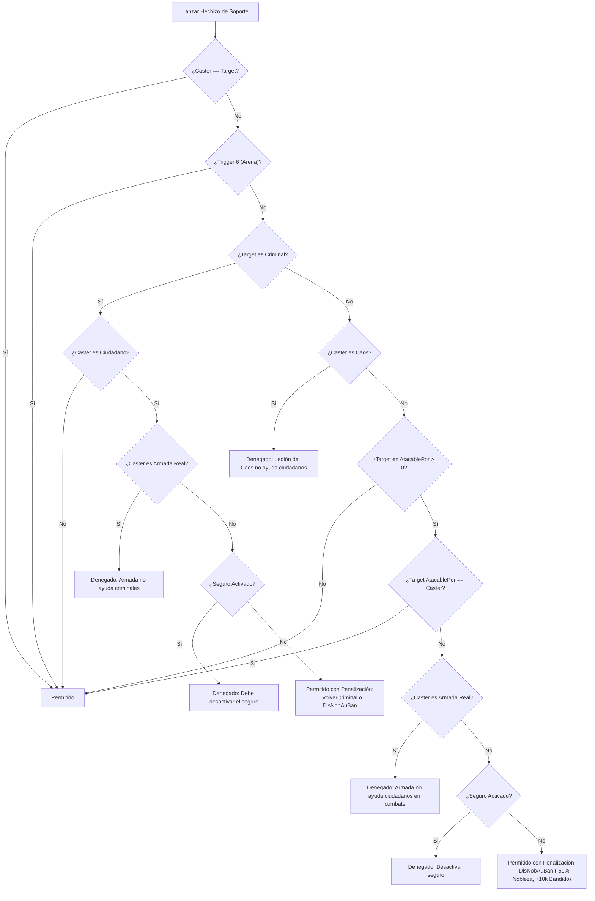

# Auditoría Técnica Exhaustiva — Módulo #23: `modHechizos.bas` (Capa 7)

Este documento contiene la investigación y auditoría técnica detallada del subsistema de magia y lanzamiento de hechizos original en Visual Basic 6 de Argentum Online v0.13.0, correspondiente a `legacy/server/Codigo/modHechizos.bas` y sus puntos de contacto en el servidor original.

---

## 1. Identificación del Módulo y Metadatos

- **Archivo Fuente Principal**: `legacy/server/Codigo/modHechizos.bas` (2.087 líneas de código fuente VB6).
- **Capa Arquitectónica**: Capa 7 (Subsistemas Core y Dominio Especializado).
- **Archivos de Dominio Asociados**:
  - `legacy/server/Codigo/Declares.bas`: Tipos `tHechizo`, enumeraciones `TipoHechizo`, `TargetType`, constantes de inventario de hechizos y elementos mágicos.
  - `legacy/server/Codigo/FileIO.bas`: Rutina `CargarHechizos` (`FileIO.bas:212-352`), deserialización de `Hechizos.dat`.
  - `legacy/server/Codigo/Protocol.bas`: Rutinas receptoras de red `HandleCastSpell` (`Protocol.bas:2489-2526`) y selector de casteo por click (`Protocol.bas:2997-3033`).
  - `legacy/server/Codigo/SistemaCombate.bas`: Reglas de ataque `PuedeAtacar`, `PuedeAtacarNPC`, `UsuarioAtacadoPorUsuario`, `NPCAtacado`, `TriggerZonaPelea` y constante `MAXDISTANCIAMAGIA`.
  - `legacy/server/Codigo/Matematicas.bas`: Función auxiliar `Porcentaje` (`Matematicas.bas:32-40`).
  - `legacy/server/Dat/Hechizos.dat`: Base de datos declarativa INI con 46 conjuros oficiales.

---

## 2. Catálogo de Procedimientos y Estructuras

### 2.1. Catálogo Completo de Subrutinas y Funciones

El archivo `legacy/server/Codigo/modHechizos.bas` declara 22 procedimientos (18 `Sub` y 4 `Function`):

| # | Procedimiento / Firma Exacta | Visibilidad | Líneas Legacy | Propósito y Comportamiento Observable |
| :-: | :--- | :---: | :---: | :--- |
| 1 | `Sub NpcLanzaSpellSobreUser(ByVal NpcIndex As Integer, ByVal UserIndex As Integer, ByVal Spell As Integer)` | Amigable/Módulo | 36–150 | Resuelve el casteo de un hechizo ofensivo o curativo desde una criatura NPC hacia un usuario. Aplica daño o cura de HP, efectos de parálisis/inmovilización y aturdimiento (estupidez), evaluando protecciones antimagia e inmunidades. |
| 2 | `Sub NpcLanzaSpellSobreNpc(ByVal NpcIndex As Integer, ByVal TargetNPC As Integer, ByVal Spell As Integer)` | Amigable/Módulo | 151–186 | Resuelve ataques mágicos ofensivos entre criaturas NPC (`SubeHP = 2`), descontando vida y disparando la muerte del NPC víctima (`MuereNpc`). |
| 3 | `Function TieneHechizo(ByVal i As Integer, ByVal UserIndex As Integer) As Boolean` | Amigable/Módulo | 187–208 | Itera las 35 ranuras de `UserHechizos` del usuario (`1 To MAXUSERHECHIZOS`) para verificar si ya posee aprendido el hechizo indicado. |
| 4 | `Sub AgregarHechizo(ByVal UserIndex As Integer, ByVal Slot As Integer)` | Amigable/Módulo | 209–242 | Aprende un hechizo desde un pergamino del inventario: verifica si ya lo tiene, localiza el primer slot libre en `UserHechizos`, lo asigna, actualiza el cliente mediante `UpdateUserHechizos` y retira el pergamino con `QuitarUserInvItem`. |
| 5 | `Sub DecirPalabrasMagicas(ByVal SpellWords As String, ByVal UserIndex As Integer)` | Amigable/Módulo | 243–269 | Emite las palabras mágicas del conjuro en texto overhead cian sobre el personaje en su área de visión (`ToPCArea`). Si el usuario estaba oculto (`flags.Oculto = 1`), revela su visibilidad forzosa (excepto administradores invisibles). |
| 6 | `Function PuedeLanzar(ByVal UserIndex As Integer, ByVal HechizoIndex As Integer) As Boolean` | Amigable/Módulo | 276–360 | Validador canónico de prerrequisitos de casteo: verifica si el personaje está vivo, si posee báculo equipado y poder suficiente (Mago), skill de Magia requerido, estamina requerida, y maná suficiente (computando bonos de Druida con Flauta Élfica). |
| 7 | `Sub HechizoTerrenoEstado(ByVal UserIndex As Integer, ByRef b As Boolean)` | Amigable/Módulo | 361–401 | Aplica efectos de área sobre coordenadas de terreno. En 0.13.0 procesa `RemueveInvisibilidadParcial`, escaneando una matriz de 17x17 celdas (`±8` tiles) alrededor de la casilla objetivo para disparar el FX en usuarios invisibles. |
| 8 | `Sub HechizoInvocacion(ByVal UserIndex As Integer, ByRef HechizoCasteado As Boolean)` | Amigable/Módulo | 408–491 | Ejecuta la invocación mágica: si `Warp = 1`, teletransporta a la mascota más alejada (`WarpMascota(FarthestPet)`); si es invocación regular, invoca hasta `cant` criaturas aliadas (`SpawnNpc`) con temporizador `IntervaloInvocacion`, asignando `MaestroUser` y control de mascotas (`MAXMASCOTAS`). |
| 9 | `Sub HandleHechizoTerreno(ByVal UserIndex As Integer, ByVal SpellIndex As Integer)` | Amigable/Módulo | 492–544 | Despachador de hechizos cuyo objetivo es una celda del mapa (`TargetType.uTerreno`): bifurca entre `uInvocacion` y `uEstado`, incrementa el skill de Magia (`SubirSkill`), deduce maná (o consume la totalidad de la reserva en warp) y descuenta estamina. |
| 10 | `Sub HandleHechizoUsuario(ByVal UserIndex As Integer, ByVal SpellIndex As Integer)` | Amigable/Módulo | 545–603 | Despachador de conjuros dirigidos a un personaje (`TargetType.uUsuarios`): bifurca entre `uEstado` (`HechizoEstadoUsuario`) y `uPropiedades` (`HechizoPropUsuario`), incrementa skill de Magia, deduce costos de maná/estamina con bonificaciones y sincroniza estadísticas. |
| 11 | `Sub HandleHechizoNPC(ByVal UserIndex As Integer, ByVal HechizoIndex As Integer)` | Amigable/Módulo | 604–668 | Despachador de conjuros dirigidos a criaturas (`TargetType.uNPC`): bifurca entre `uEstado` (`HechizoEstadoNPC`) y `uPropiedades` (`HechizoPropNPC`), descuenta recursos, aplica bonos de Druida y setea la flag de visibilidad/hostilidad `Ignorado`. |
| 12 | `Sub LanzarHechizo(ByVal SpellIndex As Integer, ByVal UserIndex As Integer)` | Amigable/Módulo | 670–749 | Punto de entrada neurálgico del casteo: valida consultas ciudadanas (`flags.EnConsulta`), ejecuta `PuedeLanzar`, valida la distancia de visión vertical (`RANGO_VISION_Y`) respecto al target, deriva al manejador correspondiente según `TargetType` y decrementa contadores de trabajo y ocultamiento. |
| 13 | `Sub HechizoEstadoUsuario(ByVal UserIndex As Integer, ByRef HechizoCasteado As Boolean)` | Amigable/Módulo | 750–1170 | Aplica modificaciones de estado sobre un usuario: Invisibilidad, Mimetismo, Envenenamiento, Cura de Veneno, Maldición, Bendición, Parálisis, Inmovilización, Remoción de Parálisis, Remoción de Estupidez, Resurrección, Ceguera y Estupidez. |
| 14 | `Sub HechizoEstadoNPC(ByVal NpcIndex As Integer, ByVal SpellIndex As Integer, ByRef HechizoCasteado As Boolean, ByVal UserIndex As Integer)` | Amigable/Módulo | 1171–1353 | Aplica modificaciones de estado sobre una criatura NPC: Invisibilidad, Envenenamiento, Cura de Veneno, Maldición, Bendición, Parálisis (verificando `AfectaParalisis`), Remoción de Parálisis (mascotas o guardias faccionarios) y Mimetismo exclusivo de Druida. |
| 15 | `Sub HechizoPropNPC(ByVal SpellIndex As Integer, ByVal NpcIndex As Integer, ByVal UserIndex As Integer, ByRef HechizoCasteado As Boolean)` | Amigable/Módulo | 1354–1424 | Aplica curación (`SubeHP = 1`) o daño mágico (`SubeHP = 2`) sobre una criatura NPC. Calcula escalado por nivel (`ELV`), bonificaciones de báculos y laúdes élficos, mitigación por defensa mágica del NPC (`defM`), reparto de experiencia (`CalcularDarExp`) y muerte (`MuereNpc`). |
| 16 | `Sub InfoHechizo(ByVal UserIndex As Integer)` | Amigable/Módulo | 1425–1474 | Notifica los efectos audiovisuales y mensajes de combate del hechizo: invoca `DecirPalabrasMagicas`, transmite los paquetes de animación gráfica (`CreateFX`) y sonido (`PlayWave`), y envía los mensajes de consola personalizados (`HechizeroMsg`, `TargetMsg`, `PropioMsg`). |
| 17 | `Public Function HechizoPropUsuario(ByVal UserIndex As Integer) As Boolean` | Pública | 1475–1863 | Resuelve alteraciones de atributos y estadísticas sobre un usuario: Hambre (`SubeHam`), Sed (`SubeSed`), Agilidad (`SubeAgilidad`), Fuerza (`SubeFuerza`), Curación (`SubeHP = 1`), Daño Mágico directo (`SubeHP = 2`), Maná (`SubeMana`) y Estamina (`SubeSta`). |
| 18 | `Public Function CanSupportUser(ByVal CasterIndex As Integer, ByVal TargetIndex As Integer, Optional ByVal DoCriminal As Boolean = False) As Boolean` | Pública | 1864–1965 | Matriz moral y legal de soporte: determina si un lanzador puede aplicar conjuros beneficiosos sobre otro usuario, evaluando arenas (Trigger 6), alineamientos morales (Ciudadano vs Criminal), membresía faccionaria (Armada Real vs Caos), estado de legítima defensa (`flags.AtacablePor`) y el seguro de combate. |
| 19 | `Sub UpdateUserHechizos(ByVal UpdateAll As Boolean, ByVal UserIndex As Integer, ByVal Slot As Byte)` | Amigable/Módulo | 1966–1998 | Sincroniza las ranuras del libro de hechizos hacia el cliente, despachando un slot particular o iterando los 35 slots (`MAXUSERHECHIZOS`). |
| 20 | `Sub ChangeUserHechizo(ByVal UserIndex As Integer, ByVal Slot As Byte, ByVal Hechizo As Integer)` | Amigable/Módulo | 1999–2016 | Actualiza la ranura en el array de memoria del personaje y despacha el paquete binario `WriteChangeSpellSlot` al cliente. |
| 21 | `Public Sub DesplazarHechizo(ByVal UserIndex As Integer, ByVal Dire As Integer, ByVal HechizoDesplazado As Integer)` | Pública | 2017–2052 | Reordena las ranuras del libro de hechizos desplazando un conjuro hacia arriba (`Dire = 1`) o hacia abajo (`Dire = -1`), intercambiando valores contiguos en `Stats.UserHechizos`. |
| 22 | `Public Sub DisNobAuBan(ByVal UserIndex As Integer, NoblePts As Long, BandidoPts As Long)` | Pública | 2053–2087 | Aplica penalización moral al personaje: decrementa puntos de Nobleza (`NobleRep`) e incrementa puntos de Bandido (`BandidoRep`). Si cae en criminalidad, expulsa al personaje de la Armada Real (`ExpulsarFaccionReal`) y actualiza su estado. |

---

### 2.2. Estructuras de Datos y Modelado en Memoria

#### Estructura `tHechizo` (`legacy/server/Codigo/Declares.bas:576-660`)
```vb
Public Type tHechizo
    Nombre As String
    desc As String
    PalabrasMagicas As String
    
    HechizeroMsg As String
    TargetMsg As String
    PropioMsg As String
    
    ' Resis As Byte  (Comentado en legacy)
    
    Tipo As TipoHechizo
    
    WAV As Integer
    FXgrh As Integer
    loops As Byte
    
    SubeHP As Byte
    MinHp As Integer
    MaxHp As Integer
    
    SubeMana As Byte
    MiMana As Integer
    MaMana As Integer
    
    SubeSta As Byte
    MinSta As Integer
    MaxSta As Integer
    
    SubeHam As Byte
    MinHam As Integer
    MaxHam As Integer
    
    SubeSed As Byte
    MinSed As Integer
    MaxSed As Integer
    
    SubeAgilidad As Byte
    MinAgilidad As Integer
    MaxAgilidad As Integer
    
    SubeFuerza As Byte
    MinFuerza As Integer
    MaxFuerza As Integer
    
    SubeCarisma As Byte
    MinCarisma As Integer
    MaxCarisma As Integer
    
    Invisibilidad As Byte
    Paraliza As Byte
    Inmoviliza As Byte
    RemoverParalisis As Byte
    RemoverEstupidez As Byte
    CuraVeneno As Byte
    Envenena As Byte
    Maldicion As Byte
    RemoverMaldicion As Byte
    Bendicion As Byte
    Estupidez As Byte
    Ceguera As Byte
    Revivir As Byte
    Morph As Byte
    Mimetiza As Byte
    RemueveInvisibilidadParcial As Byte
    
    Warp As Byte
    Invoca As Byte
    NumNpc As Integer
    cant As Integer

    ' Materializa As Byte (Comentado en legacy)
    ' ItemIndex As Byte   (Comentado en legacy)
    
    MinSkill As Integer
    ManaRequerido As Integer
    StaRequerido As Integer

    Target As TargetType
    
    NeedStaff As Integer
    StaffAffected As Boolean
End Type
```

#### Enumeradores Asociados
1. **`TipoHechizo`** (`Declares.bas:235-240`):
   - `uPropiedades = 1`: Hechizos cuantitativos que alteran puntos vitales o atributos (HP, Maná, Estamina, Hambre, Sed, Fuerza, Agilidad).
   - `uEstado = 2`: Hechizos cualitativos que imponen o remueven estados alterados (Parálisis, Invisibilidad, Veneno, Ceguera, Estupidez, etc.).
   - `uMaterializa = 3`: No implementado / reservado en legacy.
   - `uInvocacion = 4`: Hechizos de creación o invocación de criaturas / mascotas.
2. **`TargetType`** (`Declares.bas:227-232`):
   - `uUsuarios = 1`: Solo aplicable sobre personajes jugadores.
   - `uNPC = 2`: Solo aplicable sobre criaturas no-jugadoras.
   - `uUsuariosYnpc = 3`: Aplicable indistintamente sobre usuarios y criaturas.
   - `uTerreno = 4`: Aplicable sobre coordenadas de una celda del mapa.

#### Constantes Notables del Sistema
- `MAXUSERHECHIZOS = 35` (`Declares.bas:242`): Capacidad del libro de hechizos por personaje.
- `SUPERANILLO = 700` (`modHechizos.bas:34`): Objeto mágico que otorga inmunidad absoluta a estados de parálisis y estupidez.
- `APOCALIPSIS_SPELL_INDEX = 25` (`Declares.bas:162`): Índice del conjuro insignia ofensivo del juego, excluido de ciertas bonificaciones porcentuales.
- `LAUDMAGICO = 696`, `LAUDELFICO = 1049`, `FLAUTAMAGICA = 208`, `FLAUTAELFICA = 1050` (`Declares.bas:156-160`): Instrumentos musicales que potencian la magia o habilitan conjuros especiales en Bardos y Druidas.
- `HELEMENTAL_FUEGO = 26`, `HELEMENTAL_TIERRA = 28` (`modHechizos.bas:32-33`): Constantes huérfanas no utilizadas en el código.
- `MAXDISTANCIAMAGIA = 18` (`SistemaCombate.bas:41`): Constante desvinculada no evaluada en `modHechizos.bas`.

---

## 3. Mapeo de Tipos de Conjuros, Fórmulas y Verificaciones

### 3.1. Ciclo de Lanzamiento de Hechizos

El flujo de ejecución de un conjuro consta de dos fases asíncronas comandadas por paquetes del cliente:
1. **Petición de Casteo (`CastSpell`)**:
   - Recibida en `Protocol.bas:2489` (`HandleCastSpell`), recibe el slot del libro (1..35).
   - Valida que el personaje no esté muerto y quita la protección de invulnerabilidad temporal (`flags.NoPuedeSerAtacado = False`).
   - Setea `.flags.Hechizo = .Stats.UserHechizos(Spell)`.
2. **Confirmación por Click o Acción (`Work` con `eSkill.Magia`)**:
   - En `Protocol.bas:2997-3033`, el cliente envía coordenadas `(X, Y)` o target.
   - Comprueba `MapInfo.MagiaSinEfecto > 0`.
   - Valida distancia mediante `LookatTile`: evalúa `Abs(.Pos.X - X) > RANGO_VISION_X Or Abs(.Pos.Y - Y) > RANGO_VISION_Y`.
   - Valida intervalos de acción:
     - `IntervaloPermiteUsarArcos(UserIndex, False)`.
     - `IntervaloPermiteGolpeMagia(UserIndex)` e `IntervaloPermiteLanzarSpell(UserIndex)`.
   - Invoca `LanzarHechizo(.flags.Hechizo, UserIndex)` y limpia `.flags.Hechizo = 0`.

### 3.2. Validaciones Previas en `PuedeLanzar` (`modHechizos.bas:276-360`)

Antes de consumir recursos o proyectar efectos, `PuedeLanzar` corrobora:
- **Estado Vital**: Si `.flags.Muerto = 1`, aborta inmediatamente.
- **Requisito de Báculo (Mago)**: Si `NeedStaff > 0` y la clase es `eClass.Mage`, exige tener un arma equipada cuyo `StaffPower >= NeedStaff`.
- **Habilidad Mágica**: Exige `.Stats.UserSkills(eSkill.Magia) >= Hechizos(H).MinSkill`.
- **Reserva de Energía**: Exige `.Stats.MinSta >= Hechizos(H).StaRequerido`.
- **Bonificaciones de Maná para Druidas**:
  - Si la clase es `eClass.Druid` y posee equipada la `FLAUTAELFICA`:
    - Mimetismo (`Mimetiza = 1`): Reduce el costo de maná al 50% (`DruidManaBonus = 0.5`).
    - Invocaciones (`Tipo = uInvocacion`): Reduce el costo de maná al 70% (`DruidManaBonus = 0.7`).
    - Otras magias excepto Apocalipsis (`H <> 25`): Reduce el costo de maná al 90% (`DruidManaBonus = 0.9`).
  - Si el conjuro es `Warp = 1` (teletransporte de mascotas), el Druida debe poseer la totalidad de su barra de maná (`MinMAN == MaxMAN`) y al menos una mascota activa (`NroMascotas > 0`).
- **Reserva de Maná**: Exige `.Stats.MinMAN >= Hechizos(H).ManaRequerido * DruidManaBonus`.

---

### 3.3. Fórmulas de Daño y Curación Mágicos

#### Fórmulas de Curación (`SubeHP = 1`)
- **Usuario a Usuario** (`modHechizos.bas:1687-1688`):
  $$\text{CuraciónBase} = \text{RandomNumber}(\text{MinHp}, \text{MaxHp})$$
  $$\text{CuraciónFinal} = \text{CuraciónBase} + \left\lfloor \frac{\text{CuraciónBase} \times (3 \times \text{ELV})}{100} \right\rfloor$$
  Capado superior a `.Stats.MaxHp`.
- **Usuario a Criatura NPC** (`modHechizos.bas:1367-1368`):
  Aplica exactamente la misma fórmula de escalado por nivel del usuario.
- **Criatura NPC a Usuario** (`modHechizos.bas:54`):
  $$\text{Curación} = \text{RandomNumber}(\text{MinHp}, \text{MaxHp})$$
  *(Nota: El servidor padece un defecto en el mensaje de consola, indicando que "te ha quitado X puntos de vida" al curar).*

#### Fórmulas de Daño Mágico Directo (`SubeHP = 2`)
- **Usuario a Usuario (PvP)** (`modHechizos.bas:1713-1741`):
  1. *Daño Base con Escalado de Nivel*:
     $$\text{Daño}_1 = \text{RandomNumber}(\text{MinHp}, \text{MaxHp}) + \left\lfloor \frac{\text{RandomNumber}(\text{MinHp}, \text{MaxHp}) \times (3 \times \text{ELV})}{100} \right\rfloor$$
  2. *Modificador de Báculo de Mago* (solo si `StaffAffected = True` y `clase == Mage`):
     - Con báculo equipado: $\text{Daño}_2 = \left\lfloor \frac{\text{Daño}_1 \times (\text{StaffDamageBonus} + 70)}{100} \right\rfloor$
     - Sin báculo equipado: $\text{Daño}_2 = \lfloor \text{Daño}_1 \times 0.7 \rfloor$
  3. *Modificador de Instrumento Élfico de Bardo*:
     - Si tiene equipado `LAUDELFICO` o `FLAUTAELFICA`: $\text{Daño}_3 = \lfloor \text{Daño}_2 \times 1.04 \rfloor$ (bono neto del 4%).
  4. *Mitigación por Equipamiento Defensivo (Antimagia)*:
     - Casco antimagia: $\text{Daño}_4 = \text{Daño}_3 - \text{RandomNumber}(\text{Casco}.\text{DefensaMagicaMin}, \text{Casco}.\text{DefensaMagicaMax})$
     - Anillo antimagia: $\text{Daño}_5 = \text{Daño}_4 - \text{RandomNumber}(\text{Anillo}.\text{DefensaMagicaMin}, \text{Anillo}.\text{DefensaMagicaMax})$
  5. *Clampeo Inferior*: Si $\text{DañoFinal} < 0 \implies \text{DañoFinal} = 0$.

- **Usuario a Criatura NPC (PvE)** (`modHechizos.bas:1383-1410`):
  - Aplica idéntico escalado de base, báculo y laúd.
  - Mitigación por resistencia natural de la criatura:
    $$\text{DañoFinal} = \max(0, \text{Daño} - \text{Npc}.\text{Stats}.\text{defM})$$
  - Dispara el reparto de experiencia de combate mediante `CalcularDarExp(UserIndex, NpcIndex, Daño)`.

- **Criatura NPC a Usuario** (`modHechizos.bas:68-78`):
  - Base aleatoria directa: $\text{Daño} = \text{RandomNumber}(\text{MinHp}, \text{MaxHp})$.
  - Mitigación por Casco y Anillo antimagia del usuario agredido.
  - Clampeo inferior a cero.

---

### 3.4. Modificación de Atributos Primarios y Secundarios

- **Fuerza y Agilidad** (`modHechizos.bas:1600-1673`):
  - Aumento (`Sube = 1`):
    - Incremento aleatorio entre `Min` y `Max`.
    - Temporizador: `.flags.DuracionEfecto = 1200` ticks.
    - Techo de atributo: $\min(\text{MAXATRIBUTOS}, \text{AtributoBackup} \times 2)$.
  - Reducción (`Sube = 2`):
    - Sustracción aleatoria entre `Min` y `Max`.
    - Temporizador: `.flags.DuracionEfecto = 700` ticks.
    - Suelo de atributo: `MINATRIBUTOS` (generalmente 6 o configurado por sistema).
- **Hambre y Sed** (`modHechizos.bas:1497-1596`):
  - Suma o resta cuantitativa directa, actualizando flags `.flags.Hambre` y `.flags.Sed` si caen a valores menores a 1.

---

### 3.5. Efectos Especiales y Estados Alterados

1. **Parálisis e Inmovilización** (`modHechizos.bas:943-973`, `1228-1245`):
   - Inmunidad total mediante `SUPERANILLO` (ObjIndex 700): Si la víctima posee equipado dicho anillo, rechaza el conjuro emitiendo el mensaje *"Tu anillo rechaza los efectos del hechizo"*.
   - Si no está paralizado, setea `.flags.Paralizado = 1` y asigna el temporizador canónico `.Counters.Paralisis = IntervaloParalizado`.
   - Si el hechizo es de inmovilización (`Inmoviliza = 1`), marca adicionalmente `.flags.Inmovilizado = 1`.
   - En NPCs, evalúa la inmunidad natural `.flags.AfectaParalisis == 0`.
2. **Remoción de Parálisis** (`modHechizos.bas:975-992`, `1247-1292`):
   - Restablece `.flags.Paralizado = 0` y `.flags.Inmovilizado = 0`.
   - En NPCs: únicamente permitido si el usuario es amo de la criatura (`MaestroUser == UserIndex`) o si es un guardia faccionario de su misma alineación (`esArmada` para `GuardiaReal`, `esCaos` para `Guardiascaos`).
3. **Ceguera y Estupidez** (`modHechizos.bas:1128-1166`):
   - Ceguera: Asigna `.flags.Ceguera = 1` y `.Counters.Ceguera = IntervaloParalizado / 3`.
   - Estupidez: Asigna `.flags.Estupidez = 1` y `.Counters.Ceguera = IntervaloParalizado` *(Colisión de contadores detectada)*.
4. **Resurrección** (`modHechizos.bas:1015-1125`):
   - Requiere que el objetivo esté muerto y no tenga activo el seguro de resurrección (`flags.SeguroResu`).
   - Prohibido en mapas con `ResuSinEfecto > 0`.
   - Exige que el lanzador tenga su barra de energía al 100% (`MinSta == MaxSta`).
   - Requisito de catalizador por clase:
     - Mago: Báculo con poder suficiente (`StaffPower >= NeedStaff`).
     - Bardo: Exige tener equipado `LAUDELFICO` o `LAUDMAGICO`.
     - Druida: Exige tener equipada `FLAUTAELFICA` o `FLAUTAMAGICA`.
   - Ganancia moral: Si el resucitado es inocente/ciudadano, el lanzador obtiene +500 puntos de Nobleza (`NobleRep`).
   - Penalización de vida en el lanzador (fuera de arenas):
     $$\text{MinHp}_{\text{Lanzador}} = \text{MinHp}_{\text{Lanzador}} \times (1 - \text{Target}.\text{ELV} \times 0.015)$$
     Si $\text{MinHp} \le 0$, el lanzador muere por agotamiento vital (`UserDie(UserIndex)`).
5. **Mimetismo y Metamorfosis** (`modHechizos.bas:821-868`, `1312-1351`):
   - Usuario a Usuario: Resguarda la apariencia en `CharMimetizado` y adopta el cuerpo (`body`), cabeza (`Head`), y animaciones de casco, escudo y arma de la víctima. Prohibido en personajes navegando.
   - Usuario a NPC: Exclusivo de la clase Druida (`eClass.Druid`). Copia el cuerpo y cabeza de la criatura anulando animaciones de equipo. Otorga invisibilidad hostil (`flags.Ignorado = True`) si posee Flauta Élfica, durando hasta que lance otro hechizo o ataque físicamente a un NPC.
6. **Invocaciones y Teletransporte de Mascotas** (`modHechizos.bas:408-491`):
   - Prohibido en zonas seguras (`MapInfo.Pk == False` o trigger `eTrigger.ZONASEGURA`).
   - Si `Warp = 1`: Invoca a la mascota viva más distante (`FarthestPet`) posicionándola junto al amo (`WarpMascota`), consumiendo la totalidad del maná actual del lanzador.
   - Invocación ordinaria: Crea hasta `cant` criaturas aliadas (`SpawnNpc`) con temporizador de vida útil `TiempoExistencia = IntervaloInvocacion`, asociadas al amo (`MaestroUser`) y siguiendo sus pasos (`FollowAmo`), respetando el límite `MAXMASCOTAS`.

---

## 4. Matrices Legales, Zona Segura y Estado Moral

### 4.1. Matriz de Soporte Legal (`CanSupportUser`)

La función `CanSupportUser` (`modHechizos.bas:1864-1965`) arbitra si un personaje puede beneficiar a otro con conjuros de soporte (curación, remoción de parálisis, bendiciones, invisibilidad):



### 4.2. Reglas de Combate y Agresión Mágica

- **Protección de Zonas Seguras**: En mapas no-PK o sobre baldosas con trigger de zona segura (`trigger = 1`), `PuedeAtacar` aborta cualquier casteo ofensivo.
- **Seguro de Combate**: Si el lanzador tiene activo `.flags.Seguro`, no puede atacar a otros ciudadanos inocentes ni prestar asistencia a criminales.
- **Legítima Defensa y Retaliación**:
  - Al lanzar un hechizo ofensivo contra un usuario, se ejecuta `UsuarioAtacadoPorUsuario(UserIndex, TargetIndex)`.
  - Si la víctima muere y no estaba en legítima defensa con el atacante (`flags.AtacablePor <> UserIndex`), se computa frag criminal mediante `StoreFrag`, `ContarMuerte` y `ActStats`.
- **Agresión a NPCs**: Evaluada mediante `PuedeAtacarNPC(UserIndex, NpcIndex)`, disparando `NPCAtacado` para alertar la IA del NPC y sus criaturas circundantes.

---

## 5. Frontera de Desacoplamiento y Catálogo de Hooks (Capa 7)

Para preservar la pureza arquitectónica y el aislamiento estricto de `modHechizos.bas` dentro de la Capa 7, queda prohibido el acoplamiento directo hacia módulos de capas superiores o no migradas (`Modulo_UsUaRiOs`, `MODULO_NPCs`, `SistemaCombate`, etc.).

### Catálogo Preliminar de Hooks (`ISpellsHost` / `SpellsCallbacks`)

| Subsistema Externo | Funciones / Puntos de Contacto Legacy | Hook Requerido en Capa 7 |
| :--- | :--- | :--- |
| **Muerte y Resurrección** | `UserDie`, `RevivirUsuario`, `MuereNpc` | `on_user_die(user_index)`, `on_user_revive(target_index)`, `on_npc_die(npc_index, killer_index)` |
| **Combate y Moralidad** | `PuedeAtacar`, `PuedeAtacarNPC`, `UsuarioAtacadoPorUsuario`, `NPCAtacado`, `TriggerZonaPelea`, `CalcularDarExp` | `can_attack_user(...)`, `can_attack_npc(...)`, `on_user_attacked_by_user(...)`, `on_npc_attacked(...)`, `get_fight_zone_trigger(...)`, `award_combat_exp(...)` |
| **Facciones y Reputación** | `criminal`, `esArmada`, `esCaos`, `VolverCriminal`, `RestarCriminalidad`, `ExpulsarFaccionReal` | `is_criminal(...)`, `is_armada(...)`, `is_caos(...)`, `make_criminal(...)`, `reduce_criminality(...)`, `expel_from_royal_army(...)` |
| **Criaturas e IA** | `SpawnNpc`, `FollowAmo`, `WarpMascota`, `FarthestPet`, `FreeMascotaIndex` | `spawn_summoned_npc(...)`, `order_npc_follow(...)`, `warp_pet(...)`, `find_farthest_pet(...)`, `find_free_pet_slot(...)` |
| **Inventario y Objetos** | `QuitarUserInvItem`, consulta de `ObjDataList` | `consume_inventory_item(...)`, `get_object_properties(...)` |
| **Mundo y Áreas** | `MapInfo`, `MapData`, `InMapBounds` | `get_map_info(...)`, `get_map_data(...)`, `is_in_map_bounds(...)` |
| **Red y Paquetes** | `SendData`, `WriteConsoleMsg`, `WriteUpdate*`, `FlushBuffer` | Interfaz de eventos de red y serialización binaria ya estandarizada en el engine. |

---

## 6. Taxonomía de Hallazgos y Defectos Técnicos (Regla 7)

### 6.1. Defectos Técnicos Reales (Candidatos a `KNOWN-LEGACY-BUGS.md`)

#### 1. Omisión Crítica de Asignación de `daño` en Maná y Estamina (`HechizoPropUsuario`)
- **Cita Legacy**: `legacy/server/Codigo/modHechizos.bas:1775-1855`.
- **Descripción**: En los bloques correspondientes a `SubeMana = 1`, `SubeMana = 2`, `SubeSta = 1` y `SubeSta = 2`, la rutina utiliza la variable local `daño` para sumar o restar puntos de maná o estamina, pero **jamás invoca** `RandomNumber(Hechizos(SpellIndex).MiMana, Hechizos(SpellIndex).MaMana)` ni `RandomNumber(Hechizos(SpellIndex).MinSta, Hechizos(SpellIndex).MaxSta)`. Como resultado, si el hechizo afecta puramente a maná o energía, `daño` conserva el valor 0 (siendo inocuo), o peor aún, hereda el valor residual de un bloque previo ejecutado en la misma subrutina (por ejemplo, el daño de HP, Fuerza o Hambre si el conjuro tuviera múltiples efectos configurados).

#### 2. Fuga de Flujo y Muerte Asimétrica en Resurrección (`HechizoEstadoUsuario`)
- **Cita Legacy**: `legacy/server/Codigo/modHechizos.bas:1104-1120`.
- **Descripción**: Cuando un usuario resucita a otro y el agotamiento vital reduce su vida a cero (`.Stats.MinHp <= 0`), se invoca `Call UserDie(UserIndex)` y se marca `HechizoCasteado = False`. Sin embargo, el código **omite realizar `Exit Sub`**. En consecuencia, el flujo continúa y ejecuta incondicionalmente `Call RevivirUsuario(TargetIndex)` (el objetivo revive exitosamente a costa de la muerte del lanzador). Pero como `HechizoCasteado` retornó `False` al llamador `HandleHechizoUsuario`, **no se le cobra maná ni estamina al lanzador muerto ni se le incrementa el skill**, provocando una asimetría transaccional.

#### 3. Colisión de Temporizadores entre Ceguera y Estupidez (`HechizoEstadoUsuario`)
- **Cita Legacy**: `legacy/server/Codigo/modHechizos.bas:1139, 1159`.
- **Descripción**: Tanto el efecto de Ceguera (`Ceguera = 1`) como el efecto de Estupidez (`Estupidez = 1`) asignan y resetean la misma variable contadora del usuario: `.Counters.Ceguera` (`IntervaloParalizado / 3` para ceguera, e `IntervaloParalizado` para estupidez). Si a un personaje aturdido se le aplica ceguera, la duración de su aturdimiento se reduce drásticamente; a la inversa, si a un personaje ciego se le aplica estupidez, su ceguera se prolonga al triple del tiempo natural.

#### 4. Mensaje Invertido en Curación de NPC a Usuario (`NpcLanzaSpellSobreUser`)
- **Cita Legacy**: `legacy/server/Codigo/modHechizos.bas:58-61`.
- **Descripción**: Cuando una criatura castea un hechizo beneficioso sobre un jugador (`SubeHP = 1`), el servidor incrementa correctamente la vida (`.Stats.MinHp = .Stats.MinHp + daño`), pero le remite por consola el mensaje: `Npclist(NpcIndex).name & " te ha quitado " & daño & " puntos de vida."` con formato de combate.

#### 5. Asignación Errónea de Intervalo para Estupidez en `NpcLanzaSpellSobreUser`
- **Cita Legacy**: `legacy/server/Codigo/modHechizos.bas:142`.
- **Descripción**: Al aplicar estupidez sobre un usuario, la rutina asigna `.Counters.Ceguera = IntervaloInvisible` en lugar de utilizar `IntervaloParalizado`.

#### 6. Validación Unidimensional de Rango en `LanzarHechizo`
- **Cita Legacy**: `legacy/server/Codigo/modHechizos.bas:690, 701, 712, 718`.
- **Descripción**: En la verificación de distancia máxima al castear un hechizo sobre un objetivo, `LanzarHechizo` evalúa únicamente `Abs(UserList(.flags.TargetUser).Pos.Y - .Pos.Y) <= RANGO_VISION_Y`, omitiendo evaluar la distancia horizontal en el eje X (`RANGO_VISION_X`). Si bien el paquete entrante es filtrado previamente en `Protocol.bas:3008`, cualquier invocación programática interna de `LanzarHechizo` adolece de esta ceguera en el eje de abscisas.

---

### 6.2. Peculiaridades de Dominio y Diseño Deliberado (Quirks)

1. **Constantes Elementales y de Combate Huérfanas**:
   - `HELEMENTAL_FUEGO = 26` y `HELEMENTAL_TIERRA = 28` (`modHechizos.bas:32-33`) son constantes públicas declaradas que no intervienen en ninguna línea del servidor legacy.
   - `MAXDISTANCIAMAGIA = 18` (`SistemaCombate.bas:41`) fue declarada originalmente como límite esférico de casteo, pero el motor real restringe la magia exclusivamente a la ventana rectangular de visión (`RANGO_VISION_X = 11`, `RANGO_VISION_Y = 9`).
2. **Propiedad `SubeCarisma` Inerte**:
   - `tHechizo` declara `SubeCarisma`, `MinCarisma`, `MaxCarisma`, leídos formalmente en `FileIO.bas:298-300` desde `Hechizos.dat`. Sin embargo, `HechizoPropUsuario` jamás implementó el bloque de aplicación de carisma, siendo una propiedad inerte en el motor.
3. **Inmunidad Absoluta del `SUPERANILLO` (ObjIndex 700)**:
   - El ítem 700 actúa como amuleto antimagia hardcodeado que neutraliza por completo la parálisis, inmovilización y aturdimiento en usuarios agredidos tanto por jugadores como por criaturas.
4. **Instrumentos Élficos de Bardo y Druida**:
   - Los laúdes y flautas equipadas en el slot de anillo no solo aplican un multiplicador multiplicativo de daño mágico (+4%), sino que son requisitos excluyentes para revivir camaradas o reducen sensiblemente el consumo de maná en metamorfosis e invocaciones.

---

## 7. Conclusiones y Guía para la Fase de Implementación

1. **Aislamiento en Capa 7**: El futuro porting en C++20 (`modHechizos`) debe estructurarse mediante una clase de servicio o motor de reglas puras desacoplada del estado global, operando contra una interfaz abstracta `ISpellsHost` que exponga los métodos de mutación sobre `UserList` y `Npclist`.
2. **Preservación de Paridad vs Mitigación de Defectos**: Conforme a las directivas de paridad de Argentum Online, los comportamientos observables de combate deben preservarse fielmente, mientras que los bugs aritméticos (como la no asignación de daño en Maná/Stamina) deben ser tipificados en `KNOWN-LEGACY-BUGS.md` para su tratamiento riguroso en los planes de implementación subsiguientes.
