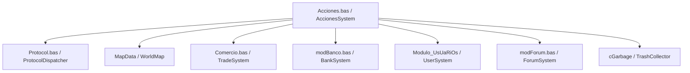

# Auditoría Técnica: Módulo legacy `Acciones.bas` (Módulo #33)

## Visión General y Propósito

El módulo legacy `Acciones.bas` (`legacy/server/Codigo/Acciones.bas`) gestiona el procesamiento de interacciones directas iniciadas por el usuario sobre el mundo del juego cuando este hace click o envía un comando de acción sobre una coordenada del mapa (`Map`, `X`, `Y`).

Con un total de **350 líneas**, el módulo sirve como despachador central de interacciones contextuales según la entidad u objeto presente en la celda destino:
1. Interacciones con NPCs especiales (vendedores, banqueros y sacerdotes/revividores).
2. Interacciones con objetos del escenario (puertas, carteles, foros y fogatas/ramitas).

Este documento presenta la auditoría exhaustiva línea por línea de `Acciones.bas`, identificando sus dependencias salientes, quirks históricos, condiciones de borde y proponiendo la superficie de desacoplamiento para la futura portabilidad a C++.

---

## 1. Catálogo Completo de Procedimientos y Visibilidad

`Acciones.bas` contiene exactamente **5 procedimientos** (todos con alcance implícito o explícito `Public`). A continuación se detalla la firma exacta, visibilidad, parámetros y propósito funcional de cada rutina:

| Procedimiento | Líneas | Visibilidad | Parámetros | Retorno | Propósito Funcional |
| :--- | :--- | :--- | :--- | :--- | :--- |
| `Accion` | `L44-L176` | `Public` (implícito) | `ByVal UserIndex As Integer`, `ByVal Map As Integer`, `ByVal X As Integer`, `ByVal Y As Integer` | `None` (Sub) | Despachador principal de acciones sobre la grilla. Filtra por rango de visión, límites de mapa y clasifica la interacción según si la celda posee un NPC o un objeto (evaluando también casilleros adyacentes para objetos multitile). |
| `AccionParaForo` | `L178-L202` | `Public` (explícito) | `ByVal Map As Integer`, `ByVal X As Integer`, `ByVal Y As Integer`, `ByVal UserIndex As Integer` | `None` (Sub) | Procesa la apertura del formulario de foro. Valida distancia max 2 celdas, consulta los mensajes via `SendPosts` y notifica al cliente para abrir la interfaz con `WriteShowForumForm`. |
| `AccionParaPuerta` | `L204-L262` | `Public` (implícito) | `ByVal Map As Integer`, `ByVal X As Integer`, `ByVal Y As Integer`, `ByVal UserIndex As Integer` | `None` (Sub) | Procesa la apertura y cierre de puertas. Verifica cerraduras con llave, altera el estado del objeto (`IndexAbierta`/`IndexCerrada`), muta la propiedad `Blocked` de las celdas y emite sonido de puerta a la zona. |
| `AccionParaCartel` | `L264-L281` | `Public` (implícito) | `ByVal Map As Integer`, `ByVal X As Integer`, `ByVal Y As Integer`, `ByVal UserIndex As Integer` | `None` (Sub) | Inspecciona un cartel (`OBJType = 8`). Si posee texto configurado, envía el mensaje de señal al usuario mediante `WriteShowSignal`. |
| `AccionParaRamita` | `L283-L350` | `Public` (implícito) | `ByVal Map As Integer`, `ByVal X As Integer`, `ByVal Y As Integer`, `ByVal UserIndex As Integer` | `None` (Sub) | Implementa la habilidad de supervivencia (encendido de fogatas sobre leña/fogata apagada). Controla zonas seguras y ciudades, calcula probabilidad de éxito, crea el objeto fogata en el mapa, lo registra en `TrashCollector` (`cGarbage`) y actualiza la habilidad. |

> [!NOTE]
> **Distribución de Rutinas de Interacción en el Servidor Legacy**:
> Si bien conceptualmente rutinas como `AgarrarItem`, `TirarOro`, `MirarObjeto`, `CrearFuego` o `AccionParaGM` suelen agruparse bajo "acciones del usuario", en el servidor de VB6 `Acciones.bas` únicamente contiene el despacho de click sobre grilla descrito arriba. Rutinas asociadas a inventario y objetos del suelo como `AgarrarItem` o `TirarOro` residen en `InvUsuario.bas` o `Modulo_InventANDobj.bas`.

---

## 2. Interacciones Espaciales, Entorno y Triggers

### 2.1 Manipulación de Puertas y Cerrojos (`AccionParaPuerta`, L204-L262)
- **Rango de interacción**: Euclidiana `Distance(UserPos.X, UserPos.Y, X, Y) <= 2` (`L213`).
- **Comprobación de Cerrojo**: Evalúa `ObjData(ObjIndex).Llave = 0` (`L214`). Si la puerta requiere llave (`Llave > 0`), emite la notificación `"La puerta está cerrada con llave."` (`L256`).
- **Apertura de Puerta (`Cerrada = 1`)**:
  - Cambia `MapData(Map, X, Y).ObjInfo.ObjIndex` a `IndexAbierta` (`L219`).
  - Muta el flag de bloqueo en mapa: `MapData(Map, X, Y).Blocked = 0` y `MapData(Map, X - 1, Y).Blocked = 0` (`L224-L225`).
  - Llama a `Bloquear(True, Map, X, Y, 0)` y `Bloquear(True, Map, X - 1, Y, 0)` (`L228-L229`) para alterar la transitabilidad.
  - Envía la actualización de gráfico a la zona con `SendToAreaByPos` (`L221`) y emite el efecto de sonido `SND_PUERTA` (`L233`).
- **Cierre de Puerta (`Cerrada = 0`)**:
  - Cambia `MapData(Map, X, Y).ObjInfo.ObjIndex` a `IndexCerrada` (`L240`).
  - Muta el flag de bloqueo en mapa: `MapData(Map, X, Y).Blocked = 1` y `MapData(Map, X - 1, Y).Blocked = 1` (`L244-L245`).
  - Llama a `Bloquear(True, Map, X - 1, Y, 1)` y `Bloquear(True, Map, X, Y, 1)` (`L248-L249`).
  - Actualiza el gráfico y emite el sonido de puerta (`L242`, `L251`).
- **Multitile / Adyacencias**: En `Accion` (`L145-L173`), si la celda cliqueada `(X, Y)` no contiene puerta, escanea consecutivamente las celdas adyacentes `(X+1, Y)`, `(X+1, Y+1)` y `(X, Y+1)` en busca de un objeto de tipo `eOBJType.otPuertas`.

### 2.2 Carteles y Foros (`L178-L202`, `L264-L281`)
- **Carteles**: Verifica que el objeto sea de tipo `otCarteles` (tipo 8, `L273`) y posea contenido en `.texto` (`L275`). Despacha el paquete binario de visualización mediante `WriteShowSignal(UserIndex, ObjIndex)` (`L276`).
- **Foros**: Verifica distancia Manhattan `<= 2` (`L193`). Despacha los hilos mediante `SendPosts(UserIndex, ForoID)` (`L198`) y le envía la orden de desplegar la interfaz gráfica del foro al cliente con `WriteShowForumForm(UserIndex)` (`L199`).

### 2.3 Supervivencia y Fogatas (`AccionParaRamita`, L283-L350)
- **Validación Espacial y Triggers**:
  - Distancia Manhattan `<= 2` (`L302`).
  - Bloqueo en Zonas Seguras: Si `MapData(Map, X, Y).trigger = eTrigger.ZONASEGURA` o `MapInfo(Map).Pk = False` (`L307`), cancela el intento indicando `"No puedes hacer fogatas en zona segura."`.
  - Prohibición Legal Urbana: Si `MapInfo(.Pos.Map).Zona = Ciudad` (`L323`), cancela indicando `"La ley impide realizar fogatas en las ciudades."` (`L340`).
- **Lógica de Éxito de Habilidad**:
  - `UserSkills(Supervivencia)` entre 2 y 5: `Suerte = 3` (probabilidad 1/3, `L312-L313`).
  - `UserSkills(Supervivencia)` entre 6 y 10: `Suerte = 2` (probabilidad 1/2, `L314-L315`).
  - `UserSkills(Supervivencia) >= 10`: `Suerte = 1` (éxito 100%, `L316-L318`).
  - Tirada aleatoria: `exito = RandomNumber(1, Suerte)` (`L320`).
- **Instanciación y Recolección de Basura (`cGarbage`)**:
  - En caso de éxito, crea el objeto `FOGATA` mediante `MakeObj(Obj, Map, X, Y)` (`L329`).
  - Instancia un DTO `Dim Fogatita As New cGarbage` (`L332`), asigna las coordenadas del mapa y lo agrega a la colección global `TrashCollector.Add(Fogatita)` (`L336`) para su posterior limpieza temporizada.
  - Incrementa la habilidad mediante `SubirSkill(UserIndex, eSkill.Supervivencia, True)` (`L338`). Si falla, llama con `False` (`L345`).

---

## 3. Superficie de Desacoplamiento y Callbacks

Para aislar `Acciones.bas` en C++ sin generar acoplamientos circulares con los módulos de red (`Protocol`), inventario (`InvUsuario`), comercio (`Comercio`), banco (`modBanco`) o mapa (`MapData`), se debe definir la estructura de servicios `AccionesCallbacks`.

### 3.1 Llamadas Salientes Identificadas



1. **Protocolo y Red (`Protocol.bas`, `modSendData.bas`)**:
   - `WriteConsoleMsg(UserIndex, Msg, FontType)`
   - `WriteShowSignal(UserIndex, ObjIndex)`
   - `WriteShowForumForm(UserIndex)`
   - `WriteUpdateUserStats(UserIndex)`
   - `SendToAreaByPos(Map, X, Y, Buffer)`
   - `SendData(Target, UserIndex, Buffer)`
   - `PrepareMessageObjectCreate(GrhIndex, X, Y)`
   - `PrepareMessagePlayWave(WaveIndex, X, Y)`
2. **Comercio y Banco (`Comercio.bas`, `modBanco.bas`)**:
   - `IniciarComercioNPC(UserIndex)`
   - `IniciarDeposito(UserIndex)`
3. **Usuarios y Atributos (`Modulo_UsUaRiOs`, `Extra.bas`)**:
   - `RevivirUsuario(UserIndex)`
   - `EsNewbie(UserIndex)`
   - `SubirSkill(UserIndex, SkillID, Exito)`
4. **Mapeo y Entorno (`Modulo_InventANDobj.bas`, `Extra.bas`)**:
   - `MakeObj(Obj, Map, X, Y)`
   - `Bloquear(bBloquear, Map, X, Y, Flag)`
   - `InMapBounds(Map, X, Y)`
   - `Distancia(Pos1, Pos2)` / `Distance(X1, Y1, X2, Y2)`
5. **Foros y Basura (`modForum.bas`, `cGarbage.cls`)**:
   - `SendPosts(UserIndex, ForoID)`
   - `TrashCollector.Add(GarbageDTO)`

### 3.2 Catálogo Preliminar de Callbacks Tipados (`AccionesCallbacks`)

```cpp
// Superficie de callbacks requerida por AccionesSystem
struct AccionesCallbacks {
    // Red y Consola
    std::function<void(int userIndex, const std::string& msg, FontType fontType)> writeConsoleMsg;
    std::function<void(int userIndex, int objIndex)> writeShowSignal;
    std::function<void(int userIndex)> writeShowForumForm;
    std::function<void(int userIndex)> writeUpdateUserStats;
    std::function<void(int map, int x, int y, uint16_t grhIndex)> sendObjectCreateToArea;
    std::function<void(int map, int x, int y, uint16_t waveIndex)> sendPlayWaveToArea;

    // Subsistemas de Negocio
    std::function<void(int userIndex)> iniciarComercioNPC;
    std::function<void(int userIndex)> iniciarDepositoBanco;
    std::function<void(int userIndex)> revivirUsuario;
    std::function<bool(int userIndex)> esNewbie;
    std::function<void(int userIndex, eSkill skill, bool exito)> subirSkill;
    std::function<bool(int userIndex, int foroId)> sendPosts;

    // Entorno y Basura
    std::function<void(const Obj& obj, int map, int x, int y)> makeObj;
    std::function<void(bool bloquear, int map, int x, int y, uint8_t flag)> setTileBlocked;
    std::function<void(int map, int x, int y)> registerGarbageFire;
};
```

---

## 4. Detección de Quirks, Bugs Históricos y Desbordamientos

De acuerdo con las reglas de la arquitectura, se han auditado las condiciones de borde y peculiaridades del código VB6 original:

### 4.1 Bug de Evaluación Booleana en Skill de Supervivencia (`L316`)
- **Código VB6**:
  ```vb
  ElseIf .Stats.UserSkills(Supervivencia) >= 10 And .Stats.UserSkills(Supervivencia) Then
      Suerte = 1
  End If
  ```
- **Análisis**: La segunda parte del `And` evalúa `.Stats.UserSkills(Supervivencia)` directamente como una expresión lógica `Boolean`. En VB6, cualquier entero no nulo se convierte implícitamente a `True`. Dado que la primera condición es `>= 10`, la variable de skill siempre es mayor que cero, haciendo que la expresión completa sea siempre `True`. El programador original pretendía escribir una cota superior (ej. `<= 100` o simplemente omitir el segundo término). En la práctica, cualquier usuario con skill mayor o igual a 10 obtiene `Suerte = 1` (100% de éxito al encender fuego).

### 4.2 Código Inalcanzable por Evaluación Redundante de Llave (`L214` vs `L217`)
- **Código VB6**:
  ```vb
  L214: If ObjData(MapData(Map, X, Y).ObjInfo.ObjIndex).Llave = 0 Then
  L215:     If ObjData(MapData(Map, X, Y).ObjInfo.ObjIndex).Cerrada = 1 Then
  L217:         If ObjData(MapData(Map, X, Y).ObjInfo.ObjIndex).Llave = 0 Then
                  ' Abre puerta...
  L235:         Else
  L236:             Call WriteConsoleMsg(UserIndex, "La puerta esta cerrada con llave.", FontTypeNames.FONTTYPE_INFO)
  L237:         End If
  ```
- **Análisis**: En la línea 214 ya se verificó que `.Llave = 0`. Al entrar a la rama verdadera, en la línea 217 se vuelve a comprobar exactamente la misma condición `.Llave = 0`. La rama `Else` de la línea 235 es **matemáticamente inalcanzable (código muerto)**. Si la puerta tuviese llave (`Llave > 0`), el flujo falla en L214 y cae en la línea 256.

### 4.3 Asunción Hardcodeada de Geometría y Paridad en Puertas (`L224-L229`, `L244-L249`)
- **Código VB6**:
  ```vb
  MapData(Map, X, Y).Blocked = 0
  MapData(Map, X - 1, Y).Blocked = 0
  Call Bloquear(True, Map, X, Y, 0)
  Call Bloquear(True, Map, X - 1, Y, 0)
  ```
- **Análisis**: Al abrir o cerrar cualquier puerta, el código asume de forma rígida que la puerta ocupa la celda cliqueada `(X, Y)` y su vecina occidental `(X - 1, Y)`. No discrimina entre puertas horizontales, verticales ni la posición del pivote del objeto multitile. Si una puerta se coloca en el borde izquierdo del mapa (`X = 1`), `X - 1 = 0` causará un acceso fuera de límites en `MapData` (mitigado únicamente en VB6 por la presencia de `On Error Resume Next` en `L211`).

### 4.4 Inconsistencia de Métricas de Distancia
- **Chebyshev / Manhattan vs Euclidiana**:
  - `AccionParaForo` (`L193`) y `AccionParaRamita` (`L302`) utilizan `Distancia(Pos1, Pos2) > 2` (distancia máxima en ejes).
  - `AccionParaPuerta` (`L213`) utilizan `Distance(X1, Y1, X2, Y2) > 2` (distancia euclidiana).
  - NPCs comerciantes y banqueros (`L80`, `L101`) utilizan `Distancia > 3`.
  - NPCs revividores (`L109`) utilizan `Distancia > 10`.
  - Carteles (`L264`) no realizan validación de distancia propia, confiando únicamente en la comprobación de visión `RANGO_VISION_X / Y` (`L55`).

### 4.5 Modificación Silenciosa de Estado (`TargetNPC` / `TargetObj`)
- En la función despachadora `Accion` (`L66`, `L130`, `L147`, `L158`, `L167`), hacer click en cualquier NPC u objeto muta inmediatamente `.flags.TargetNPC` o `.flags.TargetObj` del usuario, incluso si la acción posterior (comerciar, abrir puerta, leer cartel) fracasa por distancia o estado (muerto).

---

## 5. Referencias y Enlaces Relacionados

- Documentación de Convenciones y Reglas del Proyecto: [`docs/CONVENTIONS.md`](../CONVENTIONS.md)
- Especificación de Entidad Usuario y Estado: [`docs/audit/15-entidad-usuario-y-estado.md`](15-entidad-usuario-y-estado.md)
- Auditoría de Objetos e Inventario: [`docs/audit/12-objetos-inventario-comercio.md`](12-objetos-inventario-comercio.md)
- Auditoría de NPCs y Criaturas: [`docs/audit/13a-modulonpcs-detalle.md`](13a-modulonpcs-detalle.md)
