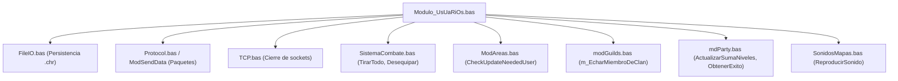

# Auditoría Técnica Detallada: Módulo #34 (`Modulo_UsUaRiOs.bas`)

Este documento constituye la auditoría exhaustiva del Módulo #34 (`legacy/server/Codigo/Modulo_UsUaRiOs.bas`, 2.429 líneas), responsable de la gestión de la entidad de usuario, su ciclo de vida, sesión, cinemática espacial, progresión de niveles, estados de muerte/resurrección y la superficie de integración con los subsistemas periféricos del servidor de Argentum Online v0.13.0.

Para el marco arquitectónico general y las estructuras de datos fundamentales (`UserList`, `User`), consultá [`15-entidad-usuario-y-estado.md`](15-entidad-usuario-y-estado.md) y [`../CONVENTIONS.md`](../CONVENTIONS.md). El plan general de portabilidad a C++ se encuentra en [`../implementation/00-port-plan.md`](../implementation/00-port-plan.md).

---

## 1. Resumen Ejecutivo y Responsabilidades

`Modulo_UsUaRiOs.bas` es uno de los módulos monolíticos centrales del servidor VB6. Concentra las siguientes responsabilidades operativas:
1. **Ciclo de Vida de Sesión y Ranuras**: Asignación de ranuras (`NextOpenUser`, `NextOpenCharIndex`), desconexión diferida (`Cerrar_Usuario`, `CancelExit`) y renombrado (`CambiarNick`).
2. **Progresión de Experiencia y Habilidades**: Calculadora de incremento de nivel (`CheckUserLevel`), ganancia probabilística de habilidades (`SubirSkill`, `CheckEluSkill`) y asignación de puntos vitales (HP, Maná, Energía, Golpe Mín/Máx).
3. **Cinemática Espacial y Transporte**: Desplazamiento grilla a grilla (`MoveUserChar`), teletransportación (`WarpUserChar`), intercambio de posición con fantasmas (*caspers*), navegación en barca (`ToogleBoatBody`, `BodyIsBoat`, `PuedeAtravesarAgua`) y teletransporte de mascotas (`WarpMascota`, `WarpMascotas`).
4. **Ciclo de Muerte y Resurrección**: Transformación a fantasma/fragata fantasmal (`UserDie`), desequipamiento masivo, caída de objetos en grilla, seguro de resurrección y restablecimiento vital (`RevivirUsuario`).
5. **Máquina de Estados de Dominio**: Modos de visibilidad (`SetInvisible`), alineación criminal/ciudadano (`VolverCriminal`, `VolverCiudadano`), designación de hogar (`setHome`, `goHome`), lógica de agresión/apropiación de NPCs (`NPCAtacado`, `ApropioNpc`, `PerdioNpc`) y estado de combate (`ToogleToAtackable`).

---

## 2. Catálogo Exhaustivo de Procedimientos

El módulo contiene 57 rutinas (Sub y Function). A continuación se clasifican según su subdominio funcional.

### 2.1 Ciclo de Vida y Sesión de Usuario

| Procedimiento | Visibilidad | Firma / Parámetros | Retorno | Responsabilidad Funcional | Líneas |
| :--- | :--- | :--- | :--- | :--- | :--- |
| `NextOpenUser` | Public (implícito) | `()` | `Integer` | Busca el primer slot libre (1 a `MaxUsers`) en `UserList` sin socket asignado. | 868-883 |
| `NextOpenCharIndex` | Public (implícito) | `()` | `Integer` | Busca la primera ranura libre en `CharList` (reutilización de sprites de cliente). | 846-866 |
| `Cerrar_Usuario` | Public (implícito) | `(ByVal UserIndex As Integer)` | `Void` | Inicia la secuencia de desconexión (10 segundos de cuenta regresiva si está en mapa PK/User). | 1850-1902 |
| `CancelExit` | Public | `(ByVal UserIndex As Integer)` | `Void` | Cancela la secuencia de salida voluntaria (`/salir`) si el jugador realiza acciones. | 1904-1926 |
| `CambiarNick` | Public | `(ByVal UserIndex As Integer, ByVal UserIndexDestino As Integer, ByVal NuevoNick As String)` | `Void` | Renombra al personaje destino en tiempo de ejecución (requiere permisos de administración). | 1928-1946 |

### 2.2 Progresión de Nivel, Experiencia y Atributos

| Procedimiento | Visibilidad | Firma / Parámetros | Retorno | Responsabilidad Funcional | Líneas |
| :--- | :--- | :--- | :--- | :--- | :--- |
| `CheckUserLevel` | Public | `(ByVal UserIndex As Integer)` | `Void` | Procesa la subida de nivel cuando `Exp >= ELU`. Incrementa HP/Mana/Sta/Hits, aplica expulsión de clanes a lvl 25 y remueve items newbie. | 433-704 |
| `ActStats` | Public | `(ByVal VictimIndex As Integer, ByVal AttackerIndex As Integer)` | `Void` | Otorga experiencia y recompensa por victoria en combate PvP/PvE a la víctima/atacante. | 38-94 |
| `SubirSkill` | Public (implícito) | `(ByVal UserIndex As Integer, ByVal Skill As Integer, ByVal Acerto As Boolean)` | `Void` | Evalúa si el usuario incrementa en 1 punto una habilidad según tirada de probabilidad y uso. | 1244-1299 |
| `CheckEluSkill` | Public | `(ByVal UserIndex As Integer, ByVal Skill As Byte, ByVal Allocation As Boolean)` | `Void` | Recalcula los puntos asignables de habilidad (*skill points*) tras subir de nivel o asignar manualmente. | 2273-2295 |
| `EnviarFama` | Public | `(ByVal UserIndex As Integer)` | `Void` | Envía al cliente el detalle de reputación (Asesino, Bandido, Ciudadano, Nobleza, Faccionaria). | 229-251 |
| `SendUserStatsTxt` | Public | `(ByVal sendIndex As Integer, ByVal UserIndex As Integer)` | `Void` | Despacha la consola de estadísticas completas de un personaje conectado a un admin. | 885-944 |
| `SendUserMiniStatsTxt` | Public (implícito) | `(ByVal sendIndex As Integer, ByVal UserIndex As Integer)` | `Void` | Despacha resumen abreviado de stats de personaje online. | 946-986 |
| `SendUserMiniStatsTxtFromChar` | Public (implícito) | `(ByVal sendIndex As Integer, ByVal charName As String)` | `Void` | Despacha mini stats leyendo directamente desde el archivo `.chr` de disco. | 988-1045 |
| `SendUserStatsTxtOFF` | Public (implícito) | `(ByVal sendIndex As Integer, ByVal Nombre As String)` | `Void` | Lee y despacha las estadísticas completas de un personaje offline desde disco. | 1948-1976 |
| `SendUserOROTxtFromChar` | Public (implícito) | `(ByVal sendIndex As Integer, ByVal charName As String)` | `Void` | Reporta el saldo en oro (inventario + banco) de un personaje leyendo el archivo `.chr`. | 1978-1996 |
| `SendUserInvTxt` | Public (implícito) | `(ByVal sendIndex As Integer, ByVal UserIndex As Integer)` | `Void` | Envía a la consola de un GM la lista de items en inventario de un usuario online. | 1047-1068 |
| `SendUserInvTxtFromChar` | Public (implícito) | `(ByVal sendIndex As Integer, ByVal charName As String)` | `Void` | Lee e imprime el inventario de un usuario offline desde disco. | 1070-1100 |
| `SendUserSkillsTxt` | Public (implícito) | `(ByVal sendIndex As Integer, ByVal UserIndex As Integer)` | `Void` | Despacha el desglose de 21 habilidades del usuario a la consola del administrador. | 1102-1119 |

### 2.3 Ciclos Temporales y Regeneración Vital

| Procedimiento | Visibilidad | Firma / Parámetros | Retorno | Responsabilidad Funcional | Líneas |
| :--- | :--- | :--- | :--- | :--- | :--- |
| `RefreshCharStatus` | Public | `(ByVal UserIndex As Integer)` | `Void` | Recalcula el estado visual y alineación del personaje ante cambios de equipo/bandos. | 293-328 |

> [!NOTE]
> El ciclo principal continuo de regeneración pasiva de HP/Maná/Stamina y decremento de Hambre y Sed es ejecutado por los temporizadores en `General.bas` (procedimientos `Sanar` y `PasoMinuto`). `Modulo_UsUaRiOs.bas` interactúa verificando las banderas `.flags.Hambre` y `.flags.Sed` en `SubirSkill` (línea 1251) para cancelar la ganancia de habilidades si el personaje está hambriento o sediento.

### 2.4 Cinemática, Transporte y Validación Espacial

| Procedimiento | Visibilidad | Firma / Parámetros | Retorno | Responsabilidad Funcional | Líneas |
| :--- | :--- | :--- | :--- | :--- | :--- |
| `MoveUserChar` | Public (implícito) | `(ByVal UserIndex As Integer, ByVal nHeading As eHeading)` | `Void` | Ejecuta el desplazamiento a la celda contigua, administra intercambio con caspers y actualiza áreas. | 717-815 |
| `WarpUserChar` | Public (implícito) | `(ByVal UserIndex As Integer, ByVal map As Integer, ByVal X As Integer, ByVal Y As Integer, ByVal FX As Boolean, Optional ByVal Teletransported As Boolean)` | `Void` | Teletransporta al usuario a coordenadas arbitrarias, ajusta mapas de origen/destino y contadores de `NumUsers`. | 1590-1700 |
| `Tilelibre` | Public (implícito) | `(ByRef Pos As WorldPos, ByRef nPos As WorldPos, ByRef Obj As Obj, ByRef Agua As Boolean, ByRef Tierra As Boolean)` | `Void` | Busca una celda libre adyacente para depositar objetos o desplazar criaturas/personajes. | 1543-1588 |
| `PuedeAtravesarAgua` | Public | `(ByVal UserIndex As Integer)` | `Boolean` | Evalúa si el usuario puede transitar sobre celdas de agua (navegando o muerto). | 706-715 |
| `ToogleBoatBody` | Public | `(ByVal UserIndex As Integer)` | `Void` | Alterna la apariencia del personaje entre su cuerpo terrestre y la embarcación (galera/barca/fragata). | 130-186 |
| `BodyIsBoat` | Public | `(ByVal body As Integer)` | `Boolean` | Determina si un ID de cuerpo (`Body`) corresponde a un barco o embarcación. | 2049-2061 |
| `ChangeUserChar` | Public | `(ByVal UserIndex As Integer, ByVal body As Integer, ByVal Head As Integer, ByVal heading As Byte, ByVal Weapon As Integer, ByVal Shield As Integer, ByVal Helmet As Integer)` | `Void` | Actualiza la representación visual completa de un personaje y notifica al área. | 188-205 |
| `MakeUserChar` | Public | `(ByVal toMap As Boolean, ByVal sndIndex As Integer, ByVal UserIndex As Integer, ByVal map As Integer, ByVal X As Integer, ByVal Y As Integer)` | `Void` | Crea la instancia del sprite en el mapa y reserva el `CharIndex` para el cliente. | 350-431 |
| `EraseUserChar` | Public | `(ByVal UserIndex As Integer, ByVal IsAdminInvisible As Boolean)` | `Void` | Elimina la presencia del sprite de un usuario del mapa (previo a warp o desconexión). | 253-291 |
| `WarpMascota` | Public | `(ByVal UserIndex As Integer, ByVal PetIndex As Integer)` | `Void` | Relocaliza a una mascota específica a la posición actual de su amo. | 1790-1848 |
| `WarpMascotas` | Private | `(ByVal UserIndex As Integer)` | `Void` | Relocaliza iterativamente a todas las mascotas invocadas del usuario al cambiar de mapa. | 1702-1788 |
| `InvertHeading` | Public | `(ByVal nHeading As eHeading)` | `eHeading` | Retorna la dirección opuesta a la orientativa provista (usado al empujar caspers). | 817-833 |
| `GetDireccion` | Public | `(ByVal UserIndex As Integer, ByVal OtherUserIndex As Integer)` | `String` | Devuelve el punto cardinal (Norte, Sur, Este, Oeste) de un usuario respecto a otro. | 2178-2208 |
| `FarthestPet` | Public | `(ByVal UserIndex As Integer)` | `Integer` | Retorna el índice de la mascota de un jugador que se encuentra a mayor distancia física. | 2220-2271 |

### 2.5 Estados del Personaje, Reglas Faccionarias y Combate

| Procedimiento | Visibilidad | Firma / Parámetros | Retorno | Responsabilidad Funcional | Líneas |
| :--- | :--- | :--- | :--- | :--- | :--- |
| `UserDie` | Public (implícito) | `(ByVal UserIndex As Integer)` | `Void` | Procesa la muerte del usuario: convierte en fantasma, cae el inventario en el suelo, limpia estados y sanciona party. | 1301-1504 |
| `RevivirUsuario` | Public | `(ByVal UserIndex As Integer)` | `Void` | Restaura a la vida a un fantasma, asignándole su cuerpo y cabeza original con 1 punto de HP. | 96-128 |
| `ContarMuerte` | Public (implícito) | `(ByVal Muerto As Integer, ByVal Atacante As Integer)` | `Void` | Actualiza contadores de asesinatos (frags), ciudadanos/criminales ejecutados y reputación. | 1506-1541 |
| `SetInvisible` | Public | `(ByVal UserIndex As Integer, ByVal userCharIndex As Integer, ByVal invisible As Boolean)` | `Void` | Aplica o remueve el estado de invisibilidad gráfica sobre un personaje. | 2063-2087 |
| `SetConsulatMode` | Public | `(ByVal UserIndex As Integer)` | `Void` | Alterna el modo de Consejero/Consejo Real/Caos con efectos de color o tag. | 2089-2111 |
| `IsArena` | Public | `(ByVal UserIndex As Integer)` | `Boolean` | Determina si la posición del usuario se ubica dentro de un mapa de coliseo o arena PvP. | 2113-2120 |
| `VolverCriminal` | Public (implícito) | `(ByVal UserIndex As Integer)` | `Void` | Modifica la alineación del usuario a Criminal si ataca o roba a un ciudadano inocente. | 1998-2022 |
| `VolverCiudadano` | Public (implícito) | `(ByVal UserIndex As Integer)` | `Void` | Limpia las faltas de un usuario restituyendo la condición de Ciudadano. | 2024-2047 |
| `ToogleToAtackable` | Public | `(ByVal UserIndex As Integer, ByVal OwnerIndex As Integer, Optional ByVal StealingNpc As Boolean = True)` | `Boolean` | Habilita el flag de atacable legítimo sobre un usuario por agresión o provocar NPCs ajenos. | 2375-2417 |
| `setHome` | Public | `(ByVal UserIndex As Integer, ByVal newHome As eCiudad, ByVal NpcIndex As Integer)` | `Void` | Establece la ciudad de residencia habitual del usuario (Ullathorpe, Nix, Banderbill, Arghal, etc.). | 2419-2429 |
| `goHome` | Public | `(ByVal UserIndex As Integer)` | `Void` | Inicia la secuencia de teletransporte de retorno a la ciudad origen registrada. | 2350-2373 |
| `PerdioNpc` | Public | `(ByVal UserIndex As Integer)` | `Void` | Remueve la propiedad y persecución de un NPC sobre el usuario al morir o alejarse. | 2122-2145 |
| `ApropioNpc` | Public | `(ByVal UserIndex As Integer, ByVal NpcIndex As Integer)` | `Void` | Asigna la pertenencia legítima del objetivo NPC al primer atacante. | 2147-2176 |
| `SameFaccion` | Public | `(ByVal UserIndex As Integer, ByVal OtherUserIndex As Integer)` | `Boolean` | Verifica si dos usuarios pertenecen al mismo bando faccionario (Armada o Legión). | 2210-2218 |
| `EsMascotaCiudadano` | Private | `(ByVal NpcIndex As Integer, ByVal UserIndex As Integer)` | `Boolean` | Verifica si un NPC invocado o domado pertenece a un personaje de alineación Ciudadana. | 1121-1134 |
| `NPCAtacado` | Public (implícito) | `(ByVal NpcIndex As Integer, ByVal UserIndex As Integer)` | `Void` | Procesa las represalias faccionarias e intencionalidad al atacar a una criatura o guardia. | 1136-1210 |
| `PuedeApuñalar` | Public | `(ByVal UserIndex As Integer)` | `Boolean` | Verifica si la clase y skills del usuario permiten asestar un golpe crítico de apuñalamiento. | 1212-1225 |
| `PuedeAcuchillar` | Public | `(ByVal UserIndex As Integer)` | `Boolean` | Verifica si el usuario dispone de la habilidad acuchillar equipando una daga. | 1227-1242 |
| `GetWeaponAnim` | Public | `(ByVal UserIndex As Integer, ByVal ObjIndex As Integer)` | `Integer` | Obtiene el ID del sprite de animación del arma equipada. | 207-227 |
| `GetNickColor` | Public | `(ByVal UserIndex As Integer)` | `Byte` | Computa la constante de color del nombre en el cliente (Criminal, Ciudadano, GM, Caos, Real). | 330-348 |
| `ChangeUserInv` | Public (implícito) | `(ByVal UserIndex As Integer, ByVal Slot As Byte, ByRef Object As UserOBJ)` | `Void` | Reemplaza directamente la estructura de un slot en el inventario del usuario. | 835-844 |
| `HasEnoughItems` | Public | `(ByVal UserIndex As Integer, ByVal ObjIndex As Integer, ByVal Amount As Long)` | `Boolean` | Verifica si el usuario acumula la cantidad solicitada de un item en su inventario. | 2297-2316 |
| `TotalOfferItems` | Public | `(ByVal ObjIndex As Integer, ByVal UserIndex As Integer)` | `Long` | Cuenta el total acumulado de un item específico en el inventario del jugador. | 2318-2334 |
| `getMaxInventorySlots` | Public | `(ByVal UserIndex As Integer)` | `Byte` | Devuelve la cantidad máxima de slots utilizables según mochila equipada (`MAX_INVENTORY_SLOTS`). | 2336-2348 |

---

## 3. Mapeo de Dependencias y Superficie de Hooks

### 3.1 Mutación Directa de Estructuras de Datos
- **`UserList`**: Mutación masiva e irrestricta de `UserList(UserIndex).Stats`, `.flags`, `.Counters`, `.Pos`, `.Char`, `.Invent` y `.MascotasIndex`.
- **`MapData`**: Mutación directa en `MoveUserChar`, `WarpUserChar`, `MakeUserChar` y `EraseUserChar` asignando `MapData(map, X, Y).UserIndex`.
- **`MapInfo`**: Lectura y actualización de `MapInfo(map).NumUsers` (control de densidad poblacional por mapa).
- **`Npclist`**: Alteración de los estados de persecución y hostilidad (`.flags.AttackedBy`, `.flags.OldMovement`) ante muerte del objetivo.

### 3.2 Dependencias Salientes de `Modulo_UsUaRiOs.bas`

### 3.3 Superficie de Hooks Exportados

Las rutinas exportadas por `Modulo_UsUaRiOs.bas` son invocadas diferidamente desde múltiples módulos:

| Módulo Llamante | Función/Sub Invocada | Propósito / Callback Diferido |
| :--- | :--- | :--- |
| `ModAreas.bas` | `EraseUserChar`, `MakeUserChar` | Redibujado de entidades al entrar/salir del radio visual de 9 subzonas. |
| `InvUsuario.bas` | `ChangeUserChar`, `RefreshCharStatus` | Actualización de sprite tras equipar/desequipar armaduras, cascos o armas. |
| `Modulo_InventANDobj.bas` | `TirarTodo`, `HasEnoughItems` | Comprobación y vaciado de items al suelo en muertes o tiradas manuales. |
| `Comercio.bas` | `LimpiarComercioSeguro`, `TotalOfferItems` | Cancelación de transacciones P2P si el usuario muere o se desconecta. |
| `SistemaCombate.bas` | `UserDie`, `ActStats`, `ContarMuerte`, `VolverCriminal` | Procesamiento del desenlace de combate PvP/PvE y cálculo de experiencia. |
| `modHechizos.bas` | `RevivirUsuario`, `SetInvisible`, `WarpUserChar` | Efectos mágicos de resucitación, invisibilidad, mimetismo y teletransporte. |

---

## 4. Taxonomía de Hallazgos y Quirks Históricos

Conforme a la **Regla 7 de [`../CONVENTIONS.md`](../CONVENTIONS.md)**, se diferencia strictly entre defectos técnicos destinados al *Master Bug Ledger* (`KNOWN-LEGACY-BUGS.md`) y reglas de dominio intencionales que deben preservarse en la implementación C++.

### 4.1 Defectos Técnicos (Destinados a `KNOWN-LEGACY-BUGS.md`)

1. **Desbordamiento Aritmético por Coerción Implícita en `CheckUserLevel`**:
   - **Ubicación**: `CheckUserLevel` (líneas 496-506).
   - **Mecanismo**: La multiplicación `.Stats.ELU = .Stats.ELU * 1.4` (o `1.35`, `1.3`, `1.225`, `1.25`) realiza una operación en punto flotante (`Double`) y luego se coerciona a un entero con signo `Long` de 32 bits. Si un personaje acumula un nivel o experiencia anómala donde `ELU` excede `2.147.483.647`, la coerción sufre desbordamiento con signo produciendo valores de `ELU` negativos o un cuelgue del servidor (`Overflow Error 6`).
2. **Underflow en Contador Poblacional `MapInfo(OldMap).NumUsers`**:
   - **Ubicación**: `WarpUserChar` (líneas 1622-1625).
   - **Mecanismo**: Si por un fallo de desincronización o desconexión no registrada `NumUsers` llega a 0 y se ejecuta `WarpUserChar`, el contador decrementa a `-1`. El parche legacy VB6 incluye un condicional defensivo `If MapInfo(OldMap).NumUsers < 0 Then MapInfo(OldMap).NumUsers = 0`. Esto evidencia un defecto estructural en el seguimiento del ciclo de vida de usuarios por mapa.
3. **Condición de Carrera en Desconexión Diferida (`Cerrar_Usuario` vs `TCP.CloseSocket`)**:
   - **Ubicación**: `Cerrar_Usuario` y `CancelExit` (líneas 1850-1926).
   - **Mecanismo**: Si la conexión de socket cae abruptamente mientras la cuenta regresiva `.Counters.Saliendo` está activa, `UserList(UserIndex).ConnIDValida` pasa a `False`. Al invocar `CancelExit`, el código entra en la rama `Else` y reasigna el temporizador de salida `Counters.Salir = IntervaloCerrarConexion` en lugar de liberar inmediatamente la ranura del usuario, manteniendo el personaje fantasma en el mundo durante 10 segundos adicionales sin socket activo.
4. **Manipulación de Visibilidad Admin (`AdminInvisible`) sobre Caspers**:
   - **Ubicación**: `MoveUserChar` (líneas 742-763).
   - **Mecanismo**: Un Administrador en modo invisible (`AdminInvisible = 1`) no puede desplazar ni intercambiar celda con un fantasma (*casper*). Sin embargo, si el Admin intenta caminar sobre la celda del casper, la validación `If Not (UserList(UserIndex).flags.AdminInvisible = 1)` saltea el intercambio pero permite la ejecución de movimiento sobre la grilla sin notificar `PrepareMessageCharacterMove`, generando desincronización de coordenadas entre el cliente del GM y el estado del mapa en el servidor.

### 4.2 Reglas de Dominio Intencionales / Comportamiento Legacy Preservable

1. **Expulsión Automática de Clanes Faccionarios a Nivel 25**:
   - **Ubicación**: `CheckUserLevel` (líneas 666-674).
   - **Regla de Dominio**: Al alcanzar el nivel 25, si el personaje pertenece a un clan con alineación faccionaria ("Real" o "Del Mal") pero aún no se ha enlistado oficialmente en la facción correspondiente, el servidor lo expulsa automáticamente del clan (`m_EcharMiembroDeClan`) para evitar que sume puntos o afecte la antifacción del clan.
2. **Transformación a Fragata Fantasmal en Agua**:
   - **Ubicación**: `UserDie` (líneas 1475-1481).
   - **Regla de Dominio**: Si un usuario muere mientras se encuentra navegando (`.flags.Navegando = 1`), su cuerpo no adopta el sprite de fantasma terrestre (`iCuerpoMuerto`), sino el sprite especial de Barco Fantasma (`iFragataFantasmal`), manteniendo la capacidad de flotar sobre celdas de agua sin perder la embarcación.
3. **Mecanismo de Desplazamiento e Intercambio de Caspers**:
   - **Ubicación**: `MoveUserChar` (líneas 740-773).
   - **Regla de Dominio**: Un personaje vivo puede atravesar la celda ocupada por un personaje muerto (*casper*). Al hacerlo, el servidor intercambia las coordenadas del casper colocándolo exactamente en la celda que acaba de vaciar el usuario vivo e invirtiendo la orientación del casper (`InvertHeading`).
4. **Activación de Seguro de Resurrección (`SeguroResu`)**:
   - **Ubicación**: `UserDie` (líneas 1335-1341) y `MoveUserChar` (líneas 745-750).
   - **Regla de Dominio**: Al morir o ser desplazado fuera de una zona de combate (Arena / Trigger 6), se activa automáticamente el seguro de resurrección (`SeguroResu = True`) para impedir que otros jugadores puedan revivir al fantasma sin su consentimiento explícito en zonas vulnerables.
5. **Penalización por Muerte en Party**:
   - **Ubicación**: `UserDie` (líneas 1493-1496).
   - **Regla de Dominio**: Al morir un miembro de una Party activa, se ejecuta `mdParty.ObtenerExito` restando experiencia a la Party de forma proporcional a `Level * -10 * CantMiembros`.

---

## 5. Referencias y Enlaces Relativos

- **Visión de Dominio Macro-Área 15**: [`15-entidad-usuario-y-estado.md`](15-entidad-usuario-y-estado.md)
- **Convenciones y Regla 7**: [`../CONVENTIONS.md`](../CONVENTIONS.md)
- **Plan de Portabilidad C++**: [`../implementation/00-port-plan.md`](../implementation/00-port-plan.md)
- **Código Fuente Legacy**: `legacy/server/Codigo/Modulo_UsUaRiOs.bas`
