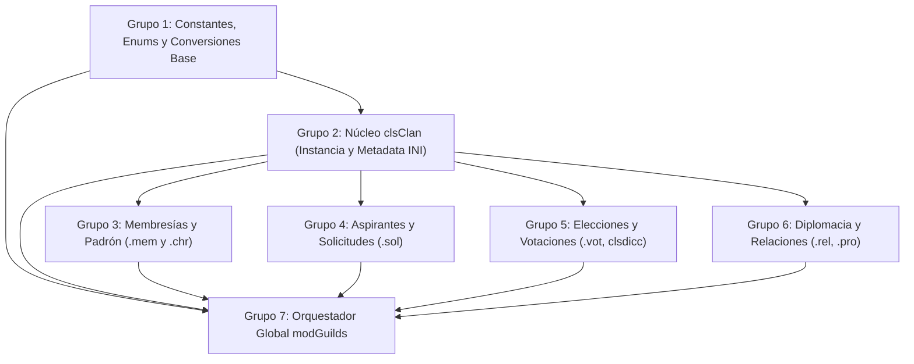

# Desglose Modular del Sistema de Clanes (`clsClan.cls` y `modGuilds.bas`)

Este documento establece la descomposición arquitectónica y la estrategia de porting a C++ para los módulos legacy:
- `legacy/server/Codigo/clsClan.cls` (720 líneas)
- `legacy/server/Codigo/modGuilds.bas` (1.783 líneas)
- **Total combinado**: 2.503 líneas (~58 rutinas / métodos)

Conforme a la regla obligatoria de **Umbral de Desglose para Módulos Grandes** (*Large Module Breakdown Threshold*, ver [`docs/CONVENTIONS.md`](../CONVENTIONS.md)), dado que el conjunto supera ampliamente el límite de 500-800 líneas y está clasificado como **"Grande"** en [`docs/implementation/00-port-plan.md`](00-port-plan.md), este desglose define la secuencia ordenada por árbol de dependencias, nivel de riesgo y disponibilidad de fixtures autoritativos antes de comenzar la implementación.

---

## 1. Arquitectura y Rol de los Módulos

En el servidor VB6 legacy, el sistema de clanes fue diseñado por Mariano Barrou ("El Oso") bajo el patrón **ADO (Active Record / Data Access Object)**:
> *"Es el 'ADO' de los clanes. La interfaz entre el disco y el juego. Los datos no se guardan en memoria para evitar problemas de sincronización, y considerando que la performance de estas rutinas NO es crítica."* (`clsClan.cls:33-37`)

1. **`clsClan` (`src/server/clsClan.hpp` / `clsClan.cpp`)**:
   Representa una entidad individual de clan. Encapsula las rutas a los archivos INI del clan y lee/escribe a demanda contra disco mediante `GetVar` / `WriteVar`. Mantiene únicamente en memoria el listado de miembros y GMs online (`Collection`), las propuestas pendientes y el vector de alineación diplomática contra el resto de los clanes.
2. **`modGuilds` (`src/server/modGuilds.hpp` / `modGuilds.cpp`)**:
   Actúa como registro y orquestador global. Contiene el catálogo de clanes cargados (`guilds`), la cantidad de clanes (`CANTIDADDECLANES`), las reglas de negocio faccionarias (antifacción, degradación de alineación), la interfaz con los comandos de los jugadores y las rutinas periódicas de mantenimiento (elecciones en `DoBackUp`).

---

## 2. Grupos Lógicos Secuenciales

---

### Grupo 1: Constantes, Enums, Conversiones y Validaciones Base (Base Helpers & DTOs)
- **Archivos fuente**: `modGuilds.bas` (L30-L80, L720-L840), `cSolicitud.hpp`.
- **Elementos**:
  - Enums: `ALINEACION_GUILD` (`ALINEACION_LEGION=1`, `ALINEACION_CRIMINAL=2`, `ALINEACION_NEUTRO=3`, `ALINEACION_CIUDA=4`, `ALINEACION_ARMADA=5`, `ALINEACION_MASTER=6`).
  - Enums: `RELACIONES_GUILD` (`GUERRA=-1`, `PAZ=0`, `ALIADOS=1`).
  - Enums: `SONIDOS_GUILD` (`SND_CREACIONCLAN=44`, `SND_ACEPTADOCLAN=43`, `SND_DECLAREWAR=45`).
  - Constantes: `MAX_GUILDS = 1000`, `CANTIDADMAXIMACODEX = 8`, `MAXASPIRANTES = 10`, `MAXANTIFACCION = 5`, `NEWSLENGTH = 1024`, `DESCLENGTH = 256`, `CODEXLENGTH = 256`.
  - Helpers de conversión string/enum: `String2Alineacion`, `Alineacion2String`, `Relacion2String`, `String2Relacion`.
  - Validaciones sintácticas: `GuildNameValido(cad)`.
- **Dependencias**:
  - Tipos base estándar C++.
- **Cobertura de Fixtures**:
  - Tests unitarios en **doctest** para validación de conversiones bidireccionales y caracteres inválidos.

---

### Grupo 2: Núcleo de `clsClan` — Estado de Instancia y Persistencia Maestro (`guildsinfo.inf`)
- **Archivos fuente**: `clsClan.cls` (L30-L220, L440-L490).
- **Elementos**:
  - Ciclo de vida: `Class_Initialize`, `Class_Terminate`, `Inicializar(GuildName, GuildNumber, Alineacion)`.
  - Creación inicial en disco: `InicializarNuevoClan(Fundador)`.
  - Propiedades y persistencia en `guildsinfo.inf`:
    - `GuildName`, `Alineacion`, `PuntosAntifaccion`, `CambiarAlineacion`.
    - `Fundador`, `SetLeader`, `GetLeader`, `GetFechaFundacion`.
    - `SetCodex`, `GetCodex`, `SetURL`, `GetURL`, `SetGuildNews`, `GetGuildNews`, `SetDesc`, `GetDesc`.
- **Formatos de Datos**:
  - Sección `[INIT]` (`NroGuilds`) y secciones `[GUILD<N>]` en `guildsinfo.inf` (ANSI Windows-1252, terminaciones CRLF `\r\n`).
- **Dependencias**:
  - `FileIO` (`GetVar`, `WriteVar`), Grupo 1.
- **Cobertura de Fixtures**:
  - **Autoritativo Real**: `tests/fixtures/guilds/real/guildsinfo.inf` (282 B, `NroGuilds=1`, clan `Game Masters`).
  - **Sintético**: `tests/fixtures/guilds/guildsinfo.inf` (1.189 B, 3 clanes).

---

### Grupo 3: Gestión de Membresías y Padrón (`*-members.mem` y `.chr`)
- **Archivos fuente**: `clsClan.cls` (L220-L350), `modGuilds.bas` (L110-L135, L270-L350, L545-L580, L1020-L1045).
- **Elementos**:
  - Padrón en disco: `CantidadDeMiembros`, `GetMemberList` (retorna nick en mayúsculas).
  - Altas y bajas: `AceptarNuevoMiembro`, `ExpulsarMiembro`, `m_EcharMiembroDeClan`, `m_PuedeSalirDeClan`.
  - Sincronización con personaje: Actualiza `GuildIndex`, `AspiranteA`, `Miembro` en `<Nick>.chr`.
  - Miembros online (runtime): `ConectarMiembro`, `DesConectarMiembro`, `m_DesconectarMiembroDelClan`, `m_Iterador_ProximoUserIndex`, `m_ListaDeMiembrosOnline`.
  - Escucha de GMs: `GMEscuchaClan`, `GMDejaDeEscucharClan`, `Iterador_ProximoGM`.
- **Formatos de Datos**:
  - `<GuildName>-members.mem` con secciones `[INIT] NroMembers=<N>` y `[Members] Member<I>=<Nick>`.
- **Dependencias**:
  - `FileIO`, `Declares` (`UserList`, `CharPath`), Grupo 2.
- **Cobertura de Fixtures**:
  - **Autoritativo Real**: `tests/fixtures/guilds/real/Game Masters-members.mem` (47 B, `Member1=Elio`).
  - **Sintético**: `tests/fixtures/guilds/Legion de Honor-members.mem`, `Armada Real-members.mem`, etc.

---

### Grupo 4: Aspirantes y Solicitudes de Ingreso (`*-solicitudes.sol` y `cSolicitud`)
- **Archivos fuente**: `clsClan.cls` (L350-L440), `modGuilds.bas` (L1620-L1715, L1810-L1940).
- **Elementos**:
  - Padrón de postulantes: `CantidadAspirantes`, `GetAspirantes`, `DetallesSolicitudAspirante`, `NumeroDeAspirante`.
  - Altas y bajas de aspirantes: `NuevoAspirante`, `RetirarAspirante`, `InformarRechazoEnChar`.
  - Lógica de negocio en `modGuilds`: `a_NuevoAspirante`, `a_AceptarAspirante`, `a_RechazarAspirante`, `a_RechazarAspiranteChar`, `a_ObtenerRechazoDeChar`, `a_DetallesAspirante`.
- **Frontera de Serialización de `cSolicitud` (Mapeo Explícito)**:
  > [!IMPORTANT]
  > **Mapeo Explícito en la Frontera de Serialización**:
  > En disco, los archivos `<GuildName>-solicitudes.sol` utilizan obligatoriamente las claves INI `Nombre` y `Detalle` bajo cada sección `[SOLICITUD<N>]` para garantizar compatibilidad byte a byte contra los fixtures reales del juego original (`legacy/server/guilds/`).
  > En memoria, el struct C++ `cSolicitud` (`src/server/cSolicitud.hpp`) conserva obligatoriamente los nombres de miembros originales `UserName` y `desc` en estricto cumplimiento de la *Naming Policy* (`legacy/server/Codigo/cSolicitud.cls`).
  > - `cSolicitud::UserName` $\longleftrightarrow$ Clave INI `"Nombre"` en disco.
  > - `cSolicitud::desc` $\longleftrightarrow$ Clave INI `"Detalle"` en disco.
  > 
  > Queda terminantemente prohibido "corregir" o unificar estos nombres hacia cualquiera de los dos lados para evitar romper la compatibilidad de archivos en disco o violar la política de preservación de identificadores de código.
- **Dependencias**:
  - `cSolicitud.hpp`, `FileIO`, `Declares`, Grupo 2.
- **Cobertura de Fixtures**:
  - **Autoritativo Real**: `tests/fixtures/guilds/real/Game Masters-solicitudes.sol` (27 B, `CantSolicitudes=0`).
  - **Sintético**: `tests/fixtures/guilds/Legion de Honor-solicitudes.sol` (122 B, 1 solicitud pendiente).

---

### Grupo 5: Elecciones, Escrutinio y Desempate (`*-votaciones.vot`, `clsdicc`) — 🚨 GRUPO CRÍTICO
- **Archivos fuente**: `clsClan.cls` (L490-L625), `modGuilds.bas` (L870-L975).
- **Elementos**:
  - Control de comicios: `EleccionesAbiertas`, `AbrirElecciones`, `CerrarElecciones` (elimina archivo `.vot` con `Kill`).
  - Sufragio: `ContabilizarVoto(Votante, Votado)`, `YaVoto(Votante)`.
  - Conteo y Desempate: `ContarVotos(CantGanadores)` consumiendo `clsdicc.MayorValor(CantGanadores)`.
  - Resolución: `RevisarElecciones`, `v_AbrirElecciones`, `v_UsuarioVota`, `v_RutinaElecciones` (invocada desde `DoBackUp`).
- **Comportamiento Crítico Legacy Verificado**:
  - En caso de empate (`CantGanadores > 1`):
    1. `SetLeader` **NO se ejecuta** (el líder actual conserva su puesto).
    2. No hay balotaje ni liderazgo compartido; el primer clasificado **no gana automáticamente**.
    3. `RevisarElecciones` retorna `False`.
    4. Se publica en `GuildNews`: `"*Empate en la votación. " & Ganador & " con " & CantGanadores & " votos ganaron las elecciones del clan."*` (*Quirk legacy*: `CantGanadores` representa la cantidad de candidatos empatados, no la cantidad de votos obtenidos).
    5. Se ejecuta `CerrarElecciones`, concluyendo el período electoral.
- **Requerimiento Obligatorio de Prueba Unitaria (doctest)**:
  - Se debe implementar un caso de prueba explícito de extremo a extremo que reproduzca un empate con 2 o más miembros, validando:
    - Que `SetLeader` no sea invocado y el líder existente permanezca intacto.
    - Que `CerrarElecciones` se ejecute (archivo `.vot` borrado de disco).
    - Que el texto de la noticia de clan (`GuildNews`) replique verbatim el mensaje defectuoso del autor original (`*Empate en la votación. JUGADOR1,JUGADOR2 con 2 votos ganaron las elecciones del clan.*`).
    - Un comentario destacado en el código del test aclarando que el éxito de la prueba consiste en reproducir fielmente este error del código fuente original, para evitar que futuros colaboradores lo "corrijan" asumiendo que es un bug del port C++.
- **Dependencias**:
  - `clsdicc.hpp`, `FileIO`, `Declares`, Grupo 2.
- **Cobertura de Fixtures**:
  - Tests unitarios en **doctest** cubriendo los 4 caminos de `RevisarElecciones`: sin votos, ganador único legítimo, ganador que desertó del clan, y empates múltiples (2 y 3 candidatos).

---

### Grupo 6: Diplomacia y Relaciones Inter-Clan (`*-relaciones.rel` y `*-propositions.pro`)
- **Archivos fuente**: `clsClan.cls` (L130-L155, L180-L190, L625-L720), `modGuilds.bas` (L1160-L1215, L1225-L1620).
- **Elementos**:
  - Estado bilateral: `p_Relaciones(1 To CANTIDADDECLANES)` (`GUERRA`, `PAZ`, `ALIADOS`).
  - Consultas: `CantidadEnemys`, `CantidadAllies`, `GetRelacion`, `SetRelacion`, `ProcesarFundacionDeOtroClan`.
  - Propuestas de Paz y Alianza: `SetPropuesta`, `AnularPropuestas`, `GetPropuesta`, `HayPropuesta`, `CantidadPropuestas`, `r_Iterador_ProximaPropuesta`.
  - Lógica diplomática en `modGuilds`: `r_DeclararGuerra`, `r_AceptarPropuestaDePaz`, `r_RechazarPropuestaDeAlianza`, `r_RechazarPropuestaDePaz`, `r_AceptarPropuestaDeAlianza`, `r_ClanGeneraPropuesta`, `r_VerPropuesta`, `r_ListaDePropuestas`.
- **Formatos de Datos**:
  - `<GuildName>-relaciones.rel` con `[RELACIONES] <OtroGuildIndex>=<Estado>`.
  - `<GuildName>-propositions.pro` con `[<OtroGuildIndex>] Tipo=<Relacion>`, `Detalle=<Texto>`, `Pendiente=<0|1>`.
- **Dependencias**:
  - `FileIO`, Grupo 1, Grupo 2.
- **Cobertura de Fixtures**:
  - Fixtures sintéticos en `tests/fixtures/guilds/` (`Armada Real-relaciones.rel`, `Fuerzas del Caos-relaciones.rel`, etc.).

---

### Grupo 7: Administrador Global, Reglas Faccionarias y Consultas (`modGuilds.bas`)
- **Archivos fuente**: `modGuilds.bas` (L80-L110, L135-L270, L415-L545, L580-L720, L840-L870, L975-L1020, L1045-L1130, L1715-L1810, L1940-L1995).
- **Elementos**:
  - Carga global: `LoadGuildsDB` (lee `guildsinfo.inf`, puebla `guilds` y fija `CANTIDADDECLANES`).
  - Fundación de clanes: `PuedeFundarUnClan`, `CrearNuevoClan`, `YaExiste`, `HasFound`.
  - Reglas de negocio y permanencia faccionaria:
    - `m_ValidarPermanencia`, `UpdateGuildMembers`, `BajarGrado`.
    - `m_EstadoPermiteEntrar`, `m_EstadoPermiteEntrarChar` (alineación requerida, nivel, estado de facción).
  - Consultas públicas: `GuildIndex`, `GuildName`, `GuildLeader`, `GuildAlignment`, `GuildFounder`, `PrepareGuildsList`.
  - Desacoplamiento de red: Wrappers hacia el protocolo de paquetes (`SendGuildNews`, `SendGuildDetails`, `SendGuildLeaderInfo`, `SendDetallesPersonaje`).
- **Decisión de Alcance Global vs. Local**:
  - En VB6, `guilds` era `Private guilds(1 To MAX_GUILDS) As clsClan` dentro de `modGuilds.bas`. **No residía en `Declares.bas`**.
  - En C++, `guilds` se encapsula dentro de la unidad de traducción `modGuilds.cpp` (`static` o namespace anónimo). No contamina el encabezado global `Declares.hpp`.
  - El acceso es estrictamente secuencial y libre de carreras de concurrencia.
- **Dependencias**:
  - Todos los grupos previos (G1 a G6), `Declares`, `FileIO`.
- **Cobertura de Fixtures**:
  - Tests integrales doctest cargando fixtures autoritativos y sintéticos con `LoadGuildsDB`.

---

## 3. Matriz de Riesgos y Puntos Críticos de Migración

| Riesgo / Quirk Detectado | Severidad | Mitigación en el Porting C++ |
| :--- | :---: | :--- |
| **Desempate en `ContarVotos`** | 🔴 Crítico | Respetar la semántica exacta descubierta en `clsClan.cls:589-615`: no reasignar líder, conservar el actual, imprimir el mensaje literal con candidatos concatenados y cerrar comicios. |
| **Bug legacy en texto de empate** | 🟡 Moderado | Replicar fielmente el formato: `"*Empate en la votación. " & Ganador & " con " & CantGanadores & " votos..."*` donde `CantGanadores` es la cuenta de empatados. |
| **Borrado de comicios con `Kill`** | 🟡 Moderado | Usar `std::filesystem::remove` con manejo de errores seguro (`std::error_code`) para evitar excepciones si el archivo no existe. |
| **Casing en nombres de miembros** | 🟢 Menor | `GetMemberList` retorna siempre en mayúsculas (`UCase$`), pero en disco `.mem` conserva la grafía original recibida. |
| **Nombres de archivo con espacios** | 🟢 Menor | Rutas como `Game Masters-members.mem` contienen espacios en blanco. Usar `std::filesystem::path` para garantizar portabilidad Windows/Linux. |
| **Desacoplamiento de `Protocol`** | 🟡 Moderado | Los métodos `SendData` y constructores de paquetes `PrepareMessage*` no deben impedir el testing unitario; proveer callbacks o mocks de salida de red para pruebas puras de lógica. |
