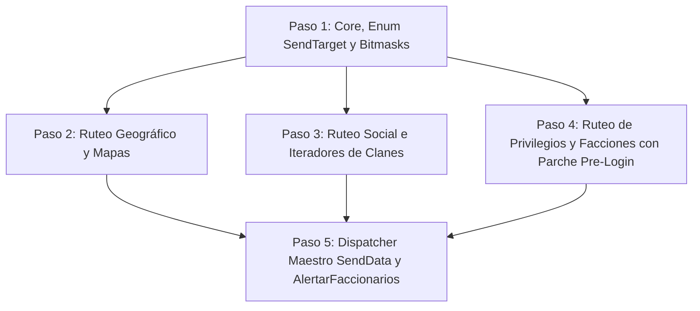

---
area: protocolo-de-red
source_files:
  - legacy/server/Codigo/modSendData.bas
  - legacy/server/Codigo/ModAreas.bas
  - legacy/server/Codigo/TCP.bas
  - legacy/server/Codigo/Protocol.bas
  - legacy/server/Codigo/Declares.bas
  - legacy/server/Codigo/modGuilds.bas
  - docs/audit/02-protocolo-de-red.md
  - docs/audit/02d-modsenddata-detalle.md
tags: [modsenddata, senddata, broadcast, multicast, areas, network, desglose, plan, span, cpp20]
last_updated: 2026-09-12
---

# Desglose Modular del Módulo de Despacho de Red `modSendData.bas` (Capa 4, Módulo #15)

Este documento establece la descomposición arquitectónica, las decisiones técnicas de diseño y la estrategia de implementación progresiva en C++20 para el módulo [`legacy/server/Codigo/modSendData.bas`](../../legacy/server/Codigo/modSendData.bas) (734 líneas en Visual Basic 6).

Conforme a las convenciones de porting del proyecto ([`docs/CONVENTIONS.md`](../CONVENTIONS.md)) y los hallazgos de la auditoría técnica ([`docs/audit/02d-modsenddata-detalle.md`](../audit/02d-modsenddata-detalle.md)), este desglose define un plan de trabajo dividido en **5 pasos lógicos secuenciales** antes de proceder a la escritura de código de producción.

---

## 1. Decisiones Estratégicas de Arquitectura en C++20

### 1.1. Zero-Copy Broadcasting con `std::span<const uint8_t>`
- **Diagnóstico Legacy**: En VB6, `SendData` y sus rutinas auxiliares recibían los paquetes serializados mediante el tipo `ByVal sndData As String` / `ByVal sdData As String`. Esto forzaba constantes asignaciones dinámicas y copias de buffers `BSTR` al despachar hacia múltiples destinatarios.
- **Implementación C++20**:
  - Toda la API de despacho utilizará vistas inmutables contiguas de memoria: `std::span<const uint8_t> data`.
  - Se admitirán sobrecargas de conveniencia con `std::string_view` (reinterpretando los caracteres como bytes) para facilitar la interoperabilidad con mensajes legibles o strings ASCII preexistentes.
  - Esto garantiza **cero copias intermedias**: el mismo buffer serializado en la pila o en un vector puede transmitirse secuencialmente a decenas o cientos de sockets sin duplicar memoria.

### 1.2. Bypass Explícito de la Cola `outgoingData` de `clsByteQueue`
- **Confirmación Histórica**: La auditoría comprobó que `modSendData.bas` **nunca escribe en `UserList(i).outgoingData` ni invoca a `FlushBuffer`**.
- **Diseño C++20**: Se preserva este principio de diseño. Las difusiones masivas (broadcast y multicast de paquetes preparados con `PrepareMessage...`) delegan **directamente** en la primitiva de socket `TCP::EnviarDatosASlot(user_index, data)`, evitando sobrecargar las colas individuales de usuario con mensajes idénticos.

### 1.3. Corrección Estricta de Bitmasks (Eliminación de `2 ^ X`)
- **Problema Legacy**: En `modSendData.bas:550-551`, el cálculo de máscaras en `SendToAreaByPos` se realizaba mediante el operador de exponenciación `2 ^ (AreaX \ 9)`, el cual opera en punto flotante (`Double`) e invoca funciones lentas de la runtime de VB (`__vbaPower`).
- **Implementación C++20**: Se emplearán exclusivamente corrimientos de bits enteros in-line (`constexpr`):
  ```cpp
  constexpr int area_pertenece_mask(int pos) noexcept {
      return 1 << (pos / 9);
  }
  ```

### 1.4. Mitigación de Bugs Legacy
1. **Descarte de `SendTarget.ToGM` Huérfano (Bug #21)**:
   - Declarado en el Enum legacy pero sin bloque de atención en el `Select Case` de `SendData`.
   - Se excluye del `enum class SendTarget` en C++20 ([`docs/implementation/KNOWN-LEGACY-BUGS.md`](KNOWN-LEGACY-BUGS.md#entrada-21--modsenddata-constante-sendtargettogm-huérfana-en-el-enumerador-de-ruteo)).
2. **Validación Obligatoria de `UserLogged` en Canales Globales/Faccionarios (Bug #22)**:
   - En el servidor original, los canales de facción (`ToCiudadanos`, `ToCriminales`, `ToReal`, `ToCaos`) y de staff (`ToAdmins`, `ToHigherAdmins`, `ToConsejo`, etc.) omitían chequear `flags.UserLogged`, transmitiendo paquetes de juego a sockets que aún estaban en la pantalla de login.
   - En C++20 se agrega el check explícito de usuario logueado en todas las ramas globales ([`docs/implementation/KNOWN-LEGACY-BUGS.md`](KNOWN-LEGACY-BUGS.md#entrada-22--modsenddata-omisión-de-verificación-userlogged-en-broadcasts-globales-administrativos-y-faccionarios)).

### 1.5. Frontera con `ModAreas.bas` (Capa 5 Proxy)
- `modSendData` (Capa 4) requiere iterar sobre los usuarios presentes en un mapa (`ConnGroups(Map)`) y evaluar las máscaras de visión (`AreasInfo`).
- Para mantener la separación de capas sin romper la estructura modular, `modSendData` accederá a las estructuras ya definidas en `Declares.hpp` (`ConnGroups`, `AreaInfo`, `UserList`), asegurando comprobaciones seguras de cotas (`is_valid_map()`) y verificación estricta de `ConnIDValida` / `is_connected()`.

---

## 2. Plan de Desglose en 5 Pasos Lógicos



---

### Paso 1: Core, Enumeración `SendTarget` y Helpers de Bitmasks

**Objetivo**: Establecer la cabecera base `include/server/network/mod_send_data.hpp`, el tipado fuerte y las utilidades matemáticas de cálculo de áreas.

#### Tareas Específicas:
1. Definir el espacio de nombres `ao::net::send_data`.
2. Declarar la enumeración strongly-typed `enum class SendTarget : uint8_t`, conteniendo los 29 valores válidos activos del servidor legacy (excluyendo el huérfano `ToGM`):
   - `ToAll = 1`, `ToMap`, `ToPCArea`, `ToAllButIndex`, `ToMapButIndex`, `ToNPCArea`, `ToGuildMembers`, `ToAdmins`, `ToPCAreaButIndex`, `ToAdminsAreaButConsejeros`, `ToDiosesYclan`, `ToConsejo`, `ToClanArea`, `ToConsejoCaos`, `ToRolesMasters`, `ToDeadArea`, `ToCiudadanos`, `ToCriminales`, `ToPartyArea`, `ToReal`, `ToCaos`, `ToCiudadanosYRMs`, `ToCriminalesYRMs`, `ToRealYRMs`, `ToCaosYRMs`, `ToHigherAdmins`, `ToGMsAreaButRmsOrCounselors`, `ToUsersAreaButGMs`, `ToUsersAndRmsAndCounselorsAreaButGMs`.
3. Implementar funciones auxiliares `inline constexpr`:
   - `area_pertenece_mask(int pos) noexcept -> int`: cálculo `1 << (pos / 9)`.
   - `area_recive_mask(int area_index) noexcept -> int`: cono de 3 áreas adyacentes `(1 << area) | (1 << (area - 1)) | (1 << (area + 1))`.
   - `is_valid_map_index(int map) noexcept -> bool`: validación de cotas seguras contra `NumMaps`.
4. Implementar adaptadores para recibir indistintamente `std::span<const uint8_t>` y `std::string_view`.

---

### Paso 2: Ruteo Geográfico (Áreas y Mapas)

**Objetivo**: Implementar las rutinas de difusión espacial sobre `ConnGroups` y matrices de visión.

#### Firmas a Implementar:
```cpp
void send_to_user_area(int user_index, std::span<const uint8_t> data);
void send_to_user_area_but_index(int user_index, std::span<const uint8_t> data);
void send_to_dead_user_area(int user_index, std::span<const uint8_t> data);
void send_to_area_by_pos(int map, int area_x, int area_y, std::span<const uint8_t> data);
void send_to_map(int map, std::span<const uint8_t> data);
void send_to_map_but_index(int user_index, std::span<const uint8_t> data);
void send_to_npc_area(int npc_index, std::span<const uint8_t> data);
```

#### Reglas de Negocio:
1. Validación temprana de mapa: si `!is_valid_map_index(map)`, abortar de inmediato (`return`).
2. Iteración acotada: recorrer exactamente `1` hasta `ConnGroups(map).CountEntrys`.
3. Test de intersección de áreas:
   ```cpp
   if ((UserList[temp_index].AreasInfo.AreaReciveX & area_x) &&
       (UserList[temp_index].AreasInfo.AreaReciveY & area_y)) {
       if (UserList[temp_index].ConnIDValida) {
           TCP::EnviarDatosASlot(temp_index, data);
       }
   }
   ```
4. En `send_to_dead_user_area`: filtrar `UserList[temp_index].flags.Muerto == 1` o pertenencia al staff (`Admin`, `Dios`, `SemiDios`, `Consejero`).
5. En `send_to_user_area_but_index` y `send_to_map_but_index`: verificar `temp_index != user_index`.

---

### Paso 3: Ruteo Social e Iteradores de Clanes y Parties

**Objetivo**: Implementar la difusión dirigida a grupos sociales (clanes y parties) interactuando con los iteradores de `modGuilds.hpp`.

#### Firmas a Implementar:
```cpp
void send_to_guild_members(int guild_index, std::span<const uint8_t> data);
void send_to_dioses_y_clan(int guild_index, std::span<const uint8_t> data);
void send_to_user_guild_area(int user_index, std::span<const uint8_t> data);
void send_to_user_party_area(int user_index, std::span<const uint8_t> data);
```

#### Reglas de Negocio:
1. `send_to_guild_members`: iterar mediante `modGuilds::m_Iterador_ProximoUserIndex(guild_index)`. Enviar si `ConnID != -1` y el usuario está conectado.
2. `send_to_dioses_y_clan`: iterar miembros del clan y adicionalmente Game Masters con `modGuilds::Iterador_ProximoGM(guild_index)`.
3. `send_to_user_guild_area`:
   - Si `UserList[user_index].GuildIndex == 0`, salir inmediatamente.
   - En el área local, reciben los miembros con mismo `GuildIndex` o administradores con rango `Dios` que no sean `RoleMaster`.
4. `send_to_user_party_area`:
   - Si `UserList[user_index].PartyIndex == 0`, salir inmediatamente.
   - En el área local, reciben únicamente quienes compartan el mismo `PartyIndex`.

---

### Paso 4: Ruteo de Privilegios y Facciones (con Parche Pre-Login)

**Objetivo**: Implementar los canales globales y locales de staff y facciones, aplicando la corrección del Bug #22.

#### Firmas a Implementar:
```cpp
// Canales Globales (1 To LastUser)
void send_to_all(std::span<const uint8_t> data);
void send_to_all_but_index(int user_index, std::span<const uint8_t> data);
void send_to_admins(std::span<const uint8_t> data);
void send_to_higher_admins(std::span<const uint8_t> data);
void send_to_consejo(std::span<const uint8_t> data);
void send_to_consejo_caos(std::span<const uint8_t> data);
void send_to_roles_masters(std::span<const uint8_t> data);
void send_to_ciudadanos(std::span<const uint8_t> data);
void send_to_criminales(std::span<const uint8_t> data);
void send_to_real(std::span<const uint8_t> data);
void send_to_caos(std::span<const uint8_t> data);
void send_to_ciudadanos_y_rms(std::span<const uint8_t> data);
void send_to_criminales_y_rms(std::span<const uint8_t> data);
void send_to_real_y_rms(std::span<const uint8_t> data);
void send_to_caos_y_rms(std::span<const uint8_t> data);

// Canales Locales por Área y Privilegios
void send_to_admins_but_consejeros_area(int user_index, std::span<const uint8_t> data);
void send_to_gms_area_but_rms_or_counselors(int user_index, std::span<const uint8_t> data);
void send_to_users_area_but_gms(int user_index, std::span<const uint8_t> data);
void send_to_users_and_rms_and_counselors_area_but_gms(int user_index, std::span<const uint8_t> data);
```

#### Reglas de Negocio y Mitigación:
1. **Mitigación Bug #22**: En todos los canales globales que iteran `1 To LastUser`, evaluar:
   ```cpp
   if (UserList[i].ConnID != -1 && UserList[i].flags.UserLogged) { ... }
   ```
   Evita que usuarios en proceso de conexión o selección de personaje reciban mensajes de gameplay o staff.
2. Filtros de facción:
   - Ciudadanos: `!criminal(i)`.
   - Criminales: `criminal(i)`.
   - Armada Real: `UserList[i].Faccion.ArmadaReal == 1`.
   - Fuerzas del Caos: `UserList[i].Faccion.FuerzasCaos == 1`.
3. Staff exclusivo en `send_to_gms_area_but_rms_or_counselors`:
   ```cpp
   const auto priv = UserList[temp_index].flags.Privilegios;
   if ((priv & ~PlayerType::User & ~PlayerType::Consejero & ~PlayerType::RoleMaster) == priv) { ... }
   ```

---

### Paso 5: Dispatcher Maestro `SendData` y Anomalía `AlertarFaccionarios`

**Objetivo**: Integrar todas las rutas en el despachador unificado `SendData` y portar la rutina especializada de auxilio faccionario.

#### Firmas a Implementar:
```cpp
void send_data(SendTarget route, int index, std::span<const uint8_t> data);
void alertar_faccionarios(int user_index);
```

#### Reglas de Negocio:
1. `send_data`:
   - `switch (route)` exhaustivo cubriendo los 29 casos sin `default` para que el compilador garantice cobertura completa.
   - Enrutamiento directo a las rutinas de los Pasos 2, 3 y 4.
2. `alertar_faccionarios`:
   - Obtener mapa del emisor (`UserList[user_index].Pos.Map`).
   - Determinar fuente de color según facción (`esCaos(user_index) ? FONTTYPE_CONSEJOCAOS : FONTTYPE_CONSEJO`).
   - Recorrer `ConnGroups(map)` y notificar a cada receptor con `SameFaccion(user_index, temp_index)` indicando la dirección relativa devuelta por `GetDireccion(user_index, temp_index)`.

---

## 3. Estrategia de Testing Unitario (`test_modsenddata.cpp`)

Se implementará una suite de pruebas en **doctest** cubriendo los 5 pasos:

1. **Test de Bitmasks y Cotas**:
   - Validación de `area_pertenece_mask` para coordenadas 1, 9, 10, 50, 100.
   - Validación de `area_recive_mask` para áreas en extremos (0 y 11) y centrales.
2. **Test de Bypass y Zero-Copy**:
   - Comprobación de que `SendData` entrega los bytes exactamente como fueron provistos a un interceptor de `TCP::EnviarDatosASlot` sin mutar `outgoingData`.
3. **Test de Ruteo Geográfico**:
   - Dos usuarios en la misma área (deben recibir).
   - Dos usuarios en áreas contiguas dentro del cono de 3x3 (deben recibir).
   - Dos usuarios en áreas alejadas o en mapas distintos (no deben recibir).
   - Exclusión de `send_to_user_area_but_index`.
4. **Test de Mitigación de Bug #22**:
   - Conexión con `ConnID != -1` pero `UserLogged = false` intentando recibir `ToCiudadanos` o `ToAdmins`: debe ignorarse y no despachar bytes.
5. **Test de Grupos Sociales**:
   - Miembros del mismo clan vs. clan distinto.
   - Miembros de la misma party vs. party distinta.
   - Comportamiento ante `GuildIndex = 0` o `PartyIndex = 0`.

---

## 4. Trazabilidad y Cumplimiento de Reglas

| Elemento | Archivo Legacy | Destino C++20 | Estado |
| :--- | :--- | :--- | :---: |
| Enum `SendTarget` | `modSendData.bas:34-64` | `include/server/network/mod_send_data.hpp` | Limpio (sin `ToGM`, Bug #21) |
| Helpers de Áreas | `modSendData.bas:550-551` | `include/server/network/mod_send_data.hpp` | `constexpr` bitshifts |
| Rutinas de Mapa y Área | `modSendData.bas:305-614` | `src/server/network/mod_send_data.cpp` | `std::span<const uint8_t>` |
| Canales Globales | `modSendData.bas:75-290` | `src/server/network/mod_send_data.cpp` | Parche Bug #22 (`UserLogged`) |
| Dispatcher Maestro | `modSendData.bas:66-303` | `src/server/network/mod_send_data.cpp` | `switch` exhaustivo |
| `AlertarFaccionarios` | `modSendData.bas:723-762` | `src/server/network/mod_send_data.cpp` | Portado fiel |
