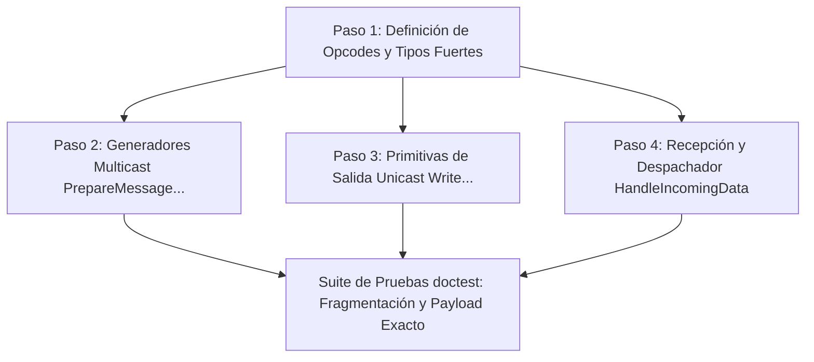

# Desglose Modular de la Infraestructura de Red de `Protocol.bas` (Capa 4, Módulo #16)

Este documento establece la descomposición arquitectónica, los requerimientos técnicos y el plan de implementación progresiva en C++20 para la **infraestructura de red y transporte binario** del módulo `legacy/server/Codigo/Protocol.bas`.

`Protocol.bas` es el componente más extenso del servidor original (con 16.874 líneas en Visual Basic 6) y está clasificado en `docs/implementation/00-port-plan.md` dentro de la **Capa 4 (Infraestructura de Red)** como módulo de **Categoría Crítica 2 (Opcodes)**.

> [!IMPORTANT]
> ### Enfoque Iterativo: Faseado por Infraestructura
> Conforme al análisis de desacoplamiento de `docs/audit/02e-protocol-detalle.md` y las directivas de capas de `docs/CONVENTIONS.md`, esta primera iteración **NO portará la lógica de juego** (combate, comercio, clanes, hechizos, inventario ni comandos de Game Masters).
> 
> Esta fase implementa **exclusivamente la capa de transporte binario y framing de red**:
> 1. Definición completa y fuertemente tipada de los opcodes de cliente y servidor.
> 2. Motor generador multicast `PrepareMessage...` reentrante para consumo directo de `modSendData`.
> 3. Primitivas de salida unicast `Write...` sobre `outgoingData`, erradicando el bug histórico del bucle infinito por `NOT_ENOUGH_SPACE` + `Resume`.
> 4. Bucle principal de recepción y defragmentación `HandleIncomingData` con validación de estado de sesión (`UserLogged`), transaccionalidad atómica y despacho a *stubs* desacoplados.
> 5. Suite de pruebas de regresión y estrés con `doctest` para validación de alineación binaria y fragmentación TCP.

---

## 1. Políticas de Transliteración Estructural (`Structural Port & Naming Policy`)

Conforme a las directivas fundacionales de `docs/CONVENTIONS.md`, este proyecto es una transliteración directa y estructural de la base de código de VB6 a C++, diseñada para brindar **máxima familiaridad a los desarrolladores de VB6**, priorizando la identidad histórica del código por encima de cualquier patrón de diseño idiomático de C++ moderno.

Para la fase de código de `Protocol.bas`, rigen las siguientes **reglas inquebrantables**:

1. **Nomenclatura Exacta de Primitivas Unicast**:
   - Los 101 métodos de serialización saliente unicast DEBEN nombrarse **EXACTAMENTE** `Write...` en PascalCase (ejemplos: `WriteUpdateHP`, `WriteConsoleMsg`, `WriteChangeInventorySlot`, `WritePosUpdate`).
   - Queda terminantemente prohibido convertirlos a `snake_case` (como `write_update_hp`).

2. **Nomenclatura Exacta de Generadores Multicast**:
   - Los métodos generadores para difusión DEBEN llamarse **EXACTAMENTE** `PrepareMessage...` en PascalCase (ejemplos: `PrepareMessageChatOverHead`, `PrepareMessageCharacterMove`, `PrepareMessageCreateFX`).
   - Queda terminantemente prohibido convertirlos a `snake_case` (como `prepare_message_chat_overhead`).

3. **Nomenclatura Exacta de Enumeraciones**:
   - Las enumeraciones principales de opcodes DEBEN denominarse **EXACTAMENTE** `ClientPacketID` y `ServerPacketID`.
   - Cada enumerador interno preserva su nombre original de VB6 (`LoginExistingChar`, `ThrowDices`, `Walk`, `Logged`, `UpdateHP`, etc.).

4. **Despachador Monolítico Central en `HandleIncomingData`**:
   - El procedimiento central de recepción `HandleIncomingData` **DEBE estructurarse obligatoriamente como un despachador central monolítico con un `switch` gigante**, preservando la forma estructural exacta del `Select Case` de VB6.
   - **Prohibición Expresa de Abstracciones Modernas**: Queda estrictamente prohibido refactorizar este despachador hacia patrones como tablas de punteros a funciones (`std::unordered_map<ClientPacketID, Handler>`), Command Pattern, polimorfismo orientado a objetos o dispatchers dinámicos basados en lambdas. El código debe leerse exactamente como el original, donde cada opcode tiene su `case ClientPacketID::...` secuencial.

5. **Consumo Directo de Variables de Estado Global**:
   - Todas las estructuras globales (`UserList`, `ConnGroups`, `LastUser`, `NumMaps`, etc.) deben consumirse de forma directa tal como lo hacía VB6, sin inyectar capas intermedias de abstracción, repositorios ficticios o contenedores de dependencias no presentes en el diseño original.

---

## 2. Diagnóstico del Sistema Legacy y Decisiones Arquitectónicas en C++20

### 2.1. Erradicación Definitiva del Bug #19 (`NOT_ENOUGH_SPACE` + `Resume`)
- **Problema Legacy**: En VB6, cada una de las 101 funciones `Write...` contenía el siguiente manejador de errores:
  ```vb
  ErrorHandler:
      If Err.Number = NOT_ENOUGH_SPACE Then
          Call FlushBuffer(UserIndex)
          Resume
      End If
  ```
  Si la conexión entraba en congestión y el socket respondía con `WSAEWOULDBLOCK`, `FlushBuffer` no lograba vaciar la cola, provocando un salto `Resume` continuo que bloqueaba el servidor al 100% de CPU en un bucle ocupado infinito (`docs/implementation/KNOWN-LEGACY-BUGS.md#entrada-19`).
- **Solución en C++20**:
  - **Eliminación Total de `Resume`**: Las primitivas `Write...` escriben en la cola elástica individual del usuario sin capturar excepciones de desbordamiento artificial.
  - **Backpressure Delegado en Capa 4**: La protección contra saturación ya está integrada en `TCP::EnviarDatosASlot` mediante colas de envío asíncronas con cota estricta (`MAX_OUTGOING_BUFFER_SIZE = 64 KB`). Si un cliente no drena datos, el subsistema de red desconecta el slot por congestión sin afectar al resto del servidor.

### 2.2. Generación Multicast Reentrante sin Estado Global
- **Problema Legacy**: Las rutinas `PrepareMessage...` utilizaban una única instancia global compartida:
  ```vb
  Private auxiliarBuffer As New clsByteQueue
  ```
  Esto impedía la reentrancia, provocaba condiciones de carrera si dos subsistemas intercalaban serializaciones y forzaba conversiones innecesarias a tipo `String` de Visual Basic.
- **Solución en C++20**:
  - Las funciones `PrepareMessage...` serializan en buffers locales eficientes o retornan vectores binarios contiguos (`std::vector<uint8_t>`) o vistas (`std::span<const uint8_t>`).
  - Estos búferes se entregan directamente a `modSendData::SendData`, permitiendo difusión masiva sin copias intermedias (*zero-copy broadcasting*).

### 2.3. Desfragmentación Atómica y Eliminación de Recursión
- **Problema Legacy**:
  - `HandleIncomingData` en VB6 utilizaba llamadas recursivas al procesar ráfagas con múltiples paquetes (`Call HandleIncomingData(UserIndex)`), exponiendo al servidor a desbordamiento de pila (*stack overflow*) ante ráfagas maliciosas.
  - El manejo de fragmentación TCP creaba y copiaba objetos temporales enteros de `clsByteQueue` para intentar decodificar cadenas dinámicas.
- **Solución en C++20**:
  - **Bucle Iterativo `while`**: Toda ráfaga recibida se drena mediante un bucle iterativo controlado.
  - **Inspección Segura (`PeekByte`)**: Se inspecciona el opcode sin extraerlo hasta corroborar la disponibilidad mínima de bytes.
  - **Transaccionalidad Atómica**: Si la cola no contiene la totalidad de los datos del paquete (verificado por longitud fija o por captura de `NotEnoughDataException` en paquetes dinámicos), se aborta la iteración (`break`) preservando la cola intacta para el próximo evento de red de Asio.

---

## 3. Estructura del Desglose en 4 Pasos Lógicos



---

### Paso 1: Definición de Opcodes (`ClientPacketID` y `ServerPacketID`)

**Objetivo**: Establecer las definiciones fuertemente tipadas en C++20 de todos los identificadores de paquetes, constantes de protocolo y enumeradores de soporte visual y de diálogo.

#### Archivos Involucrados:
- `src/server/Protocol.hpp`

#### Especificación Técnica:
1. **Enumeración `ClientPacketID` (129 Opcodes de Entrada, Base 0)**:
   - Declarada como `enum class ClientPacketID : uint8_t`.
   - Transcripción uno a uno garantizando los valores binarios exactos del cliente legacy (VB6 asigna base 0 por defecto a enums sin inicializador explícito):
     - `LoginExistingChar = 0`
     - `ThrowDices = 1`
     - `LoginNewChar = 2`
     - `Talk = 3`, `Yell = 4`, `Whisper = 5`, `Walk = 6`, `RequestPositionUpdate = 7`
     - `Attack = 8`, `PickUp = 9`, `SafeToggle = 10`, `ResuscitationSafeToggle = 11`
     - ... (todos los paquetes intermedios de interacción, hechizos, inventario, clanes)
     - `GMCommands = 122`, `InitCrafting = 123`, `Home = 124`, `ShowGuildNews = 125`, `ShareNpc = 126`, `StopSharingNpc = 127`, `Consultation = 128`.
   - Constante centinela: `constexpr uint8_t LAST_CLIENT_PACKET_ID = 128;` (coincide exactamente con `Consultation = 128` en base 0).

2. **Enumeración `ServerPacketID` (104 Opcodes de Salida, Base 0)**:
   - Declarada como `enum class ServerPacketID : uint8_t`.
   - Mapeo byte-exacto de los mensajes emitidos hacia el cliente:
     - `Logged = 0`
     - `RemoveDialogs = 1`, `RemoveCharDialog = 2`, `NavigateToggle = 3`, `Disconnect = 4`
     - `CommerceEnd = 5`, `BankEnd = 6`, `CommerceInit = 7`, `BankInit = 8`
     - `UpdateSta = 15`, `UpdateMana = 16`, `UpdateHP = 17`, `UpdateGold = 18`
     - `ChangeMap = 21`, `PosUpdate = 22`, `ChatOverHead = 23`, `ConsoleMsg = 24`
     - ... (inventario, diálogos, efectos visuales, clanes, estado de facción)
     - `MultiMessage = 101`, `StopWorking = 102`, `CancelOfferItem = 103`.

3. **Enumeradores Auxiliares**:
   - `FontTypeNames : uint8_t`: 21 estilos de fuente de consola (`FONTTYPE_TALK = 0`, `FONTTYPE_FIGHT`, `FONTTYPE_WARNING`, `FONTTYPE_SERVER`, etc.).
   - `eEditOptions : uint8_t`: Enumerador de opciones de edición de personajes.
   - `PacketParseResult : uint8_t`:
     ```cpp
     enum class PacketParseResult : uint8_t {
         Ok,                 // Paquete procesado exitosamente
         NeedMoreData,       // Fragmentación detectada, se requieren más bytes
         InvalidSession,     // Intento de acción ilegal para el estado actual de sesión
         MalformedData,      // Carga corrupta o que viola límites del protocolo
         UnknownPacket       // Opcode no registrado
     };
     ```

#### Criterios de Aceptación:
- `sizeof(ClientPacketID) == 1` y `sizeof(ServerPacketID) == 1`.
- Coincidencia byte a byte de los identificadores con respecto al cliente VB6 original.

---

### Paso 2: Generadores Multicast (`PrepareMessage...`)

**Objetivo**: Implementar las funciones encargadas de formatear mensajes binarios en memoria y retornar buffers serializados para ser consumidos por el subsistema `modSendData` a través de `SendData`.

#### Archivos Involucrados:
- `src/server/Protocol.hpp`
- `src/server/Protocol.cpp`

#### Decisiones de Diseño:
- **Retorno Eficiente**: Las funciones retornan `std::vector<uint8_t>` listo para transmitirse vía `std::span<const uint8_t>` a través de `modSendData::SendData`.
- **Independencia de Estado Global**: Cada invocación instancia su propio escritor local o utiliza un búfer reservado en pila, permitiendo concurrencia segura y reentrancia completa.

#### Catálogo de Rutinas Multicast Nativas en `Protocol.bas`:
1. `PrepareMessageSetInvisible(int16_t CharIndex, bool invisible)`
2. `PrepareMessageCharacterChangeNick(int16_t CharIndex, std::string_view newNick)`
3. `PrepareMessageChatOverHead(std::string_view Chat, int16_t CharIndex, uint32_t color)`
4. `PrepareMessageConsoleMsg(std::string_view Chat, FontTypeNames FontIndex)`
5. `PrepareMessageCreateFX(int16_t CharIndex, int16_t FX, int16_t FXLoops)`
6. `PrepareMessagePlayWave(uint8_t wave, uint8_t X, uint8_t Y)`
7. `PrepareMessageGuildChat(std::string_view Chat)`
8. `PrepareMessageShowMessageBox(std::string_view Chat)`
9. `PrepareMessagePlayMidi(uint8_t midi, int16_t loops)`
10. `PrepareMessagePauseToggle()`
11. `PrepareMessageRainToggle()`
12. `PrepareMessageObjectDelete(uint8_t X, uint8_t Y)`
13. `PrepareMessageBlockPosition(uint8_t X, uint8_t Y, bool Blocked)`
14. `PrepareMessageObjectCreate(int16_t GrhIndex, uint8_t X, uint8_t Y)`
15. `PrepareMessageCharacterRemove(int16_t CharIndex)`
16. `PrepareMessageRemoveCharDialog(int16_t CharIndex)`
17. `PrepareMessageCharacterCreate(...)` (cuerpo, cabeza, dirección, nombre, posición, etc.)
18. `PrepareMessageCharacterChange(...)`
19. `PrepareMessageCharacterMove(int16_t CharIndex, uint8_t X, uint8_t Y)`
20. `PrepareMessageForceCharMove(uint8_t Direccion)`
21. `PrepareMessageUpdateTagAndStatus(int16_t UserIndex, uint8_t NickColor, ...)`
22. `PrepareMessageErrorMsg(std::string_view message)`

*(Nota: En caso de requerirse generadores adicionales para mensajes de broadcast de áreas o clanes, se mantendrá estrictamente el prefijo `PrepareMessage...` en PascalCase).*

#### Criterios de Aceptación:
- Formateo de bytes idéntico a las salidas de referencia de Visual Basic 6.
- Cero fugas de memoria y compatibilidad directa con `modSendData::SendData`.

---

### Paso 3: Primitivas de Salida Unicast (`Write...`)

**Objetivo**: Implementar las 101 funciones de serialización individual directa sobre la cola `UserList[UserIndex].outgoingData`, suprimiendo los patrones de bloqueo y bucle infinito del código legacy.

#### Archivos Involucrados:
- `src/server/Protocol.hpp`
- `src/server/Protocol.cpp`

#### Especificación de Infraestructura y Vaciado:
1. **Función `FlushBuffer(int16_t UserIndex)`**:
   - Inspecciona `UserList[UserIndex].outgoing_data.length()`.
   - Si contiene datos acumulados, extrae el bloque completo y lo envía de forma atómica a `TCP::EnviarDatosASlot(UserIndex, data)`.
   - `outgoing_data` queda limpia para el siguiente ciclo.
2. **Eliminación de la Excepción Artificial `NOT_ENOUGH_SPACE`**:
   - `clsByteQueue` en C++ gestiona crecimiento dinámico seguro.
   - Las rutinas `Write...` encolan directamente en `outgoing_data`.
   - No existe directiva `Resume` ni reintentos bloqueantes. La gestión de saturación es delegada limpiamente a la capa de transporte TCP.

#### Familias de Rutinas `Write...` (101 Métodos en PascalCase):
- **Ciclo de Conexión y Autenticación**: `WriteLogged`, `WriteDisconnect`, `WriteErrorMsg`, `WriteUserIndexInServer`, `WriteUserCharIndexInServer`.
- **Estadísticas y Atributos**: `WriteUpdateUserStats`, `WriteUpdateHP`, `WriteUpdateMana`, `WriteUpdateSta`, `WriteUpdateGold`, `WriteUpdateBankGold`, `WriteUpdateExp`, `WriteAttributes`, `WriteFame`, `WriteMiniStats`, `WriteLevelUp`.
- **Inventario, Banco y Comercio**: `WriteChangeInventorySlot`, `WriteChangeBankSlot`, `WriteChangeSpellSlot`, `WriteAddSlots`, `WriteTradeOK`, `WriteBankOK`, `WriteChangeUserTradeSlot`, `WriteChangeNPCInventorySlot`, `WriteOfferDetails`.
- **Entorno y Movimiento**: `WritePosUpdate`, `WriteChangeMap`, `WriteCharacterCreate`, `WriteCharacterRemove`, `WriteCharacterMove`, `WriteForceCharMove`, `WriteCharacterChange`, `WriteObjectCreate`, `WriteObjectDelete`, `WriteBlockPosition`.
- **Consola y Diálogos**: `WriteConsoleMsg`, `WriteChatOverHead`, `WriteShowMessageBox`, `WriteGuildChat`, `WriteShowSignal`.
- **Efectos y Estados**: `WriteCreateFX`, `WritePlayWave`, `WritePlayMidi`, `WriteBlind`, `WriteBlindNoMore`, `WriteDumb`, `WriteDumbNoMore`, `WriteParalizeOK`, `WriteMeditateToggle`, `WriteSetInvisible`.
- **Clanes y Facciones**: `WriteGuildList`, `WriteGuildNews`, `WriteGuildLeaderInfo`, `WriteGuildMemberInfo`, `WriteGuildDetails`, `WriteShowGuildFundationForm`, `WriteShowGuildAlign`, `WriteAlianceProposalsList`, `WritePeaceProposalsList`.
- **Paneles de Game Master y Administración**: `WriteSpawnList`, `WriteShowSOSForm`, `WriteShowPartyForm`, `WriteShowMOTDEditionForm`, `WriteShowGMPanelForm`, `WriteUserNameList`.
- **Misceláneos**: `WritePong`, `WriteSendNight`, `WritePauseToggle`, `WriteRainToggle`, `WriteStopWorking`, `WriteCancelOfferItem`, `WriteDiceRoll`.

#### Criterios de Aceptación:
- Cada rutina serializa el `ServerPacketID` correspondiente seguido de sus parámetros exactos con el orden y tamaño de tipos de VB6.
- Inexistencia de cualquier forma de bucle ocupado o bloqueo ante sobrecarga de paquetes.

---

### Paso 4: Bucle de Recepción, Desfragmentación y Despachador Monolítico (`HandleIncomingData`)

**Objetivo**: Implementar la lógica central de recepción de paquetes por conexión en `HandleIncomingData(int16_t UserIndex)`, estructurada como un despachador monolítico central con un `switch` gigante que replica fielmente el `Select Case` de VB6.

#### Archivos Involucrados:
- `src/server/Protocol.hpp`
- `src/server/Protocol.cpp`

#### Lógica de Ejecución del Bucle Iterativo:
```cpp
void HandleIncomingData(int16_t UserIndex) {
    auto& user = UserList[UserIndex];
    
    while (user.incoming_data.length() > 0) {
        // 1. Lectura no destructiva inicial (PeekByte)
        uint8_t raw_opcode = 0;
        if (!user.incoming_data.peek_byte(raw_opcode)) {
            break;
        }
        
        auto opcode = static_cast<ClientPacketID>(raw_opcode);
        
        // 2. Validación estricta del estado de sesión (UserLogged)
        if (!user.flags.UserLogged) {
            // Solo se admiten paquetes pre-login
            if (opcode != ClientPacketID::LoginExistingChar &&
                opcode != ClientPacketID::ThrowDices &&
                opcode != ClientPacketID::LoginNewChar) {
                // Violación de seguridad de protocolo: desconexión inmediata
                TCP::CloseSocket(UserIndex);
                return;
            }
        } else {
            // Usuario ya autenticado: paquetes de login son ilegales
            if (opcode == ClientPacketID::LoginExistingChar ||
                opcode == ClientPacketID::LoginNewChar) {
                TCP::CloseSocket(UserIndex);
                return;
            }
        }
        
        // 3. Reseteo de contadores de inactividad
        if (raw_opcode <= LAST_CLIENT_PACKET_ID) {
            user.Counters.IdleCount = 0;
            user.flags.NoPuedeSerAtacado = false;
        }
        
        // 4. Despachador Monolítico Switch (Réplica exacta del Select Case de VB6)
        PacketParseResult res = DispatchPacket(UserIndex, opcode);
        
        if (res == PacketParseResult::NeedMoreData) {
            // Fragmentación TCP: faltan bytes para completar el paquete.
            // La cola retiene los bytes intactos y se interrumpe el ciclo hasta la próxima lectura.
            break;
        }
        
        if (res == PacketParseResult::MalformedData || res == PacketParseResult::UnknownPacket) {
            // Paquete malicioso, corrupto o desconocido: desconexión
            TCP::CloseSocket(UserIndex);
            return;
        }
        
        // res == PacketParseResult::Ok -> El paquete consumió sus bytes y continúa la ráfaga.
    }
    
    // Al concluir el drenaje de la ráfaga, vaciar las respuestas acumuladas en outgoingData
    FlushBuffer(UserIndex);
}
```

#### Estructura del `switch` Monolítico y Stubs:
- El despacho dentro de `DispatchPacket(UserIndex, opcode)` implementa un gran `switch (opcode)` exhaustivo para los 129 `ClientPacketID`.
- Cada `case` extrae sus tipos de datos primitivos de `incoming_data`:
  ```cpp
  case ClientPacketID::Walk: {
      if (user.incoming_data.length() < 2) return PacketParseResult::NeedMoreData;
      user.incoming_data.read_byte(); // Consume opcode
      uint8_t heading = user.incoming_data.read_byte();
      HandleWalkStub(UserIndex, heading);
      return PacketParseResult::Ok;
  }
  ```
- Cada rama delega en un *stub* de lógica vacío (ej. `HandleWalkStub`, `HandleAttackStub`), el cual en esta fase de infraestructura solo registra trazas de depuración.
- Queda prohibido cualquier intermediario orientado a objetos o contenedor polimórfico.

#### Criterios de Aceptación:
- Bucle 100% iterativo (cero recursión).
- Estructura central de `switch` idéntica al `Select Case` de VB6.
- Tolerancia total a fragmentación sin corrupción de memoria.
- Desconexión inmediata de clientes con secuencias ilegales de autenticación.

---

## 4. Estrategia de Pruebas Unitarias con `doctest`

Se creará la suite `tests/test_protocol.cpp` integrada en el ejecutable `unit_tests.exe`.

### 4.1. Pruebas de Alineación Binaria y Opcodes
- Verificación estática con `static_assert` de los tamaños (`sizeof == 1`) y valores de los enumeradores `ClientPacketID` y `ServerPacketID`.
- Validación de correspondencia exacta contra las constantes originales de VB6.

### 4.2. Simulación de Fragmentación de Flujo TCP
- **Caso Paquete de Tamaño Fijo (`Walk`: Opcode 1B + Heading 1B = 2B)**:
  1. Se inyecta únicamente el primer byte (Opcode) en `incoming_data`.
  2. Se invoca `HandleIncomingData`.
  3. Se corrobora que la cola conserva el byte intacto (`length() == 1`), no se ejecutó el stub y el socket permanece abierto (`NeedMoreData`).
  4. Se inyecta el segundo byte (Heading).
  5. Se reejecuta `HandleIncomingData`.
  6. Se corrobora que el paquete fue consumido completamente, la cola queda vacía y el stub fue invocado con el valor correcto.
- **Caso Paquete Dinámico con Cadena (`Talk`: Opcode 1B + StrLen 2B + String NB)**:
  1. Se inyecta el opcode y la longitud del string, pero solo una porción del mensaje de texto.
  2. Se verifica que la transacción efectúa rollback, manteniendo los bytes íntegros.
  3. Se inyecta el fragmento restante de texto.
  4. Se confirma la deserialización íntegra sin errores de memoria.

### 4.3. Simulación de Ráfaga Multipaquetes Concatenados
- Se inyectan 3 paquetes válidos consecutivos en un único búfer de `incoming_data` (ej. `Ping`, `Walk`, `RequestPositionUpdate`).
- Se invoca `HandleIncomingData` una sola vez.
- Se corrobora que el bucle procesó y drenó los 3 paquetes en secuencia secuencial y exhaustiva, dejando la cola en 0 bytes.

### 4.4. Pruebas de Seguridad y Ciclo de Vida de Sesión
- Envío de un paquete de juego (`ClientPacketID::Attack`) con `flags.UserLogged = false` $\rightarrow$ Verificar que el socket es cerrado de inmediato (`TCP::CloseSocket`).
- Envío de un paquete de login (`ClientPacketID::LoginExistingChar`) con `flags.UserLogged = true` $\rightarrow$ Verificar que el socket es cerrado de inmediato.

### 4.5. Pruebas de Generación de Payloads Salientes
- **Validación de `PrepareMessage...`**:
  - Comparación byte a byte de las salidas generadas contra vectores binarios conocidos de referencia de VB6.
- **Validación de `Write...` y `FlushBuffer`**:
  - Invocación de múltiples primitivas `Write...` en secuencia.
  - Verificación de acumulación en `outgoing_data`.
  - Invocación de `FlushBuffer` y verificación de entrega atómica de la trama a `TCP::EnviarDatosASlot`.

---

## 5. Matriz de Trazabilidad con el Código Legacy

| Componente Legacy (VB6) | Componente C++20 | Función / Propósito | Estado |
| :--- | :--- | :--- | :---: |
| `Enum ClientPacketID` | `enum class ClientPacketID : uint8_t` | 129 Opcodes de entrada cliente $\rightarrow$ servidor (Base 0) | Implementado |
| `Enum ServerPacketID` | `enum class ServerPacketID : uint8_t` | 104 Opcodes de salida servidor $\rightarrow$ cliente (Base 0) | Implementado |
| `FontTypeNames`, `eEditOptions` | `enum class FontTypeNames`, `eEditOptions` | Formato visual y diálogos auxiliares | Implementado |
| `auxiliarBuffer` global | Búferes locales reentrantes | Serialización segura sin estado global | Planificado |
| `PrepareMessage...` | `PrepareMessage...` en PascalCase | Generación multicast/broadcast para `modSendData::SendData` | Planificado |
| `Write...` (101 funciones) | `Write...` en PascalCase | Serialización directa en `outgoing_data` | Planificado |
| `NOT_ENOUGH_SPACE` + `Resume` (Bug #19) | Eliminado / Backpressure en TCP | Prevención definitiva de congelamiento por 100% CPU | Planificado |
| `FlushBuffer` | `FlushBuffer` | Vaciado de cola individual hacia socket TCP | Planificado |
| `HandleIncomingData` (recursivo) | `HandleIncomingData` (iterativo + switch) | Drenaje iterativo con switch monolítico central | Planificado |
| Control `UserLogged` | Validación estricta de sesión | Prevención de paquetes fuera de secuencia y exploits | Planificado |
| `doctest` Test Suite | `tests/test_protocol.cpp` | Cobertura unitaria de fragmentación y alineación | Implementado (Paso 1) |

---

## 6. Próximos Pasos

1. **Aprobación del Plan de Desglose**: Confirmación del usuario sobre la estructura, enfoque de infraestructura y políticas de transliteración.
2. **Ejecución del Paso 1**: Creación de `src/server/Protocol.hpp` con enums fuertemente tipados (`ClientPacketID`, `ServerPacketID`) y constantes de protocolo. *(Completado)*
3. **Ejecución del Paso 2**: Implementación de los generadores multicast `PrepareMessage...`.
4. **Ejecución del Paso 3**: Implementación de las primitivas de salida `Write...` y `FlushBuffer`.
5. **Ejecución del Paso 4**: Implementación del despachador monolítico `HandleIncomingData` con su `switch` de 129 ramas y stubs de desacoplamiento.
6. **Ejecución de Pruebas**: Creación y validación de la suite en `tests/test_protocol.cpp` compilando con CMake.
