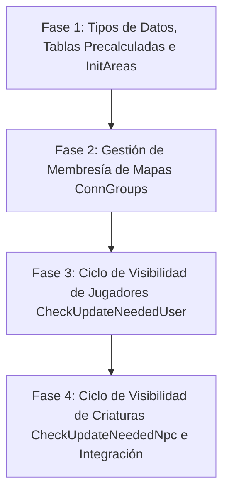

---
area: arquitectura-espacial
module_id: 17
source_files:
  - legacy/server/Codigo/ModAreas.bas
  - docs/audit/03-modareas-detalle.md
  - docs/CONVENTIONS.md
  - docs/implementation/KNOWN-LEGACY-BUGS.md
tags: [modareas, areas, visibilidad, cuadrantes, bitmask, breakdown, plan, cpp20]
last_updated: 2026-09-13
---

# Plan de Desglose Modular: Módulo de Gestión Espacial y Áreas `ModAreas.bas` (Capa 5, Módulo #17)

Este documento establece la planificación técnica detallada, las decisiones arquitectónicas y la estrategia de implementación progresiva en C++20 para el módulo [`legacy/server/Codigo/ModAreas.bas`](../../legacy/server/Codigo/ModAreas.bas) (~459 líneas en Visual Basic 6).

Conforme a las directivas de porting institucional de [`docs/CONVENTIONS.md`](../CONVENTIONS.md), los hallazgos de la auditoría técnica ([`docs/audit/03-modareas-detalle.md`](../audit/03-modareas-detalle.md)) y los registros estratégicos del Master Bug Ledger ([`docs/implementation/KNOWN-LEGACY-BUGS.md`](KNOWN-LEGACY-BUGS.md)), este desglose define un plan de trabajo estructurado en **cuatro fases secuenciales e independientes**.

---

## 1. Resumen Ejecutivo y Alcance

El subsistema de áreas constituye el mecanismo central de particionamiento espacial del servidor de Argentum Online. Su objetivo es confinar las transmisiones de red y los cálculos de visibilidad a una ventana rectangular de **3x3 franjas de área (27x27 tiles)** alrededor de cada observador, evitando la sobrecarga cuadrática $O(N^2)$ de broadcast global por mapa.

### Principios Rectores del Porting:
1. **Transliteración Estricta sin Optimizaciones Prematuras**: Se aplica de forma incondicional la Regla #4 de [`CONVENTIONS.md`](../CONVENTIONS.md). Se replican todas las fórmulas aritméticas, colisiones históricas y corrimientos lineales originales.
2. **Preservación de Offsets y Cotas Desfasadas**: Los campos de límites espaciales se implementarán con tipos enteros con signo (`int16_t`) para soportar los valores negativos originales (ej. `MinX = -9`) sin forzar clampleos prematuros en memoria.
3. **Membresía Contigua Determinista**: La gestión de usuarios conectados por mapa (`ConnGroups`) empleará arreglos contiguos planos con corrimiento lineal secuencial a la izquierda en remociones, garantizando el mismo orden de iteración y despacho que en VB6.
4. **Exclusión de Rutinas Muertas e I/O Obsoleta**: Se excluyen el arreglo no leído `PosToArea` y el subsistema bloqueante de persistencia horaria `AreasStats.dat` / `AreasOptimizacion`, calificados bajo la *Única Excepción* de [`CONVENTIONS.md`](../CONVENTIONS.md).

---

## 2. Decisiones Estratégicas y Guardrails de Arquitectura en C++20

### 2.1. Replicación Literal de la Fórmula de `AreaID` (Bug #24)
- **Diagnóstico Legacy**: En `ModAreas.bas:84`, el identificador de área se precalcula mediante el producto escalar simple:
  $$\text{AreaID}(X, Y) = \left( \left\lfloor \frac{X}{9} \right\rfloor + 1 \right) \times \left( \left\lfloor \frac{Y}{9} \right\rfloor + 1 \right)$$
  Esta fórmula no es inyectiva y genera colisiones entre franjas distintas (ej. (1,5) y (2,3) ambas dan 12).
- **Implementación C++20**: **Replicated**. Conforme a [`KNOWN-LEGACY-BUGS.md#entrada-24`](KNOWN-LEGACY-BUGS.md#entrada-24--modareas-colisión-de-areaid-por-producto-no-inyectivo), se preserva exactamente la fórmula original:
  ```cpp
  // Replicated: Preserva colisiones históricas de VB6 (LoopC \ 9 + 1) * (loopX \ 9 + 1)
  AreasInfo[x][y] = static_cast<uint8_t>((x / 9 + 1) * (y / 9 + 1));
  ```
  Queda terminantemente prohibido sustituirla por un índice inyectivo o plano.

### 2.2. Aritmética Literal y Tipado con Signo para Offsets Negativos (Bug #25)
- **Diagnóstico Legacy**: En `ModAreas.bas:186-187`, cuando $X < 9$, la fórmula `MinX = ((X \ 9) - 1) * 9` produce `-9`, valor que se almacena directamente en la estructura de la entidad `.AreasInfo.MinX = CInt(MinX)`. El clamp posterior `If MinX < 1 Then MinX = 1` solo altera la variable local de barrido inmediato.
- **Implementación C++20**: **Replicated**. Conforme a [`KNOWN-LEGACY-BUGS.md#entrada-25`](KNOWN-LEGACY-BUGS.md#entrada-25--modareas-persistencia-de-coordenadas-negativas-en-minx--miny), los campos `MinX` y `MinY` en `AreaInfo` se declaran como `int16_t`. Se preserva la asignación antes del clamp local, asegurando que los cálculos relativos subsiguientes al desplazarse al Este (`MinX + 27 = 18`) o Sur operen sobre la escala exacta de VB6.

### 2.3. Membresía de Mapas con Corrimiento Lineal Secuencial
- **Diagnóstico Legacy**: `ConnGroups(Map).UserEntrys` almacena una lista compacta de usuarios en base 1. Al remover un jugador (`QuitarUser`), ejecuta un escaneo lineal $O(N)$ y desplaza manualmente a la izquierda los elementos restantes.
- **Implementación C++20**: Conforme a la prohibición de optimización de estructuras de [`CONVENTIONS.md`](../CONVENTIONS.md), se utilizará un vector contiguo plano (`std::vector<int16_t>`), manteniendo la búsqueda secuencial y la remoción por corrimiento contiguo (`erase`). Queda descartado el uso de técnicas como *swap-and-pop* o tablas hash para asegurar paridad absoluta en el orden de iteración de red.

### 2.4. Cómputo Directo de Bitmasks sin Operadores de Punto Flotante
- **Diagnóstico Legacy**: VB6 utilizaba el operador exponencial `2 ^ TempInt` (que evalúa en punto flotante `Double`).
- **Implementación C++20**: Se utilizarán corrimientos de bits enteros:
  ```cpp
  constexpr int16_t area_pertenece_mask(int16_t franja) noexcept {
      return static_cast<int16_t>(1 << franja);
  }
  ```
  La tabla precalculada `AreasRecive[12]` encenderá los 3 bits correspondientes:
  $$\text{AreasRecive}[k] = (1 \ll k) \mid (k > 0 \,?\, (1 \ll (k-1)) : 0) \mid (k < 11 \,?\, (1 \ll (k+1)) : 0)$$

### 2.5. Exclusiones de Código Muerto e I/O Obsoleta (Bug #26)
- **`PosToArea`**: Matriz de 100 bytes inicializada pero jamás leída. Se excluye por código muerto.
- **`AreasStats.dat` / `AreasOptimizacion`**: Módulo arcaico de persistencia en disco de estadísticas horarias para predecir `ReDim Preserve`. Se excluye formalmente bajo la *Única Excepción* de [`CONVENTIONS.md`](../CONVENTIONS.md).

### 2.6. Preservación de Nombres e Interfaz Pública
Se preservan los nombres de los procedimientos públicos en PascalCase dentro del namespace `ModAreas`:
- `InitAreas()`
- `CheckUpdateNeededUser(int16_t user_index, uint8_t head, bool but_index = false)`
- `CheckUpdateNeededNpc(int16_t npc_index, uint8_t head)`
- `QuitarUser(int16_t user_index, int16_t map)`
- `AgregarUser(int16_t user_index, int16_t map, bool but_index = false)`
- `AgregarNpc(int16_t npc_index)`

---

## 3. Plan de Desglose en 4 Fases Secuenciales



---

### Fase 1: Tipos de Datos, Tablas Precalculadas e `InitAreas`

#### 1. Objetivos
- Definir la estructura `AreaInfo` con campos enteros con signo (`int16_t`) para `MinX` y `MinY`.
- Definir la estructura `ConnGroup` para representar la membresía de usuarios por mapa.
- Declarar la constante `USER_NUEVO = 255`.
- Precalcular la matriz estática `AreasInfo[101][101]` con la fórmula de producto literal.
- Precalcular la tabla `AreasRecive[12]` con las máscaras de 3 bits de adyacencia.
- Implementar `InitAreas()` para inicializar el estado espacial y reservar las entradas de `ConnGroups` para `1..NumMaps`.

#### 2. Declaraciones y Tipos C++20
```cpp
namespace ModAreas {

inline constexpr uint8_t USER_NUEVO = 255;

struct AreaInfo {
    int16_t AreaPerteneceX{0};
    int16_t AreaPerteneceY{0};
    int16_t AreaReciveX{0};
    int16_t AreaReciveY{0};
    int16_t MinX{0}; // Signed: almacena -9 en bordes
    int16_t MinY{0}; // Signed: almacena -9 en bordes
    int32_t AreaID{0};
};

struct ConnGroup {
    int32_t CountEntrys{0};
    int32_t OptValue{0};
    std::vector<int16_t> UserEntrys; // 1-based o índice contiguo compacto
};

void InitAreas();

// Consultas de tablas precalculadas
uint8_t GetAreaID(int16_t x, int16_t y) noexcept;
int16_t GetAreaRecive(int16_t franja) noexcept;

} // namespace ModAreas
```

#### 3. Escenarios de Pruebas Unitarias (Doctest)
- **T1.1**: Verificar que `InitAreas()` llena `AreasRecive[0..11]` correctamente:
  - `AreasRecive[0] == 3` (bits 0 y 1).
  - `AreasRecive[1] == 7` (bits 0, 1 y 2).
  - `AreasRecive[5] == (1<<4 | 1<<5 | 1<<6) == 112`.
  - `AreasRecive[11] == (1<<10 | 1<<11) == 3072`.
- **T1.2**: Verificar valores de `AreasInfo` en celdas límite y distribución de franjas:
  - Celda $(1, 1)$: $\text{FranjaX}=0, \text{FranjaY}=0 \implies (0+1) \times (0+1) = 1$.
  - Celda $(8, 8)$: Franja 0 $\implies \text{AreaID} = 1$.
  - Celda $(9, 9)$: Franja 1 $\implies (1+1) \times (1+1) = 4$.
  - Celda $(100, 100)$: Franja 11 $\implies (11+1) \times (11+1) = 144$.
- **T1.3**: Verificar colisiones esperadas históricas (Bug #24):
  - $(15, 50)$ [franja 1, 5] y $(20, 30)$ [franja 2, 3] ambos producen exactamente $\text{AreaID} = 12$.

---

### Fase 2: Gestión de Membresía de Mapas (`AgregarUser` y `QuitarUser`)

#### 1. Objetivos
- Implementar `AgregarUser(user_index, map, but_index)` asegurando la prevención de duplicados mediante búsqueda lineal $O(N)$ y reseteo de campos `AreasInfo`.
- Implementar `QuitarUser(user_index, map)` realizando la búsqueda lineal y el corrimiento hacia la izquierda secuencial preservando contigüidad.
- Despachar `CheckUpdateNeededUser(user_index, USER_NUEVO, but_index)` al enrolar un usuario.

#### 2. Algoritmo y Criterios de Paridad
```cpp
void AgregarUser(int16_t user_index, int16_t map, bool but_index) {
    if (!is_valid_map(map)) return;
    
    auto& group = ConnGroups[map];
    bool es_nuevo = true;
    
    // Búsqueda lineal secuencial exacta de VB6
    for (int32_t i = 0; i < group.CountEntrys; ++i) {
        if (group.UserEntrys[i] == user_index) {
            es_nuevo = false;
            break;
        }
    }
    
    if (es_nuevo) {
        group.UserEntrys.push_back(user_index);
        group.CountEntrys = static_cast<int32_t>(group.UserEntrys.size());
    }
    
    auto& areas = UserList[user_index].AreasInfo;
    areas.AreaID = 0;
    areas.AreaPerteneceX = 0;
    areas.AreaPerteneceY = 0;
    areas.AreaReciveX = 0;
    areas.AreaReciveY = 0;
    
    CheckUpdateNeededUser(user_index, USER_NUEVO, but_index);
}

void QuitarUser(int16_t user_index, int16_t map) {
    if (!is_valid_map(map)) return;
    
    auto& group = ConnGroups[map];
    auto it = std::find(group.UserEntrys.begin(), group.UserEntrys.end(), user_index);
    if (it == group.UserEntrys.end()) return;
    
    // Corrimiento lineal a la izquierda (preserva orden estricto de VB6)
    group.UserEntrys.erase(it);
    group.CountEntrys = static_cast<int32_t>(group.UserEntrys.size());
}
```

#### 3. Escenarios de Pruebas Unitarias (Doctest)
- **T2.1**: Insertar usuarios en mapa vacío y verificar incremento de `CountEntrys` y contenido contiguo.
- **T2.2**: Intentar insertar usuario duplicado: constatar que `CountEntrys` no incrementa y no se duplica en la lista.
- **T2.3**: Remover un usuario intermedio entre 3 usuarios (ej. [10, 20, 30], remover 20): verificar que la lista queda exactamente `[10, 30]` y `CountEntrys == 2`.
- **T2.4**: Intentar remover usuario inexistente: verificar que no produce excepción y la lista queda intacta.
- **T2.5**: Comprobar que `AgregarUser` resetea `AreaID = 0` y todas las máscaras a 0 antes de llamar a `CheckUpdateNeededUser`.

---

### Fase 3: Ciclo de Visibilidad y Transiciones de Jugadores (`CheckUpdateNeededUser`)

#### 1. Objetivos
- Evaluar control de salida temprana si `AreaID` coincide con la celda actual.
- Computar la franja emergente de barrido según la orientación (`NORTH`, `SOUTH`, `WEST`, `EAST`, `USER_NUEVO`), preservando la aritmética literal con signo (`int16_t`).
- Persistir el valor `-9` en `MinX` o `MinY` en `USER_NUEVO` para coordenadas menores a 9 (Bug #25).
- Despachar `WriteAreaChanged` al usuario que cruzó frontera.
- Recorrer el rectángulo emergente $[MinX, MaxX] \times [MinY, MaxY]$ (con cotas locales clampleadas a $[1, 100]$):
  - Notificación recíproca de jugadores (`MakeUserChar`), control de administradores invisibles, sincronización de invisibilidad (`WriteSetInvisible`) y vaciado de búfer (`FlushBuffer`).
  - Notificación de criaturas (`MakeNPCChar`).
  - Creación de objetos (`WriteObjectCreate`) y bloqueo de puertas (`Bloquear`).
- Actualizar bitmasks (`AreaReciveX/Y`, `AreaPerteneceX/Y`) y `AreaID`.

#### 2. Lógica de Rumbo y Offsets Literales
```cpp
int32_t min_x = user.AreasInfo.MinX;
int32_t min_y = user.AreasInfo.MinY;
int32_t max_x = 0;
int32_t max_y = 0;

if (head == eHeading::NORTH) {
    max_y = min_y - 1;
    min_y = min_y - 9;
    max_x = min_x + 26;
    user.AreasInfo.MinX = static_cast<int16_t>(min_x);
    user.AreasInfo.MinY = static_cast<int16_t>(min_y);
} else if (head == eHeading::SOUTH) {
    max_y = min_y + 35;
    min_y = min_y + 27;
    max_x = min_x + 26;
    user.AreasInfo.MinX = static_cast<int16_t>(min_x);
    user.AreasInfo.MinY = static_cast<int16_t>(min_y - 18);
} else if (head == eHeading::WEST) {
    max_x = min_x - 1;
    min_x = min_x - 9;
    max_y = min_y + 26;
    user.AreasInfo.MinX = static_cast<int16_t>(min_x);
    user.AreasInfo.MinY = static_cast<int16_t>(min_y);
} else if (head == eHeading::EAST) {
    max_x = min_x + 35;
    min_x = min_x + 27;
    max_y = min_y + 26;
    user.AreasInfo.MinX = static_cast<int16_t>(min_x - 18);
    user.AreasInfo.MinY = static_cast<int16_t>(min_y);
} else if (head == USER_NUEVO) {
    min_y = ((user.Pos.Y / 9) - 1) * 9;
    max_y = min_y + 26;
    min_x = ((user.Pos.X / 9) - 1) * 9;
    max_x = min_x + 26;
    user.AreasInfo.MinX = static_cast<int16_t>(min_x); // Almacena -9 si pos.X < 9
    user.AreasInfo.MinY = static_cast<int16_t>(min_y); // Almacena -9 si pos.Y < 9
}

// Clamp local exclusivo para el bucle de barrido inmediato
int32_t loop_min_x = std::clamp<int32_t>(min_x, 1, 100);
int32_t loop_min_y = std::clamp<int32_t>(min_y, 1, 100);
int32_t loop_max_x = std::clamp<int32_t>(max_x, 1, 100);
int32_t loop_max_y = std::clamp<int32_t>(max_y, 1, 100);
```

#### 3. Escenarios de Pruebas Unitarias (Doctest)
- **T3.1**: Movimiento sin cruce de frontera (misma celda o misma franja 9x9): comprobar salida inmediata `Exit Sub` sin emitir `AreaChanged`.
- **T3.2**: Login en $(5, 5)$ con `USER_NUEVO`:
  - Constatar que `user.AreasInfo.MinX == -9` y `MinY == -9` (Bug #25).
  - Constatar que el barrido se ejecuta en $[1, 17] \times [1, 17]$.
- **T3.3**: Desplazamiento hacia el Este (`EAST`) desde frontera:
  - Partiendo de `MinX = -9`, verificar que la franja emergente de barrido es $[18, 26]$.
  - Verificar que el nuevo `AreasInfo.MinX` guardado es $0$.
- **T3.4**: Despacho de paquetes: simular presencia de otro usuario y constatar que se invoca `MakeUserChar` en ambos sentidos y `FlushBuffer` para el observador.
- **T3.5**: Simular presencia de objeto y puerta: constatar emisión de `WriteObjectCreate` y `Bloquear`.

---

### Fase 4: Ciclo de Visibilidad de Criaturas (`CheckUpdateNeededNpc` y `AgregarNpc`)

#### 1. Objetivos
- Implementar `AgregarNpc(npc_index)` reseteando campos de área y llamando con `USER_NUEVO`.
- Implementar `CheckUpdateNeededNpc(npc_index, head)` calculando la franja emergente.
- Preservar la asimetría histórica de VB6:
  - Evalúa `If MapInfo(map).NumUsers != 0 Then`.
  - Notifica a los usuarios de la franja mediante `MakeNPCChar`.
  - **No ejecuta `FlushBuffer`** (a diferencia de los usuarios).
- Actualizar bitmasks y `AreaID` de la criatura.

#### 2. Escenarios de Pruebas Unitarias (Doctest)
- **T4.1**: `AgregarNpc` resetea `AreaID = 0` y ejecuta actualización inicial.
- **T4.2**: Movimiento de criatura cruzando área en mapa sin usuarios (`NumUsers == 0`): constatar que no se itera ni despacha ningún paquete, pero las máscaras del NPC se actualizan.
- **T4.3**: Movimiento de criatura cruzando área con usuarios presentes: constatar despacho de `MakeNPCChar` a los clientes situados en la franja emergente.

---

## 4. Matriz de Trazabilidad y Dependencias

| Procedimiento Legacy | Componente C++ | Archivo Destino | Pruebas Unitarias |
| :--- | :--- | :--- | :--- |
| `InitAreas` | `ModAreas::InitAreas` | `src/server/ModAreas.cpp` | `tests/test_modareas.cpp:TestInitAreas` |
| `AreasOptimizacion` | *Excluido (obsoleto)* | — | — |
| `CheckUpdateNeededUser` | `ModAreas::CheckUpdateNeededUser` | `src/server/ModAreas.cpp` | `tests/test_modareas.cpp:TestCheckUpdateNeededUser` |
| `CheckUpdateNeededNpc` | `ModAreas::CheckUpdateNeededNpc` | `src/server/ModAreas.cpp` | `tests/test_modareas.cpp:TestCheckUpdateNeededNpc` |
| `QuitarUser` | `ModAreas::QuitarUser` | `src/server/ModAreas.cpp` | `tests/test_modareas.cpp:TestQuitarUser` |
| `AgregarUser` | `ModAreas::AgregarUser` | `src/server/ModAreas.cpp` | `tests/test_modareas.cpp:TestAgregarUser` |
| `AgregarNpc` | `ModAreas::AgregarNpc` | `src/server/ModAreas.cpp` | `tests/test_modareas.cpp:TestAgregarNpc` |

---

## 5. Criterios de Aceptación y Validación

1. **Paridad de Fórmulas y Bits**:
   - `AreasInfo` replica exactamente las 121 IDs originales con sus colisiones matemáticas.
   - `AreasRecive` contiene exactamente las 12 máscaras de adyacencia de 3 bits.
2. **Determinismo Espacial y Membresía**:
   - `ConnGroups` mantiene el orden contiguo exacto de inserción y corrimiento a la izquierda.
   - Las coordenadas relativas negativas en bordes se almacenan en `int16_t` sin alteración.
3. **Despacho Asimétrico Conforme al Legacy**:
   - Cruce de frontera emite `WriteAreaChanged` al usuario en tránsito.
   - No se emite `CharacterRemove` por cambio de área.
   - Se emite `MakeUserChar` recíproco con `FlushBuffer` en usuarios, y `MakeNPCChar` sin `FlushBuffer` en NPCs.
4. **Validación Automática**:
   - Suite completa de pruebas unitarias implementada en `tests/test_modareas.cpp` aprobando el 100% de los casos.
