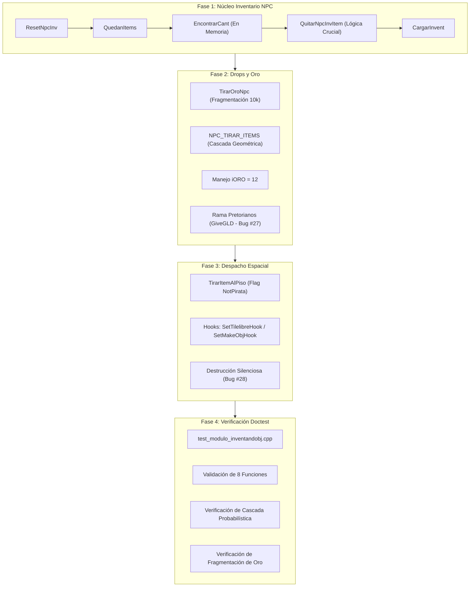

# Plan de Desglose Modular: Módulo de Inventario y Objetos `Modulo_InventANDobj.bas` (Capa 6, Módulo #18)

Este documento establece la planificación técnica detallada, las decisiones arquitectónicas y la estrategia de implementación progresiva en C++20 para el módulo [`legacy/server/Codigo/Modulo_InventANDobj.bas`](../../legacy/server/Codigo/Modulo_InventANDobj.bas) (346 líneas en Visual Basic 6, internamente `InvNpc`).

Conforme a las directivas de porting institucional de [`docs/CONVENTIONS.md`](../CONVENTIONS.md), los hallazgos de la auditoría técnica ([`docs/audit/04-inventario-objetos-detalle.md`](../audit/04-inventario-objetos-detalle.md)) y los registros estratégicos del Master Bug Ledger ([`docs/implementation/KNOWN-LEGACY-BUGS.md`](KNOWN-LEGACY-BUGS.md)), este desglose define un plan de trabajo estructurado en **cuatro fases secuenciales e independientes**.

---

## 1. Resumen Ejecutivo y Alcance

`Modulo_InventANDobj.bas` es el componente responsable del **inventario de criaturas y comerciantes**, el sistema probabilístico de drop al morir NPCs, la fragmentación de oro arrojado al suelo y la función utilitaria de posicionamiento de objetos en celdas transitables (`TirarItemAlPiso`).

### Delimitación de Responsabilidades:
1. **Dominio de `Modulo_InventANDobj` (Módulo #18)**:
   - Gestión de slots del inventario de NPCs (`Npclist(NpcIndex).Invent`).
   - Reposición automática de stock para comerciantes y tratamiento de ítems cruciales (`Crucial = 1`).
   - Algoritmo de drop probabilístico en cascada geométrica y rama de muerte de criaturas pretorianas (`NPC_TIRAR_ITEMS`).
   - Fragmentación de pilas de oro en montos de hasta `MAX_INVENTORY_OBJS` ($10.000$) (`TirarOroNpc`).
   - Despacho de ítems hacia celdas libres del mapa mediante `TirarItemAlPiso`.
2. **Dominio de `InvUsuario` (Módulo #19 - Fuera de este alcance)**:
   - Gestión de inventarios de jugadores (`UserList(UserIndex).Invent`).
   - Lógica de equipamiento (`EquiparInvItem`, `Desequipar`) y uso de ítems (`UseInvItem`).
   - Mutaciones canónicas sobre el mapa (`MakeObj`, `EraseObj`, `DropObj`, `GetObj`).
   - El exploit de duplicación en `DropObj` y la pérdida de saldo en `/TIRARORO` pertenecen a `InvUsuario.bas` y **no se intervienen en este módulo**.

### Estado de Cierre Proyectado:
Al finalizar su implementación y suite de pruebas, este módulo quedará formalmente categorizado como **`Completado (Aislado / Cableado Pendiente)`** conforme a [`docs/CONVENTIONS.md`](../CONVENTIONS.md#definición-formal-de-los-tres-estados-de-cierre-de-módulo-module-closure-states), quedando cerrado su código fuente C++ y desacoplado mediante hooks inyectables para `Tilelibre` (Capa 9) y `MakeObj` (Capa 6, Módulo #19).

---

## 2. Decisiones Estratégicas y Guardrails de Arquitectura en C++20

### 2.1. Transliteración Estructural Directa (Sin Unificación Prematura de Inventarios)
- **Directiva**: Queda terminantemente prohibido unificar los inventarios de jugadores y NPCs en jerarquías polimórficas o clases abstractas compartidas.
- **Implementación**: Las operaciones de inventario de NPCs operan directamente sobre la estructura `Inventario` embebida en `Npclist[npc_index].Invent`, tipada conforme a [`src/server/Declares.hpp`](../../src/server/Declares.hpp).
- **Naming Policy**: Se preservan los nombres originales en PascalCase en el namespace `Modulo_InventANDobj`:
  - `TirarItemAlPiso`
  - `NPC_TIRAR_ITEMS`
  - `QuedanItems`
  - `EncontrarCant`
  - `ResetNpcInv`
  - `QuitarNpcInvItem`
  - `CargarInvent`
  - `TirarOroNpc`

### 2.2. Aislamiento y Desacoplamiento Mediante Inyección de Hooks
Para permitir la compilación y prueba unitaria exhaustiva en `test_modulo_inventandobj.cpp` sin generar dependencias circulares con módulos superiores o no portados, la interfaz expondrá puntos de inyección de callbacks:
```cpp
namespace Modulo_InventANDobj {

// Firma para la búsqueda espacial de celdas libres (Modulo_UsUaRiOs.bas:Tilelibre)
using TilelibreHook = std::function<void(const WorldPos& pos, WorldPos& n_pos, const Obj& obj, bool agua, bool tierra)>;

// Firma para la creación física de objetos en el mapa (InvUsuario.bas:MakeObj)
using MakeObjHook = std::function<void(const Obj& obj, std::int16_t map, std::int16_t x, std::int16_t y)>;

void SetTilelibreHook(TilelibreHook hook) noexcept;
void SetMakeObjHook(MakeObjHook hook) noexcept;

} // namespace Modulo_InventANDobj
```

### 2.3. Eliminación de I/O Sincrónica a Disco en `EncontrarCant` y `CargarInvent`
- **Diagnóstico Legacy**: VB6 ejecutaba `GetVar(DatPath & "NPCs.dat", ...)` síncronamente durante el gameplay para reponer ítems cruciales en comerciantes.
- **Implementación C++20**: Las funciones de reposición consultarán un repositorio en memoria cargado previamente por `FileIO` (`NPCData` o tabla de plantillas de criaturas). En pruebas unitarias, se permitirá inyectar un proveedor de plantillas o stock base para garantizar determinismo y cero llamadas al sistema de archivos en el bucle caliente.

### 2.4. Replicación Estricta de Bugs y Asimetrías del Master Bug Ledger
1. **Descarte de `GiveGLD` en NPCs no pretorianos (Bug #27)**:
   - Conforme a [`KNOWN-LEGACY-BUGS.md` (Entrada #27)](KNOWN-LEGACY-BUGS.md#entrada-27--modulo_inventandobj-descarte-de-givegld-en-npcs-no-pretorianos), `NPC_TIRAR_ITEMS` solo evaluará y arrojará el campo `.GiveGLD` si `is_pretoriano == true`. Para criaturas regulares, el oro solo cae si está presente en la matriz `Drop(1..5)`.
2. **Destrucción silenciosa de ítems ante saturación espacial (Bug #28)**:
   - Conforme a [`KNOWN-LEGACY-BUGS.md` (Entrada #28)](KNOWN-LEGACY-BUGS.md#entrada-28--modulo_inventandobj-destrucción-silenciosa-de-ítems-y-oro-por-saturación-espacial-en-tilelibre), si el hook `Tilelibre` devuelve `(0, 0)`, `TirarItemAlPiso` omite la llamada a `MakeObj` y retorna `WorldPos{map, 0, 0}` sin registrar error ni interrumpir los bucles de oro de `TirarOroNpc`.

---

## 3. Plan de Desglose en Cuatro Fases



### 3.1. Fase 1 (G1 — Núcleo de Inventario NPC y Reposición de Stock)
Implementación de la gestión básica de contenedores de criaturas en `src/server/Modulo_InventANDobj.hpp` y `src/server/Modulo_InventANDobj.cpp`:

1. **`ResetNpcInv(int16_t npc_index)`**:
   - Pone a cero los slots `1..MAX_INVENTORY_SLOTS` ($30$) de `Npclist[npc_index].Invent.Object`.
   - Reinicia contadores: `.Invent.NroItems = 0`, `.InvReSpawn = 0`.
2. **`QuedanItems(int16_t npc_index, int16_t obj_index) -> bool`**:
   - Búsqueda lineal secuencial en los slots ocupados de `Npclist[npc_index].Invent`.
   - Devuelve `true` si encuentra al menos una unidad con `ObjIndex == obj_index`, `false` en caso contrario.
3. **`EncontrarCant(int16_t npc_index, int16_t obj_index) -> int16_t`**:
   - Consulta la cantidad base original asignada en la plantilla de configuración del NPC.
   - Retorna la cantidad inicial o `0` si el NPC no comercia dicho ítem.
4. **`QuitarNpcInvItem(int16_t npc_index, uint8_t slot, int16_t cantidad)`**:
   - Descuenta `cantidad` de `Npclist[npc_index].Invent.Object[slot].Amount`.
   - Si `Amount <= 0`:
     - Decrementa `.Invent.NroItems`.
     - Limpia el slot (`ObjIndex = 0`, `Amount = 0`).
     - **Tratamiento Crucial (`ObjData[obj_index].Crucial <> 0`)**:
       - Si `!QuedanItems(npc_index, obj_index)`, consulta `EncontrarCant` y repone el slot con el stock original, incrementando `.Invent.NroItems`.
     - **Vaciado Total**: Si `.Invent.NroItems == 0` y `.InvReSpawn <> 1`, convoca `CargarInvent(npc_index)`.
5. **`CargarInvent(int16_t npc_index)`**:
   - Restablece el inventario inicial del NPC desde los metadatos de su plantilla.

### 3.2. Fase 2 (G2 — Drops Probabilísticos y Fraccionamiento de Oro)
Implementación de la economía de recompensas de criaturas:

1. **`TirarOroNpc(int32_t cantidad, const WorldPos& pos)`**:
   - Si `cantidad > 0`, inicializa `remaining_gold = cantidad`.
   - Bucle `while (remaining_gold > 0)`:
     - Extrae un bloque: `chunk = std::min(remaining_gold, static_cast<int32_t>(MAX_INVENTORY_OBJS))`.
     - Descuenta `remaining_gold -= chunk`.
     - Construye `Obj{ .ObjIndex = iORO, .Amount = chunk }`.
     - Invoca `TirarItemAlPiso(pos, obj)`.
2. **`NPC_TIRAR_ITEMS(npc& current_npc, bool is_pretoriano)`**:
   - **Rama Pretoriana (`is_pretoriano == true`)**:
     - Barre los slots `1..MAX_INVENTORY_SLOTS`: todo slot con `ObjIndex > 0` se arroja al suelo llamando a `TirarItemAlPiso(current_npc.Pos, obj)`.
     - Si `current_npc.GiveGLD > 0`, convoca `TirarOroNpc(current_npc.GiveGLD, current_npc.Pos)` (Bug #27).
     - Retorno inmediato.
   - **Rama Regular (`is_pretoriano == false`)**:
     - Tirada determinista o pseudoaleatoria $R \in [1, 100]$:
       - Si $R > 90$ ($10\%$ de probabilidad): No arroja botín (drop nulo).
       - Si $R \le 90$:
         - `nro_drop = 1`.
         - Si $R \le 10$ ($10\%$ de probabilidad):
           - `nro_drop = 2`.
           - Bucle para etapas 3, 4 y 5 (`for i = 1 to 3`): si una nueva tirada de $1..100$ resulta $\le 10$, incrementa `nro_drop++`; de lo contrario, corta el bucle.
     - Selección y despacho:
       - Si `current_npc.Drop[nro_drop].ObjIndex > 0`:
         - Si coincide con `iORO` ($12$), llama a `TirarOroNpc(current_npc.Drop[nro_drop].Amount, current_npc.Pos)`.
         - Caso contrario, llama a `TirarItemAlPiso(current_npc.Pos, obj)`.

### 3.3. Fase 3 (G3 — Despacho Espacial y Puntos de Extensión)
Integración espacial y gestión de hooks:

1. **`TirarItemAlPiso(const WorldPos& pos, const Obj& obj, bool not_pirata = true) -> WorldPos`**:
   - Invoca el hook de búsqueda `s_tilelibre_hook(pos, nueva_pos, obj, not_pirata, true)`.
   - Si `nueva_pos.X != 0 && nueva_pos.Y != 0`:
     - Invoca el hook de materialización `s_make_obj_hook(obj, pos.Map, nueva_pos.X, nueva_pos.Y)`.
   - Retorna `nueva_pos` (preservando el valor `(0, 0)` en caso de saturación, Bug #28).
2. **Puntos de Configuración**:
   - `SetTilelibreHook`: Asigna el resolvedor espacial (por defecto, stub configurable en memoria para tests).
   - `SetMakeObjHook`: Asigna el despachador de mapa (por defecto, mock/espía que almacena los ítems generados).

### 3.4. Fase 4 (G4 — Verificación Integral y Suite Doctest)
Desarrollo de la suite de pruebas unitarias en `tests/test_modulo_inventandobj.cpp`:

1. **Suite 1: Gestión de Inventario de NPCs**:
   - Reseteo completo en `ResetNpcInv` comprobando los 30 slots y contadores.
   - Búsqueda lineal en `QuedanItems` (ítem presente en slot intermedio vs. ítem ausente).
   - Consumo parcial de ítems en `QuitarNpcInvItem` y reducción de cantidad.
   - Vaciado de slot no crucial (purgado y decremento de `NroItems`).
   - Reposición automática de ítem crucial (`Crucial = 1`) restaurando la cantidad base de la plantilla.
   - Reposición total de inventario vía `CargarInvent` cuando se vacía el último ítem de un mercader.
2. **Suite 2: Algoritmo de Drops y Probabilidades**:
   - Simulación de cascada geométrica con generador pseudoaleatorio predecible:
     - Caso 1: Roll $> 90$ $\rightarrow$ Drop nulo.
     - Caso 2: Roll $11..90$ $\rightarrow$ Selección de `Drop(1)`.
     - Caso 3: Rolls encadenados para `Drop(2)`, `Drop(3)`, `Drop(4)` y `Drop(5)`.
   - Verificación de botín de oro (`Drop(N).ObjIndex == 12`) invocando `TirarOroNpc`.
   - Verificación de pretoriano arrojando todos los slots ocupados y evaluando `.GiveGLD`.
   - Validación del Bug #27: confirmación de que un NPC normal con `.GiveGLD > 0` no arroja dicho oro si no es pretoriano.
3. **Suite 3: Fragmentación de Oro**:
   - Despacho de monto inferior al límite ($500$ monedas $\rightarrow$ 1 sola llamada a `TirarItemAlPiso` con $500$).
   - Despacho de monto exacto ($10.000$ monedas $\rightarrow$ 1 llamada con $10.000$).
   - Despacho de monto múltiple ($25.000$ monedas $\rightarrow$ 3 llamadas sucesivas: $10.000$, $10.000$ y $5.000$).
4. **Suite 4: Despacho Espacial y Tolerancia a Fallos**:
   - Invocación exitosa de `TirarItemAlPiso` materializando el objeto vía `MakeObjHook`.
   - Propagación correcta del flag `not_pirata` hacia el parámetro `Agua` de `Tilelibre`.
   - Validación del Bug #28: simulación de saturación espacial (`Tilelibre` devolviendo `0, 0`), verificando que `MakeObjHook` no sea convocado y la función retorne `(0, 0)` sin arrojar excepciones.

---

## 4. Matriz de Trazabilidad e Hitos de Entrega

| Fase | Archivos C++ Involucrados | Cobertura Funcional | Hito de Cierre |
| :---: | :--- | :--- | :--- |
| **G1** | `src/server/Modulo_InventANDobj.hpp`<br>`src/server/Modulo_InventANDobj.cpp` | `ResetNpcInv`, `QuedanItems`, `EncontrarCant`, `QuitarNpcInvItem`, `CargarInvent` | Compilación limpia y tests unitarios de stock y cruciales aprobados. |
| **G2** | `src/server/Modulo_InventANDobj.cpp` | `TirarOroNpc`, `NPC_TIRAR_ITEMS` (cascada y pretorianos) | Paridad probabilística de drops y fragmentación de oro verificada al 100%. |
| **G3** | `src/server/Modulo_InventANDobj.hpp`<br>`src/server/Modulo_InventANDobj.cpp` | `TirarItemAlPiso`, hooks `SetTilelibreHook`, `SetMakeObjHook` | Puntos de extensión operativos y aislamiento total de capas 8 y 9. |
| **G4** | `tests/test_modulo_inventandobj.cpp` | Suite completa con 4 casos de prueba doctest | 155 tests preexistentes + suite nueva pasando al 100% sin regresiones. |

Con este plan de desglose formalizado, el módulo queda listo para iniciar su implementación secuencial en la siguiente interacción una vez aprobado.
