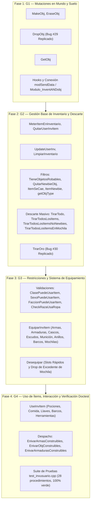

# Plan de Desglose Modular: Módulo de Inventario de Usuario y Suelo `InvUsuario.bas` (Capa 6, Módulo #19)

Este documento establece la planificación técnica detallada, las decisiones arquitectónicas y la estrategia de implementación progresiva en C++20 para el módulo [`legacy/server/Codigo/InvUsuario.bas`](../../legacy/server/Codigo/InvUsuario.bas) (1.554 líneas en Visual Basic 6).

Conforme a las directivas de porting institucional de [`docs/CONVENTIONS.md`](../CONVENTIONS.md), los hallazgos de la auditoría técnica detallada ([`docs/audit/12b-invusuario-detalle.md`](../audit/12b-invusuario-detalle.md)) y los registros estratégicos del Master Bug Ledger ([`docs/implementation/KNOWN-LEGACY-BUGS.md`](KNOWN-LEGACY-BUGS.md)), este desglose define un plan de trabajo estructurado en **cuatro fases lógicas, secuenciales e independientes**.

---

## 1. Resumen Ejecutivo y Alcance

`InvUsuario.bas` es el núcleo operativo de la economía tangible del jugador en Argentum Online:
- **Mutaciones en el Suelo del Mundo**: Creación (`MakeObj`), borrado (`EraseObj`), arrojamiento de ítems (`DropObj`) y recolección desde la celda (`GetObj`).
- **Gestión del Inventario del Usuario**: Asignación de ranuras (`MeterItemEnInventario`), remoción de ítems (`QuitarUserInvItem`), sincronización de red (`UpdateUserInv`) y descarte masivo (`TirarTodo`, `TirarTodosLosItems`, etc.).
- **Economía de Oro**: Descarte de oro de la billetera en pilas físicas de hasta 10.000 unidades (`TirarOro`).
- **Restricciones y Sistema de Equipamiento**: Lógica de compatibilidad por clase, sexo, facción y raza (`CheckRazaUsaRopa`), equipamiento interactivo (`EquiparInvItem`) y desvestido (`Desequipar`).
- **Máquina de Estados de Consumo e Interacción**: Lógica de activación de ítems (`UseInvItem`) para alimentos, pociones, llaves, bebidas, forja y navegación; así como el despacho de recetas de manufactura (`Enivar...`).

### Delimitación de Responsabilidades:
1. **Dominio de `InvUsuario` (Módulo #19)**:
   - Los 28 procedimientos canónicos declarados en `InvUsuario.bas`.
   - Modificación directa del array bidimensional de mapas `MapData(Map, X, Y).ObjInfo`.
   - Modificación directa de la estructura `UserList(UserIndex).Invent`.
   - Emisión de tramas espaciales de objetos (`PrepareMessageObjectCreate`, `PrepareMessageObjectDelete`) a través de `modSendData::SendToAreaByPos`.
   - Replicación estricta y literal de los bugs históricos #29 (duplicación en `DropObj`) y #30 (pérdida de saldo en `TirarOro`).
2. **Dominio de `Modulo_InventANDobj` (Módulo #18)**:
   - Inventario de NPCs (`Npclist(NpcIndex).Invent`) y drops probabilísticos de criaturas.
   - `InvUsuario::MakeObj` abastecerá el hook `Modulo_InventANDobj::SetMakeObjHook`.
3. **Dominio de `Modulo_UsUaRiOs` (Capa 9 - Desacoplado mediante Hooks)**:
   - Rutinas de bajo nivel de personaje: `ChangeUserInv`, `ChangeUserChar`, `DarCuerpoDesnudo`, `Tilelibre`.

### Estado de Cierre Proyectado:
Al completar sus cuatro fases y suites de prueba, este módulo quedará categorizado como **`Completado (Aislado / Cableado Pendiente)`** conforme a [`docs/CONVENTIONS.md`](../CONVENTIONS.md#definición-formal-de-los-tres-estados-de-cierre-de-módulo-module-closure-states).

---

## 2. Decisiones Estratégicas y Guardrails de Arquitectura en C++20

### 2.1. Replicación Estricta del Exploit de Duplicación (Bug #29)
- **Directiva Absoluta**: Queda terminantemente **PROHIBIDO** corregir, mitigar, sanear o introducir banderas de configuración (*flags*) para alterar el comportamiento histórico de `DropObj`.
- **Comportamiento Literal Transliterado**:
  1. En `DropObj`, la estructura local `Obj` retiene el monto original pretendido por el jugador (`Obj.Amount = num`).
  2. Si la celda receptora ya contiene unidades del mismo ítem y la adición supera `MAX_INVENTORY_OBJS` (10.000), el código recorta únicamente la variable local `num = MAX_INVENTORY_OBJS - MapData(.Pos.Map, X, Y).ObjInfo.Amount`.
  3. Se convoca a `MakeObj(Obj, Map, X, Y)` pasando la estructura `Obj` **con la cantidad completa sin recortar**, acumulando por encima de 10.000 en el suelo.
  4. Se invoca a `QuitarUserInvItem(UserIndex, Slot, num)` deduciendo de la mochila únicamente la cantidad recortada `num`.
  5. La diferencia entre `Obj.Amount` y `num` se materializa de la nada en el suelo.

### 2.2. Replicación de la Pérdida de Oro en Billetera (Bug #30)
- **Comportamiento Literal Transliterado**:
  - En `TirarOro`, ante montos `Cantidad > 500000`, se calcula el remanente `Extra = Cantidad - 500000` y `Cantidad` se trunca a `500000`.
  - Se arrojan hasta 50 pilas de 10.000 monedas al suelo mediante `TirarItemAlPiso`.
  - Al concluir, si se arrojó con éxito al menos una pila (`TeniaOro <> .Stats.GLD`), el bloque final deduce incondicionalmente `Extra` de la billetera (`.Stats.GLD = .Stats.GLD - Extra`) sin haber arrojado ese saldo al mundo.

### 2.3. Preservación Literal de Nombres y Quirks de VB6
- **Nombres en PascalCase y Typos Legacy**: Se preservan los identificadores originales en el namespace `InvUsuario`, incluyendo los typos históricos de las rutinas de carpintería y herrería:
  - `EnivarArmasConstruibles`
  - `EnivarObjConstruibles`
  - `EnivarArmadurasConstruibles`
- **Incoherencia de Parámetros en `DropObj`**: En `legacy/server/Codigo/InvUsuario.bas:369`, la validación de si la celda está libre u ocupada lee `MapData(UserList[user_index].Pos.map, x, y)` (usando el mapa de la posición del usuario) en vez del parámetro `map` recibido. Este quirk se replica fielmente.

### 2.4. Saneamiento de Desbordamientos Aritméticos de 16 Bits
- **Diagnóstico**: En VB6, `ObjInfo.Amount + Obj.Amount` operaba con enteros de 16 bits con signo (`Integer`), pudiendo gatillar en tiempo de ejecución el `Error 6: Overflow`.
- **Directiva C++20**: Para prevenir *Undefined Behavior* por integer overflow en C++, las adiciones de cantidades en celdas y ranuras de inventario deben promoverse a enteros de 32 bits con signo (`int32_t`) previo a la asignación o comprobación de cotas.

### 2.5. Aislamiento Mediante Inyección de Hooks (Capa 6 $\to$ Capa 9)
Para desacoplar el módulo de `Modulo_UsUaRiOs.bas` y permitir pruebas deterministas en `tests/test_invusuario.cpp`, el archivo `InvUsuario.hpp` expondrá los siguientes hooks:

```cpp
namespace InvUsuario {

// Búsqueda espacial de celdas transitables (Modulo_UsUaRiOs.bas:Tilelibre)
using TilelibreHook = std::function<void(const WorldPos& pos, WorldPos& n_pos, const Obj& obj, bool agua, bool tierra)>;

// Notificación de cambio visual de inventario (Modulo_UsUaRiOs.bas:ChangeUserInv)
using ChangeUserInvHook = std::function<void(std::int16_t user_index, std::uint8_t slot)>;

// Notificación de cambio de apariencia corporal/armadura (Modulo_UsUaRiOs.bas:ChangeUserChar)
using ChangeUserCharHook = std::function<void(std::int16_t user_index, std::int16_t body, std::int16_t head, std::int16_t heading, std::int16_t weapon, std::int16_t shield, std::int16_t helmet)>;

// Reversión de vestimenta a cuerpo desnudo según raza/sexo (Modulo_UsUaRiOs.bas:DarCuerpoDesnudo)
using DarCuerpoDesnudoHook = std::function<void(std::int16_t user_index, bool modificar)>;

void SetTilelibreHook(TilelibreHook hook) noexcept;
void SetChangeUserInvHook(ChangeUserInvHook hook) noexcept;
void SetChangeUserCharHook(ChangeUserCharHook hook) noexcept;
void SetDarCuerpoDesnudoHook(DarCuerpoDesnudoHook hook) noexcept;

} // namespace InvUsuario
```

### 2.6. Cableado Anticipado con `Modulo_InventANDobj`
La función `InvUsuario::MakeObj` cumple con la firma canónica `MakeObjHook`:
```cpp
void MakeObj(const Obj& obj, std::int16_t map, std::int16_t x, std::int16_t y);
```
En la Fase 1, se registrará y validará que `Modulo_InventANDobj::SetMakeObjHook(&InvUsuario::MakeObj)` opere de forma transparente.

---

## 3. Plan de Desglose en Cuatro Fases



---

### Fase 1: G1 — Mutaciones en el Mundo y Suelo

- **Objetivo**: Implementar las primitivas fundamentales de alteración de objetos en el plano físico (`MapData`) y el arrojamiento de ítems desde el usuario.
- **Procedimientos a Implementar (4)**:
  1. `void MakeObj(const Obj& obj, std::int16_t map, std::int16_t x, std::int16_t y);`
  2. `void EraseObj(std::int32_t envios, std::int16_t map, std::int16_t x, std::int16_t y);`
  3. `void DropObj(std::int16_t user_index, std::uint8_t slot, std::int32_t num);`
  4. `void GetObj(std::int16_t user_index);`
- **Puntos Críticos**:
  - **Replicación del Bug #29**: En `DropObj`, `Obj.Amount` retiene la cantidad original pretendida por el usuario y se envía sin recortar a `MakeObj`.
  - Promoción a `int32_t` en la acumulación de montos de celdas (`.ObjInfo.Amount + Obj.Amount`) para evitar *Overflow*.
  - Notificación de red: `modSendData::SendToAreaByPos` con `Protocol::PrepareMessageObjectCreate` y `PrepareMessageObjectDelete`.
  - Inyección de hooks de soporte (`SetChangeUserInvHook`).
  - Integración y cableado con `Modulo_InventANDobj::SetMakeObjHook`.

---

### Fase 2: G2 — Gestión Base de Inventario y Descarte

- **Objetivo**: Implementar la lógica interna de almacenamiento en las 30 ranuras del usuario, apilamiento de objetos, filtros de novato/caída y la fragmentación de oro.
- **Procedimientos a Implementar (14)**:
  1. `bool MeterItemEnInventario(std::int16_t user_index, const Obj& item);`
  2. `void QuitarUserInvItem(std::int16_t user_index, std::uint8_t slot, std::int32_t cantidad);`
  3. `void UpdateUserInv(bool actualizar_armas, std::int16_t user_index, std::uint8_t slot);`
  4. `void LimpiarInventario(std::int16_t user_index);`
  5. `bool TieneObjetosRobables(std::int16_t user_index);`
  6. `void QuitarNewbieObj(std::int16_t user_index);`
  7. `bool ItemSeCae(std::int16_t user_index, std::uint8_t slot);`
  8. `bool ItemNewbie(std::int16_t item_index);`
  9. `std::int16_t getObjType(std::int16_t item_index);`
  10. `void TirarTodo(std::int16_t user_index);`
  11. `void TirarTodosLosItems(std::int16_t user_index);`
  12. `void TirarTodosLosItemsNoNewbies(std::int16_t user_index);`
  13. `void TirarTodosLosItemsEnMochila(std::int16_t user_index);`
  14. `void TirarOro(std::int32_t cantidad, std::int16_t user_index);`
- **Puntos Críticos**:
  - **Replicación del Bug #30**: En `TirarOro`, preservar la evaporación del remanente `Extra` (> 500.000) si se arrojó al menos una pila.
  - Sincronización de `CurrentInventorySlots` (20 slots base, hasta 30 con mochila).
  - Manejo de peso total (`UserList[user_index].Invent.NroItems`).

---

### Fase 3: G3 — Restricciones y Sistema de Equipamiento

- **Objetivo**: Implementar las reglas de validación de equipo según los atributos del jugador y la colocación/remoción de prendas y armas.
- **Procedimientos a Implementar (6)**:
  1. `bool ClasePuedeUsarItem(std::int16_t user_index, std::int16_t obj_index);`
  2. `bool SexoPuedeUsarItem(std::int16_t user_index, std::int16_t obj_index);`
  3. `bool FaccionPuedeUsarItem(std::int16_t user_index, std::int16_t obj_index);`
  4. `bool CheckRazaUsaRopa(std::int16_t user_index, std::int16_t obj_index);`
  5. `void EquiparInvItem(std::int16_t user_index, std::uint8_t slot);`
  6. `void Desequipar(std::int16_t user_index, std::uint8_t slot);`
- **Puntos Críticos**:
  - Actualización de los slots rápidos de equipamiento: `ArmourEqpSlot`, `WeaponEqpSlot`, `CascoEqpSlot`, `EscudoEqpSlot`, `AnilloEqpSlot`, `MunicionEqpSlot`, `BarcoSlot`, `MochilaEqpSlot`.
  - Invocación de los hooks `ChangeUserCharHook` y `DarCuerpoDesnudoHook` para reflejar la apariencia visual del personaje.
  - Al desequipar mochilas (`MochilaEqpSlot`), descarte automático de ítems ubicados en ranuras expandidas (slots 21 a 30) hacia el suelo.

---

### Fase 4: G4 — Uso de Ítems, Interacción y Verificación Doctest

- **Objetivo**: Implementar la activación de consumibles e interacción con oficios, y consolidar la suite de pruebas unitarias.
- **Procedimientos a Implementar (4)**:
  1. `void UseInvItem(std::int16_t user_index, std::uint8_t slot);`
  2. `void EnivarArmasConstruibles(std::int16_t user_index);`
  3. `void EnivarObjConstruibles(std::int16_t user_index);`
  4. `void EnivarArmadurasConstruibles(std::int16_t user_index);`
- **Puntos Críticos**:
  - Máquina de estados según `ObjData[obj_index].OBJType`:
    - `otUseOnce` (comida y hambre).
    - `otBebidas` (agua y sed).
    - `otPociones` (modificación temporal de atributos, vida, maná y curación de veneno).
    - `otGuita` (conversión de ítems de oro a billetera).
    - `otLlaves` (apertura de puertas y cofres).
    - `otBarcos` (alternancia entre navegación y tierra firme).
  - Despacho de paquetes de construcción (`Protocol::WriteBlacksmithWeapons`, `WriteCarpenterObjects`, `WriteBlacksmithArmors`) preservando los typos históricos.
  - **Suite de Pruebas `tests/test_invusuario.cpp`**:
    - Verificación rigurosa de los 28 procedimientos.
    - Test del Exploit de Duplicación (Bug #29) confirmando que `num` se recorta pero `MakeObj` recibe la cantidad completa.
    - Test de Pérdida de Saldo (Bug #30) confirmando que `Extra` se descuenta de la billetera sin arrojarse.
    - Test de promociones aritméticas de 16 bits sin overflow.
    - Ciclos completos de equipar y desequipar armas, armaduras y mochilas.

---

## 4. Matriz de Cobertura de Procedimientos (28/28)

| # | Procedimiento Legacy | Grupo / Fase | Tipo / Retorno | Estado Proyectado |
| :-: | :--- | :---: | :---: | :---: |
| 1 | `MakeObj` | Fase 1 (G1) | `Sub` / `void` | Planificado |
| 2 | `EraseObj` | Fase 1 (G1) | `Sub` / `void` | Planificado |
| 3 | `DropObj` | Fase 1 (G1) | `Sub` / `void` | Planificado (Bug #29 Replicado) |
| 4 | `GetObj` | Fase 1 (G1) | `Sub` / `void` | Planificado |
| 5 | `MeterItemEnInventario` | Fase 2 (G2) | `Function` / `bool` | Planificado |
| 6 | `QuitarUserInvItem` | Fase 2 (G2) | `Sub` / `void` | Planificado |
| 7 | `UpdateUserInv` | Fase 2 (G2) | `Sub` / `void` | Planificado |
| 8 | `LimpiarInventario` | Fase 2 (G2) | `Sub` / `void` | Planificado |
| 9 | `TieneObjetosRobables` | Fase 2 (G2) | `Function` / `bool` | Planificado |
| 10 | `QuitarNewbieObj` | Fase 2 (G2) | `Sub` / `void` | Planificado |
| 11 | `ItemSeCae` | Fase 2 (G2) | `Function` / `bool` | Planificado |
| 12 | `ItemNewbie` | Fase 2 (G2) | `Function` / `bool` | Planificado |
| 13 | `getObjType` | Fase 2 (G2) | `Function` / `int16_t` | Planificado |
| 14 | `TirarTodo` | Fase 2 (G2) | `Sub` / `void` | Planificado |
| 15 | `TirarTodosLosItems` | Fase 2 (G2) | `Sub` / `void` | Planificado |
| 16 | `TirarTodosLosItemsNoNewbies` | Fase 2 (G2) | `Sub` / `void` | Planificado |
| 17 | `TirarTodosLosItemsEnMochila` | Fase 2 (G2) | `Sub` / `void` | Planificado |
| 18 | `TirarOro` | Fase 2 (G2) | `Sub` / `void` | Planificado (Bug #30 Replicado) |
| 19 | `ClasePuedeUsarItem` | Fase 3 (G3) | `Function` / `bool` | Planificado |
| 20 | `SexoPuedeUsarItem` | Fase 3 (G3) | `Function` / `bool` | Planificado |
| 21 | `FaccionPuedeUsarItem` | Fase 3 (G3) | `Function` / `bool` | Planificado |
| 22 | `CheckRazaUsaRopa` | Fase 3 (G3) | `Function` / `bool` | Planificado |
| 23 | `EquiparInvItem` | Fase 3 (G3) | `Sub` / `void` | Planificado |
| 24 | `Desequipar` | Fase 3 (G3) | `Sub` / `void` | Planificado |
| 25 | `UseInvItem` | Fase 4 (G4) | `Sub` / `void` | Planificado |
| 26 | `EnivarArmasConstruibles` | Fase 4 (G4) | `Sub` / `void` | Planificado (Typo Preservado) |
| 27 | `EnivarObjConstruibles` | Fase 4 (G4) | `Sub` / `void` | Planificado (Typo Preservado) |
| 28 | `EnivarArmadurasConstruibles` | Fase 4 (G4) | `Sub` / `void` | Planificado (Typo Preservado) |
