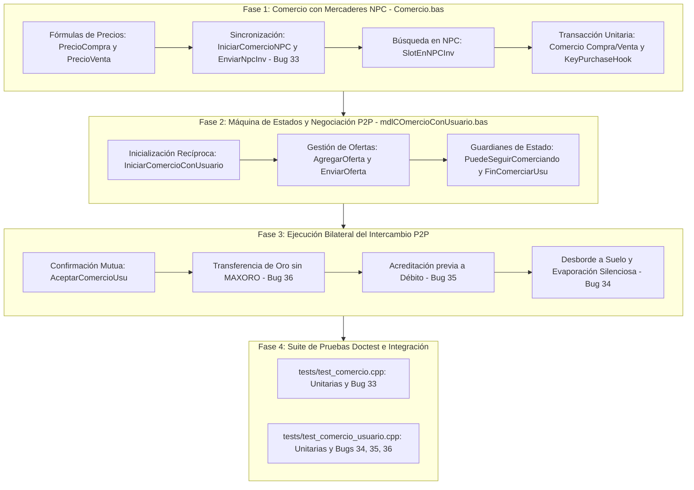

# Plan de Desglose Modular: Módulos de Comercio `Comercio.bas` y `mdlCOmercioConUsuario.bas` (Capa 6, Módulo #21)

Este documento formaliza la planificación técnica detallada, las directivas arquitectónicas vinculantes y la estrategia de implementación progresiva en C++20 para los dos módulos del subsistema de intercambio económico en Argentum Online v0.13.0:
- `legacy/server/Codigo/Comercio.bas` (288 líneas en VB6): Comercio unilateral con personajes no jugadores (NPCs).
- `legacy/server/Codigo/mdlCOmercioConUsuario.bas` (353 líneas en VB6): Comercio seguro bilateral entre usuarios (P2P).

Conforme a las convenciones institucionales de `docs/CONVENTIONS.md`, el catálogo de auditoría técnica exhaustiva de `docs/audit/12d-comercio-detalle.md` y el Master Bug Ledger en `docs/implementation/KNOWN-LEGACY-BUGS.md`, este trabajo se estructura en **cuatro fases secuenciales**.

---

## 1. Directivas Arquitectónicas Vinculantes

### 1.1. Segregación Estructural
En concordancia con el plan maestro de migración (`00-port-plan.md`), el módulo se dividirá en dos unidades de traducción independientes:
1. **Comercio con Mercaderes NPC**:
   - Encabezado: `src/server/Comercio.hpp`
   - Implementación: `src/server/Comercio.cpp`
   - Espacio de nombres: `ao::trade` o funciones canónicas en `ao`.
2. **Comercio Seguro Bilateral P2P**:
   - Encabezado: `src/server/mdlCOmercioConUsuario.hpp`
   - Implementación: `src/server/mdlCOmercioConUsuario.cpp`
   - Espacio de nombres: `ao::user_trade` o funciones canónicas en `ao`.

### 1.2. Replicación Obligatoria de Defectos Históricos (Master Bug Ledger)
Queda terminantemente prohibido aplicar correcciones o refactorizaciones lógicas sobre los defectos documentados en `docs/implementation/KNOWN-LEGACY-BUGS.md`:
- **Bug #33**: Asimetría de ranuras en mercaderes NPC (`MAX_NORMAL_INVENTORY_SLOTS = 20` vs `MAX_INVENTORY_SLOTS = 30`). La rutina `enviar_npc_inv` debe iterar estrictamente hasta la ranura 20, dejando los slots 21 a 30 en memoria pero invisibles al cliente.
- **Bug #34**: Desborde a suelo y evaporación silenciosa en comercio seguro. Si la mochila del receptor colapsa y el suelo adyacente está saturado de objetos (`TileLibre` retorna coordenadas nulas `(0, 0)`), el ítem debe ser sustraído del emisor sin materializarse en el mapa ni en el receptor.
- **Bug #35**: Acreditación previa al débito en comercio P2P. La entrega al receptor debe ejecutarse antes de la sustracción en el emisor.
- **Bug #36**: Omisión de validación de `MAXORO` en comercio seguro. La transferencia de oro entre jugadores debe sumar directamente el monto pactado sin clamplear contra `MAXORO = 90000000`.

### 1.3. Prevención de Comportamiento Indefinido (UB) por Desbordamiento Aritmético
En Visual Basic 6, las operaciones con enteros desbordan detonando `Error 6 (Overflow)`. En C++20, el desbordamiento de enteros con signo (`signed integer overflow`) constituye comportamiento indefinido (*Undefined Behavior*). Para neutralizar este riesgo manteniendo fielmente la semántica de VB6:
- Todas las sumas y multiplicaciones de monedas de oro y cantidades ofertadas deben promoverse a `std::int64_t` antes de la operación.
- Tras la evaluación o asignación, el resultado se asigna a los campos de destino (`int32_t`) respetando las cotas del modelo.

---

## 2. Fases de Implementación Técnica



---

### Fase 1 (G1 — Comercio con Mercaderes NPC - `Comercio.bas`)

#### 1. Alcance Operativo y Procedimientos
Migración a `src/server/Comercio.hpp` y `src/server/Comercio.cpp`:
- `Descuento(int16_t user_index) -> float`: Computa $1.0f + \text{skill}(Comerciar) / 100.0f$.
- `SalePrice(int16_t obj_index) -> float`: Si `ItemNewbie(obj_index)` retorna `0.0f`; de lo contrario `valor / 3.0f`.
- `IniciarComercioNPC(int16_t user_index)`: Despacha `EnviarNpcInv`, fija `flags.Comerciando = true` y emite `WriteCommerceInit`.
- `EnviarNpcInv(int16_t user_index, int16_t npc_index)`: Itera rígidamente del slot 1 al 20 (`MAX_NORMAL_INVENTORY_SLOTS`), calculando el valor unitario con descuento y emitiendo `WriteChangeNPCInventorySlot`. (**Bug #33**).
- `SlotEnNPCInv(int16_t npc_index, int16_t obj_index, int16_t cantidad) -> int16_t`: Recorre las 30 ranuras del NPC buscando coincidencia con capacidad o ranura vacía.
- `Comercio(eModoComercio modo, int16_t user_index, int16_t npc_index, int16_t slot, int16_t cantidad)`:
  - **Modo Compra**:
    - Guardián: `cantidad < 1 || slot < 1 || slot > MAX_INVENTORY_SLOTS`.
    - Autoban si `cantidad > 10000` (`MAX_INVENTORY_OBJS`).
    - Clamping de `cantidad` al stock disponible en el slot del comerciante.
    - Cómputo de precio:
      $$\text{precio} = \text{static\_cast<int32\_t>}\left(\left(\frac{\text{valor}}{\text{descuento}} \times \text{cantidad}\right) + 0.5f\right)$$
    - Si saldo de oro insuficiente: mensaje por consola y aborto.
    - Inserción en inventario del usuario con `MeterItemEnInventario`. Si falla (mochila llena), aborto sin cobro y emisión de `WriteTradeOK`.
    - Débito de oro del usuario y descuento en NPC con `QuitarNpcInvItem`.
    - Hook de compra de llaves (`KeyPurchaseHook`): Notifica la adquisición de llaves (`otLlaves`) para actualizar `NPCs.dat` y registrar log.
  - **Modo Venta**:
    - Clamping de `cantidad` al stock del slot del usuario.
    - Validación de compatibilidad: `TipoItems` del NPC o `otCualquiera`. Prohibición expresa de venta de oro (`iORO = 12`).
    - Restricciones faccionarias: Armaduras reales (`Real = 1`) restringidas a sastres con nombre `"SR"`; armaduras del Caos (`Caos = 1`) a `"SC"`.
    - Prohibición para administradores con rango Consejero.
    - Débito en mochila con `QuitarUserInvItem`.
    - Cómputo de cobro con truncamiento directo:
      $$\text{precio} = \text{static\_cast<int32\_t>}\left(\text{SalePrice}(\text{obj\_index}) \times \text{cantidad}\right)$$
    - Acreditación de oro con clamping explícito a `MAXORO = 90000000`.
    - Acumulación en inventario del NPC mediante `SlotEnNPCInv`. Si el NPC tiene 30 slots ocupados, el objeto no se almacena en el NPC pero el dinero se le paga al jugador.
    - Incremento de habilidad `eSkill.Comerciar`.

#### 2. Diseño de Interfaces en C++
```cpp
namespace ao {

enum class eModoComercio : uint8_t {
    Compra = 1,
    Venta = 2
};

constexpr uint8_t REDUCTOR_PRECIOVENTA = 3;

using KeyPurchaseHook = std::function<void(int16_t user_index, int16_t npc_index, uint8_t slot, int16_t obj_index)>;
using BanUserHook = std::function<void(int16_t user_index, std::string_view reason)>;

float Descuento(int16_t user_index);
float SalePrice(int16_t obj_index);
void IniciarComercioNPC(int16_t user_index);
int16_t SlotEnNPCInv(int16_t npc_index, int16_t obj_index, int16_t cantidad);
void EnviarNpcInv(int16_t user_index, int16_t npc_index);
void Comercio(eModoComercio modo, int16_t user_index, int16_t npc_index, int16_t slot, int16_t cantidad,
              KeyPurchaseHook key_hook = nullptr, BanUserHook ban_hook = nullptr);

} // namespace ao
```

---

### Fase 2 (G2 — Máquina de Estados y Negociación P2P - `mdlCOmercioConUsuario.bas`)

#### 1. Alcance Operativo y Procedimientos
Migración a `src/server/mdlCOmercioConUsuario.hpp` y `src/server/mdlCOmercioConUsuario.cpp`:
- Estructura `tCOmercioUsuario`:
  - `DestUsu`: Identificador del usuario interlocutor.
  - `DestNick`: Apodo del destinatario para validación de identidad.
  - `Objeto`: Arreglo de 30 ranuras fijas de `ObjIndex` ofertados (base 1).
  - `cant`: Arreglo de 30 ranuras de cantidades ofertadas (`int32_t`).
  - `GoldAmount`: Saldo de monedas de oro ofrecidas (`int32_t`).
  - `Acepto`: Flag de aceptación final de la transacción.
  - `Confirmo`: Flag de bloqueo/congelamiento de la mesa de ofertas.
- `IniciarComercioConUsuario(int16_t origen, int16_t destino)`:
  - Si ambos usuarios se apuntan recíprocamente (`ComUsu.DestUsu == destino` y viceversa), inicializa la sesión: actualiza mochilas, activa `flags.Comerciando = true` y despacha `WriteUserCommerceInit` a ambos sockets.
  - Si es la primera solicitud, almacena el target y notifica por consola al destinatario con invitación a escribir `/COMERCIAR`.
- `AgregarOferta(int16_t user_index, uint8_t offer_slot, int16_t obj_index, int64_t amount, bool is_gold)`:
  - Verifica `PuedeSeguirComerciando`.
  - Si `.Confirmo == true`, aborta la sesión por intento de alteración ilícita.
  - Si `is_gold == true`:
    - Adiciona `amount` a `GoldAmount` mediante aritmética de 64 bits y clamplea a 0 si resulta negativo.
  - Si `is_gold == false`:
    - Actualiza `Objeto(offer_slot)` y adiciona `amount` a `cant(offer_slot)`.
    - Si la cantidad resultante es $\le 0$, blanquea la ranura (`Objeto = 0`, `cant = 0`).
- `EnviarOferta(int16_t user_index, uint8_t offer_slot)`:
  - Recupera los datos de la oferta del interlocutor y los transmite mediante `WriteChangeUserTradeSlot`.
- `FinComerciarUsu(int16_t user_index)`:
  - Notifica `WriteUserCommerceEnd` si `DestUsu > 0`.
  - Resetea flags, arrays de ítems y cantidades, saldo de oro y apodo.
  - Desactiva `.flags.Comerciando = false`.
- `PuedeSeguirComerciando(int16_t user_index) -> bool`:
  - Valida índices en rango `[1, MaxUsers]`, flags de conexión activa, reciprocidad en `DestUsu`, coincidencia de apodos y estado vivo.
  - **Preservación del Quirk**: No comprueba la distancia física entre los jugadores. Si falla alguna validación básica, ejecuta `FinComerciarUsu` en ambas partes.

#### 2. Diseño de Interfaces en C++
```cpp
namespace ao {

constexpr int16_t MAX_OFFER_SLOTS = 30;
constexpr int16_t GOLD_OFFER_SLOT = MAX_OFFER_SLOTS + 1; // 31
constexpr int32_t MAX_ORO_LOGUEABLE = 50000;
constexpr int32_t MAX_OBJ_LOGUEABLE = 1000;

void IniciarComercioConUsuario(int16_t origen, int16_t destino);
void EnviarOferta(int16_t user_index, uint8_t offer_slot);
void FinComerciarUsu(int16_t user_index);
void AgregarOferta(int16_t user_index, uint8_t offer_slot, int16_t obj_index, int64_t amount, bool is_gold);
bool PuedeSeguirComerciando(int16_t user_index);

} // namespace ao
```

---

### Fase 3 (G3 — Ejecución Bilateral del Intercambio P2P)

#### 1. Alcance Operativo y Procedimientos
Implementación de la rutina de cierre y transferencia `AceptarComercioUsu`:
- `AceptarComercioUsu(int16_t user_index, QuitarObjetosHook quitar_obj_hook, TirarItemAlPisoHook tirar_piso_hook)`:
  - Marca `.Acepto = true`.
  - Comprueba si la contraparte ya aceptó (`otro_user.ComUsu.Acepto == true`). Si no, aguarda su confirmación.
  - Al estar ambos confirmados, ejecuta el ciclo de transferencia para las 31 ranuras (`1 To MAX_OFFER_SLOTS + 1`):
    1. **Bienes del Usuario A hacia Usuario B**:
       - Si `OfferSlot == GOLD_OFFER_SLOT`:
         - Deduce `GoldAmount` del Usuario A.
         - Acredita `GoldAmount` al Usuario B **sin clampleo contra MAXORO** (**Bug #36**), previniendo overflow con `int64_t`.
       - Si `Objeto(OfferSlot) > 0`:
         - Intenta ingresar el ítem al Usuario B con `MeterItemEnInventario` (**Acreditación previa, Bug #35**).
         - Si `MeterItemEnInventario` retorna `false`, intenta arrojarlo al suelo en la posición del receptor con `tirar_piso_hook`.
         - Si el suelo circundante está saturado y retorna `WorldPos{map, 0, 0}`, el ítem no se crea físicamente.
         - A continuación, deduce incondicionalmente las unidades del emisor invocando `quitar_obj_hook`, consumando la evaporación silenciosa (**Bug #34**).
    2. **Bienes del Usuario B hacia Usuario A**:
       - Ejecuta exactamente la misma secuencia descrita en el paso 1 en sentido inverso.
    3. **Cierre de Sesión**:
       - Invoca `FinComerciarUsu` en ambas partes.

#### 2. Diseño de Callbacks de Desacoplamiento
```cpp
namespace ao {

using QuitarObjetosHook = std::function<void(int16_t obj_index, int32_t amount, int16_t user_index)>;
using TirarItemAlPisoHook = std::function<WorldPos(const WorldPos& pos, const Obj& obj)>;

void AceptarComercioUsu(int16_t user_index,
                        QuitarObjetosHook quitar_obj_hook = nullptr,
                        TirarItemAlPisoHook tirar_piso_hook = nullptr);

} // namespace ao
```

---

### Fase 4 (G4 — Suite de Pruebas Doctest e Integración)

Creación de dos suites unitarias exhaustivas sin dependencias gráficas ni de sockets de red:
1. `tests/test_comercio.cpp`:
   - Cálculo matemático de precios de compra con habilidad de comerciar y redondeo ceiling (`+0.5f`).
   - Cálculo de precio de venta truncado (`Fix()`) y retorno 0 para ítems de novato.
   - Sincronización de mercader: verificación estricta de que `enviar_npc_inv` solo transmite 20 ranuras a pesar de que el NPC contenga 30 slots cargados (**Reproducción del Bug #33**).
   - Compras con autoban ante pedidos $> 10000$ unidades.
   - Compras con inventario lleno: verificación de que no se deduce oro.
   - Ventas con clamping a `MAXORO = 90000000`.
   - Disparo del hook `KeyPurchaseHook` al comprar llaves.
2. `tests/test_comercio_usuario.cpp`:
   - Máquina de estados: apertura recíproca con `/COMERCIAR`, rechazo, y cierre voluntario.
   - Modificación y cancelación de ofertas confirmadas (`.confirmo == true`).
   - Transferencia de oro: acreditación superando los 90.000.000 de oro sin clampleo (**Reproducción del Bug #36**).
   - Secuencia de ítems: verificación de que `meter_item_en_inventario` se invoca antes de `quitar_objetos` (**Reproducción del Bug #35**).
   - Evaporación de ítems: simulación de mochila llena y retorno nulo de celda libre `(0, 0)`, comprobando que el ítem se sustrae del emisor pero no se entrega al receptor (**Reproducción del Bug #34**).

---

## 3. Matriz de Trazabilidad y Cobertura de Defectos

| Bug ID | Módulo Afectado | Procedimiento | Comportamiento Legacy Replicado | Test de Verificación Asociado |
| :---: | :--- | :--- | :--- | :--- |
| **#33** | `Comercio.bas` | `EnviarNpcInv` | Itera rígidamente solo los primeros 20 slots (`MAX_NORMAL_INVENTORY_SLOTS`), dejando invisibles los slots 21 a 30 en el cliente. | `test_comercio.cpp`: `"Comercio NPC - Asimetria de slots 20 vs 30 (Bug #33)"` |
| **#34** | `mdlCOmercioConUsuario.bas` | `AceptarComercioUsu` | Al colmarse la mochila del receptor y estar el suelo saturado, el objeto se sustrae del emisor y desaparece en el limbo. | `test_comercio_usuario.cpp`: `"Comercio P2P - Evaporacion por piso saturado (Bug #34)"` |
| **#35** | `mdlCOmercioConUsuario.bas` | `AceptarComercioUsu` | Invierte el orden transaccional acreditando en receptor antes de debitar en emisor. | `test_comercio_usuario.cpp`: `"Comercio P2P - Acreditacion previa al debito (Bug #35)"` |
| **#36** | `mdlCOmercioConUsuario.bas` | `AceptarComercioUsu` | Acredita oro directamente sin validar ni acotar al límite `MAXORO = 90000000`. | `test_comercio_usuario.cpp`: `"Comercio P2P - Omicion de MAXORO en transferencia (Bug #36)"` |

---

## 4. Estado de Cierre Proyectado

Al completar la implementación y la ejecución exitosa de la suite doctest, los módulos `Comercio.hpp`/`.cpp` y `mdlCOmercioConUsuario.hpp`/`.cpp` quedarán catalogados formalmente bajo el estado:
**`Completado (Aislado / Cableado Pendiente)`**
conforme a la taxonomía institucional de `docs/CONVENTIONS.md`.
