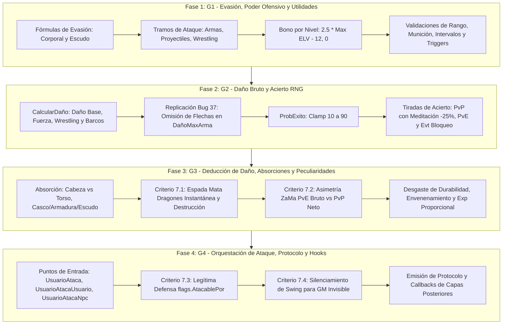

---
area: formulas-de-combate
module_id: 22
source_files:
  - legacy/server/Codigo/SistemaCombate.bas
  - docs/audit/04a-sistemacombate-detalle.md
  - docs/CONVENTIONS.md
  - docs/implementation/KNOWN-LEGACY-BUGS.md
tags: [combate, pvp, pve, formulas, daño, evasion, escudos, apuñalar, criticos, experiencia, karma, bug-37, cpp20, breakdown, plan]
last_updated: 2026-09-15
---

# Plan de Desglose Modular: Sistema de Combate `SistemaCombate.bas` (Capa 7, Módulo #22)

Este documento formaliza la planificación técnica detallada, las directivas arquitectónicas vinculantes y la estrategia de implementación progresiva en C++20 para el módulo medular de combate físico y balance en Argentum Online v0.13.0:
- `legacy/server/Codigo/SistemaCombate.bas` (1.922 líneas en VB6).

Conforme a las directivas de [`docs/CONVENTIONS.md`](../CONVENTIONS.md) (Regla de Módulos Grandes y Regla 7 de Taxonomía de Hallazgos), el informe de auditoría exhaustiva de [`docs/audit/04a-sistemacombate-detalle.md`](../audit/04a-sistemacombate-detalle.md) y el Master Bug Ledger en [`docs/implementation/KNOWN-LEGACY-BUGS.md`](KNOWN-LEGACY-BUGS.md), este trabajo se estructura en **cuatro fases secuenciales** cubriendo el 100% de los 33 procedimientos legacy.

---

## 1. Directivas Arquitectónicas Vinculantes

### 1.1. Organización Estructural y Convención de Nombres
- **Archivos Destino**: `src/server/SistemaCombate.hpp` y `src/server/SistemaCombate.cpp`.
- **Superficie Pública de Funciones**: Preservación estricta y literal en **PascalCase** de los 33 procedimientos originales de VB6 (e.g. `CalcularDaño`, `PoderEvasion`, `UsuarioAtaca`, `UserDañoNpc`).
- **Constantes de Rango**: Declaración de constantes de combate idénticas a VB6:
  - `constexpr uint8_t MAXDISTANCIAARCO = 18;`
  - `constexpr uint8_t MAXDISTANCIAMAGIA = 18;`

### 1.2. Preservación del Bug Ledger y Peculiaridades de Dominio
En cumplimiento de la taxonomía institucional de la Regla 7 de `docs/CONVENTIONS.md`:
1. **Defecto Técnico / Bug Ledger ([`docs/implementation/KNOWN-LEGACY-BUGS.md`](KNOWN-LEGACY-BUGS.md))**:
   - **Bug #37 (Omisión de Flechas en Bono de Fuerza / `DañoMaxArma`)**: Al calcular el daño con arco y flechas (`CalcularDaño`), la munición suma a `DañoArma`, pero se omite sumarla a `DañoMaxArma`. El bono por fuerza `((DañoMaxArma / 5) * Max(0, Fuerza - 15))` escala únicamente según el arco. **Replicación obligatoria (`Replicated (Strict Parity)`)**.
2. **Peculiaridades de Dominio y Reglas Históricas de Balance**:
   - **Criterio 7.1 (Espada Mata Dragones)**: Letalidad absoluta instantánea (`MinHp + def`) y destrucción inmediata del arma contra `DRAGON`; daño fijado exactamente en 1 contra cualquier otro objetivo.
   - **Criterio 7.2 (Apuñalamiento ZaMa 07/04/2010)**: En PvE (`UserDañoNpc`), `DoApuñalar` recibe el daño base antes de restar la defensa del NPC; en PvP (`UserDañoUser`), recibe el daño neto post-absorción de armaduras.
   - **Criterio 7.3 (Legítima Defensa en `flags.AtacablePor`)**: Si un usuario muere a manos de quien lo tenía como objetivo en legítima defensa (`flags.AtacablePor == AtacanteIndex`), no se cuenta frag (`StoreFrag`), no suma muerte penalizada (`ContarMuerte`) ni se descuenta karma ni se vuelve criminal (`VolverCriminal`).
   - **Criterio 7.4 (Sigilo de Game Masters Invisibles)**: Cuando un GM invisible falla un golpe cuerpo a cuerpo, el sonido `SND_SWING` no se emite por broadcast al área sino únicamente a su propio socket (`EnviarDatosASlot`).

### 1.3. Aislamiento Mediante Inyección de Dependencias (Hooks)
Dado que `SistemaCombate` reside en Capa 7 y depende de subsistemas no portados de Capas 8 y 9 (`Modulo_UsUaRiOs.bas`, `NPCs.bas`, `Trabajo.bas`, `ModoParty.bas`), se aislarán todas las llamadas externas mediante callbacks tipados (`std::function`), permitiendo compilar y probar unitariamente el combate en aislamiento total.

---

## 2. Inventario Exhaustivo y Mapeo de Fases

| # | Procedimiento Legacy | Tipo | Visibilidad VB6 | Fase Asignada | Propósito Principal |
| :-: | :--- | :---: | :---: | :-: | :--- |
| 1 | `MinimoInt` | Function | Public | **Fase 1 (G1)** | Utilidad: menor entre dos enteros de 16 bits. |
| 2 | `MaximoInt` | Function | Public | **Fase 1 (G1)** | Utilidad: mayor entre dos enteros de 16 bits. |
| 3 | `PoderEvasionEscudo` | Function | Private/Public | **Fase 1 (G1)** | Índice defensivo aportado por el escudo equipado. |
| 4 | `PoderEvasion` | Function | Private/Public | **Fase 1 (G1)** | Índice defensivo de evasión corporal base (Tácticas, Agilidad, Nivel). |
| 5 | `PoderAtaqueArma` | Function | Private/Public | **Fase 1 (G1)** | Índice ofensivo cuerpo a cuerpo por tramos de Armas. |
| 6 | `PoderAtaqueProyectil` | Function | Private/Public | **Fase 1 (G1)** | Índice ofensivo a distancia por tramos de Proyectiles. |
| 7 | `PoderAtaqueWrestling` | Function | Private/Public | **Fase 1 (G1)** | Índice ofensivo desarmado por tramos de Wrestling. |
| 8 | `PoderAtaqueModificado` | Function | Public | **Fase 1 (G1)** | Retorna el poder de ataque activo según arma/proyectil en mano. |
| 9 | `CheckResistencia` | Function | Public | **Fase 1 (G1)** | Tirada porcentual de resistencia mágica con dados d100. |
| 10 | `ArcoYFlecha` | Function | Public | **Fase 1 (G1)** | Valida arco equipado y compatibilidad con munición cargada. |
| 11 | `AlcanzaEspacio` | Function | Public | **Fase 1 (G1)** | Distancia máxima según arma (`MAXDISTANCIAARCO` o `1`). |
| 12 | `CheckArmasMuniciones` | Function | Public | **Fase 1 (G1)** | Valida correspondencia entre tipo de arco y flecha. |
| 13 | `IntervaloPermiteAtacar` | Function | Public | **Fase 1 (G1)** | Controla cooldown de ataque físico y avisos de espera. |
| 14 | `ArmaParaApuñalar` | Function | Public | **Fase 1 (G1)** | Chequea flag `Apuñala = 1` en el ítem. |
| 15 | `SameClan` | Function | Private/Public | **Fase 1 (G1)** | Consulta pertenencia mutua a un mismo clan (`GuildIndex`). |
| 16 | `SameParty` | Function | Private/Public | **Fase 1 (G1)** | Consulta pertenencia mutua a un mismo grupo (`PartyIndex`). |
| 17 | `TriggerZonaPelea` | Function | Public | **Fase 1 (G1)** | Evalúa Trigger 6 (Arenas) en origen y destino. |
| 18 | `ProbExito` | Function | Public | **Fase 2 (G2)** | Fórmula acotada `clamp(10, 90, 50 + (Atk - Def) * 0.4)`. |
| 19 | `UserImpactoUser` | Function | Public | **Fase 2 (G2)** | Tirada de impacto PvP (con penalización del 25% si medita). |
| 20 | `UserImpactoNpc` | Function | Public | **Fase 2 (G2)** | Tirada de impacto de usuario a NPC y skill checks. |
| 21 | `NpcImpactoUser` | Function | Public | **Fase 2 (G2)** | Tirada de impacto de NPC a usuario y test de bloqueo de escudo. |
| 22 | `NpcImpactoNpc` | Function | Private/Public | **Fase 2 (G2)** | Tirada de impacto físico entre dos criaturas. |
| 23 | `CalcularDaño` | Function | Public | **Fase 2 (G2)** | Daño físico bruto con **Bug #37** (omisión de flecha en `DañoMaxArma`). |
| 24 | `NpcDaño` | Function | Public | **Fase 2 (G2)** | Genera daño aleatorio del NPC en rango `MinHit`..`MaxHit`. |
| 25 | `UserDañoNpc` | Sub | Public | **Fase 3 (G3)** | Aplica daño a NPC, defensa, ZaMa PvE (**7.2**), Mata Dragones (**7.1**). |
| 26 | `NpcDañoUser` | Sub | Public | **Fase 3 (G3)** | Aplica daño de NPC a usuario, absorción (casco/armadura/escudo) y muerte. |
| 27 | `NpcDañoNpc` | Sub | Public | **Fase 3 (G3)** | Aplica daño físico mutuo entre NPCs y verifica muerte. |
| 28 | `UserDañoUser` | Sub | Public | **Fase 3 (G3)** | Aplica daño PvP, ZaMa PvP (**7.2**), absorción y mata dragones (**7.1**). |
| 29 | `UserEnvenena` | Sub | Public | **Fase 3 (G3)** | Aplica probabilidad de envenenamiento (60%) si el arma posee veneno. |
| 30 | `RestarCriminalidad` | Sub | Public | **Fase 3 (G3)** | Reduce penalización criminal al morir ante Guardias Reales. |
| 31 | `CalcularDarExp` | Sub | Public | **Fase 3 (G3)** | Reparto proporcional de experiencia y consumo de `ExpCount`. |
| 32 | `UsuarioAtaca` | Sub | Public | **Fase 4 (G4)** | Despachador principal de acción de ataque (stamina, celdas, ruteo). |
| 33 | `UsuarioAtacaNpc` | Function | Public | **Fase 4 (G4)** | Flujo de ataque a criatura (pérdida de inmunidad de druida). |
| 34 | `NpcAtacaUser` | Function | Public | **Fase 4 (G4)** | Flujo de ataque de criatura a usuario (animaciones y venenos). |
| 35 | `NpcAtacaNpc` | Sub | Public | **Fase 4 (G4)** | Flujo de combate criatura vs criatura. |
| 36 | `UsuarioAtacaUsuario` | Function | Public | **Fase 4 (G4)** | Flujo completo PvP: distancias, efectos y sigilo GM (**7.4**). |
| 37 | `UsuarioAtacadoPorUsuario`| Sub | Public | **Fase 4 (G4)** | Consecuencias morales, karma, criminalidad y legítima defensa (**7.3**). |
| 38 | `PuedeAtacar` | Function | Public | **Fase 4 (G4)** | Matriz exhaustiva de guardianes legales para PvP. |
| 39 | `PuedeAtacarNPC` | Function | Public | **Fase 4 (G4)** | Matriz exhaustiva de guardianes para PvE y apropiación de NPCs. |
| 40 | `MuereNpc` | Sub | Public | **Fase 4 (G4)** | Orquestación de muerte de NPC, drops, facciones y experiencia. |
| 41 | `RestarCriaturasEntrenador`| Sub | Public | **Fase 4 (G4)** | Libera slots de mascotas invocadas o subordinadas. |
| 42 | `CheckPets` | Sub | Public | **Fase 4 (G4)** | Coordinación de objetivos para mascotas agresoras. |
| 43 | `AllFollowAmo` | Sub | Public | **Fase 4 (G4)** | Fuerza a las mascotas a adoptar modo seguimiento. |
| 44 | `AllMascotasAtacanUser` | Sub | Public | **Fase 4 (G4)** | Ordena contraataque masivo de mascotas hacia un agresor. |

---

## 3. Desglose en 4 Fases Secuenciales



---

### Fase 1 (G1 — Evasión, Poder Ofensivo y Utilidades)

#### 1. Alcance Operativo y Procedimientos
- `MinimoInt(int16_t a, int16_t b) -> int16_t` y `MaximoInt(int16_t a, int16_t b) -> int16_t`.
- `PoderEvasionEscudo(int16_t user_index) -> int32_t`:
  $$\text{PoderEvasionEscudo} = \left\lfloor \frac{\text{SkillDefensa} \times \text{ModClase.Escudo}}{2} \right\rfloor$$
- `PoderEvasion(int16_t user_index) -> int32_t`:
  $$\text{lTemp} = \left(\text{SkillTacticas} + \frac{\text{SkillTacticas}}{33} \times \text{Agilidad}\right) \times \text{ModClase.Evasion}$$
  $$\text{PoderEvasion} = \text{lTemp} + 2.5 \times \max(\text{Nivel} - 12, 0)$$
- `PoderAtaqueArma(int16_t user_index) -> int32_t`: 4 tramos por skill (<31, <61, <91, >=91) multiplicados por Agilidad y `ModClase.AtaqueArmas`, más el bono por nivel.
- `PoderAtaqueProyectil(int16_t user_index) -> int32_t` y `PoderAtaqueWrestling(int16_t user_index) -> int32_t`: Fórmulas equivalentes por tramos.
- `PoderAtaqueModificado(int16_t user_index) -> int32_t`: Rutea a `PoderAtaqueProyectil` si porta arco o `PoderAtaqueArma` en caso contrario.
- Validaciones auxiliares: `ArcoYFlecha`, `CheckArmasMuniciones`, `AlcanzaEspacio`, `IntervaloPermiteAtacar`, `ArmaParaApuñalar`, `SameClan`, `SameParty`, `TriggerZonaPelea`, `CheckResistencia`.

#### 2. Estrategia de Pruebas Doctest
- Pruebas puras sin estado global complejo: verificación matemática de tramos de habilidad, bono de nivel nulo en niveles $\le 12$ y creciente en $>12$, división flotante `/ 33`, y cotas de `MAXDISTANCIAARCO = 18`.

---

### Fase 2 (G2 — Daño Bruto y Acierto RNG)

#### 1. Alcance Operativo y Procedimientos
- `CalcularDaño(int16_t user_index, int16_t npc_index = 0) -> int32_t`:
  $$\text{Daño} = \left( 3 \times \text{DañoArma} + \left(\frac{\text{DañoMaxArma}}{5} \times \max(0, \text{Fuerza} - 15)\right) + \text{DañoUsuario} \right) \times \text{ModClase}$$
  - **Replicación Obligatoria del Bug #37**:
    ```cpp
    if (arma.Municion == 1 && user.Invent.MunicionEqpObjIndex > 0) {
        const auto& proyectil = ObjData[user.Invent.MunicionEqpObjIndex];
        daño_arma += RandomNumber(proyectil.MinHIT, proyectil.MaxHIT);
        // BUG #37 PRESERVADO: proyectil.MaxHIT NO se suma a DañoMaxArma para el bono de fuerza.
    }
    ```
  - Soporte de Wrestling (con y sin guantes en slot de anillo) y navegación en barcos.
- `ProbExito(int32_t atk, int32_t def) -> int32_t`:
  $$\text{ProbExito} = \text{clamp}(10, 90, \lfloor 50 + (atk - def) \times 0.4 \rfloor)$$
- `UserImpactoUser(int16_t atacante, int16_t atacado) -> bool`:
  - Evaluación de evasión base + escudo.
  - **Penalización por Meditación**: Si `flags.Meditando == true`, se aplica:
    $$\text{ProbEvadir} = (100 - \text{ProbExito}) \times 0.75$$
    $$\text{ProbExito} = \min(90, 100 - \text{ProbEvadir})$$
  - Si falla y el defensor lleva escudo, evaluación de bloqueo:
    $$\text{ProbRechazo} = \text{clamp}\left(10, 90, \left\lfloor \frac{100 \times \text{SkillDefensa}}{\text{SkillDefensa} + \text{SkillTacticas}} \right\rfloor\right)$$
- `UserImpactoNpc`, `NpcImpactoUser`, `NpcImpactoNpc`, `NpcDaño`.

#### 2. Estrategia de Pruebas Doctest
- Pruebas deterministas con RNG mockeado / semillas fijas:
  - Verificación estricta del **Bug #37**: comparar el bono de fuerza de un disparo con flecha básica vs flecha pesada y certificar que `DañoMaxArma` permanece idéntico.
  - Comprobación de los límites del `clamp(10, 90)` en situaciones de diferencia extrema de poder.
  - Verificación del incremento del $25\%$ de acierto contra defensores meditando.

---

### Fase 3 (G3 — Deducción de Daño, Absorciones y Peculiaridades de Dominio)

#### 1. Alcance Operativo y Procedimientos
- `UserDañoNpc(int16_t user_index, int16_t npc_index)`:
  - **Criterio 7.1 (Espada Mata Dragones)**: Si `npc.NPCtype == eNPCType.DRAGON` y porta `EspadaMataDragonesIndex`, el daño es `npc.Stats.MinHp + npc.Stats.def` y se destruye el arma (`QuitarObjetos`). Si el objetivo no es dragón, el daño es fijo en `1`.
  - **Criterio 7.2 (Apuñalamiento ZaMa en PvE)**: Invocación de `DoApuñalar` pasando `DañoBase` **antes** de restar la defensa del NPC.
  - Deducción de HP en NPC, desgaste de arma y cálculo de experiencia proporcional (`CalcularDarExp`).
- `UserDañoUser(int16_t atacante, int16_t victima)`:
  - Sorteo de zona de impacto (Cabeza absorbe Casco; Torso absorbe Armadura + Escudo).
  - Reducción de absorción por arma de `Refuerzo`.
  - **Criterio 7.2 (Apuñalamiento ZaMa en PvP)**: Invocación de `DoApuñalar` pasando el daño residual **después** de absorber defensas.
  - Desgaste de durabilidad de armaduras y armas.
  - Evaluación de envenenamiento (`UserEnvenena`).
- `NpcDañoUser(int16_t npc_index, int16_t user_index)` y `NpcDañoNpc(int16_t atacante, int16_t victima)`.
- `CalcularDarExp`: Manejo exacto del remanente `flags.ExpCount` y tope `MAXEXP`.
- `RestarCriminalidad`: Reducción de reputación al caer ante guardias.

#### 2. Estrategia de Pruebas Doctest
- Verificación del **Criterio 7.1**: impacto letal instantáneo a dragones con remoción de espada, y daño = 1 contra criaturas comunes.
- Verificación del **Criterio 7.2**: aserción de que el hook de apuñalamiento recibe valores diferentes en PvE (bruto) y PvP (neto post-absorción).
- Pruebas de absorción de cabeza vs torso y durabilidad de equipamiento.

---

### Fase 4 (G4 — Orquestación de Flujo de Ataque, Protocolo y Hooks)

#### 1. Alcance Operativo y Procedimientos
- Puntos de entrada principales:
  - `UsuarioAtaca(int16_t user_index)`: Control de fatiga (stamina), cooldowns, obtención de coordenada frontal y ruteo a NPC o Usuario.
  - `UsuarioAtacaUsuario(int16_t atacante, int16_t atacado)`: Matriz `PuedeAtacar`, distancias, disparadores de hurto y ejecución.
  - `UsuarioAtacadoPorUsuario(int16_t atacante, int16_t victima)`:
    - **Criterio 7.3 (Legítima Defensa)**: Si `flags.AtacablePor == atacante`, bypass total de penalización de karma (`Stats.Karma`), criminalidad (`VolverCriminal`), conteo de frags (`StoreFrag`) y muertes (`ContarMuerte`).
    - Cancelación de salida segura del servidor (`CancelExit`).
  - `UsuarioAtacaNpc`, `NpcAtacaUser`, `NpcAtacaNpc`.
- **Criterio 7.4 (Sigilo de GM Invisible)**:
  - En swing fallido al aire, si `EsGM(user_index) && flags.Invisible == 1`, despachar `WritePlayWave(SND_SWING)` únicamente al socket privado del GM mediante `EnviarDatosASlot`, omitiendo el broadcast al área.
- Gestión de criaturas y amos: `CheckPets`, `AllFollowAmo`, `AllMascotasAtacanUser`, `RestarCriaturasEntrenador`, `MuereNpc`.
- Matrices de guardianes legales completas: `PuedeAtacar` y `PuedeAtacarNPC`.

#### 2. Catálogo de Callbacks e Inyección de Dependencias
```cpp
namespace ao {

struct CombatHooks {
    std::function<void(int16_t victim_index)> UserDieHook;
    std::function<void(int16_t npc_index, int16_t killer_user_index)> NpcDieHook;
    std::function<void(int16_t user_index, eSkill skill, bool exito)> SubirSkillHook;
    std::function<void(int16_t user_index)> CheckUserLevelHook;
    std::function<void(int16_t user_index, int32_t exp, int16_t map, int16_t x, int16_t y)> PartyExpHook;
    std::function<void(int16_t user_index, int16_t victim_user, int16_t victim_npc, int32_t daño)> DoApuñalarHook;
    std::function<void(int16_t user_index, int16_t target_user, int16_t target_npc, int32_t daño)> DoGolpeCriticoHook;
    std::function<void(int16_t user_index, int16_t victim_index)> VolverCriminalHook;
    std::function<void(int16_t user_index)> CancelExitHook;
};

void SetCombatHooks(const CombatHooks& hooks);

} // namespace ao
```

#### 3. Estrategia de Pruebas Doctest e Integración
- Aserción de **Criterio 7.3**: simular combate donde la víctima tiene `flags.AtacablePor = atacante` y certificar que la muerte no gatilla `VolverCriminalHook` ni decrementa karma.
- Aserción de **Criterio 7.4**: validar que el swing fallido de un GM invisible produce un despacho dirigido exclusivamente a su propio slot de conexión.
- Validación de la matriz de guardianes `PuedeAtacar` con seguros activados, mapas seguros (ciudades) y zonas de trigger 6 (arenas de combate).

---

## 4. Matriz de Trazabilidad y Verificación

| Requisito / Hallazgo | Categoría | Procedimiento Legacy | Criterio de Aceptación en C++ | Test Unitario Asociado |
| :--- | :--- | :--- | :--- | :--- |
| **Bug #37** | Defecto Técnico (`KNOWN-LEGACY-BUGS.md`) | `CalcularDaño` | La munición de arco no suma su `MaxHIT` a `DañoMaxArma` para el cálculo del bono por fuerza. | `test_sistemacombate.cpp`: `"Combate - Bug #37 Omicion de flechas en DañoMaxArma"` |
| **Criterio 7.1** | Peculiaridad de Dominio | `UserDañoNpc` / `UserDañoUser` | Daño letal absoluto instantáneo contra `DRAGON` con autodestrucción; daño fijado en 1 contra otros blancos. | `test_sistemacombate.cpp`: `"Combate - Espada Mata Dragones letalidad y autodestruccion"` |
| **Criterio 7.2** | Regla de Balance Histórica | `UserDañoNpc` vs `UserDañoUser` | `DoApuñalar` recibe daño bruto pre-absorción en PvE y daño neto post-absorción en PvP. | `test_sistemacombate.cpp`: `"Combate - Asimetria ZaMa en Apuñalar PvE vs PvP"` |
| **Criterio 7.3** | Regla de Juego (Legítima Defensa) | `UsuarioAtacadoPorUsuario` | Agresor con `flags.AtacablePor` no recibe penalización de karma, ni cuenta frag ni muerte en estadísticas. | `test_sistemacombate.cpp`: `"Combate - Legitima defensa en flags.AtacablePor"` |
| **Criterio 7.4** | Mecánica de Administración | `UsuarioAtaca` | Fallo de ataque cuerpo a cuerpo de GM invisible despacha `SND_SWING` solo a su slot privado. | `test_sistemacombate.cpp`: `"Combate - Sigilo de swing para GM invisible"` |

---

## 5. Estado de Cierre Proyectado

Al culminar la implementación de las 4 fases y lograr el 100% de aserciones en verde en `tests/test_sistemacombate.cpp`, el módulo quedará catalogado formalmente bajo el estatus:
**`Completado (Aislado / Cableado Pendiente)`**
conforme al estándar de migración de `docs/CONVENTIONS.md`.
