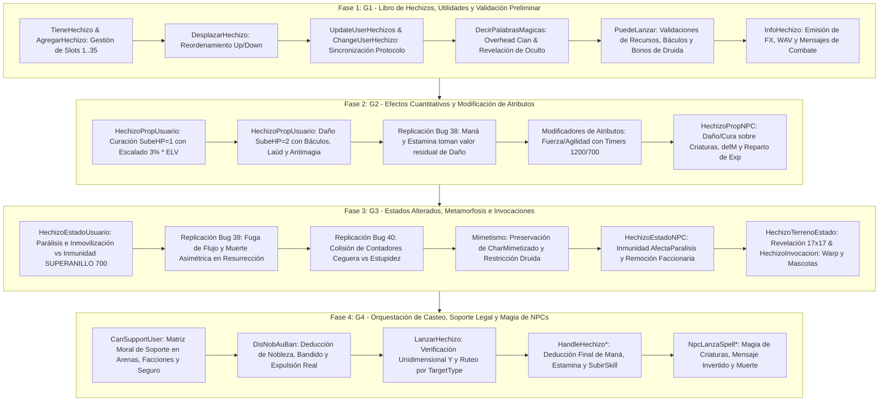

# Plan de Desglose Modular: Magia y Hechizos `modHechizos.bas` (Capa 7, Módulo #23)

Este documento formaliza la planificación técnica detallada, las directivas arquitectónicas vinculantes y la estrategia de implementación progresiva en C++20 para el subsistema central de magia, conjuros, efectos de estado y soporte legal en Argentum Online v0.13.0:
- `legacy/server/Codigo/modHechizos.bas` (2.087 líneas en VB6).

Conforme a las directivas de [`docs/CONVENTIONS.md`](../CONVENTIONS.md) (Regla de Módulos Grandes y Regla 7 de Taxonomía de Hallazgos), el informe de auditoría técnica exhaustiva de [`docs/audit/14a-hechizos-detalle.md`](../audit/14a-hechizos-detalle.md) y el Master Bug Ledger en [`docs/implementation/KNOWN-LEGACY-BUGS.md`](KNOWN-LEGACY-BUGS.md), este trabajo se estructura en **cuatro fases secuenciales** cubriendo el 100% de los 22 procedimientos legacy.

---

## 1. Directivas Arquitectónicas Vinculantes

### 1.1. Organización Estructural y Convención de Nombres
- **Archivos Destino**: `src/server/modHechizos.hpp` y `src/server/modHechizos.cpp`.
- **Superficie Pública de Funciones**: Preservación estricta y literal en **PascalCase** de los 22 procedimientos originales de VB6 (e.g. `LanzarHechizo`, `PuedeLanzar`, `HechizoPropUsuario`, `HechizoEstadoUsuario`, `CanSupportUser`).
- **Constantes de Dominio**:
  - `constexpr int16_t SUPERANILLO = 700;` (inmunidad absoluta a parálisis y estupidez).
  - `constexpr int16_t APOCALIPSIS_SPELL_INDEX = 25;` (exclusión canónica de bonos porcentuales de druida).
  - `constexpr uint8_t MAXUSERHECHIZOS = 35;` (capacidad estándar del libro de hechizos).
  - `constexpr int16_t LAUDMAGICO = 696;`, `constexpr int16_t FLAUTAMAGICA = 208;`
  - `constexpr int16_t LAUDELFICO = 1049;`, `constexpr int16_t FLAUTAELFICA = 1050;`
  - `constexpr int16_t HELEMENTAL_FUEGO = 26;`, `constexpr int16_t HELEMENTAL_TIERRA = 28;` (preservadas por paridad).

### 1.2. Preservación del Bug Ledger y Peculiaridades de Dominio (Regla 7)
En cumplimiento estricto de la taxonomía institucional de la Regla 7 de `docs/CONVENTIONS.md`:

1. **Defectos Técnicos Reales ([`docs/implementation/KNOWN-LEGACY-BUGS.md`](KNOWN-LEGACY-BUGS.md))**:
   - **Bug #38 (Omisión de `daño` en Maná y Estamina / `HechizoPropUsuario:1775-1855`)**: En los bloques `SubeMana = 1/2` y `SubeSta = 1/2`, el motor de VB6 jamás evalúa `RandomNumber(MiMana, MaMana)` ni `RandomNumber(MinSta, MaxSta)`. Aplica el valor previo residual de la variable local `daño`. **Replicación obligatoria (`Replicated (Strict Parity)`)**.
   - **Bug #39 (Fuga de Flujo y Muerte Asimétrica en Resurrección / `HechizoEstadoUsuario:1104-1120`)**: Si el esfuerzo vital de resucitar mata al lanzador (`.Stats.MinHp <= 0`), se ejecuta `UserDie` y `HechizoCasteado = False`, pero omite `Exit Sub`. El objetivo resucita igual y el lanzador muerto no consume maná ni energía ni sube skill. **Replicación obligatoria (`Replicated (Strict Parity)`)**.
   - **Bug #40 (Colisión de Contadores entre Ceguera y Estupidez / `HechizoEstadoUsuario:1139, 1159`)**: Ambos estados alterados asignan y resetean el mismo contador `.Counters.Ceguera` (`IntervaloParalizado / 3` vs `IntervaloParalizado`), pisando mutuamente sus tiempos de expiración. **Replicación obligatoria (`Replicated (Strict Parity)`)**.

2. **Peculiaridades de Dominio, Balance y Quirks Históricos**:
   - **Quirk 7.1 (Mensaje Invertido en Curación de NPC / `NpcLanzaSpellSobreUser:58-61`)**: Si una criatura cura a un jugador (`SubeHP = 1`), suma vida pero envía el mensaje `"te ha quitado X puntos de vida"`.
   - **Quirk 7.2 (Intervalo de Estupidez en Criaturas / `NpcLanzaSpellSobreUser:142`)**: Asigna `.Counters.Ceguera = IntervaloInvisible` en lugar de `IntervaloParalizado`.
   - **Quirk 7.3 (Validación Unidimensional en `LanzarHechizo:690`)**: Evalúa únicamente `Abs(TargetY - Y) <= RANGO_VISION_Y`, omitiendo la coordenada X en el chequeo interno.
   - **Quirk 7.4 (Bonos de Druida con Flauta Élfica / `PuedeLanzar:321-336`)**: Descuento del 50% de maná en mimetismo, 30% en invocaciones y 10% en magia general excepto Apocalipsis (#25). Warp exige el 100% de la barra de maná y al menos 1 mascota activa.
   - **Quirk 7.5 (Bonos de Báculo de Mago y Laúd de Bardo)**: Con `StaffAffected`, Mago sin báculo inflige 70% de daño; con báculo inflige `(StaffDamageBonus + 70)/100`. Bardo con `LAUDELFICO` o `FLAUTAELFICA` suma un multiplicador del 4% (`daño * 1.04`).

---

### 1.3. Aislamiento Mediante Interfaz de Callbacks (`ISpellsHost` / `SpellsCallbacks`)

Dado que `modHechizos` pertenece a la Capa 7 y orquesta interacciones con subsistemas de capas no migradas o externas (`Modulo_UsUaRiOs.bas`, `SistemaCombate.bas`, `MODULO_NPCs.bas`, `ModFacciones.bas`, `Statistics.bas`), todas las llamadas salientes se desacoplan mediante una estructura de callbacks tipados (`SpellsCallbacks`), permitiendo compilar y testear el 100% de la lógica sin enlaces directos al estado global del servidor.

```cpp
struct SpellsCallbacks {
    // Muerte y Resurrección
    std::function<void(int16_t user_index)> user_die;
    std::function<void(int16_t target_index)> revivir_usuario;
    std::function<void(int16_t npc_index, int16_t user_index)> muere_npc;

    // Combate y Retaliación
    std::function<bool(int16_t user_index, int16_t target_index)> puede_atacar;
    std::function<bool(int16_t user_index, int16_t npc_index, bool paralisis)> puede_atacar_npc;
    std::function<void(int16_t attacker_index, int16_t victim_index)> usuario_atacado_por_usuario;
    std::function<void(int16_t npc_index, int16_t user_index)> npc_atacado;
    std::function<int16_t(int16_t user_index, int16_t target_index)> trigger_zona_pelea;
    std::function<void(int16_t user_index, int16_t npc_index, int32_t damage)> calcular_dar_exp;

    // Facciones, Moral y Reputación
    std::function<bool(int16_t user_index)> criminal;
    std::function<bool(int16_t user_index)> es_armada;
    std::function<bool(int16_t user_index)> es_caos;
    std::function<void(int16_t user_index)> volver_criminal;
    std::function<void(int16_t user_index)> restar_criminalidad;
    std::function<void(int16_t user_index)> expulsar_faccion_real;
    std::function<void(int16_t user_index)> refresh_char_status;

    // Criaturas y Mascotas
    std::function<int16_t(int16_t npc_num, const WorldPos& pos, bool backup, bool respawn)> spawn_npc;
    std::function<void(int16_t npc_index)> follow_amo;
    std::function<void(int16_t user_index, int16_t pet_index)> warp_mascota;
    std::function<int16_t(int16_t user_index)> farthest_pet;
    std::function<int16_t(int16_t user_index)> free_mascota_index;

    // Inventario y Progresión
    std::function<void(int16_t user_index, uint8_t slot, int16_t amount)> quitar_user_inv_item;
    std::function<void(int16_t user_index, eSkill skill, bool sube)> subir_skill;

    // Notificaciones y Estadísticas
    std::function<void(int16_t user_index, int16_t target_index)> store_frag;
    std::function<void(int16_t victim_index, int16_t killer_index)> contar_muerte;
    std::function<void(int16_t victim_index, int16_t killer_index)> act_stats;
    std::function<void(int16_t user_index, int16_t char_index, bool invisible)> set_invisible;
    std::function<void(int16_t user_index, int16_t body, int16_t head, uint8_t heading, int16_t weapon, int16_t shield, int16_t helmet)> change_user_char;
    std::function<int16_t(int16_t user_index, int16_t weapon_obj_index)> get_weapon_anim;
};
```

---

## 2. Inventario Exhaustivo y Mapeo de Fases

El módulo consta exactamente de **22 procedimientos**, asignados secuencialmente a través de las 4 fases:

| # | Procedimiento Legacy | Tipo | Visibilidad VB6 | Líneas Legacy | Fase Asignada | Propósito Principal |
| :-: | :--- | :---: | :---: | :---: | :-: | :--- |
| 1 | `TieneHechizo` | Function | Amigable | 187–208 | **Fase 1 (G1)** | Verifica si el usuario ya aprendió el hechizo en sus 35 slots. |
| 2 | `AgregarHechizo` | Sub | Amigable | 209–242 | **Fase 1 (G1)** | Asigna un hechizo desde un pergamino, consume el ítem y actualiza ranura. |
| 3 | `DecirPalabrasMagicas` | Sub | Amigable | 243–269 | **Fase 1 (G1)** | Emite palabras mágicas cian en área y desoculta personajes. |
| 4 | `PuedeLanzar` | Function | Amigable | 276–360 | **Fase 1 (G1)** | Valida requisitos vitales, báculos, maná, estamina y bonos de Druida. |
| 5 | `InfoHechizo` | Sub | Amigable | 1425–1474 | **Fase 1 (G1)** | Emite FX, sonidos y mensajes a los involucrados (respetando GMs invisibles). |
| 6 | `UpdateUserHechizos` | Sub | Amigable | 1966–1998 | **Fase 1 (G1)** | Sincroniza ranuras del libro (unitaria o masivamente). |
| 7 | `ChangeUserHechizo` | Sub | Amigable | 1999–2016 | **Fase 1 (G1)** | Asigna conjuro en memoria y despacha `WriteChangeSpellSlot`. |
| 8 | `DesplazarHechizo` | Sub | Public | 2017–2052 | **Fase 1 (G1)** | Intercambia ranuras adyacentes arriba/abajo en el libro. |
| 9 | `HechizoPropUsuario` | Function | Public | 1475–1863 | **Fase 2 (G2)** | Modificación de HP, atributos, hambre, sed y **Bug #38** (Maná/Sta residual). |
| 10 | `HechizoPropNPC` | Sub | Amigable | 1354–1424 | **Fase 2 (G2)** | Curación y daño sobre criaturas, bonos de báculo/laúd, defensa y exp. |
| 11 | `HechizoEstadoUsuario` | Sub | Amigable | 750–1170 | **Fase 3 (G3)** | Parálisis, ceguera, estupidez, resurrección, **Bug #39** y **Bug #40**. |
| 12 | `HechizoEstadoNPC` | Sub | Amigable | 1171–1353 | **Fase 3 (G3)** | Estados alterados sobre criaturas, remoción por facción y mimetismo druida. |
| 13 | `HechizoTerrenoEstado` | Sub | Amigable | 361–401 | **Fase 3 (G3)** | Efectos en terreno: remoción de invisibilidad en área de 17x17 celdas. |
| 14 | `HechizoInvocacion` | Sub | Amigable | 408–491 | **Fase 3 (G3)** | Warp de mascotas (gasto total de maná) e invocación múltiple de criaturas. |
| 15 | `LanzarHechizo` | Sub | Amigable | 670–749 | **Fase 4 (G4)** | Punto de entrada neurálgico, validación en Y y ruteo según `TargetType`. |
| 16 | `HandleHechizoUsuario` | Sub | Amigable | 545–603 | **Fase 4 (G4)** | Despachador para usuarios: deduce maná/estamina con bonos de druida. |
| 17 | `HandleHechizoNPC` | Sub | Amigable | 604–668 | **Fase 4 (G4)** | Despachador para criaturas: deducción de costos y flag `Ignorado`. |
| 18 | `HandleHechizoTerreno` | Sub | Amigable | 492–544 | **Fase 4 (G4)** | Despachador para celdas: deducción de costos e incremento de skill. |
| 19 | `CanSupportUser` | Function | Public | 1864–1965 | **Fase 4 (G4)** | Matriz legal de soporte: arenas, facciones, criminalidad y legítima defensa. |
| 20 | `DisNobAuBan` | Sub | Public | 2053–2087 | **Fase 4 (G4)** | Penalización moral: resta nobleza, suma bandido y expulsa armada. |
| 21 | `NpcLanzaSpellSobreUser` | Sub | Amigable | 36–150 | **Fase 4 (G4)** | Criatura lanza hechizo sobre usuario (daño/cura, parálisis, estupidez). |
| 22 | `NpcLanzaSpellSobreNpc` | Sub | Amigable | 151–186 | **Fase 4 (G4)** | Criatura agrede mágicamente a otra criatura y procesa su muerte. |

---

## 3. Desglose en 4 Fases Secuenciales



---

### Fase 1 (G1 — Libro de Hechizos, Utilidades y Validación Preliminar)

#### 1. Alcance Operativo y Procedimientos Asignados
- `TieneHechizo(int16_t spell_index, int16_t user_index) -> bool`.
- `AgregarHechizo(int16_t user_index, int16_t slot) -> void`.
- `DecirPalabrasMagicas(const std::string& spell_words, int16_t user_index) -> void`.
- `PuedeLanzar(int16_t user_index, int16_t spell_index) -> bool`.
- `InfoHechizo(int16_t user_index) -> void`.
- `UpdateUserHechizos(bool update_all, int16_t user_index, uint8_t slot) -> void`.
- `ChangeUserHechizo(int16_t user_index, uint8_t slot, int16_t spell_index) -> void`.
- `DesplazarHechizo(int16_t user_index, int16_t dire, int16_t hechizo_desplazado) -> void`.

#### 2. Reglas Clave y Detalles Algorítmicos
- **Validaciones en `PuedeLanzar`**:
  - Personaje muerto aborta con mensaje `"No puedes lanzar hechizos estando muerto."`.
  - Si `NeedStaff > 0` y la clase es `Mage`, exige báculo equipado con `StaffPower >= NeedStaff`.
  - Exige `Skill(Magia) >= MinSkill` y `MinSta >= StaRequerido`.
  - Bonos de Druida con Flauta Élfica: `DruidManaBonus = 0.5` si `Mimetiza = 1`, `0.7` si `Tipo = uInvocacion`, `0.9` en magia general excepto Apocalipsis (`APOCALIPSIS_SPELL_INDEX = 25`).
  - Para `Warp = 1`, Druida requiere maná completo (`MinMAN == MaxMAN`) y `NroMascotas > 0`.
- **Desplazamiento del Libro**:
  - Arriba (`dire = 1`): intercambia con `slot - 1` (rechaza `slot == 1`).
  - Abajo (`dire = -1`): intercambia con `slot + 1` (rechaza `slot == MAXUSERHECHIZOS`).
- **Desocultamiento**:
  - `DecirPalabrasMagicas` desoculta al personaje si `flags.Oculto = 1` (salvo administradores invisibles).

#### 3. Escenarios de Prueba Unitarios (Doctest)
1. Inserción de hechizo en slot vacío y rechazo ante duplicados o libro lleno.
2. Desplazamiento válido e inválido de slots en los extremos (1 y 35).
3. Verificación de `PuedeLanzar`: rechazo por báculo insuficiente en Mago, falta de estamina o maná.
4. Verificación de descuentos porcentuales de maná para Druidas según equipo y conjuro.
5. Revelación visual de personajes ocultos al decir palabras mágicas.

---

### Fase 2 (G2 — Efectos Cuantitativos y Modificación de Atributos)

#### 1. Alcance Operativo y Procedimientos Asignados
- `HechizoPropUsuario(int16_t user_index) -> bool`.
- `HechizoPropNPC(int16_t spell_index, int16_t npc_index, int16_t user_index, bool& hechizo_casteado) -> void`.

#### 2. Reglas Clave y Detalles Algorítmicos
- **Replicación Estricta del Bug #38**:
  - En los bloques `SubeMana` y `SubeSta`, **no se evalúa** `RandomNumber` para dichos atributos. La modificación utiliza el contenido residual de la variable local `daño`.
  - Si un conjuro afecta puramente a maná o estamina, `daño` ingresa con valor 0 y produce una mutación de 0 puntos.
  - Si el conjuro modifica previamente HP o Fuerza, `daño` traslada ese monto al cálculo de maná/estamina.
- **Fórmula Canónica de Curación (`SubeHP = 1`)**:
  $$\text{daño} = \text{RandomNumber}(\text{MinHp}, \text{MaxHp}) + \left\lfloor \frac{\text{RandomNumber}(\text{MinHp}, \text{MaxHp}) \times (3 \times \text{ELV})}{100} \right\rfloor$$
- **Fórmula Canónica de Daño Mágico (`SubeHP = 2`)**:
  - Base con escalado del $3\% \times \text{ELV}$.
  - Multiplicador de báculo en Magos con `StaffAffected`: $\lfloor \text{daño} \times (\text{StaffBonus} + 70) / 100 \rfloor$ con vara, o $\lfloor \text{daño} \times 0.7 \rfloor$ desarmado.
  - Multiplicador de Bardo con `LAUDELFICO` o `FLAUTAELFICA`: $\lfloor \text{daño} \times 1.04 \rfloor$.
  - Mitigación por Casco y Anillo antimagia en usuarios; mitigación por `.Stats.defM` en NPCs.
  - Clampeo inferior a cero.
- **Modificación de Atributos Primarios (Fuerza y Agilidad)**:
  - Sube: temporizador en 1200 ticks; cap en $\min(\text{MAXATRIBUTOS}, \text{Backup} \times 2)$.
  - Baja: temporizador en 700 ticks; suelo en $\text{MINATRIBUTOS}$.
- **Muerte y Reparto de Experiencia**:
  - Muerte de usuario agredido dispara `Statistics.StoreFrag`, `ContarMuerte`, `ActStats` y `UserDie` (salvo que estuviera en legítima defensa con el agresor).
  - Daño a NPCs otorga experiencia proporcional mediante `CalcularDarExp` y muerte mediante `MuereNpc`.

#### 3. Escenarios de Prueba Unitarios (Doctest)
1. Verificación determinista de curación con escalado de nivel de 1 a 50.
2. Cálculo de daño mágico evaluando penalización de mago desarmado (0.7x), bonificación de báculos y bonus de bardo (1.04x).
3. Mitigación antimagia por Casco y Anillo, comprobando clampeo a 0 sin subdesbordamiento.
4. **Prueba de Replicación del Bug #38**: Hechizo puro de maná/energía resulta en delta = 0; hechizo combinado traslada el daño de HP residual al maná.
5. Mutaciones temporales de Fuerza y Agilidad verificando límites superior (doble del backup) e inferior.

---

### Fase 3 (G3 — Estados Alterados, Metamorfosis e Invocaciones)

#### 1. Alcance Operativo y Procedimientos Asignados
- `HechizoEstadoUsuario(int16_t user_index, bool& hechizo_casteado) -> void`.
- `HechizoEstadoNPC(int16_t npc_index, int16_t spell_index, bool& hechizo_casteado, int16_t user_index) -> void`.
- `HechizoTerrenoEstado(int16_t user_index, bool& b) -> void`.
- `HechizoInvocacion(int16_t user_index, bool& hechizo_casteado) -> void`.

#### 2. Reglas Clave y Detalles Algorítmicos
- **Replicación Estricta del Bug #39 (Muerte Asimétrica en Resurrección)**:
  - Descuento de vida al resucitar: $\text{MinHp} \times (1 - \text{Target}.\text{ELV} \times 0.015)$.
  - Si $\text{MinHp} \le 0$, invoca `UserDie(UserIndex)` y marca `HechizoCasteado = False`.
  - Al omitir `Exit Sub`, **continúa y ejecuta** `RevivirUsuario(TargetIndex)`. El objetivo revive exitosamente aunque el lanzador perezca.
- **Replicación Estricta del Bug #40 (Colisión Ceguera vs Estupidez)**:
  - Ambos efectos sobreescriben la misma variable `.Counters.Ceguera` (`IntervaloParalizado / 3` vs `IntervaloParalizado`).
- **Inmunidad Absoluta de `SUPERANILLO` (700)**:
  - Rechaza parálisis, inmovilización y estupidez con mensaje de consola.
- **Mimetismo y Metamorfosis**:
  - Usuario a Usuario: Resguarda cuerpo/cabeza originales en `CharMimetizado` y adopta la apariencia del objetivo.
  - Usuario a Criatura: Exclusivo de la clase Druida (`eClass.Druid`).
- **Invocaciones y Warp**:
  - `Warp = 1`: consume la totalidad de la reserva de maná actual y reposiciona la mascota más distante (`WarpMascota`).
  - Invocación regular: genera hasta `cant` criaturas aliadas con `IntervaloInvocacion`, limitadas por `MAXMASCOTAS`.
- **Efectos en Terreno**:
  - `RemueveInvisibilidadParcial`: escanea el cuadrilátero de 17x17 celdas ($X \pm 8$, $Y \pm 8$) disparando el FX sobre personajes invisibles no-administradores.

#### 3. Escenarios de Prueba Unitarios (Doctest)
1. Inmunidad del `SUPERANILLO` contra parálisis y estupidez en usuarios.
2. **Prueba de Replicación del Bug #39**: Agotamiento vital en resurrección provoca la muerte del lanzador (`UserDie`) pero culmina exitosamente la resurrección del objetivo (`RevivirUsuario`).
3. **Prueba de Replicación del Bug #40**: Aplicación consecutiva de Ceguera y Estupidez comprueba la sobreescritura del contador unificado `.Counters.Ceguera`.
4. Invocación de criaturas aliadas respetando el límite estricto `MAXMASCOTAS`.
5. Mimetismo de criaturas bloqueado para no-druidas y permitido para druidas.

---

### Fase 4 (G4 — Orquestación de Casteo, Soporte Legal y Magia de NPCs)

#### 1. Alcance Operativo y Procedimientos Asignados
- `LanzarHechizo(int16_t spell_index, int16_t user_index) -> void`.
- `HandleHechizoUsuario(int16_t user_index, int16_t spell_index) -> void`.
- `HandleHechizoNPC(int16_t user_index, int16_t hechizo_index) -> void`.
- `HandleHechizoTerreno(int16_t user_index, int16_t spell_index) -> void`.
- `CanSupportUser(int16_t caster_index, int16_t target_index, bool do_criminal = false) -> bool`.
- `DisNobAuBan(int16_t user_index, int32_t noble_pts, int32_t bandido_pts) -> void`.
- `NpcLanzaSpellSobreUser(int16_t npc_index, int16_t user_index, int16_t spell) -> void`.
- `NpcLanzaSpellSobreNpc(int16_t npc_index, int16_t target_npc, int16_t spell) -> void`.

#### 2. Reglas Clave y Detalles Algorítmicos
- **Matriz Moral de Soporte en `CanSupportUser`**:
  - Auto-casteo y Trigger 6 (Arenas) siempre permitidos.
  - Personaje en consulta ciudadana (`flags.EnConsulta`) bloqueado.
  - Objetivo Criminal: Armada Real bloqueada; Ciudadano bloqueado si tiene seguro de combate activado (`flags.Seguro`); si no tiene seguro, se penaliza con `VolverCriminal` o pérdida del 50% de nobleza y +10.000 de bandido (`DisNobAuBan`).
  - Objetivo Ciudadano: Legión del Caos bloqueada; Ciudadano en legítima defensa (`flags.AtacablePor > 0` ajeno) exige quitar el seguro y penaliza nobleza/bandido.
- **Orquestación en `LanzarHechizo`**:
  - Valida rango vertical `Abs(TargetY - Y) <= RANGO_VISION_Y` (Quirk 7.3).
  - Rutea a los manejadores de usuario, criatura o terreno.
  - Decrementa contadores de trabajo y ocultamiento.
- **Magia de Criaturas (`NpcLanzaSpell*`)**:
  - Evalúa `MapInfo.MagiaSinEfecto`.
  - Aplica mitigación antimagia de casco y anillo al dañar usuarios.
  - Preserva el Quirk 7.1 (mensaje de daño en curación) y Quirk 7.2 (intervalo invisible en estupidez).
  - Muerte de criaturas dispara `MuereNpc` computando amo (`MaestroUser`) si existiera.

#### 3. Escenarios de Prueba Unitarios (Doctest)
1. Matriz exhaustiva de `CanSupportUser`: Ciudadano curando Criminal (con y sin seguro), Armada curando Criminal (siempre prohibido), Caos curando Ciudadano (prohibido).
2. Penalización moral en `DisNobAuBan`: deducción del 50% de nobleza, suma de bandido y expulsión de Armada si cae en criminalidad.
3. Flujo completo de casteo en `LanzarHechizo` validando ruteo por `TargetType` y consumo exacto de maná/estamina.
4. Descuento total de maná en invocación de mascotas tipo warp.
5. Magia ofensiva de criaturas hacia usuarios y entre criaturas evaluando mitigaciones y disparador de muerte.

---

## 4. Estrategia de Pruebas Unitarias y Garantía de No Regresión

1. **Determinismo Aislado**: Todas las pruebas unitarias se basarán en fixtures y callbacks desacoplados de `SpellsCallbacks`, sin requerir sockets, temporizadores reales ni I/O de disco.
2. **Cobertura al 100% de Procedimientos**: Cada una de las 22 funciones legacy contará con tests directos e indirectos cubriendo ramas de éxito, fallo, desbordamiento y casos límite.
3. **Invarianza de la Suite Existente**: Las pruebas del nuevo módulo residirán en `tests/test_modhechizos.cpp`, garantizando que los 260 tests preexistentes continúen inalterados y en verde.
