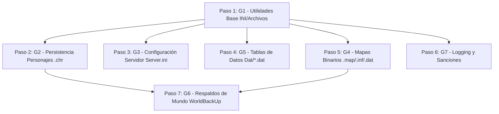

# Desglose Modular de Persistencia e E/S (`FileIO.bas`)

Este documento establece la descomposición interna del módulo monolítico `legacy/server/Codigo/FileIO.bas` (~2.246 líneas, 38 funciones/procedimientos) en **7 grupos lógicos independientes**.

En lugar de tratar a `FileIO` como un único paso de porting atómico y masivo en la Capa 3 del servidor, esta especificación define la secuencia interna de migración a C++ ordenada por árbol de dependencias internas, nivel de riesgo y disponibilidad de pruebas automáticas (*fixtures*).

---

> [!IMPORTANT]
> **Diferenciación entre Datos de Usuario vs. Datos de Configuración del Juego**:
> Los archivos manejados por `FileIO.bas` se dividen conceptualmente en dos categorías:
> 1. **Persistencia de Estado de Usuario / Runtime**: Personajes (`.chr`) y backups (`\WorldBackUp\`). Son mutables, generados durante la partida por los usuarios/servidor y poseen cobertura sintética de pruebas en `tests/fixtures/charfile/` (con la limitación aceptada del proyecto).
> 2. **Configuración Estática y Tablas del Mundo**: Mapas (`.map`, `.inf`, `.dat`), configuraciones (`Server.ini`) y tablas de datos (`Obj.dat`, `Balance.dat`, `Hechizos.dat`, `spawn.dat`). Son datos estáticos distribuídos con el juego/servidor y no son generados por los jugadores.

---

## 1. Grupos Lógicos Identificados en `FileIO.bas`

### Grupo 1: Utilidades Base de Archivos e INI (Low-Level INI & File Helpers) — ✅ COMPLETADO
- **Estado**: **Completado** (Implementado en `FileIO.hpp`/`FileIO.cpp` — `GetVar`, `WriteVar`, `TxtDimension`, `ReadField`).
- **Funciones y Procedimientos**:
  - `GetVar(file, Main, Var, EmptySpaces)`: Lectura de claves INI mediante API de sistema / buffer.
  - `WriteVar(file, Main, Var, Value)`: Escritura de claves INI.
  - `TxtDimension(name)`: Helper para calcular el tamaño de un archivo en disco (`FileLen`).
  - `ReadField(pos, text, sepAscii)`: Helper primitivo de parsing de cadenas delimitadas.
- **Formatos de Datos Relevantes**:
  - Opera sobre el formato INI ANSI (Windows-1252) con terminaciones de línea CRLF (`\r\n`).
- **Dependencias Internas**:
  - *Ninguna*. Es la base primitiva de E/S del módulo.
- **Cobertura de Fixtures de Prueba**:
  - Sin fixtures dedicados en `tests/fixtures/`. Se valida mediante tests unitarios en **doctest** con archivos temporales e inyección de strings INI.

---

### Grupo 2: Persistencia de Personajes (`.chr`) — 🚨 CATEGORÍA CRÍTICA 1 — ✅ COMPLETADO
- **Estado**: **Completado** (Implementado en `FileIO.hpp`/`FileIO.cpp` — `SaveUser`, `LoadUserInit`, `LoadUserStats`, `LoadUserReputacion`, `criminal`, ver [`10-fileio-persistencia-personajes.md`](10-fileio-persistencia-personajes.md)).
- **Funciones y Procedimientos**:
  - `SaveUser(UserIndex, UserFile)`: Serializa el tipo `User` completo a disco en formato `.chr` mediante `WriteVar`.
  - `LoadUserInit(UserIndex, UserFile)`: Procedimiento principal de lectura de `.chr` usando `clsIniReader`.
  - `LoadUserStats(UserIndex, UserFile)`: Helper interno de `LoadUserInit` para secciones `[STATS]`, `[ATRIBUTOS]`, `[SKILLS]`, `[FLAGS]`, `[COUNTERS]`, `[FACCIONES]`.
  - `LoadUserReputacion(UserIndex, UserFile)`: Helper interno de `LoadUserInit` para `[REP]` / `[FACCIONES]`.
  - `criminal(UserIndex)`: Consulta de estado criminal del usuario basado en sus contadores persistidos.
- **Formatos de Datos Relevantes**:
  - **Sección 4 de `docs/audit/06-formatos-de-datos.md`**: Estructura de texto INI ANSI (Windows-1252) con secciones `[INIT]`, `[STATS]`, `[ATRIBUTOS]`, `[SKILLS]`, `[FLAGS]`, `[FACCIONES]`, `[INVENTORY]`, `[SPELLS]`, `[BANCO]`, `[GUILD]`.
- **Dependencias Internas y Externas**:
  - Depende del **Grupo 1** (`WriteVar` en `SaveUser`), del módulo **`Declares`** (`Declares.hpp`, para la estructura `User`, sus subtipos y `UserList`) y de la clase externa `clsIniReader` (para `LoadUserInit`).
- **Cobertura de Fixtures de Prueba**:
  - **SÍ POSEE COBERTURA DE FIXTURES**: Cobertura en `tests/fixtures/charfile/` (`PEPE.chr`, `GONZALO.chr`, `NOVATO.chr`, `PODEROSO.chr`).
  - *Nota*: Es el único grupo de `FileIO` con fixtures reales para validación estricta byte a byte (`SaveUser` debe producir exactamente la misma salida INI que VB6).

---

### Grupo 3: Configuración del Servidor y Roles Administrativos (`Server.ini` & Roles) — ✅ COMPLETADO
- **Estado**: **Completado** (Implementado en `FileIO.hpp`/`FileIO.cpp` — `LoadSini`, `EsAdmin`, `EsDios`, `EsSemiDios`, `EsConsejero`, `EsRolesMaster`, `LoadMotd`, ver [`11-fileio-configuracion-servidor.md`](11-fileio-configuracion-servidor.md)).
- **Funciones y Procedimientos**:
  - `LoadSini()`: Lee `Server.ini` y puebla variables globales (puerto, límites, banderas de testing, intervalos, IDs de armaduras faccionarias).
  - `EsAdmin(name)`: Verifica si el nick figura en `[Admines]` de `Server.ini`.
  - `EsDios(name)`: Verifica si el nick figura en `[Dioses]` de `Server.ini`.
  - `EsSemiDios(name)`: Verifica si el nick figura en `[SemiDioses]` de `Server.ini`.
  - `EsConsejero(name)`: Verifica si el nick figura en `[Consejeros]` de `Server.ini`.
  - `EsRolesMaster(name)`: Verifica si el nick figura en `[RolesMasters]` de `Server.ini`.
  - `LoadMotd()`: Lee `Motd.ini` con el mensaje del día.
- **Formatos de Datos Relevantes**:
  - Archivos INI de configuración general del servidor (`Server.ini`, `Motd.ini`).
- **Dependencias Internas**:
  - Depende del **Grupo 1** (`GetVar`).
- **Cobertura de Fixtures de Prueba**:
  - Sin fixtures en `tests/fixtures/` (es configuración estática del servidor). Se verifica en **doctest** mediante fixtures sintéticos de configuración INI (`tests/test_fileio_serverconfig.cpp`).

---

### Grupo 4: Carga y Guardado de Mapas Binarios e INI (`.map`, `.inf`, `.dat`) — ✅ COMPLETADO
- **Estado**: **Completado** (Implementado en `FileIO.hpp`/`FileIO.cpp` — `CargarMapa`, `GrabarMapa`, `LoadMapData`, `generateMatrix`, `setDistance`, `getLimit`, ver [`13-fileio-mapas.md`](13-fileio-mapas.md)).
- **Funciones y Procedimientos**:
  - `CargarMapa(Map, MAPFl)`: Lee geometría/capas binarias (`.map`), triggers/spawns binarios (`.inf`) y metadatos INI (`.dat`).
  - `GrabarMapa(Map, MAPFILE)`: Serializador binario de `.map` (cabecera `tCabecera` 263b + registros de tiles por bitfield `ByFlags`), `.inf` (cabecera 10b + triggers `TileExit` y `NpcIndex`) y `.dat` (propiedades del mapa).
  - `LoadMapData()`: Lee `Map.dat` para conocer la cantidad global de mapas (`NumMaps`) y sus nombres.
  - `generateMatrix(mapa)`: Precomputa la matriz de distancias (`distanceToCities`) entre mapas y ciudades principales.
  - `setDistance(mapa, city, side, X, Y)`: Algoritmo recursivo para cálculo de distancias.
  - `getLimit(mapa, side)`: Encuentra el ID del mapa vecino leyendo los bordes con `TileExit`.
- **Formatos de Datos Relevantes**:
  - **Secciones 1 y 2 de `docs/audit/06-formatos-de-datos.md`**:
    - Cabecera binaria `tCabecera` (263 bytes `#pragma pack(push, 1)`: `char desc[255]`, `int32_t crc`, `int32_t magicWord`).
    - Cabecera `.map` (273 bytes total: `int16_t MapVersion` + `tCabecera` + 8 bytes tempint) + 10.000 registros de tiles de tamaño variable condicionados por `uint8_t ByFlags`.
    - Cabecera `.inf` (10 bytes: 5 `int16_t`) + 10.000 registros de tiles de triggers condicionados por `uint8_t ByFlags` (`TileExit.Map`, `X`, `Y`, `NpcIndex`).
    - Archivo de metadatos INI `Mapa<N>.dat` y `Map.dat`.
- **Dependencias Internas**:
  - Depende del **Grupo 1** (`GetVar`, `WriteVar`). `generateMatrix` depende de `setDistance` y `getLimit` (el cual consulta la grilla `MapData` poblada por `CargarMapa`).
- **Cobertura de Fixtures de Prueba**:
  - Fixtures de mapas binarios autoritativos en `tests/fixtures/maps/` (Mapas 1, 4, 8 y 15).

---

### Grupo 5: Tablas de Datos de Juego y Balance (Game Data & Balance Tables Loading) — ✅ COMPLETADO
- **Estado**: **Completado** (Implementado en `FileIO.hpp`/`FileIO.cpp` — `LoadOBJData`, `CargarHechizos`, `LoadBalance`, etc., ver [`12-fileio-tablas-datos.md`](12-fileio-tablas-datos.md)).
- **Funciones y Procedimientos**:
  - `LoadOBJData()`: Lee `Dat/Obj.dat` (catálogo de ítems y propiedades) usando `clsIniReader`.
  - `CargarHechizos()`: Lee `Dat/Hechizos.dat` (catálogo de hechizos) mediante `GetVar`.
  - `LoadBalance()`: Lee `Dat/Balance.dat` (modificadores de clase/raza, vida, exponente de party, recompensas faccionarias) mediante `GetVar`.
  - `LoadArmasHerreria()`: Lee `Dat/ArmasHerreria.dat` (recetas de herrero).
  - `LoadArmadurasHerreria()`: Lee `Dat/ArmadurasHerreria.dat` (recetas de armaduras).
  - `LoadObjCarpintero()`: Lee `Dat/ObjCarpintero.dat` (recetas de carpintero).
  - `LoadArmadurasFaccion()`: Lee `Dat/ArmadurasFaccionarias.dat` (límites de defensa y alineación faccionaria).
  - `CargarSpawnList()`: Lee `Dat/spawn.dat` (reglas de apariciones NPC).
  - `CargarForbidenWords()`: Lee `Dat/forbidenwords.dat` (palabras prohibidas).
  - `CargaApuestas()`: Lee `Dat/apuestas.dat` (estadísticas del sistema de apuestas).
- **Formatos de Datos Relevantes**:
  - Archivos de texto INI estructurados ubicados en el directorio `Dat/`.
- **Dependencias Internas**:
  - Depende del **Grupo 1** (`GetVar`) y de la clase externa `clsIniReader` (`LoadOBJData`).
- **Cobertura de Fixtures de Prueba**:
  - Fixtures reales del juego en `tests/fixtures/gamedata/real/` (`Obj.dat`, `Hechizos.dat`, `Balance.dat`, etc.).

---

### Grupo 6: Sistema de Respaldos de Mundo (World Backup System) — ✅ COMPLETADO
- **Estado**: **Completado** (Implementado en `FileIO.hpp`/`FileIO.cpp` — `DoBackUp`, `CargarBackUp`, `BackUPnPc`, `CargarNpcBackUp`, ver [`14-fileio-backup-logging.md`](14-fileio-backup-logging.md)).
- **Funciones y Procedimientos**:
  - `DoBackUp()`: Orquesta el respaldo de mapas modificados y NPCs activos a disco, registrando timestamp en `logs/BackUps.log` (sin tocar archivos `.chr`).
  - `CargarBackUp()`: Restaura el estado del mundo desde `WorldBackUp/` con fallback automático a mapas base.
  - `BackUPnPc(NpcIndex)`: Persiste el estado de un NPC en disco (`Dat/bkNPCs.dat`) en formato INI.
  - `CargarNpcBackUp(NpcIndex, NpcNumber)`: Restaura el estado del NPC respaldado en memoria y en la grilla.
- **Formatos de Datos Relevantes**:
  - Orquesta mapas binarios/INI (Grupo 4), archivos INI de NPCs y registro de fecha de backup.
- **Dependencias Internas**:
  - Depende directamente del **Grupo 1** (`WriteVar`/`GetVar`), **Grupo 4** (`GrabarMapa`/`CargarMapa`) y estructuras de `Declares`.
- **Cobertura de Fixtures de Prueba**:
  - Fixtures reales de respaldo de mundo en `tests/fixtures/worldbackup/real/` (`Mapa1`, `Mapa10`, `Mapa11`).

---

### Grupo 7: Logging Administrativo y Sanciones (Logs & Bans) — ✅ COMPLETADO
- **Estado**: **Completado** (Implementado en `FileIO.hpp`/`FileIO.cpp` — `LogBan`, `LogBanFromName`, `Ban`, ver [`14-fileio-backup-logging.md`](14-fileio-backup-logging.md)).
- **Funciones y Procedimientos**:
  - `LogBan(BannedIndex, UserIndex, motivo)`: Escribe el detalle del ban en `logs/BanDetail.log` (INI) y agrega el nick en `logs/GenteBanned.log` (append plano).
  - `LogBanFromName(BannedName, UserIndex, motivo)`: Escribe en `logs/BanDetail.dat` y `logs/GenteBanned.log`.
  - `Ban(BannedName, Baneador, motivo)`: Escribe en `logs/BanDetail.dat` y `logs/GenteBanned.log`.
- **Formatos de Datos Relevantes**:
  - Formato INI de log (`BanDetail.log` / `BanDetail.dat`) y append de texto llano (`GenteBanned.log`).
- **Dependencias Internas**:
  - Depende del **Grupo 1** (`WriteVar`).
- **Cobertura de Fixtures de Prueba**:
  - Pruebas unitarias en `tests/test_fileio_adminlogs.cpp` con verificación estructurada y append.

---

## 2. Matriz Resumen de Grupos Lógicos de `FileIO.bas`

| # | Grupo Lógico | Cant. Rutinas | Formato de Datos Principal | Categoria de Datos | Dependencias en FileIO | Fixtures en `tests/fixtures/` | Estado |
| :-: | :--- | :-: | :--- | :--- | :--- | :--- | :---: |
| **G1** | Utilidades Base INI/Archivos | 4 | INI ANSI (Windows-1252) | Helper / Primitivas | *Ninguna* | No (Test con temp file) | **✅ Completado** |
| **G2** | Persistencia Personajes (`.chr`) | 5 | INI `.chr` (Windows-1252) | **Runtime / Usuario** (Mutables) | **G1** + `Declares` + `clsIniReader` | **SÍ (`tests/fixtures/charfile/`)** | **✅ Completado** |
| **G3** | Configuración Servidor y Roles | 7 | `Server.ini` / `Motd.ini` | Configuración Estática | **G1** | Sí (`tests/fixtures/serverconfig/real/`) | **✅ Completado** |
| **G4** | Mapas Binarios e INI | 6 | `.map` (bin), `.inf` (bin), `.dat` (INI) | **Contenido Estático** | **G1** (`MapData`) | Sí (`tests/fixtures/maps/real/`) | **✅ Completado** |
| **G5** | Tablas de Datos (`Dat/*.dat`) | 10 | INI `Dat/*.dat` | Tablas Estáticas Juego | **G1** + `clsIniReader` | Sí (`tests/fixtures/gamedata/real/`) | **✅ Completado** |
| **G6** | Respaldos de Mundo (`WorldBackUp`) | 4 | `.map` Binario + NPC INI + Log | Runtime / Respaldo | **G1, G4** | Sí (`tests/fixtures/worldbackup/real/`) | **✅ Completado** |
| **G7** | Logging y Sanciones | 3 | INI Log + Plain Text Append | Runtime / Logs | **G1** | Pruebas herméticas doctest | **✅ Completado** |

---

## 3. Secuencia de Porting Recomendada (Orden por Dependencia y Riesgo)

El porting de `FileIO.bas` a C++ en la Capa 3 del servidor **debe ejecutarse en 7 pasos secuenciales internos**:

### Justificación Detallada del Orden:

1. **Paso 1: Grupo 1 (Utilidades Base INI/Archivos — `GetVar`, `WriteVar`, `TxtDimension`)**
   - *Razón*: Constituye el cimiento primitivo de lectura y escritura INI sin el cual ningún otro grupo puede funcionar. No posee dependencias internas.
   - *Riesgo*: Bajo.

2. **Paso 2: Grupo 2 (Persistencia de Personajes `.chr` — `SaveUser`, `LoadUserInit`, etc.)**
   - *Razón*: **Prioridad máxima del proyecto** (Categoría Crítica 1 — Persistencia). Es el requisito de compatibilidad más riguroso (salida idéntica byte a byte con VB6). Se porta inmediatamente en el Paso 2 porque solo depende de G1, `Declares` y `clsIniReader`, y cuenta con la ventaja de poseer **fixtures de prueba existentes en `tests/fixtures/charfile/`** (`PEPE.chr`, `GONZALO.chr`, etc.) para verificar la compatibilidad de inmediato con **doctest**.
   - *Riesgo*: Alto (riesgo de romper compatibilidad de guardados de usuarios).

3. **Paso 3: Grupo 3 (Configuración del Servidor — `LoadSini`, Roles, `LoadMotd`)**
   - *Razón*: Requerido temprano para la inicialización básica de opciones del servidor (puertos, configuraciones, listas de administradores). Solo depende de G1.
   - *Riesgo*: Bajo.

4. **Paso 4: Grupo 5 (Tablas de Datos e Inicialización — `Obj.dat`, `Balance.dat`, `Hechizos.dat`, etc.)**
   - *Razón*: Carga de catálogos y parámetros del mundo del juego requeridos por los subsistemas de objetos, magia y combate. Son lecturas INI aisladas que solo dependen de G1 y `clsIniReader`.
   - *Riesgo*: Medio (verificar tipos numéricos y claves de configuración).

5. **Paso 5: Grupo 4 (Mapas Binarios e INI — `CargarMapa`, `GrabarMapa`, `generateMatrix`, etc.)**
   - *Razón*: Elevada complejidad técnica debido al empaquetamiento binario estricto `#pragma pack(push, 1)` de `tCabecera` (263 bytes), cabecera de mapa (273 bytes), decodificación de bitfields (`ByFlags`), capas gráficas variables y triggers binarios `.inf`. Al no haber fixtures binarios en `tests/fixtures/`, se deberán implementar generadores de buffers sintéticos para doctest.
   - *Riesgo*: Alto (alineación de memoria binaria y endianness Little-Endian).

6. **Paso 6: Grupo 7 (Logging Administrativo y Sanciones — `LogBan`, `Ban`, etc.)**
   - *Razón*: Rutinas accesorias simples para registrar sanciones. Dependen de G1.
   - *Riesgo*: Bajo.

7. **Paso 7: Grupo 6 (Respaldos de Mundo — `DoBackUp`, `CargarBackUp`, Backup de NPCs)**
   - *Razón*: Es el orquestador de nivel más alto de `FileIO`. Depende directamente de G2 (`SaveUser`), G4 (`GrabarMapa`/`CargarMapa`) y G1. Debe migrarse obligatoriamente en último lugar cuando la persistencia de usuarios y mapas esté 100% migrada y verificada.
   - *Riesgo*: Medio.
