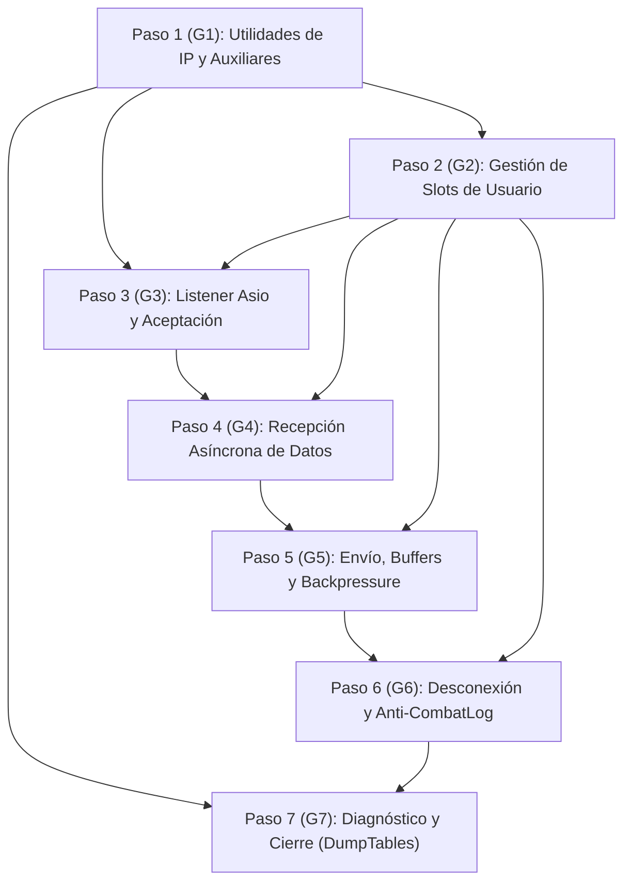

# Desglose Modular del Subsistema de Red y TCP (`TCP.bas`)

Este documento establece la descomposición arquitectónica, el árbol de dependencias internas y la estrategia de implementación progresiva en C++20 para el subsistema de red del servidor de Argentum Online v0.13.0, unificando los módulos legacy:
- `legacy/server/Codigo/TCP.bas` (1.758 líneas)
- `legacy/server/Codigo/wskapiAO.bas` (630 líneas)
- `legacy/server/Codigo/wsksock.bas` (888 líneas)
- Funciones auxiliares asociadas de `Modulo_UsUaRiOs.bas` y `Protocol.bas`.
- **Total combinado legacy**: ~3.276 líneas.

Conforme al principio de **Umbral de Desglose para Módulos Grandes** (*Large Module Breakdown Threshold*, ver [`docs/CONVENTIONS.md`](../CONVENTIONS.md)), al tratarse de un componente clasificado como **"Grande" (Categoría Crítica 2)** en [`docs/implementation/00-port-plan.md`](00-port-plan.md), este desglose organiza el trabajo en **7 grupos lógicos secuenciales (G1 a G7)** antes de iniciar la escritura de código de producción.

---

## 1. Decisiones Estratégicas de Arquitectura

A partir de la auditoría técnica detallada ([`docs/audit/02c-tcp-detalle.md`](../audit/02c-tcp-detalle.md)), se fijan tres definiciones estructurales mandatorias:

### 1.1. Modelo de Concurrencia: Standalone Asio Monohilo (`io_context.poll()`)
- **Premisa de diseño**: En el servidor original de Visual Basic 6 (STA), la red y el juego compartían estrictamente el mismo hilo de ejecución a través de la cola de mensajes Win32.
- **Implementación en C++20**: Se adopta el modelo **Single-Threaded Event Loop** utilizando la biblioteca header-only **standalone Asio** (paquete vcpkg `asio`).
- El ciclo de eventos de red se conduce mediante invocaciones no bloqueantes a `io_context.poll()` / `poll_one()` dentro del mismo hilo que gobierna el Game Loop principal.
- **Beneficios**:
  1. **Cero mutexes y sincronización**: Acceso libre y determinista a las estructuras globales de datos (`UserList`, `MapData`, `SecurityIp`, `BanIps`) sin riesgo alguno de condiciones de carrera (*race conditions*) ni sobrecarga por primitivas de bloqueo.
  2. **Determinismo absoluto en pruebas**: Los tests unitarios en **doctest** pueden controlar y bombear el loop de red de forma 100% determinista, paso a paso, sin depender de esperas activas (`sleep`), temporizadores flotantes ni condiciones no reproducibles entre hilos.

### 1.2. Resolución de Código Muerto en `SecurityIp`
- Tras la auditoría de [`legacy/server/Codigo/wskapiAO.bas`](../../legacy/server/Codigo/wskapiAO.bas) y [`legacy/server/Codigo/TCP.bas`](../../legacy/server/Codigo/TCP.bas), se confirmó que las llamadas a `IPSecuritySuperaLimiteConexiones` (L433), `IpRestarConexion` (L466, L626) y la estructura `MaxConTables` se encuentran **100% comentadas con apóstrofe en el binario de producción 0.13.0**.
- **Resolución**: Quedan formalmente catalogadas como **Excluded (dead code, not ported)** en [`docs/implementation/KNOWN-LEGACY-BUGS.md`](KNOWN-LEGACY-BUGS.md) (Entradas #13 y #14) y no serán portadas a C++, evitando la sobrecomplejidad de mantener tablas de conteo concurrentes inactivas en el servidor histórico.
- **Punto de integración activo**: Se mantiene exclusivamente la invocación a `SecurityIp::IpSecurityAceptarNuevaConexion(ip)` para el control anti-flood de intervalos (1.000 ms).

### 1.3. Mitigación de Vulnerabilidades Legacy (Bugs #19 y #20)
- **Mitigación de Bug #19 (Safe Backpressure)**: Se suprime el defectuoso patrón legacy de control de flujo (`NOT_ENOUGH_SPACE` en `clsByteQueue` de 10 KB + `Resume` en `Protocol.bas` + `WSAEWOULDBLOCK` en `WsApiEnviar`), el cual causaba congelamientos del servidor al 100% de CPU ante clientes laggeados ([`docs/audit/02c-tcp-detalle.md`](../audit/02c-tcp-detalle.md#54-umbrales-de-socket-os-y-la-trampa-de-bloqueo-wsaewouldblock)). En su lugar, Asio encola buffers salientes en memoria dinámica y, si una sesión acumula más de un límite de saturación configurable (ej. 64 KB), se procede a la desconexión ordenada del cliente protegiendo al servidor.
- **Mitigación de Bug #20 (Safe RAII Socket Close)**: En `EventoSockAccept`, el servidor legacy invocaba `WSApiCloseSocket(NuevoSock)` antes de asignar `NuevoSock = Ret`, intentando cerrar el descriptor 0 y fugando el descriptor real aceptado. En C++, la aceptación utiliza `asio::ip::tcp::socket` gobernado por RAII, garantizando el cierre inmediato y automático ante cualquier rechazo temprano.

---

## 2. Mapa de Dependencias entre Grupos Lógicos

---

## 3. Especificación Detallada de Pasos de Porting

---

### Paso 1 (G1): Utilidades de IP y Auxiliares de Red
- **Propósito**: Proveer funciones de conversión y formateo de direcciones IP entre representación binaria de 32 bits (network byte order) y formato texto punteado (*dotted-decimal*), con validación sintáctica estricta.
- **Archivos Fuente Legacy**:
  - `legacy/server/Codigo/wsksock.bas` (L527-L545: `GetAscIP`, L801-806: `GetLongIp`, L411-421: `AddrToIP`, L758-764: `IpToAddr`).
- **Archivos C++ Destino**:
  - `src/server/TCP.hpp`
  - `src/server/TCP.cpp`
- **Funciones y Procedimientos a Implementar**:
  - `std::string GetAscIP(uint32_t ip)`: Convierte un entero IPv4 binario de 32 bits a cadena de texto estándar `"a.b.c.d"`. Si la dirección es nula o inválida, devuelve `"255.255.255.255"` emulando fielmente el comportamiento de `inet_ntoa` en VB6.
  - `uint32_t GetLongIp(std::string_view ip)`: Parsea una cadena punteada `"a.b.c.d"` y retorna su valor numérico de 32 bits en network byte order.
  - `bool IsValidIP(std::string_view ip)`: Valida que la cadena contenga 4 octetos decimales en el rango [0, 255].
- **Dependencias Previas**:
  - Tipos base estándar de C++ (`<string>`, `<cstdint>`, `<string_view>`).
  - `asio::ip::address_v4` para conversiones robustas y portables.
- **Estrategia de Pruebas (doctest)**:
  - Archivo de pruebas: `tests/test_tcp.cpp` (Subcaso: *G1 — Utilidades de IP*).
  - Casos de prueba:
    - Conversión de `127.0.0.1` a entero y vuelta a string (paridad bidireccional).
    - Casos de borde: `0.0.0.0`, `255.255.255.255`, IPs privadas clase A/B/C (`10.0.0.1`, `192.168.1.1`).
    - Formatos defectuosos: octetos > 255, cadenas con letras, cadenas con menos o más de 4 componentes.
- **Criterio de Aceptación**:
  - Coincidencia exacta con las cadenas generadas históricamente por `inet_ntoa` de WinSock. Cero dependencias de sockets activos.

---

### Paso 2 (G2): Gestión de Slots de Usuario y Mapeo de Sockets
- **Propósito**: Implementar la búsqueda lineal de slots disponibles en `UserList`, la asignación y liberación de índices de usuario, y el mapeo asociativo de alta velocidad entre descriptores/sesiones y `UserIndex`.
- **Archivos Fuente Legacy**:
  - `legacy/server/Codigo/Modulo_UsUaRiOs.bas` (L868-L883: `NextOpenUser`).
  - `legacy/server/Codigo/wskapiAO.bas` (L130-L142: `BuscaSlotSock`, L144-L186: `AgregaSlotSock`, L188-L199: `BorraSlotSock`).
  - `legacy/server/Codigo/TCP.bas` (L1719-L1756: `ResetUserSlot`).
- **Archivos C++ Destino**:
  - `src/server/TCP.hpp`
  - `src/server/TCP.cpp`
- **Funciones y Procedimientos a Implementar**:
  - `int16_t NextOpenUser()`: Recorre secuencialmente `UserList` de 1 a `MaxUsers`. Retorna el primer índice donde `UserList[i].ConnID == -1 && !UserList[i].flags.UserLogged`. Si todos están ocupados, retorna `MaxUsers + 1`.
  - `void ResetUserSlot(int16_t user_index)`: Blanquea la totalidad del slot en memoria: `ConnIDValida = false`, `ConnID = -1`, invoca resets de subsistemas (comercio, facciones, contadores, guild, char, inventario, spells, banco).
  - `int16_t BuscaSlotSock(uint64_t sock_id)`: Busca el `UserIndex` asignado a un identificador de sesión/socket en tiempo $O(1)$ mediante `std::unordered_map<uint64_t, int16_t>`. Retorna -1 si no existe.
  - `void AgregaSlotSock(uint64_t sock_id, int16_t slot)`: Asocia el socket al slot en el mapa interno.
  - `void BorraSlotSock(uint64_t sock_id)`: Desvincula y remueve el socket del mapa.
- **Dependencias Previas**:
  - `Declares` (`UserList`, `MaxUsers`, estructuras `User`).
  - Paso 1 (G1).
- **Estrategia de Pruebas (doctest)**:
  - Archivo de pruebas: `tests/test_tcp.cpp` (Subcaso: *G2 — Gestión de Slots de Usuario*).
  - Casos de prueba:
    - Búsqueda en tabla vacía: asigna slot 1.
    - Ocupación parcial: asignación del primer slot discontinuo liberado.
    - Saturación total: retorna `MaxUsers + 1`.
    - Reseteo completo: verificación de que `ResetUserSlot` restaura campos a sus valores iniciales seguros.
    - Mapeo de sockets: inserción, búsqueda y eliminación correcta de múltiples asociaciones `sock_id -> slot`.
- **Criterio de Aceptación**:
  - Búsqueda y blanqueo idénticos a VB6, garantizando que un slot con `flags.UserLogged = true` jamás sea retornado por `NextOpenUser` aunque su `ConnID` valga -1.

---

### Paso 3 (G3): Listener Asio y Aceptación de Conexiones
- **Propósito**: Inicializar el listener pasivo TCP mediante `asio::ip::tcp::acceptor`, procesar conexiones entrantes en el hilo del loop, validar anti-flood síncronamente con `SecurityIp`, chequear la lista negra `BanIps` y gestionar el rechazo por servidor lleno.
- **Archivos Fuente Legacy**:
  - `legacy/server/Codigo/wskapiAO.bas` (L86-L105: `IniciaWsApi`, L372-L497: `EventoSockAccept`, L584-L589: `WSApiCloseSocket`).
  - `legacy/server/Codigo/wsksock.bas` (L834-L896: `ListenForConnect`).
  - `legacy/server/Codigo/General.bas` (L459-L463).
- **Archivos C++ Destino**:
  - `src/server/TCP.hpp`
  - `src/server/TCP.cpp`
- **Funciones y Procedimientos a Implementar**:
  - `bool IniciaServidor(uint16_t puerto, std::string_view bind_ip = "")`: Configura e inicia el `asio::ip::tcp::acceptor` en el puerto provisto reutilizando direcciones (`reuse_address(true)`).
  - `void DetenerServidor()`: Cierra el acceptor y todas las sesiones de red activas.
  - `void EventoSockAccept(asio::ip::tcp::socket socket)`: Callback ejecutado cuando una conexión TCP completa el handshake:
    1. Obtiene la IP remota del endpoint (`client_ip = socket.remote_endpoint().address().to_v4().to_uint()`).
    2. Consulta `SecurityIp::IpSecurityAceptarNuevaConexion(client_ip)`. Si retorna `false`, cierra el socket RAII y aborta inmediatamente (mitigando Bug #20).
    3. Consulta `NextOpenUser()`.
    4. Si `slot <= MaxUsers`:
       - Limpia buffers `incomingData` y `outgoingData` de `UserList[slot]`.
       - Registra `UserList[slot].ip = GetAscIP(client_ip)`.
       - Verifica lista `BanIps`: si está baneado, emite error y cierra.
       - Asigna `ConnID`, `ConnIDValida = true`, registra en `AgregaSlotSock`.
       - Comienza la escucha asíncrona de lectura (Paso 4).
    5. Si `slot > MaxUsers` (Servidor Lleno):
       - Transmite paquete preformateado de servidor lleno y cierra el socket.
- **Dependencias Previas**:
  - Standalone Asio (`<asio.hpp>`).
  - `SecurityIp` (`IpSecurityAceptarNuevaConexion`).
  - Pasos 1 y 2 (G1, G2).
- **Estrategia de Pruebas (doctest)**:
  - Archivo de pruebas: `tests/test_tcp.cpp` (Subcaso: *G3 — Listener y Aceptación*).
  - Casos de prueba:
    - Apertura de listener en `127.0.0.1:0` (puerto dinámico).
    - Conexión desde un socket cliente local (`asio::ip::tcp::socket` en loopback).
    - Invocación de `io_context.poll()`, verificando que el acceptor procesa la conexión y puebla `UserList[slot]`.
    - Conexión ráfaga inmediata desde la misma IP: validación de rechazo por `SecurityIp` sin afectar las sesiones existentes.
    - Llenado artificial de slots (`MaxUsers` ocupados): verificación de emisión de mensaje de error y cierre determinista sin leak de descriptores.
- **Criterio de Aceptación**:
  - Aceptación no bloqueante compatible con el Game Loop. Cierre seguro RAII sin fugas de sockets.

---

### Paso 4 (G4): Recepción Asíncrona de Datos
- **Propósito**: Recibir datos binarios mediante `async_read_some` en cada sesión de red, depositando los bytes de forma contigua en la cola `incomingData` (`clsByteQueue`) del usuario asignado.
- **Archivos Fuente Legacy**:
  - `legacy/server/Codigo/wskapiAO.bas` (L255-L293: `FD_READ`, L499-L518: `EventoSockRead`).
- **Archivos C++ Destino**:
  - `src/server/TCP.hpp`
  - `src/server/TCP.cpp`
- **Funciones y Procedimientos a Implementar**:
  - `void IniciarLectura(int16_t user_index)`: Programa un `async_read_some` sobre el socket del usuario utilizando un buffer de lectura fijo de 8.192 bytes (`SIZE_RCVBUF`).
  - `void EventoSockRead(int16_t user_index, const uint8_t* data, size_t length)`: Escribe los bytes recibidos en `UserList[user_index].incomingData.WriteBlock(data, length)`.
  - Notificación de paquetes: Marca el slot como poseedor de datos listos para ser consumidos por el pipeline de decodificación (`Protocol::HandleIncomingData`).
  - Si la lectura finaliza con error (`eof` o `connection_reset`), canaliza hacia la desconexión ordenada (Paso 6).
- **Dependencias Previas**:
  - `clsByteQueue` (`WriteBlock`, `length`).
  - Pasos 1, 2 y 3 (G1, G2, G3).
- **Estrategia de Pruebas (doctest)**:
  - Archivo de pruebas: `tests/test_tcp.cpp` (Subcaso: *G4 — Recepción de Datos*).
  - Casos de prueba:
    - Envío de paquetes de 10 bytes, 500 bytes y 4.096 bytes desde el socket cliente en loopback.
    - Ejecución de `io_context.poll()` en el test.
    - Inspección de `UserList[slot].incomingData`: los bytes coinciden exactamente con el payload transmitido.
    - Fragmentación de paquetes: envío en 2 tramos separados, verificando que `incomingData` concatena los bloques de forma transparente.
- **Criterio de Aceptación**:
  - La cola `incomingData` preserva el orden FIFO estricto de bytes recibido del stream TCP.

---

### Paso 5 (G5): Envío de Datos, Buffers Salientes y Mitigación de Backpressure
- **Propósito**: Transmitir datos hacia los clientes mediante `EnviarDatosASlot` y `FlushBuffer`, administrando una cola asíncrona de buffers por sesión y mitigando de forma definitiva la vulnerabilidad histórica de busy-wait (Bug #19).
- **Archivos Fuente Legacy**:
  - `legacy/server/Codigo/TCP.bas` (L822-L843: `EnviarDatosASlot`).
  - `legacy/server/Codigo/wskapiAO.bas` (L314-L352: `WsApiEnviar`).
  - `legacy/server/Codigo/Protocol.bas` (L17233-L17249: `FlushBuffer`).
- **Archivos C++ Destino**:
  - `src/server/TCP.hpp`
  - `src/server/TCP.cpp`
- **Funciones y Procedimientos a Implementar**:
  - `void FlushBuffer(int16_t user_index)`: Extrae todos los bytes pendientes en `UserList[user_index].outgoingData` (`ReadASCIIStringFixed` / `ReadBlock`) y los transfiere a `EnviarDatosASlot`.
  - `void EnviarDatosASlot(int16_t user_index, const std::string& datos)`: Agrega los bytes a la cola de salida de la sesión de red. Si no había una escritura asíncrona activa, dispara `asio::async_write`.
  - **Mitigación de Bug #19 (Safe Backpressure)**: Si el volumen total de datos acumulados en la cola de salida de una sesión supera `MAX_OUTGOING_BUFFER_SIZE` (constante de seguridad, p. ej. 65.536 bytes / 64 KB) debido a que el cliente no lee, se aborta la sesión de forma controlada y se programa la desconexión del usuario, erradicando el reintento infinito de `WSAEWOULDBLOCK`.
- **Dependencias Previas**:
  - `clsByteQueue` (`ReadBlock`, `length`).
  - Pasos 1 a 4 (G1 a G4).
- **Estrategia de Pruebas (doctest)**:
  - Archivo de pruebas: `tests/test_tcp.cpp` (Subcaso: *G5 — Envío y Backpressure*).
  - Casos de prueba:
    - Escritura en `outgoingData`, llamada a `FlushBuffer`, ejecución de `poll()`, y lectura en el cliente loopback validando paridad binaria total.
    - Múltiples ráfagas consecutivas de `FlushBuffer` sin esperar la finalización previa: la cola de salida de Asio entrega los buffers secuencialmente y sin pérdidas.
    - Prueba de saturación intencional (simulación de cliente sin leer acumulando > 64 KB): verificación de que el servidor no se cuelga en bucle infinito y gatilla la desconexión segura del cliente saturado.
- **Criterio de Aceptación**:
  - Emisión confiable de datos sin bloqueo de hilo. Protección contra clientes desincronizados o maliciosos.

---

### Paso 6 (G6): Ciclo de Vida de Desconexión y Mecánica Anti-CombatLog
- **Propósito**: Administrar los flujos de desconexión ordenada (`/SALIR`) y desconexión abrupta (caída de enlace, timeout, cierre forzado), preservando la regla histórica donde el personaje permanece en mapas PK durante 10 segundos antes de ser removido del mundo.
- **Archivos Fuente Legacy**:
  - `legacy/server/Codigo/TCP.bas` (L610-L672: `CloseSocket`, L782-L795: `CloseSocketSL`, L1758-L1865: `CloseUser`).
  - `legacy/server/Codigo/wskapiAO.bas` (L269-L288, L294-L304: `FD_CLOSE`, L520-L539: `EventoSockClose`, L584-L589: `WSApiCloseSocket`).
  - `legacy/server/Codigo/Modulo_UsUaRiOs.bas` (L1850-L1897: `Cerrar_Usuario`).
  - `legacy/server/Codigo/General.bas` (L1555-L1569: `PasarSegundo`).
- **Archivos C++ Destino**:
  - `src/server/TCP.hpp`
  - `src/server/TCP.cpp`
- **Funciones y Procedimientos a Implementar**:
  - `void CloseSocket(int16_t user_index)`: Cierra la sesión de red, invoca `CloseSocketSL`, cancela comercios activos, vacía buffers y, si el usuario estaba logueado, coordina la persistencia y limpieza del slot.
  - `void CloseSocketSL(int16_t user_index)`: Cierra y destruye el socket físico TCP a nivel Asio y remueve el slot de `BorraSlotSock`, pero **sin blanquear la entidad del usuario en el juego** (`ConnIDValida = false`, preservando `UserLogged = true`).
  - `void CerrarUsuario(int16_t user_index)`: Si el personaje está logueado en un mapa PK, activa `.Counters.Saliendo = true` y fija `.Counters.Salir = IntervaloCerrarConexion` (10s), haciéndolo visible de inmediato si estaba invisible u oculto.
  - Desacoplamiento de `CloseUser`: Se estructura una interfaz extensible o callback de persistencia que conecta con `FileIO::SaveUser` y blanquea el slot con `ResetUserSlot`.
- **Dependencias Previas**:
  - Pasos 1 a 5 (G1 a G5).
  - `FileIO` (`SaveUser`).
- **Estrategia de Pruebas (doctest)**:
  - Archivo de pruebas: `tests/test_tcp.cpp` (Subcaso: *G6 — Ciclo de Vida y Anti-CombatLog*).
  - Casos de prueba:
    - Desconexión en zona segura: `CloseSocket` inmediato, slot queda libre en el mismo frame.
    - Cierre abrupto en mapa PK: el socket TCP se destruye al instante, pero el slot retiene `flags.UserLogged = true` y `.Counters.Saliendo = true` con contador en 10.
    - Simulación del avance de segundos: decremento de `.Counters.Salir`, al llegar a 0 se ejecuta `CloseSocket` final, se persiste el archivo `.chr` y se resetea el slot con `ResetUserSlot`.
- **Criterio de Aceptación**:
  - Imposibilidad de exploit por corte de socket físico en zonas de combate (paridad estricta con VB6).

---

### Paso 7 (G7): Diagnóstico y Cierre de Módulo (`DumpTables` e Integración Global)
- **Propósito**: Completar las funciones administrativas diferidas dependientes de `TCP` (específicamente `SecurityIp::DumpTables`), implementar el reinicio global de sockets y consolidar la suite de integración completa del subsistema de red.
- **Archivos Fuente Legacy**:
  - `legacy/server/Codigo/Protocol.bas` (L11393: llamada administrativa a `DumpTables`).
  - `legacy/server/Codigo/SecurityIp.bas` (L314-L327: `DumpTables`).
  - `legacy/server/Codigo/wskapiAO.bas` (L542-L582: `WSApiReiniciarSockets`).
- **Archivos C++ Destino**:
  - `src/server/SecurityIp.cpp` (Implementación de `DumpTables` consumiendo `TCP::GetAscIP`).
  - `src/server/TCP.hpp`
  - `src/server/TCP.cpp`
  - `tests/test_tcp.cpp`
- **Funciones y Procedimientos a Implementar**:
  - `void SecurityIp::DumpTables()`: Itera los elementos activos de `IpTables` y formatea la salida de diagnóstico llamando a `TCP::GetAscIP(ip)`, resolviendo la dependencia pendiente documentada en [`docs/implementation/16-securityip.md`](16-securityip.md).
  - `void WSApiReiniciarSockets()`: Cierra todas las conexiones activas, resetea la totalidad de los slots de usuario, reinicia el acceptor de Asio y restablece el estado de red a cero.
- **Dependencias Previas**:
  - Todos los pasos previos (G1 a G6).
  - Módulo `SecurityIp`.
- **Estrategia de Pruebas (doctest)**:
  - Archivo de pruebas: `tests/test_tcp.cpp` (Subcaso: *G7 — Diagnóstico e Integración*).
  - Casos de prueba:
    - Ejecución de `DumpTables()` con IPs pobladas, verificando la traducción correcta a string punteado.
    - Reinicio global con múltiples conexiones activas: todos los sockets son desconectados y el servidor vuelve a aceptar nuevas conexiones en el puerto configurado.
    - Ejecución completa de la suite total de pruebas del proyecto (`argentum_tests.exe`), garantizando 0 regresiones.
- **Criterio de Aceptación**:
  - 100% de tests unitarios pasando limpiamente. Ninguna fuga de memoria detectada con AddressSanitizer (ASan).

---

## 4. Tabla Consolidada de Entregables por Paso

| Paso | Subgrupo | Archivos C++ Creados/Modificados | Cobertura Funcional Clave | Tests Unitarios (doctest) |
| :---: | :---: | :--- | :--- | :--- |
| **1** | **G1** | `src/server/TCP.hpp` `src/server/TCP.cpp` | `GetAscIP`, `GetLongIp`, validación de IPs. | Conversión bidireccional, casos borde, IPs malformadas. |
| **2** | **G2** | `src/server/TCP.hpp` `src/server/TCP.cpp` | `NextOpenUser`, `ResetUserSlot`, `AgregaSlotSock`, `BorraSlotSock`. | Asignación secuencial, slots salteados, saturación `MaxUsers`. |
| **3** | **G3** | `src/server/TCP.hpp` `src/server/TCP.cpp` | Acceptor Asio, `io_context.poll()`, filtro anti-flood síncrono, chequeo `BanIps`. | Loopback accept, rechazo anti-flood, mitigación Bug #20. |
| **4** | **G4** | `src/server/TCP.hpp` `src/server/TCP.cpp` | `async_read_some`, volcado a `incomingData`, notificación de tramas. | Recepción mono/multibloque, fragmentación TCP en loopback. |
| **5** | **G5** | `src/server/TCP.hpp` `src/server/TCP.cpp` | `EnviarDatosASlot`, `FlushBuffer`, cola saliente Asio, backpressure limit. | Despacho saliente, paridad binaria, mitigación Bug #19. |
| **6** | **G6** | `src/server/TCP.hpp` `src/server/TCP.cpp` | `CloseSocket`, `CloseSocketSL`, `CerrarUsuario`, retardo 10s PK. | Desconexión limpia vs abrupta, retención de entidad PK. |
| **7** | **G7** | `src/server/SecurityIp.cpp` `src/server/TCP.cpp` | `SecurityIp::DumpTables`, `WSApiReiniciarSockets`, suite completa. | Validación diagnóstica, reinicio de red, suite integral verde. |

---

## 5. Referencias y Documentación Cruzada

- [Normas de Arquitectura y Convenciones — `docs/CONVENTIONS.md`](../CONVENTIONS.md)
- [Plan Maestro de Porting C++ — `docs/implementation/00-port-plan.md`](00-port-plan.md)
- [Auditoría del Protocolo de Red — `docs/audit/02-protocolo-de-red.md`](../audit/02-protocolo-de-red.md)
- [Auditoría Exhaustiva de Red y TCP — `docs/audit/02c-tcp-detalle.md`](../audit/02c-tcp-detalle.md)
- [Registro Maestro de Bugs Históricos — `docs/implementation/KNOWN-LEGACY-BUGS.md`](KNOWN-LEGACY-BUGS.md)
- [Especificación de `SecurityIp.bas` — `docs/implementation/16-securityip.md`](16-securityip.md)
- [Desglose Metodológico de `FileIO.bas` — `docs/implementation/FileIO-breakdown.md`](FileIO-breakdown.md)
- [Desglose Metodológico de `clsClan.cls` — `docs/implementation/clsClan-breakdown.md`](clsClan-breakdown.md)
